# 082：IBM《机器学习（无监督学习、深度学习和强化学习、毕业项目）｜machine learning》中英字幕 p82 43_CNN示例笔记本（选修部分）第2部分.zh_en -BV1eu4m1F7oz_p82-

Welcome back for our next exercise Now in our previous model， we had the structure that we have here。

 a convolutional layer， another convolutional layer that max pool to bring down the size。

 flattening it out， then that dense connection and then that final classification with the activation functions and the dropouts that we had specified。

Now we want to try building a more complicated model and it's going to have the following structure。

Convolutional layer， convolution layer， max pool， and then two more convolution layers。

 So we're adding on an extra two convolution layers， another max pool。

 and then that flatten that dense connection in our final classification。

We're also going to use strides of one for each one of our convolutional layers。

 so rather than moving that kernel along。2 to the right then two down， as we did before。

 we're only going to move it across and down by one each time。

We're then going to see how many parameters does our new model have and compared to our old model。

 and then we're going to train it only for five epochs。

 It will be more complicated so it'll take some more time。

 And then we can look at the loss and accuracy numbers for both the training and validation sets and。

We can on your own， go ahead and try different structures and run times and see how accurate you can get your model to be。

So we're going to run this with this specified new framework。 So we're going to。Again。

Have 32 different filters。Here are grids going to be 3 by 3 above， if you recall， we had 5 by 5。

 So that will also move across a bit quicker。

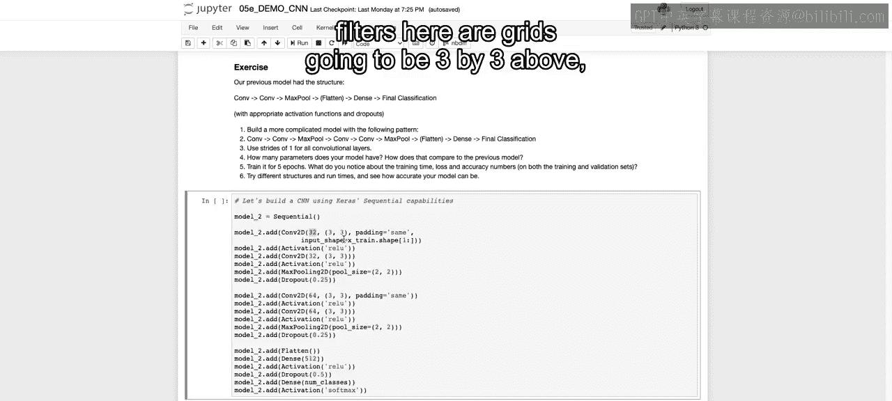

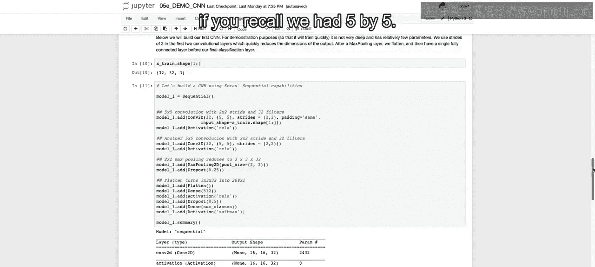

And then we before we had the the strides equal to one by one by two by two now they're going to be at their default of one by one。

 and then we're having padding on each will'll also add on some extra。Wait， some extra。

Learning that we'll have to do。 it' will have to go through more convolutional operations as we have that padding。

Then we have our relo activation， and again， we set the default。

 we have another convolutional layer this time without padding we have。Another activation of Relo。

 some max pooling。And then we have another convolutional layer this time with 64 different filters。

 And we're going to do that with padding。 and then again without padding again。

 using a three by three grid。And then we'll flatten， have our dense layer。

 and then our final dense layer to predict the classes as well as the activation of softmax。

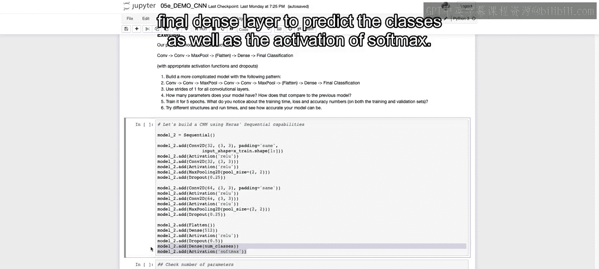

So we run this to set up our new framework， and then when we look down at the number of total parameters that we have to learn or up to 1。

25 million total parameters that we have to train。

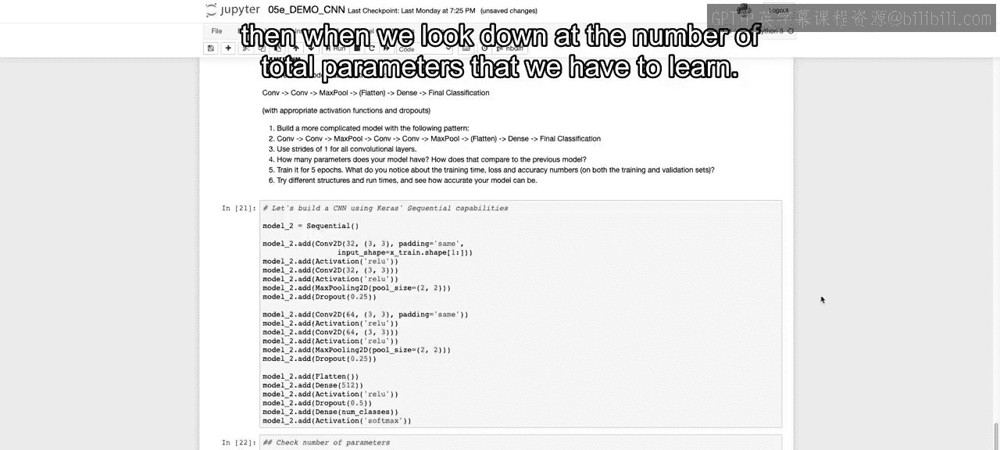

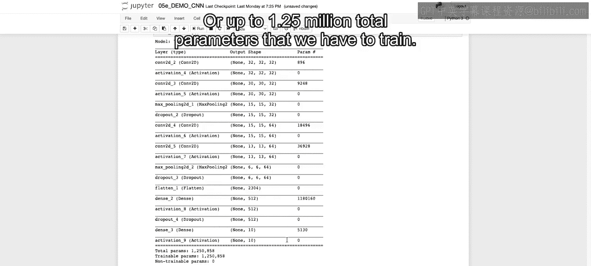

And if you were called before， we only had around 181000 to train。

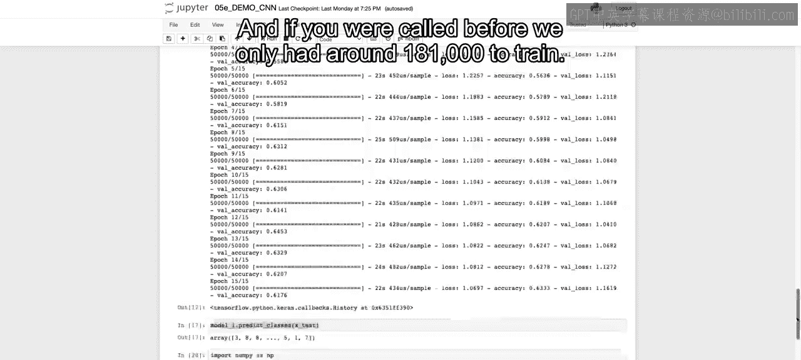

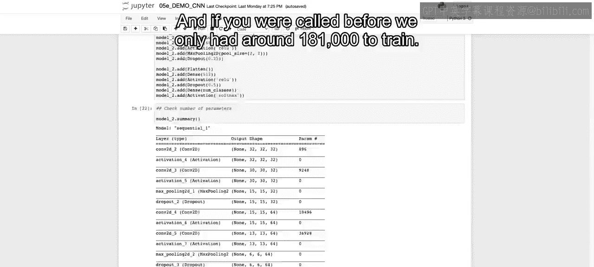

So if we think about the timing that this will take and we'll start to run it here。

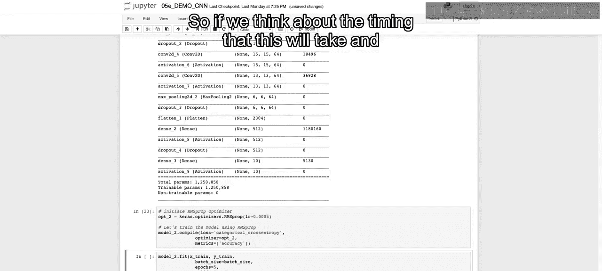

We're going to have probably something that's going to take a lot longer at each one of the epochs。

 So we see that E T A， it' going down pretty quickly， but still at each one of the epochs。

 It's around this three minute mark。That's getting 3 minutes，20 seconds。

 And it's going to take some time at each epoch， compared to。

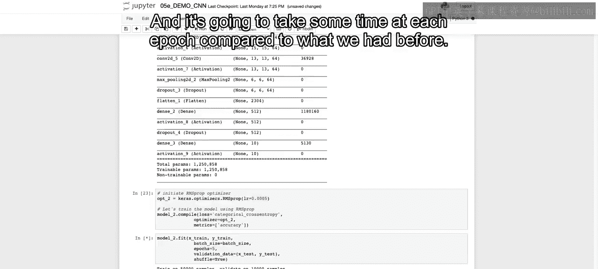

What we had before， what was going through each epoch。Around 27 seconds。

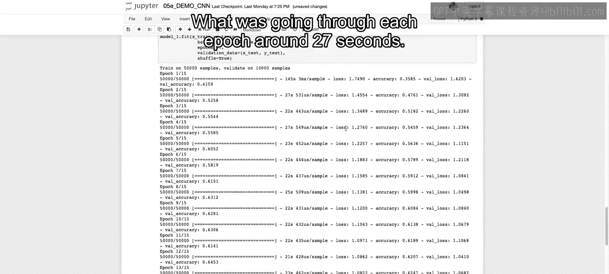

Now， I'm going to pause a video here and come back when this is done running。

 and this will take some time to run， even longer than it did before。

 But it's something that we want to make sure that you take into account as you start to build out your deep neural networks and understanding that as you have more complex structure。

 you'll probably need a stronger machine or some way of paralyzing across multiple machines as you build these out。

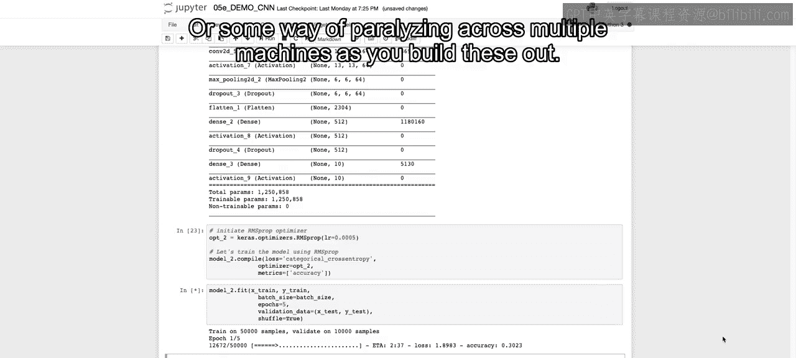

All right， I'll see you in just a bit。So hopefully you're able to run that on your own。

And as we see here， it took quite a bit of time to run that。

 We see thiss a bit under three minutes for each one of the different epochs for five epochs。

 we're getting close to 15 minutes to run through and fit the model。

But what we also see is if we look at the accuracy and specifically the validation accuracy for that holdout set。

 we after the fourth epoch， got to a higher accuracy than we ever got before with the other architecture。

 So we see this more complex framework was able to better fit to our actual data set。

Now we can play around with different frameworks， adding on extraconvolutional layers。

 moving convolutional layers， changing the stride and so on。 But as we saw here。

 it could take some time。So and because of the flexibility， there's actually some architecture。

 some frameworks that are best practices or most common practices that are used throughout that we'll discuss in just a bit。

 but before that in our next video， we will discuss how we can use something that we trained on for a specific data。

 such as what we did here。And use that training to actually supplement。

A classification of images for a completely different data set。

 And we'll see what will mean in just a second when we discuss in the next lecture the idea of transfer learning。

 All right， I'll see you there。

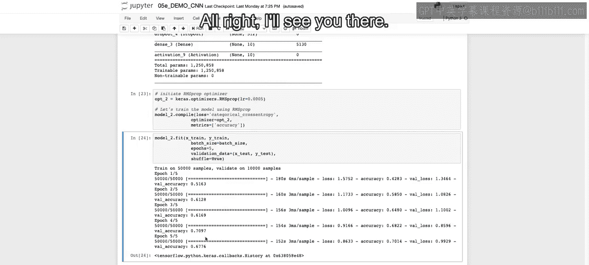

