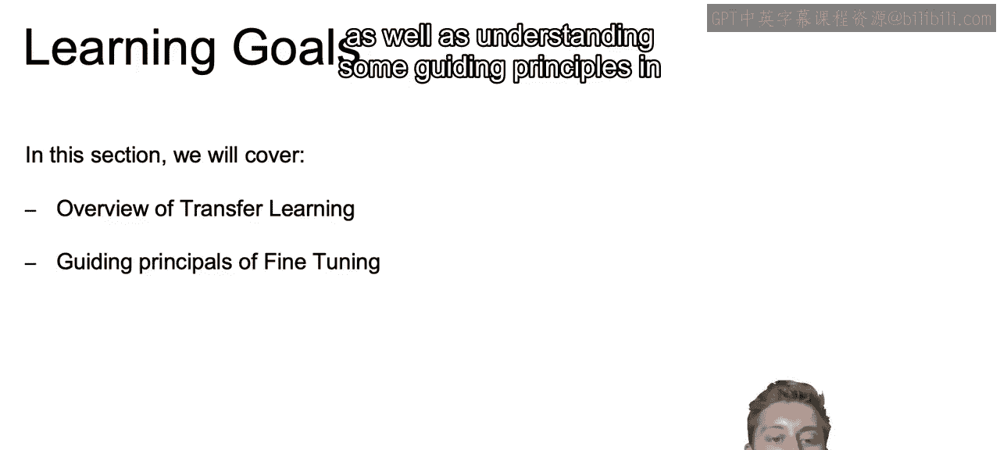
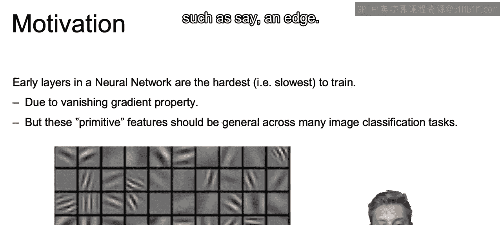
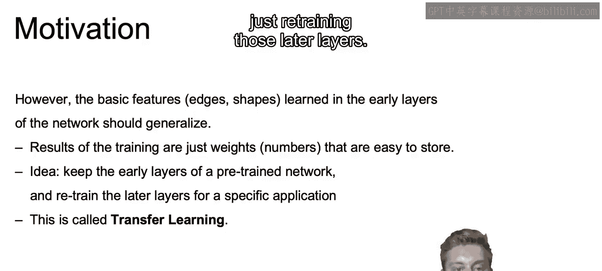
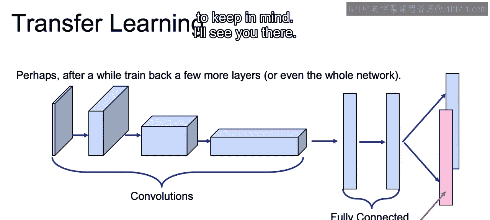

# 083：IBM《机器学习（无监督学习、深度学习和强化学习、毕业项目）｜machine learning》中英字幕 p83 44_迁移学习简介.zh_en -BV1eu4m1F7oz_p83-

In this set of videos， we'll discuss transfer learning。

 which allows to leverage already trained networks to make predictions for new data sets。

So in this section， we're going to cover an overview of transfer learning。

 starting off with the motivation behind transfer learning。

As well as understanding some guiding principles in regards to fine tuning our transfer learning models。

Now， generally speaking， the earlier we are within our neural network。

Those earlier layers are going to be the slowest to train。

And this is generally going to be in large part due to the way that our weights are being optimized。

So if we recall that vanishish ingredient problem， we recall that because of back propagation。

By the time we get to the partial derivative in regards to our earlier layers。

It's very possible that we're not making any major updates to our weights。

But if we think about how our convolutional networks actually work。

And we think back to past lectures。Those earlier layers are meant to represent only the most primitive features。

 such as say an edge。

Now， our later layers， on the other hand， are going to be capturing those features that are particular to these specific images in our data set。

And those features。In the later layers were builted off of those earlier primitive layers that we just discussed。

And these later layers will also be much easier and quicker to train。

 as it doesn't suffer from the problems just mentioned from those earlier layers in regards to how fast I can train and will have a more immediate impact on that final result。

So just to motivate this a bit further。Any one of our famous competition winning models are going to be incredibly difficult to train from scratch。

 This is due to the fact that they're going to be trained on huge data sets。

 Huge dataset sets will obviously take much longer time to train on。😊。

They're going to have to go through a very long number of iterations to get to that optimal answer。

And we saw it just in that last notebook。 How long it take for a very simple model。

To learn the optimal weights， and that was， of course， though， on our own personal machines。

And with that in mind， when we build these award winning models。

 we also will need some very heavy computing power to learn these patterns in a reasonable amount of time。

And that's all assuming that you got your framework right on that first time。

 We'll also have to spend time experimenting to get those hyperparameter， number of layers。

 What kind of strides want to flatten， et cetera。😊，Now， what we often see， though。

 is that the basic features such as those edges and simple shapes learned in earlier layers of the network will generalize fairly well to any similar problems。

And if you just want to store the results。It's just a matter of storing those learned weights。

 not the actual lift that was needed to learn those weights in the first place。

So our new idea will be to save those early layers of a pre chain network。

And then just retrain the later layers for a specific application for whatever our data set is。

And this concept。Is going to be what we call transfer learning of taking those earlier layers of a preing network and then just retraining those later layers。

Now let's walk through a visualization of this concept of transfer learning。So what we have here。

In the image in front of you。Represents our first trained convolutional neural network with a number of convolutional layers then that fully connected layer。

 ultimately leading to that final soft max classifier as very similar to what we did in our last notebook。

The idea will be to remove that final output layer。

And then we can use what we learned so far or even go back further。 for example。

 back one of the fully connected layers or even further removing one of those convolutional layers and so on。

And then we can use that pretrain network and train only on that last layer or last few layers。

 using those learned earlier layers from the prior problem。In order to make a prediction on new data。

Now， this idea is going to be more of an art than a science in figuring out how long to train that last layer。

 whether not to go back further and retrain more layers and so on。And in the next video。

 we're going to discuss some of the options available to you。

 as well as some basic guiding principles to keep in mind。

All right， I'll see you there。

