# 084：IBM《机器学习（无监督学习、深度学习和强化学习、毕业项目）｜machine learning》中英字幕 p84 45_迁移学习和微调.zh_en -BV1eu4m1F7oz_p84-

So let's start off with some different transfer learning options that are available to us。

So the additional training that we do of a pretrain network on a specific new data set。

 so those extra steps on top of that pretrain network is going to be referred to as the step of fine tuning。

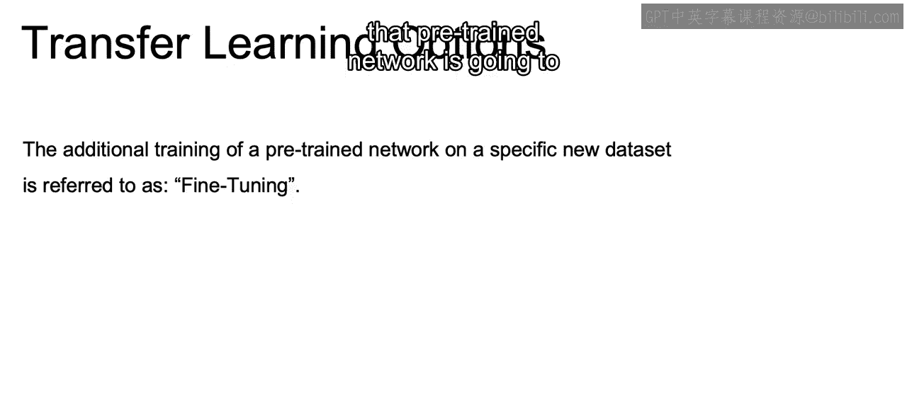

As mentioned earlier， understanding exactly how to fine tune in regards to how much or how far back is going to require you to think through a lot of different options。

Should you just train the very last layer， Should you go back a few layers。

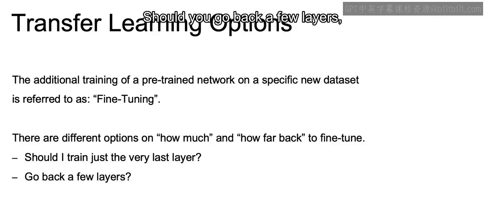

Or even retrain the entire network。Using that pretrain network to just initialize the weights for your new data。

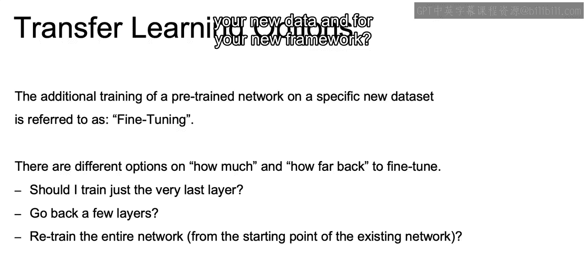

And for your new framework。Now， while there are no hard and fast rules for fine tuning。

 your transfer learning model。

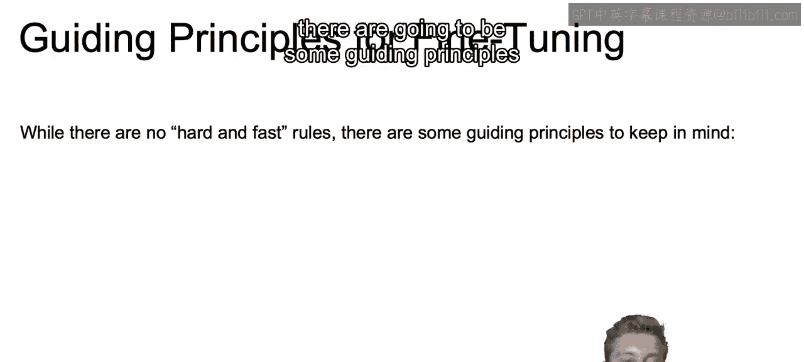

There are going to be some guiding principles that you're going to want to keep in mind。First off。

 the more similar your data and problem are to the source data of your pretrain network。

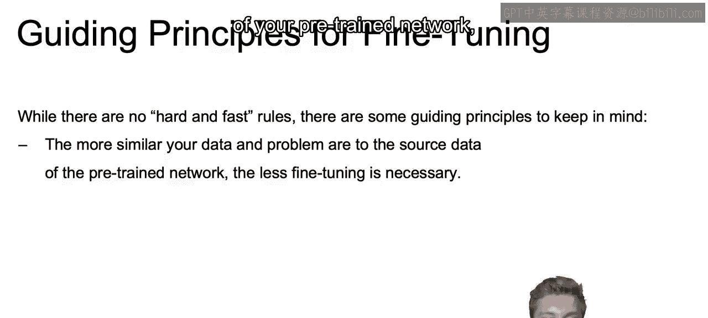

The less fine tuning you'll have to do。So for example。

 if you're using a pretrain network that was pre traineded on IageNe to distinguish between dogs and cats。

You should need relatively little fine tuning， so you don't need to go as far back。

 say in your model， and use a lot of those pre trained weights。

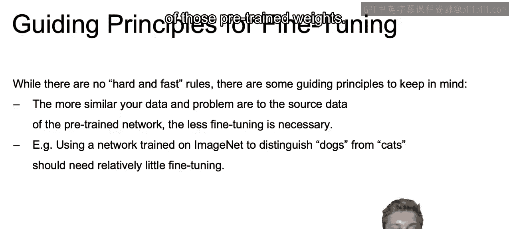

And that's due to the fact that IageNe was already used to distinguish between different breeds of dogs and different breeds of cats。

 so likely already has learned all those features that you're going to need。

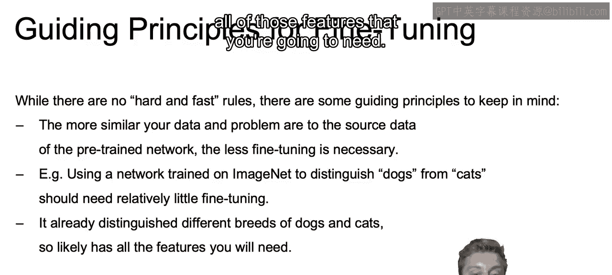

Also， the more data you have available about your specific problem。

The more the network will benefit from the longer and deeper fine tuning of your model。

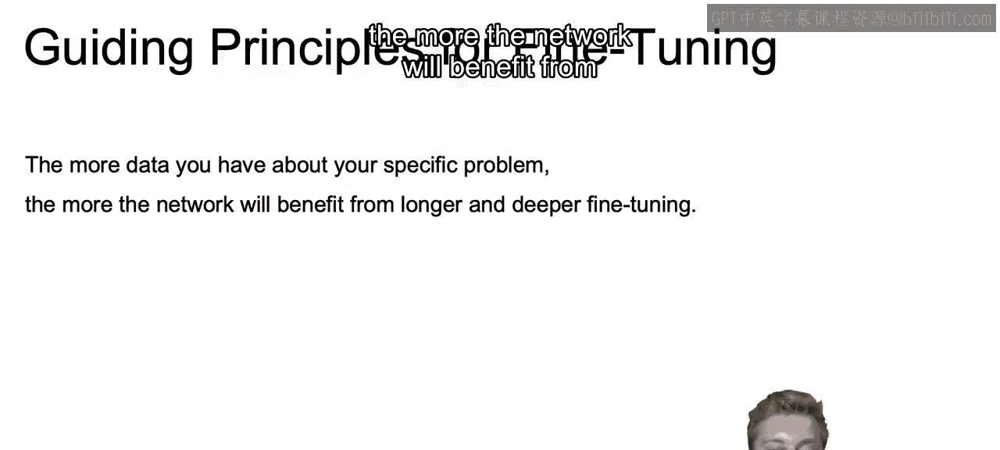

So for example， if you only had 100 dogs and 100 cats in your new training set。

You probably want to do very little fine tuning。Maybe just remove that final layer or two again。

 for example， and use a lot of those pre traineded attributes that you learned from， say Inet。

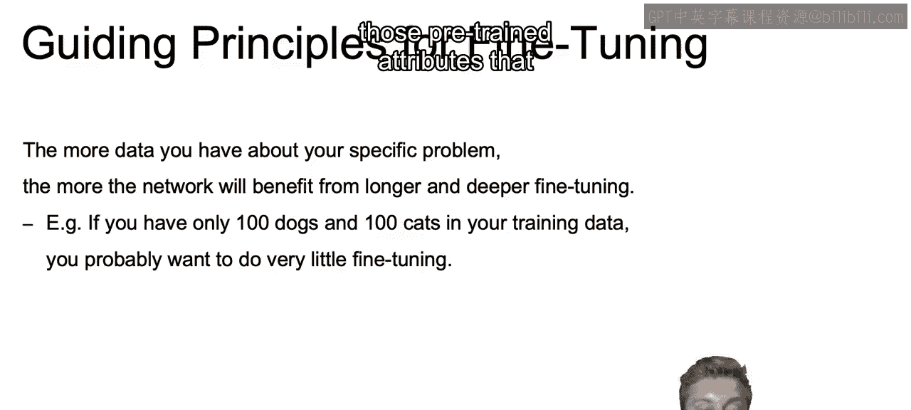

On the other hand， if you have 100，000 dogs and 100，000 cats。

 you may get more value from longer and deeper fine tuning。

 going back further or even retraining the full network。

 using that past network to initialize your weights。

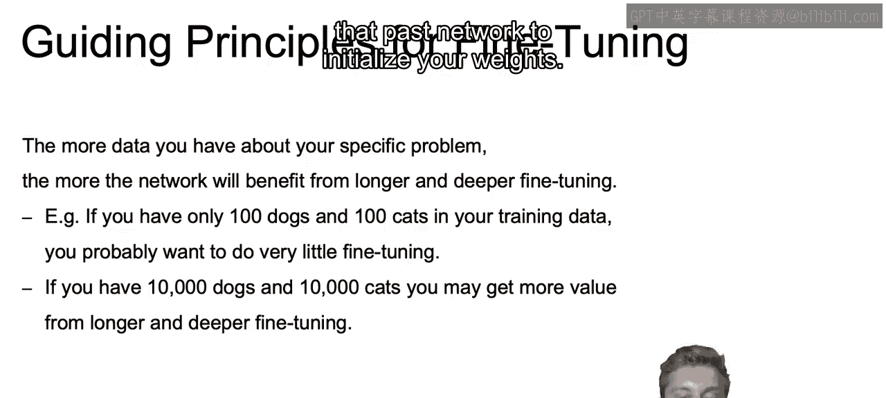

Also， if your data is substantially different in nature。

 than the data the source model was trained on。

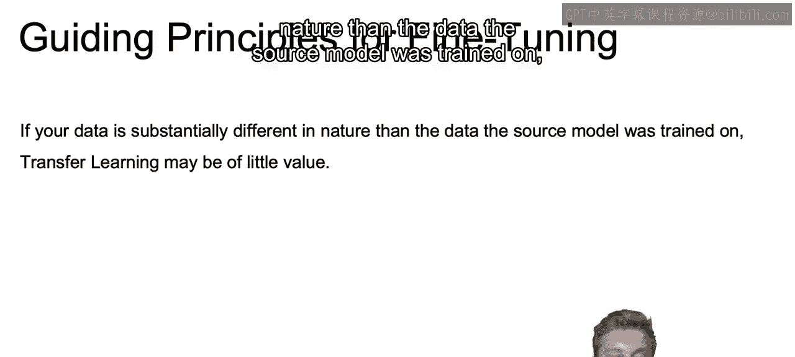

Transfer learning may actually be of little value。 So an obvious example is if a network that was trained on recognizing type Latin alphabet characters。

 it probably won't do a good job in regards to helping you distinguish between cats and dogs。

 but likely would be useful as a starting point for recognizing， say， Cyyrillic alphabet characters。

 as they are both some type of alphabet。

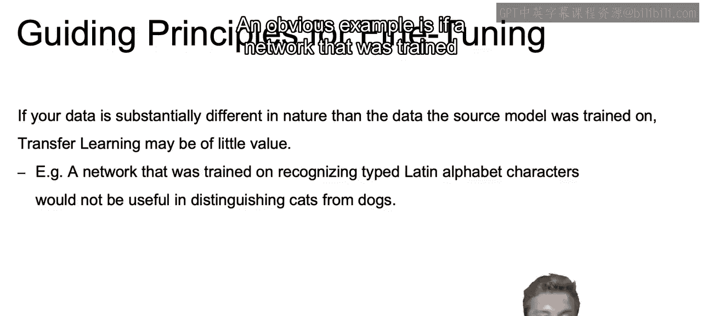

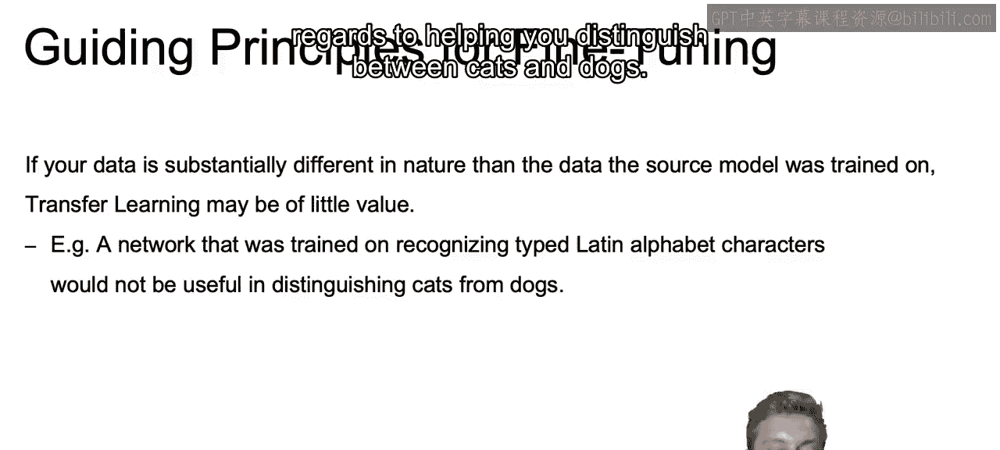

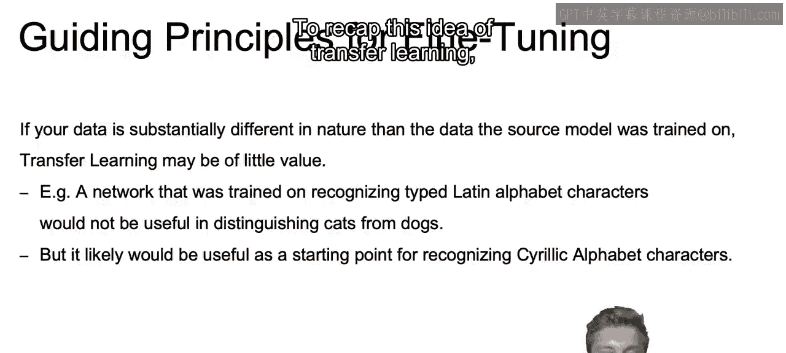

So to recap this idea of transfer learning， we have an overview of transfer learning。

 as well as providing that motivation and understanding that it takes a while to learn those smaller pieces。

 those lower level features such as an edge and you may want to actually take pre-train networks。

 if you want to do something like image classification and you don't have that large of a data。

 And with that in mind， we discuss a few guiding principles in regards to fine tuning that model。

 you want similar data sets， you want to ensure that if you have only a small dataset。

 not to do too much fine tuning。 if you have a larger data。

 perhaps you'd benefit from doing even more fine tuning。

Now that closes out our lecture here on transfer learning。

And in the next video we'll show you how to actually conduct transfer learning using Python。

 Allright， I'll see you there。

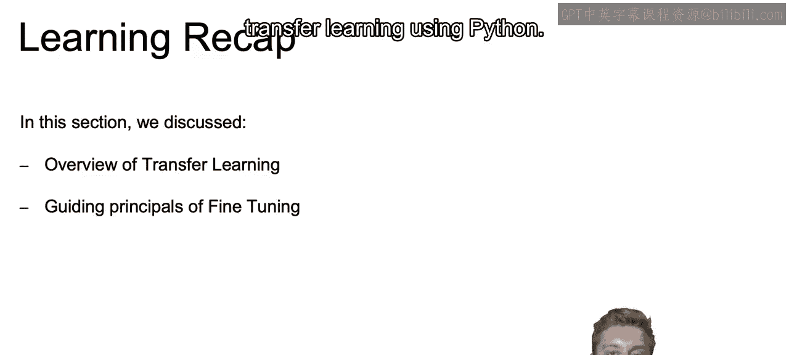

