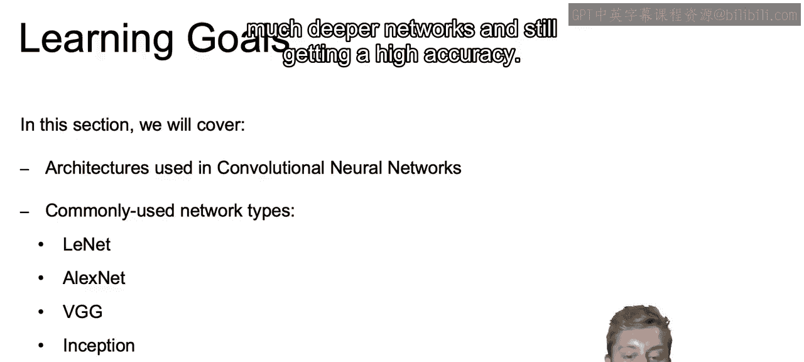
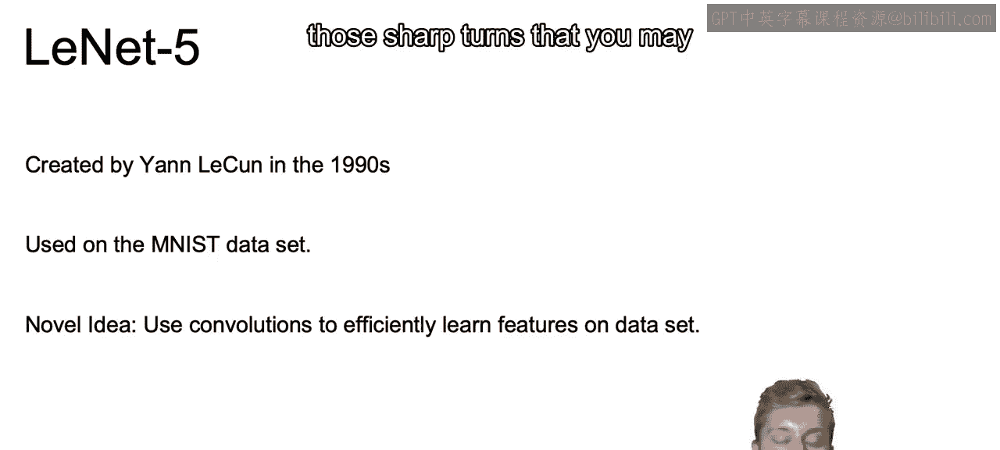
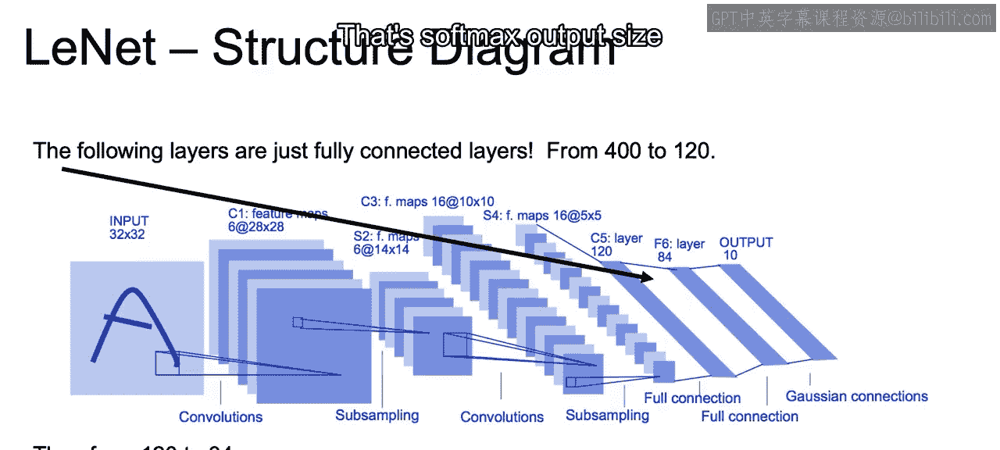
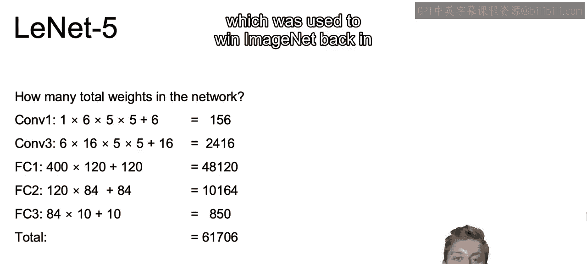

# 086：LeNet.zh_en -BV1eu4m1F7oz_p86-

In general， it may be difficult to determine the appropriate architecture for your convolutional neural network。

With that in mind， in this section， we're going to discuss some different architectures。

 which is help provide a framework as you move towards building out your own convolutional neural nets。

Now let's go over our learning goals for this section。In this section。

 we're going to discuss different architectures using in convolutional neural networks。

And we're going to specifically talk about some commonly used network types。

We're going to start off with Lette， which is an earlier architecture。

 so it's going to be more of a motivating architecture and it was one of the first successes and it was used on black and white images。

We'll then discuss AlexNe， which has what really made convolutional neural networks popular as it won the 2012 ImageNet competition by Landslide。

Then we'll discuss VGG， which is a means of coming up with a simpler overall architecture that's still able to identify more complex features。

We'll then un discuss inception， which will be a means of combining different types of layers together within a single layer。

 and we'll see what that means in just a bit。And then finally， we have ResNe。

 which is going to be a means of working with much。

 much deeper networks and still getting high accuracy。

So starting off with Lyette， Wellette was created by Ian McCum in the 1990s， so again。

 it's one of those earlier architectures。And the Lnette was built for MNIS。

 and the MNIS data set is specifically numerical values that are handwritten between0 and9。

 and we want to identify which number is written。For a given image。

 so they're all going to be black and white on gray scale。

 so we're only going to have one channel if we think back to our discussion about image data。

And he was able to use this concept of convolutions for the first time to efficiently learn these features that are built into the data。

 whether those are those edges or those loops， or those sharp turns that you may see in any numerical value。

So let's walk through the actual architecture of working with Lyette。

So we have the actual structure diagram here in front of us and we start off with this input。

 which is a 32 by 32 grayscale image Again in the original data set we are working with numerical values in that Ms data set and that's why our output at the end is going to be 10 different values is going to predict whether it's a 0。

1，2，3 etc through 9， So 10 different possible outputs here we have an A you can just imagine that is a handwritten digit。

And we also have zero depth here since we we have this on the gray scale， it's in black and white。

 so we don't have to worry about having different channels， just going to have a depth of one。

So then we have our first convolutional layer。And that's going to be a five by five convolutional layer with a stride of one。

 so it's going to be moving across the image one step at a time and then down the image one step at a time。

And this will have the resulting output with a dimension of 28 by 28。And the reason for this。

 as we discuss， if we're moving that five by5 filter across our image and down our image。

 we're actually going to be reducing the number of dimensions each time we take those steps。

 especially if there's no padding。We also are going to use a depth of six。

 so this means we will result in six different kernels that are being learned。

So our filter will have six different kernels and we'll have that output that we have here of 6 by 28 by 28。

 so the next layer does have a depth and that depth is6。

So we want to think how many weights do we need to learn for this particular layer？

And if we think about what the size of our kernel is， and that is5 by 5， so we have 25 weights there。

Then we add on the bias term， so we end up with 26 weights。And then we think about the depth。

Of that layer， of that filter。So we multiply that 26。

 which is just one kernel times six for the depth to come to 156 weights being learned at that first layer。

Next， we have a pooling layer with stride equal to two。

So it's going to be no weight's needed to be learned as pooling is just a fixed operation。

But we want to note that here， given that we're working with this older architecture。

 the original paper actually does a more complicated pooling than max or average pooling。

 but this is essentially considered obsolete by now， so if you are going to be using this。

 you would probably use something like max pooling。

We then have another5 by5hi filter again with stride equal to one and with no padding。 so again。

 we're going to be reducing our size even further。So this time we go to。depth of 16。

 so we went from6 out to 16， and we reduced that output size to 10 by 10 as we discussed。

 as we move that 5 by5 filter， it will reduce the actual size of that next layer and then we have that depth again of 16。

The kernels will be taking in the full depth of that previous layer。

And that fold depth is equal to 6。So each five by five kernel now looks at six times five by five pixels。

Not just the5 by5 or the 32 by 32 as we saw in the original layer。

 but now in order to calculate each one of the individual pixels in each one of our 16 dimensions。

We now have to look at six times five times five pixels。

So because each kernel has six times five times five different weights that are being learned。

 we have 150 weights， plus that biascer so equal to 151 for each particular kernel。

And then to get the total weights for this layer， we multiply this by our new depth， which is 16。

 So we're learning here 2416 weights， which is just 16 times 1，51。And we have our output here。

 which is 16 by5 by5。 We can then flatten this into a vector， which is a 400 vector。

And now we are just working with fully connected layers so we can go from 400 down to 120。

 and then from 120 down to 84。Then ultimately from 84 down to 10 and allow us to ultimately predict which class we are actually working with for our number 0 through 9。

 So that softm output size 10 for each one of those 10 digits。

So how many weights did we actually have to train as we walked through this Lynette structure？

So if you think about that first layer， we only had 156 weights in that convolutional layer。

Then 2416， and then moving to those fully connected layers， that's when the numbers really jump up。

 and we see 48000， then 10，000， then 850， and then ultimately we had a total of 61。

 different weights or 61，706 weight。Now this is always going to be less than the equivalent for a fully connected layer。

And with that we want to note and the major takeaway that we want to take from here is that convolutional layers are generally going to have relatively few weights compared to these fully connected networks。

This structure that we just walked through， the Lette structure， is still used today。

In regards to that convolutional layer， then the pooling layer， and again。

 the convolutional layer ultimately leading to those fully connected layers at the end。

That close out discussion here in regards to Lyette in the next video。

 we will discuss the Alex Ne structure， which was used to win Iagenet back in 2012。 All right。

 I'll see you there。

