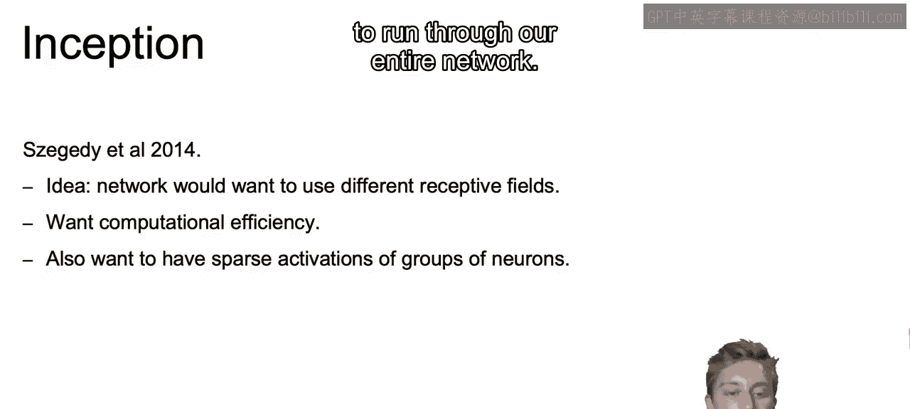
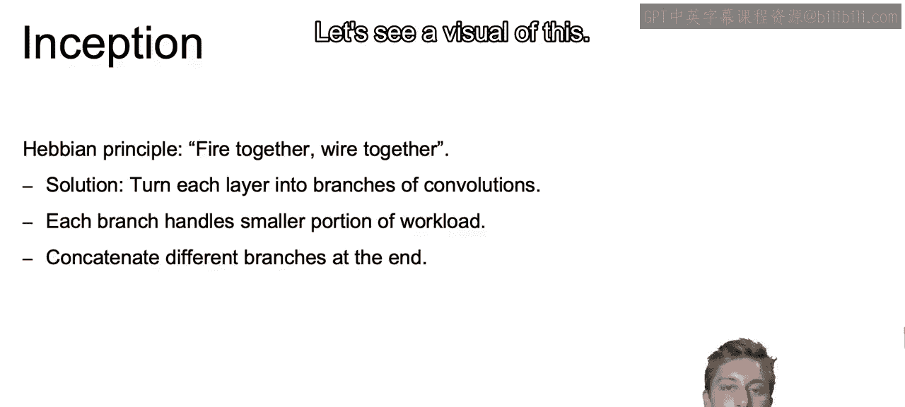
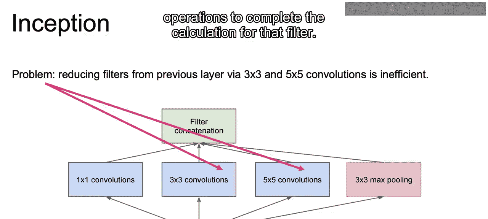
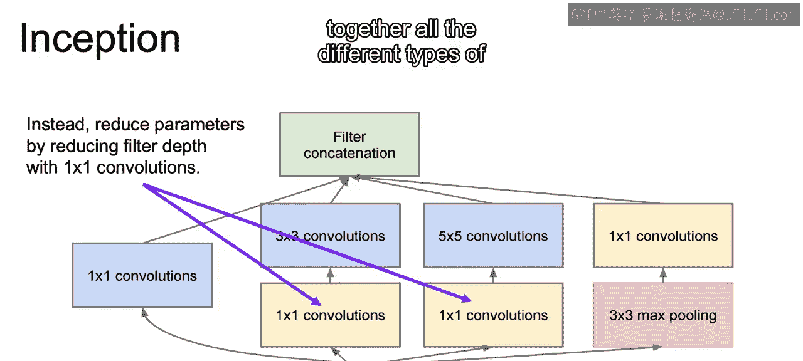
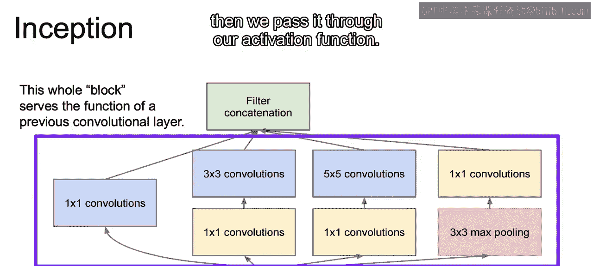
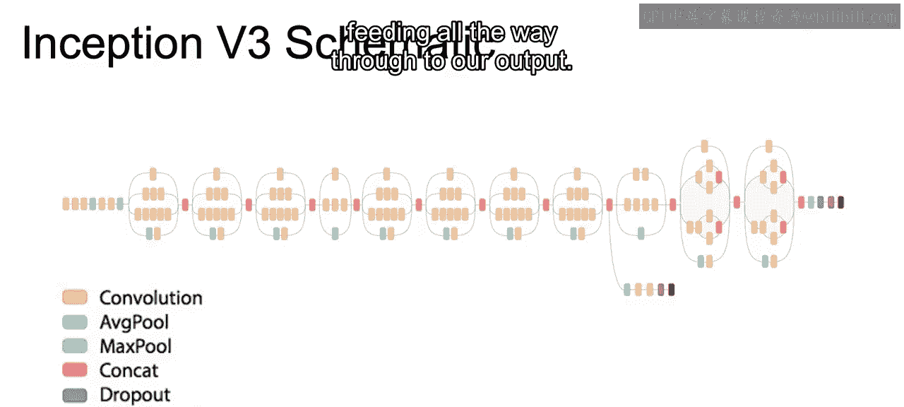

# 088：Inception.zh_en -BV1eu4m1F7oz_p88-

Now I'd like to talk about the Inception architecture。Now with inception。

 the idea is perhaps you don't know exactly what type of filter or what type of layer you want at each step。

So you may want to combine or try a bunch of them together。

But this can be computationally expensive and we probably want to accomplish this with some level of computational efficiency。

And we're also going to want to ensure that we can reduce the total number of activations that are needed to run through our entire network。

So our solution with the inception architecture will be to turn each individual layer into branches of convolutions rather than just working with a single filter type。

And each of these branches are going to handle a small portion of the workload。

And then each layer will concatenate the different branches to complete a single layer。

So let's see a visual of this。

So what we see here。Is we are moving through our previous layer。To the next layer。

 using one of these inception blocks。 So this is our first idea of this inception block that we see here where we have the previous layer。

 and then we're going to concatenate many different types of convolutions， as well as max pullinging。

 which will make up that next layer， So we'll have one by one convolutions。

 make up a certain depth 3 by three convolutions，5 by5， and so on。😊。

And then we concatenate all those together to get our full depth。

And then we can run our activation function through that concatenated version of that layer。Now。

 the way that is laid out， if we use the reducing filters from the previous layer using 3 by 3 and 5 by 5 convolutions。

So we run three by three and five by five convolutions through the full depth of the previous layer。

 we shall recall that we're going to have to have a value for every single channel or every level of depth of that prior layer in order to get each individual value。

Thus， we end up requiring a ton of operations to complete the calculation for that filter。

Now， instead of what we just saw， what we can do is first。

 as we look at these one by one convolutions， is we can run this one by one convolution。

 and that one by one convolution may at first seem meaningless。

 But recall that we're also working with the entire depth。😊。

So we would have a different single number for each level of the new depth that we're trying to calculate。

 similar to when we work with different three by three kernels to come up with different depths with a three by three kernel。

 we do the same with a one by one。 But this time we're just multiplying by a single value。

And by first doing these one by one convolutions。We can reduce the depth。

Without nearly as many calculations as would be needed if we did a 3 by3 or a 5 by5 filter。

And then once we have reduced that depth。Then we can do our five by five convolutions or a three by three convolutions with much fewer operations required。

 thus reducing the computational complexity。Now， with that。

We also have this pooling that we see all the way out to the right。And for max pooling。

 we still are going to end up with that same number of channels or that same depth if we did pooling on that previous layer。

So doing the one by one convolutions after the max pooling allows us to again reduce that depth to whatever depth we want before concatenating together all the different types of convolutions that we have here in our inception layer。

And this whole block serves the function of that previous convolutional layer。

 so we combine these all together， and then once we combine these all together。

 then we pass it through our activation function。

So to see what this looks like for a full network。We have our input coming in from the left。

 and we see that we have multiple different convolutions within a single layer where we have single。

Triple and five， so three by three or five by five convolutions， as well as perhaps an average pool。

 and then once we concatenate those all together， then we can run the soft necks and we can continue to do that with different types of convolutions at each one of the different layers feeding all the way through to our output。

