# 089：ResNet.zh_en -BV1eu4m1F7oz_p89-

Now I'd like to talk briefly about our final architecture， the Resnet architecture。

And I want to start off with the motivation behind it。Now。

 researchers were building deeper and deeper networks as they started to realize the power of convolutional neural nets。

But they start to find that as they built out these deeper networks。

 they were actually tending to have worse performance on deeper networks。

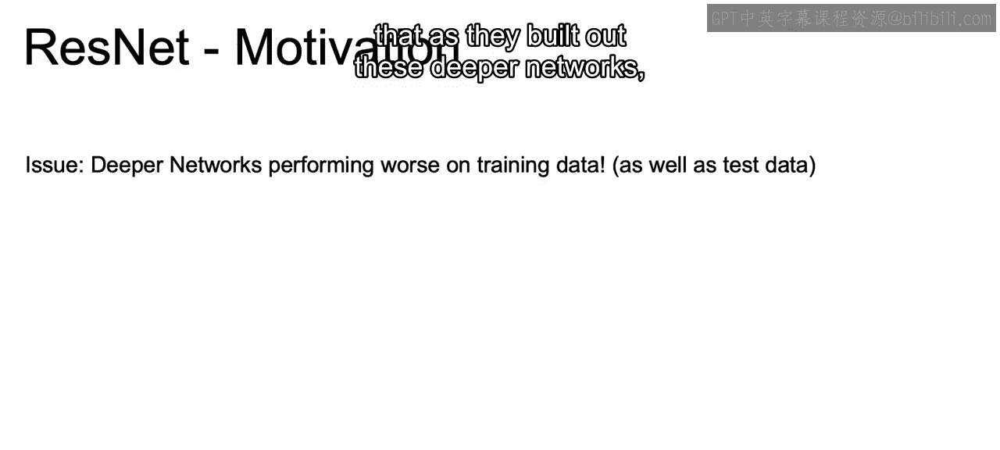

And we see this here on the training error with the 20 layer versus the 56 layer network that we actually have a higher training error with that higher layer network。

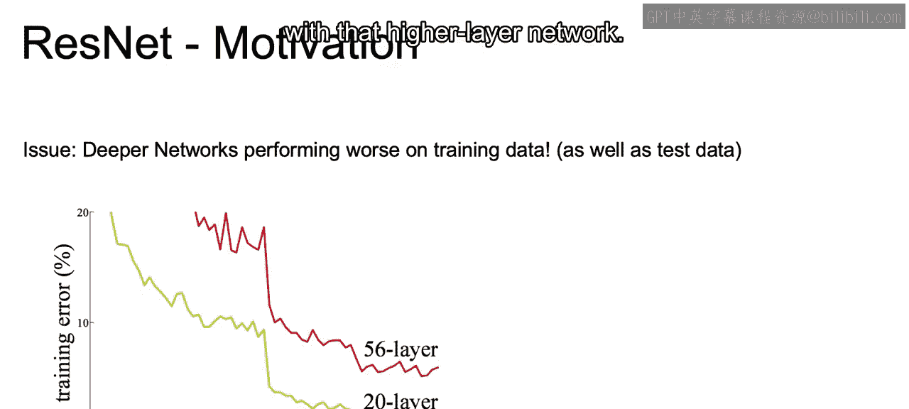

And hopefully you don't think that this is intuitive because this is intuitive as we see here for perhaps the test error on our holdout set。

 but when focusing just on our training set， ideally。

 we should just be getting better and better in regards to the training error just on that training set that we learned the model on。

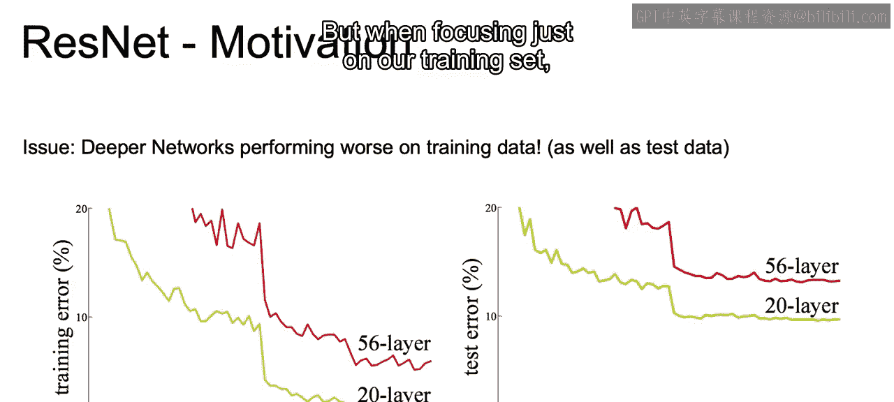

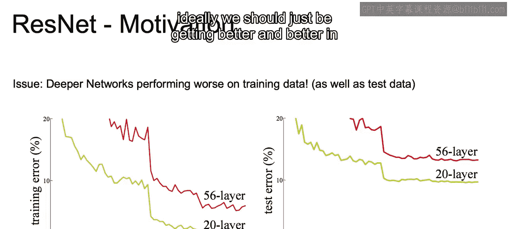

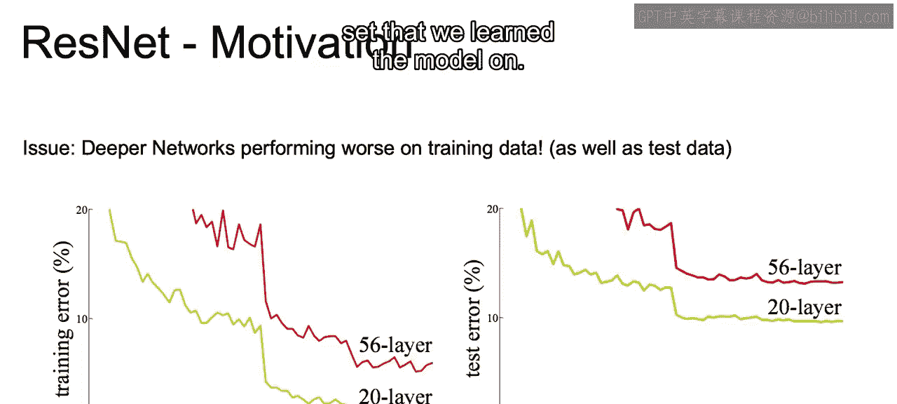

And this is surprising again， because deeper networks should overfit more and should do better on the training set。

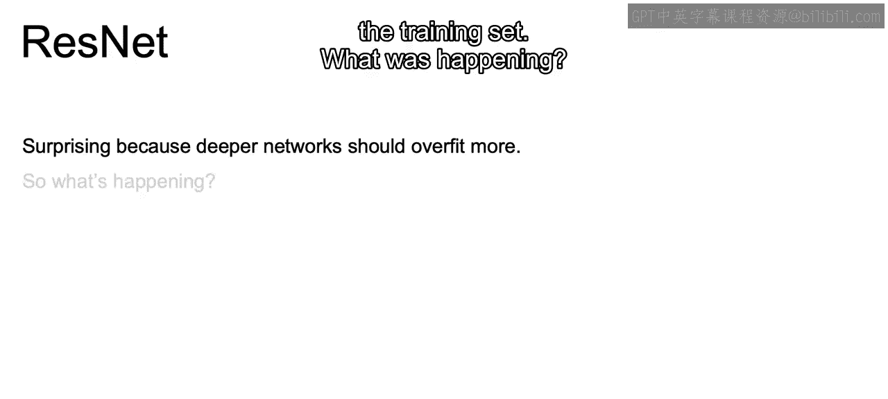

So what was happening？Earlier layers of deep networks were very slow to adjust so it was hard to adjust those earlier layers within the network。

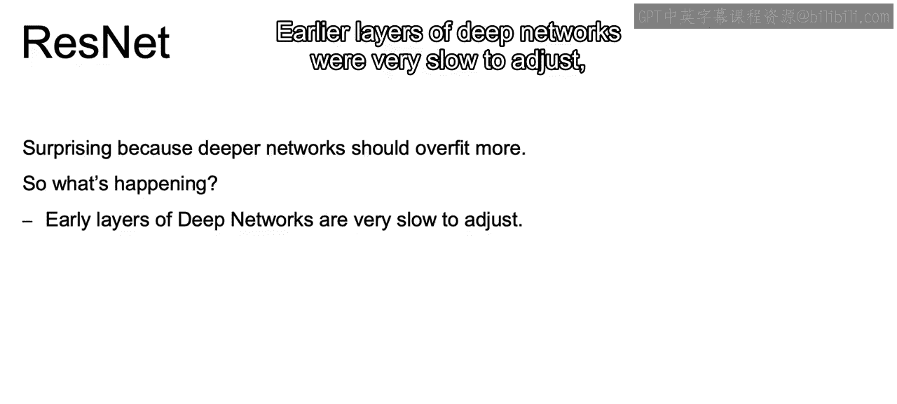

Analogous to that vanishing gradient issue as we move towards the front。

 as we do back propagation and move towards the front of our neural network。

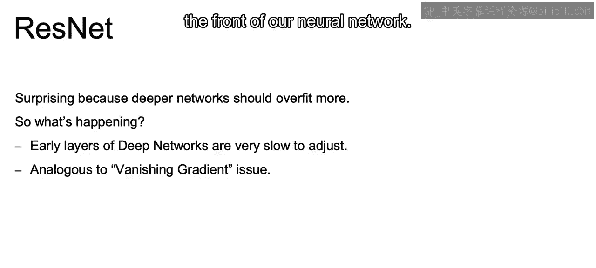

And this is happening that we are having this lower performance on the training set when， in theory。

 we should be able to just have an identity transformation that makes the deeper network behave just like the shallower one。

 So if our 20 layer network is doing well and we add on another layer or another 30 layers。

 there's no reason why we would do worse。 because we can just add on identity layers that keep it exactly the same。

😊，But our convolutional neural nets due to the vanish ingredient gradient issue weren't able to learn these identity matrices or identity transformations in any type of way。

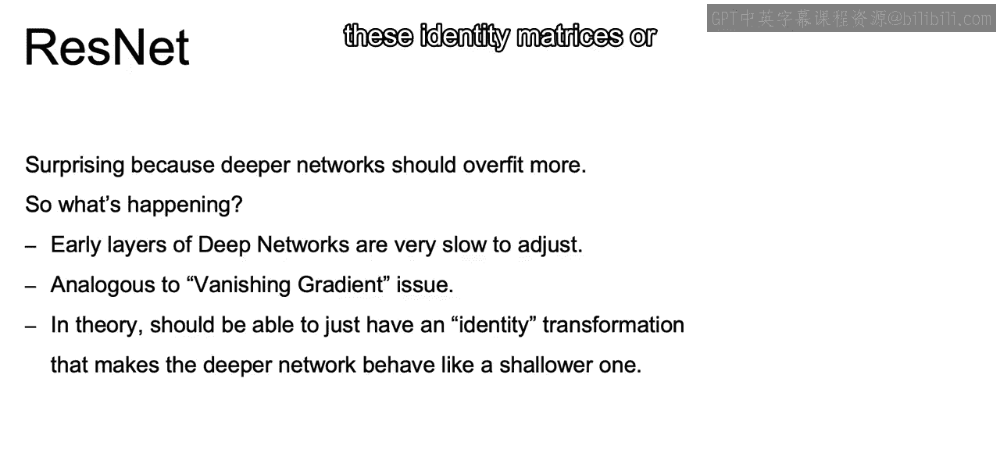

So the assumption that will make resnet possible， so resnet is the solution to this problem will be that the best transformation over multiple layers will be close to F of x plus x。

Or x is going to be our input to the series of layers。

 and we see that here in eye diagram where we have that x。

And F of x is our function represented by several layers。

 say convolutions here with their relo activations， as we see in the diagram in between。

And we can then take that layer's linear transformations。

As well as the added on initial weights that x and pass them through that current relo。

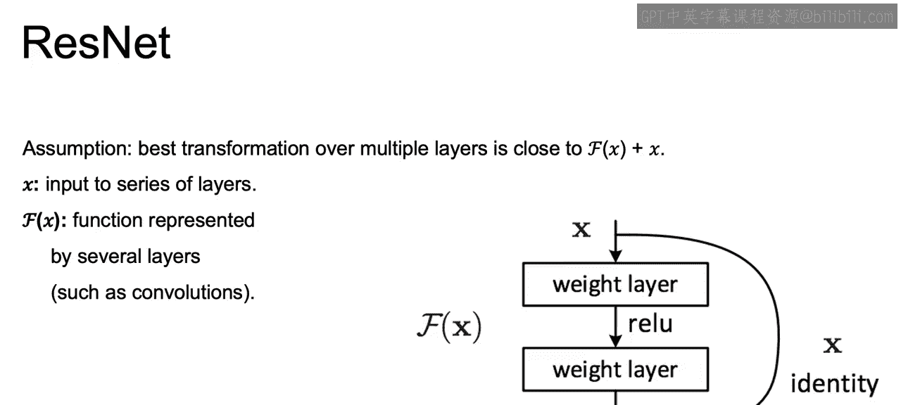

And this shortcut allows for the information from those earlier layers to easily pass through our network。

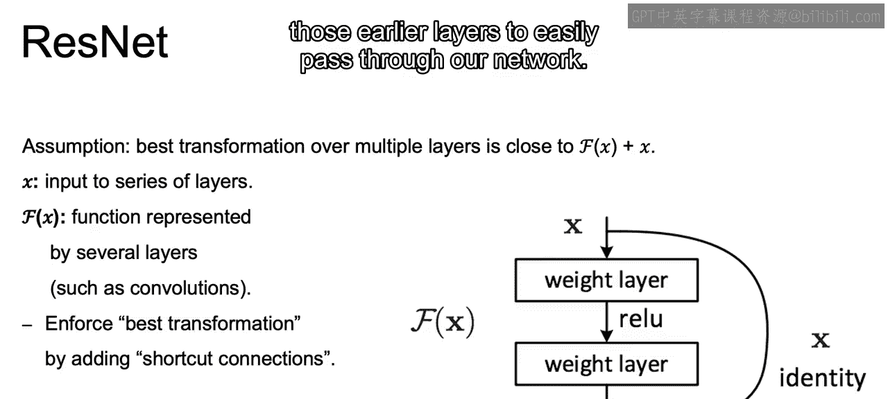

And we can continue to do this throughout the network to ensure that prior layers， say two layers。

 ps， and not just that initial input， as you may have thought about with X。

 can continue to be added to the output of the most recent layer。

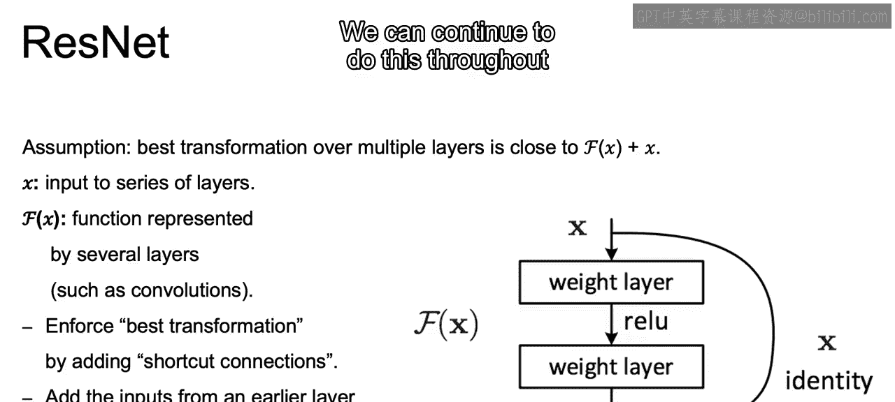

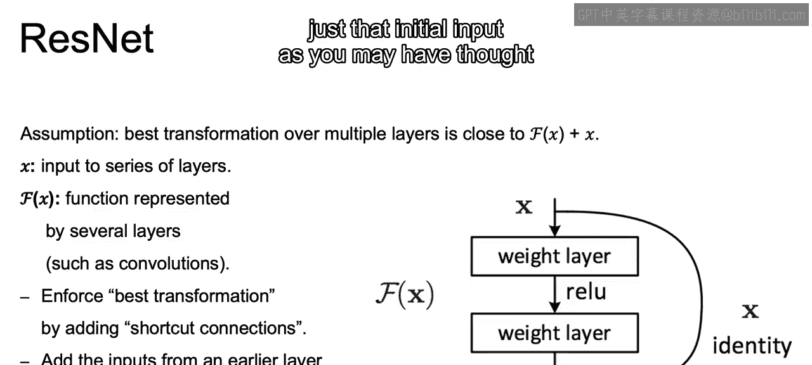

And the idea basically is keep passing that initial information unchanged to the next layer。

 as well as that transformed information as we move along our network。

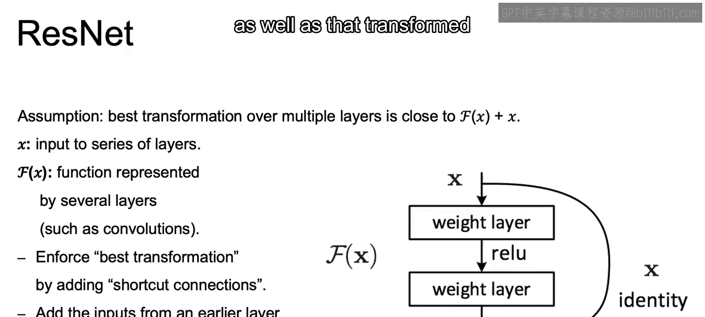

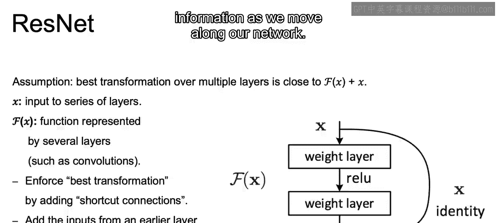

Now， this will actually allow you to continue to pass through pass information。

 if we just set our weights to 0 for our new layers。

 so it's possible to just have relo of that shortcut connection。Represented by the loop。

And what goes wrong is that as we go deeper and deeper。

 it becomes difficult to even learn something like that identity function due to the banishing gradient issue。

 But if we allow for that， again， initial value to be passed through。

Then we can hold on to that value from that earlier layer。Add again。

 zero weights to that new information coming in and effectively have that identity transformation as we move through our network。

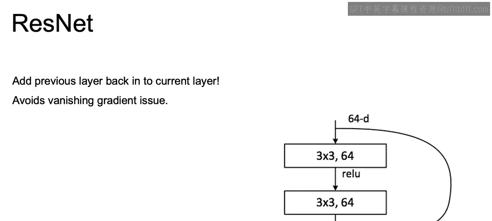

Now to recap。In this section， we discuss many different common architectures that we should be aware of when we're working with convolutional neural nets。

We started off with Lette， which was an earlier version where we saw the framework of that convolutional layer。

 then the pooling layer， and then those fully connected layers first being introduced using the MNIS data。

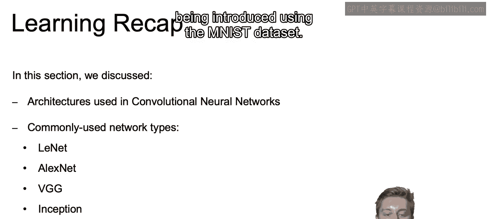

Then we discussed Alexnet， which was。Introducing we lose into the equation。

 as well as other breakthroughs and efficiencies to create that complex network that ultimately blew away the IageNet competition back in 2012。

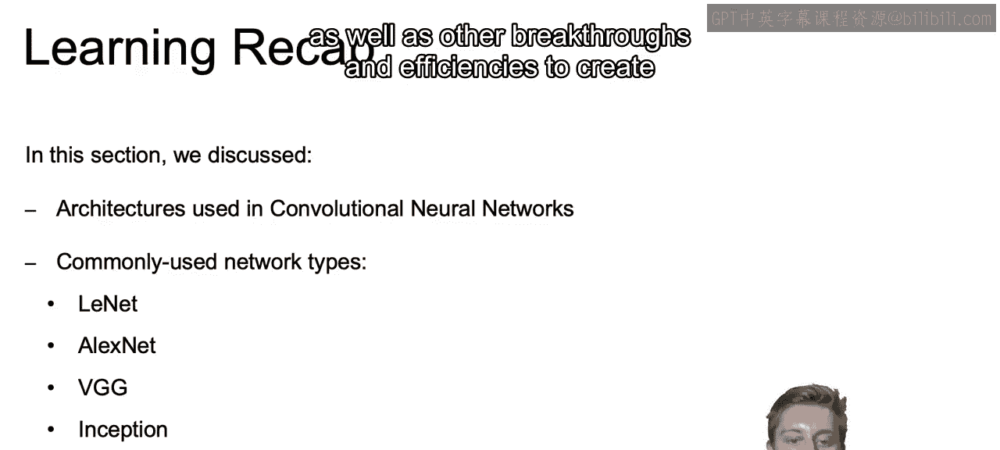

We then discussed VGG and how that allowed for a simpler。

 powerful framework that accommodated for its simplicity with deeper networks。

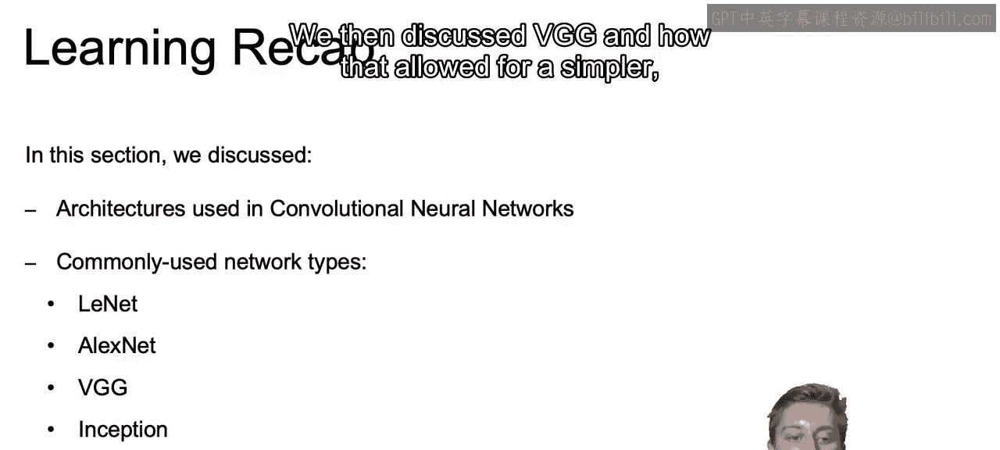

We discussed the inception model which allowed us to include multiple layer types within a single layer while maintaining computational efficiency。

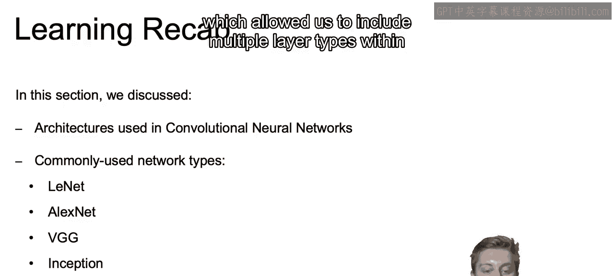

Then finally， we discussed ResNe， which allowed for maintaining information from earlier in the network to ensure that we can build out incredibly deep networks while still continuing to reduce training error。

Now that closes out discussion on convolutional neural networks。

 which are very powerful for image data。But in the next video we're going to introduce our next major framework that's going to be powerful for working with text and time series data。

 namely recurrent neural networks All right， I'll see you there。

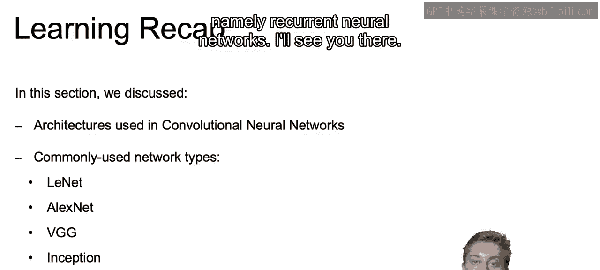

