# 090：IBM《机器学习（无监督学习、深度学习和强化学习、毕业项目）｜machine learning》中英字幕 p90 51_循环神经网络（RNN）.zh_en -BV1eu4m1F7oz_p90-

In this set of videos， we're going to motivate and gain an understanding of how recurrent neural networks work。

Now let's go over the learning goals for this set of videos。In this set of videos。

 we're going to cover what recurrent neural networks are as well as the motivation behind them。

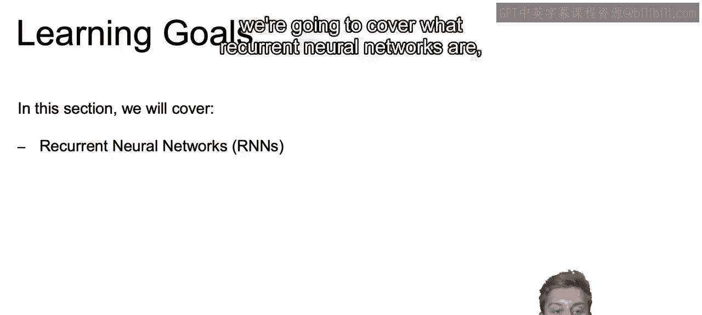

We'll discuss both the practical and mathematical details that allow you to understand how recurrentin neural networks work。

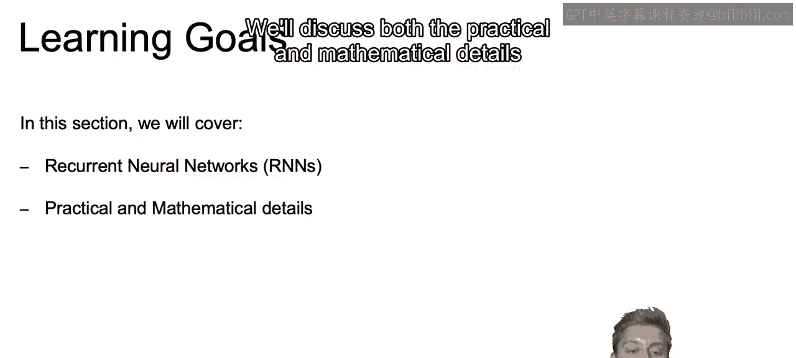

And then finally we'll touch on some limitations of these recurrent neural networks that we discuss and that will lead into our next set of videos on how to adjust for those limitations。

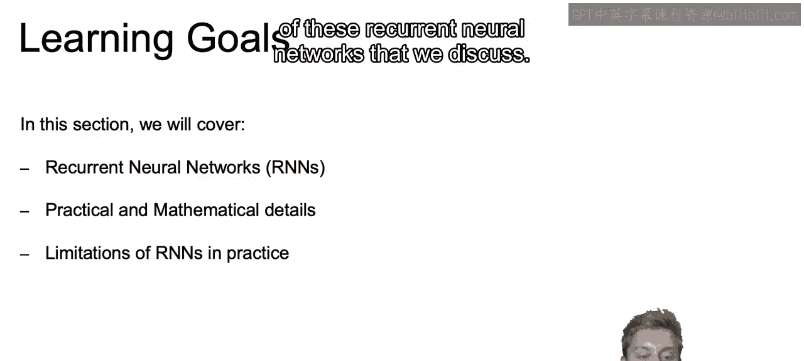

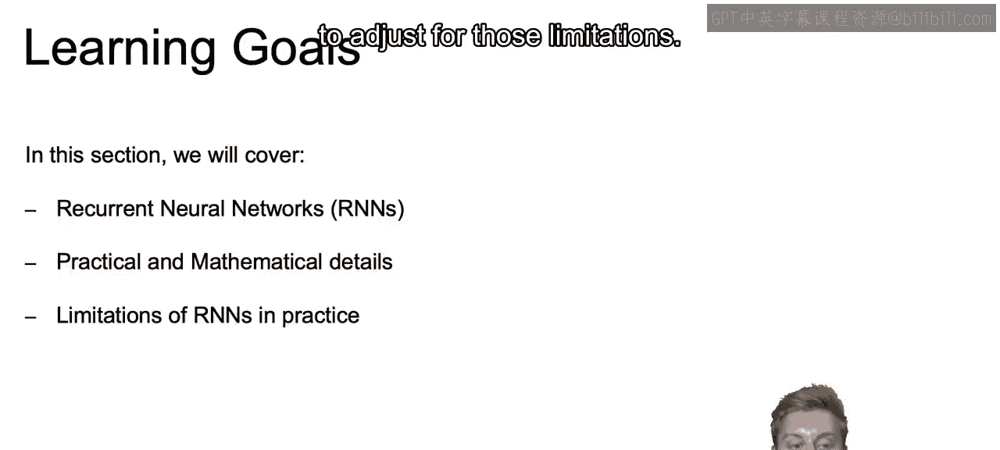

So we discuss how processing of images will force them into a specific input dimension。

 where with our gray scale， we can imagine the two dimensions of pixels。

 say 28 by 28 and why something like a convolutional operation。

 which we saw in the past videos takes on surrounding cells。

 and it makes sense for these types of input data。

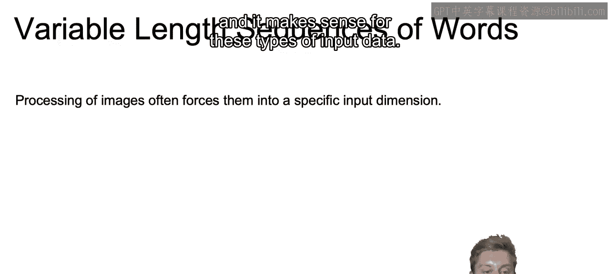

But this may not be immediately obvious in regards to text。

 in regards to what kind of data we want to input and what kind of operations we want to use。

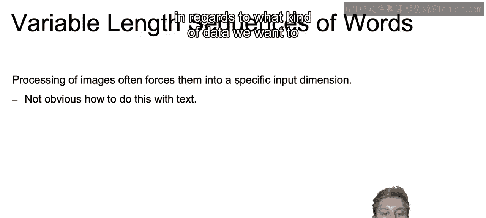

For example， if our problem statement was to classify tweets as positive， negative or neutral。

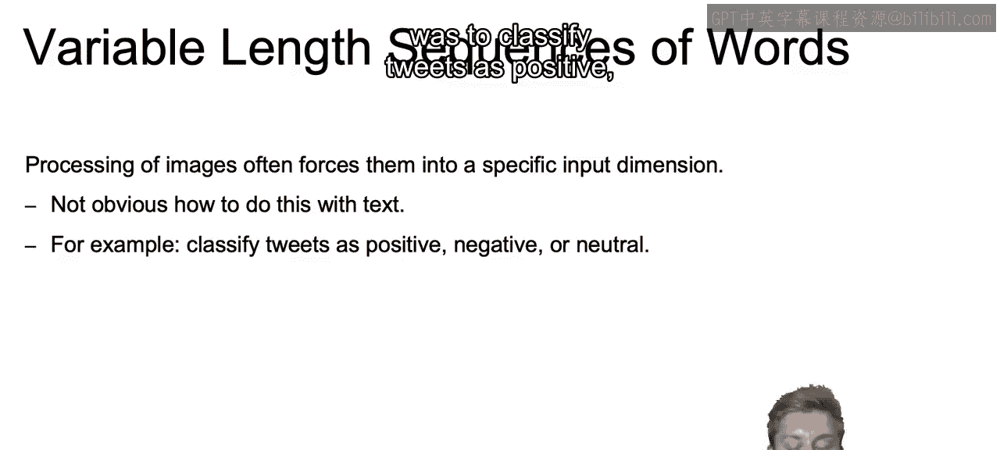

Different tweets can have different number of words。

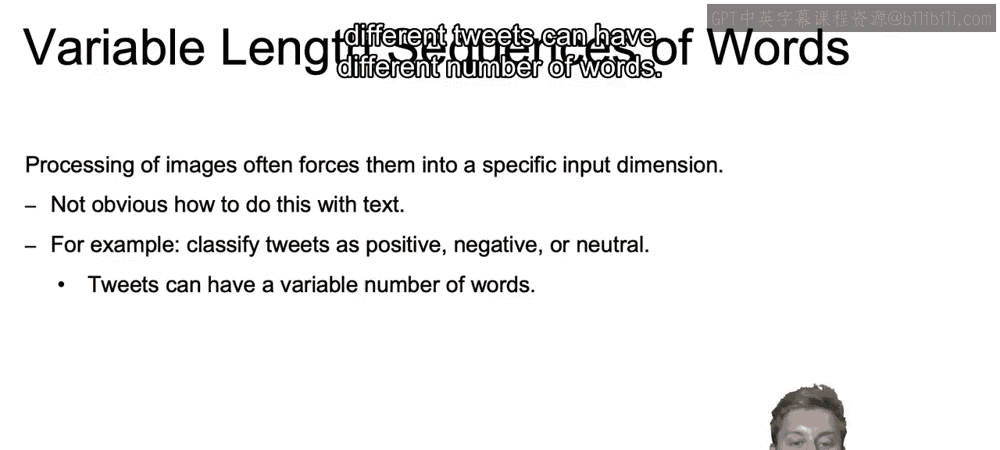

And we want to know how can we account for this variable link for each one of our input sequences？

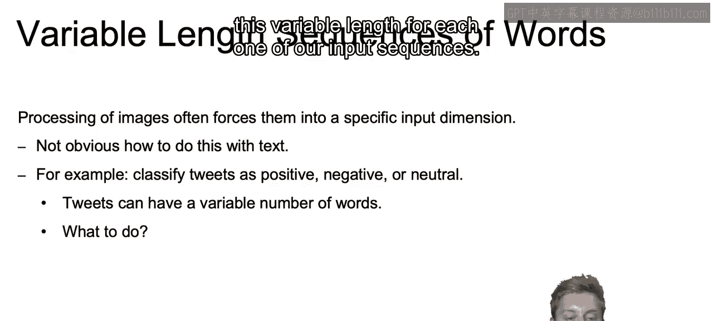

Now we want to do better than just the bag of words implementationment。

 which would essentially take every word and just state how many times that word appeared in the document。

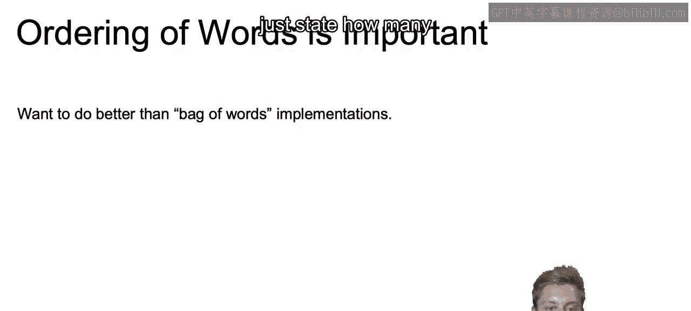

Ideally。When working with text data， each word can be processed and understood in the appropriate context。

 And by context， we can think of it as the prior word surrounding that word， prior sentences。

 et cetera。

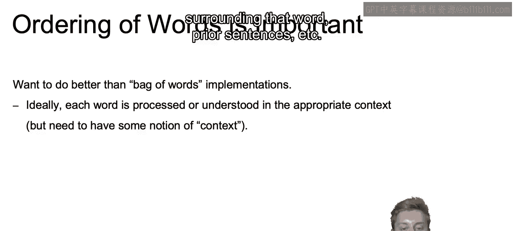

And those words should be handled differently， depending on that context， you can think about say。

 a bat being either the animal of a bat or a baseball bat。

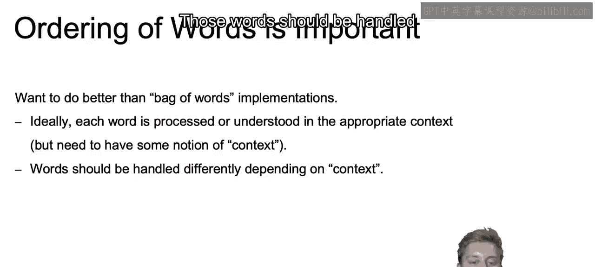

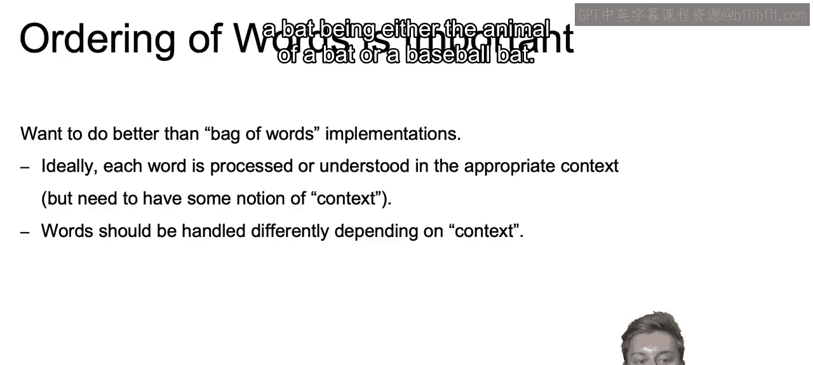

Also， we get more words。As we get those more words。

 we should be able to update the context that we are currently working with。

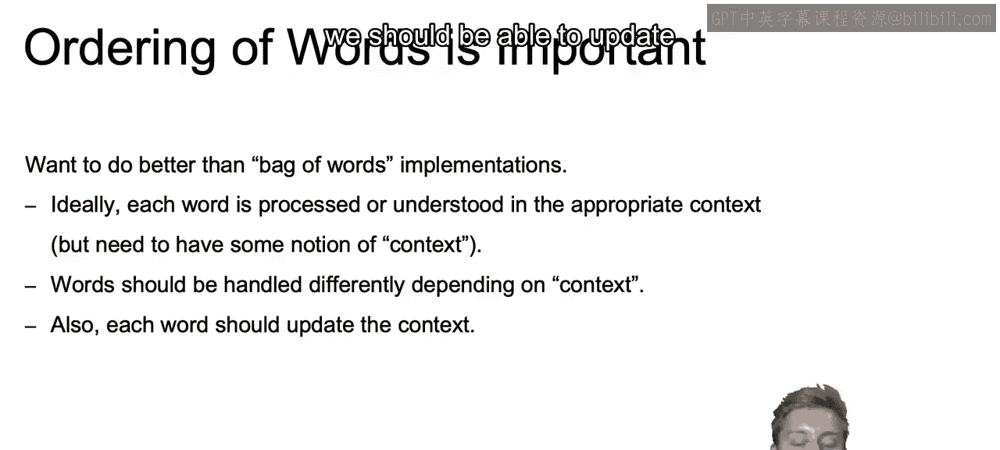

So the solution will be to use this idea of recurrence。

 where we input the words into our network one by one。

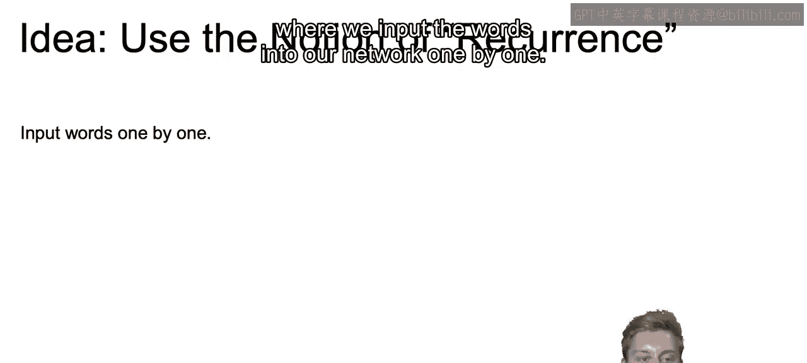

And this would mean that we can deal with variable length by just continuing to feed until the end of the sentence or till the end of the document。

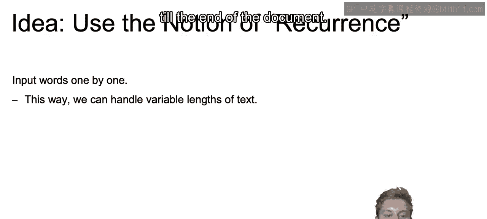

And because we have the information from prior words。

 the response to any particular word can depend on those that actually preceded it since we're feeding it one by one。

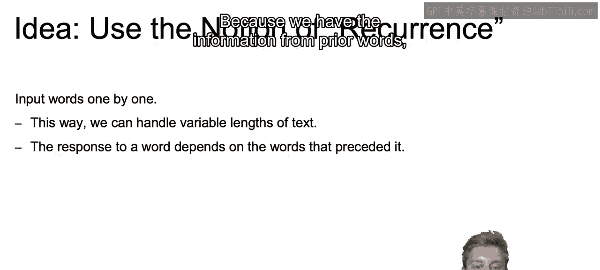

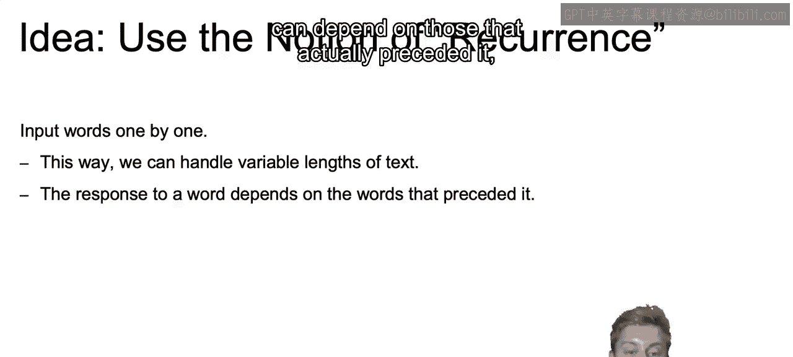

Our network would then output two things as each new word came in。One being a prediction。

 if a sequence were to end at any particular word， what would the prediction be？

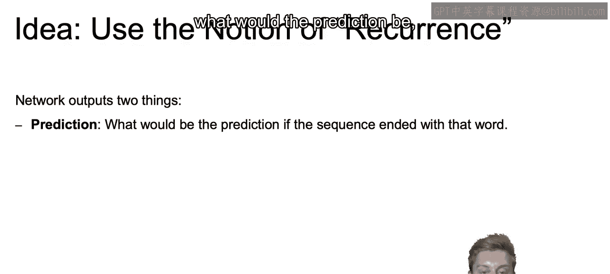

And second， a state， which contained a summary of everything that happened in the past leading up to that point。

 or again， that context that we're looking for。

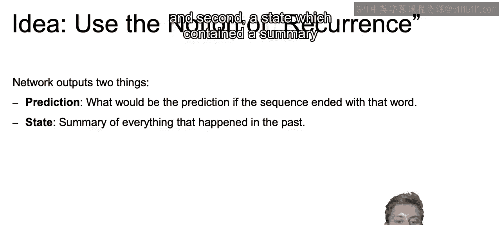

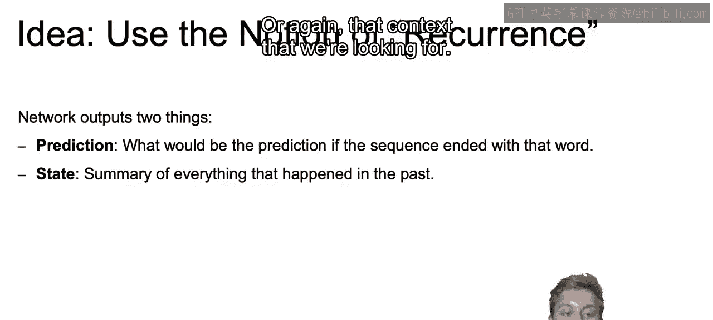