# 091：IBM《机器学习（无监督学习、深度学习和强化学习、毕业项目）｜machine learning》中英字幕 p91 52_状态和循环神经网络.zh_en -BV1eu4m1F7oz_p91-

Now this picture of how the recurrent network is。Used or how it's built is often a bit confusing to digest。

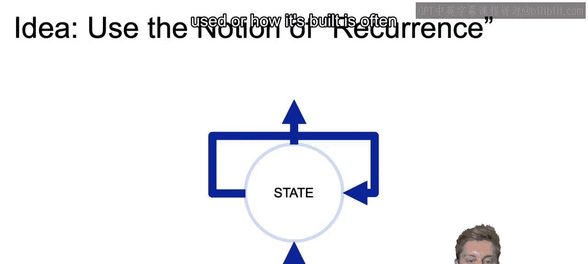

But what we're looking at here。

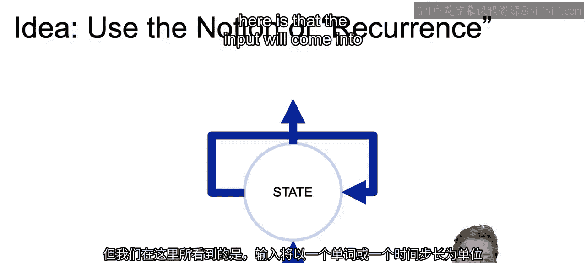

Is that the input will come into a network one word or one time step at a time。

And as those values come in， we can update the state with all past context so we can keep track of the inputs that have come in。

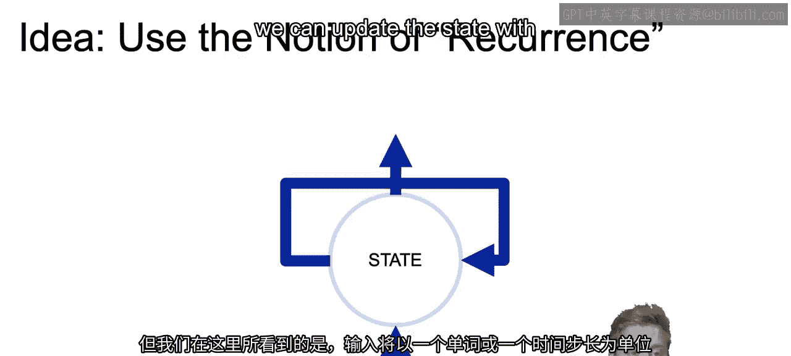

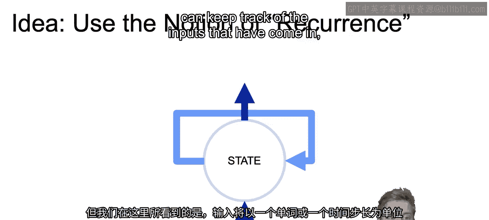

As well as outputting a value so that we can have a prediction at each word or at each time set。

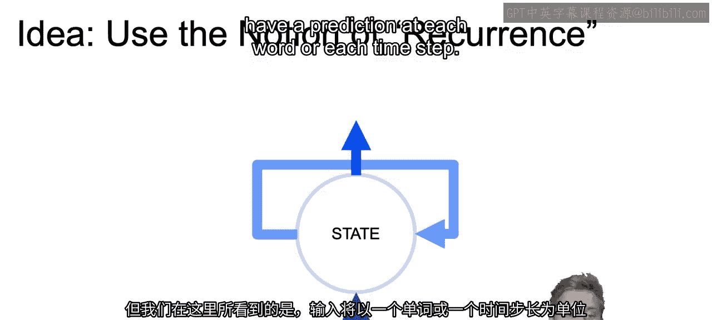

Now， as I said， this may be a bit unclear， so let's unroll this recurrent neural net and take a deeper dive inside。

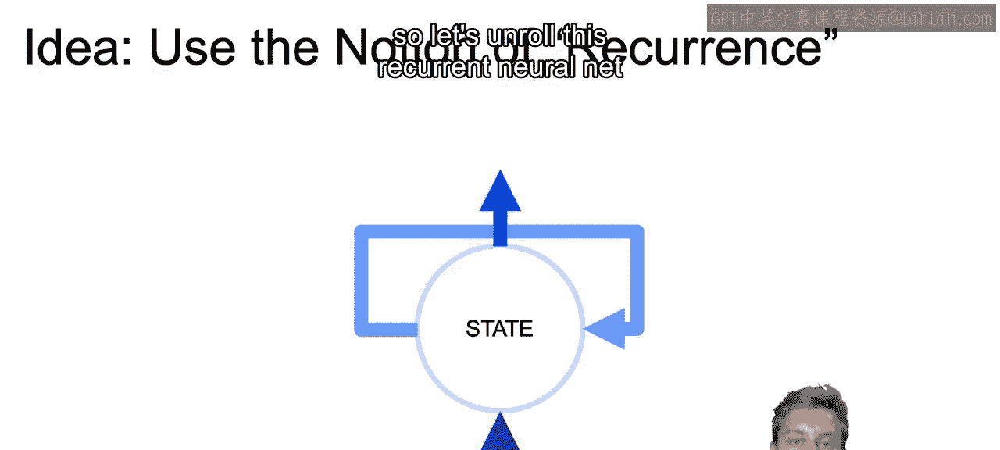

Now looking at the quote unquote， unrolled version of what we just saw。

We're going to have our words coming in as input and those come in one at a time。

And then starting back at W1， we have a linear transformation denoted here by this matrix U。

And note that W will be some vector representing that single word。 And in general。

 R N does not only take words， but can be taken in any information at one point in time。

 So you can imagine this being an input vector with sales data with inventory levels。

 promotional spends， all for one time period， and then W2 being that same information for time period 2 and so on。

But again， in this instance， we're just going to continue to think of this in terms of words。

 where each word has its vector representation for word one， word  two， etc within the sentence。Now。

 how are we able to store？And pass that information from one cell to the next。

The way that we do that。Is that each step？Along with our input dot product of W and U。

 which we just did， right， we took the dot product of that W vector with our U transformation。

We're also going to be getting as input the state from the prior cells。

So starting at S1 or even before S1， we can initialize that state with a zero vector。

But then we pass that information from S1 or state 1 to S2 and so on。

And the way that we do this is we add together the values from that prior state。

And take the dot product of that state with our matrixtri W。

We then combine the values from the input of W1 and U。As well as S1 and that W matrix。

And pass that through all together， all combined through an activation function to get our new state。

Now， the output from this activation can be used as actual output at each step。

And that is often the case， what can also do， as we see here with these V matrices。

 is have another transformation take place with this vector。Pass that through another activation。

And either pass that new value as output。Or even create another layer on top。

 you can think of this as just the first layer in our neural network with some amount of nodes。

 we can have it another depth to our layer and create another layer taking in as input these output values。

And once all that is done， often we may only use that final output that we have here to create our ultimate prediction that we're trying to make。

So as an example。The first two words have an unknown sentiment。

 while the last two words that we have here are going to have that positive sentiment。

So you see the question mark question mark， and then it was able to predict the positive sentiment if it was predicting sentiment at each one of these different outputlets。

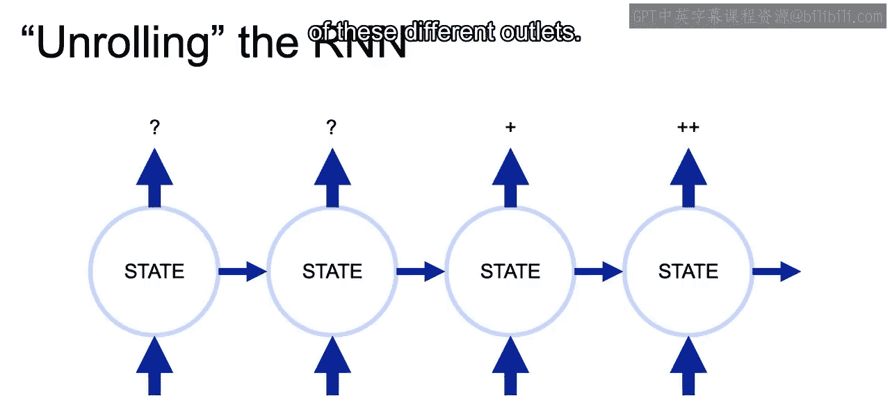

Now each of these cells can have an output greater than one。

 so we can imagine if we set our matrix to have an output with say phi values。

 so that01 is an array with five different values。We would be getting five different outputs at each one of these steps。

And this is the idea of having more than one node in our first layer within a feed4 neural network。

 those are one and the same。

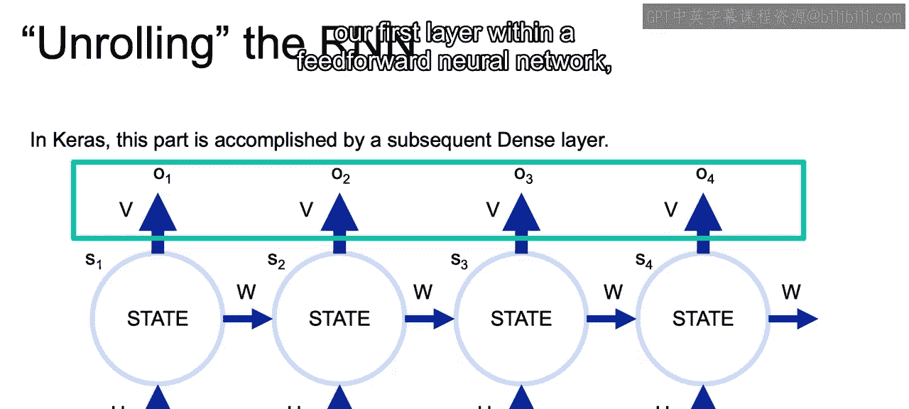

So if we're assuming something like five or more nodes or five or more outputs。

 and ultimately we want to predict something like a class that's only between two values or three values。

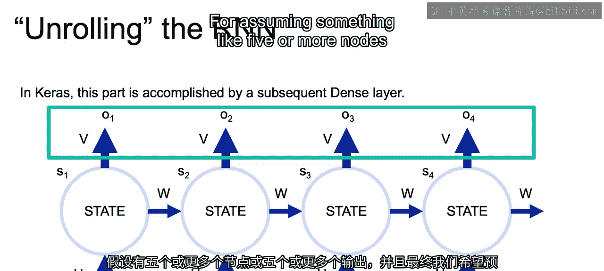

We'll need to have a dense matrix that give the linear combination of each one of those nodes。

 as well as an activation function that results in either three values or only a single value depending what we're looking at。

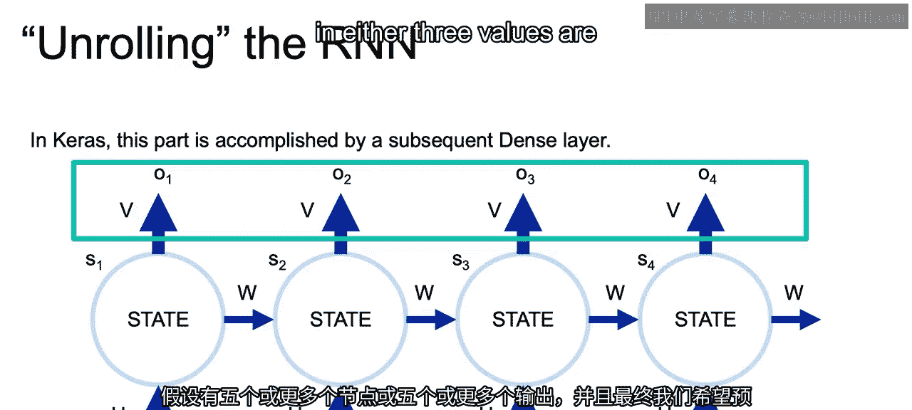

Now， if this is a bit confusing， an important note is that usually we're only looking at that final output。

 So here say0，4， output 4。And since that is the only output with information from all the other inputs。

 that's going to be the most important。And that single output of 04。

Can have those five values that we just talked about or 32 values。

 whatever amount of values you want in regards to the number of nodes you want in that first layer。

And if we have something like five or 32 nodes， then we need to pass that through a dense layer。

 just that 04， in order to come up with the prediction。

 whether that's an output of just one value or three values。

 whatever it is you're trying to classify。

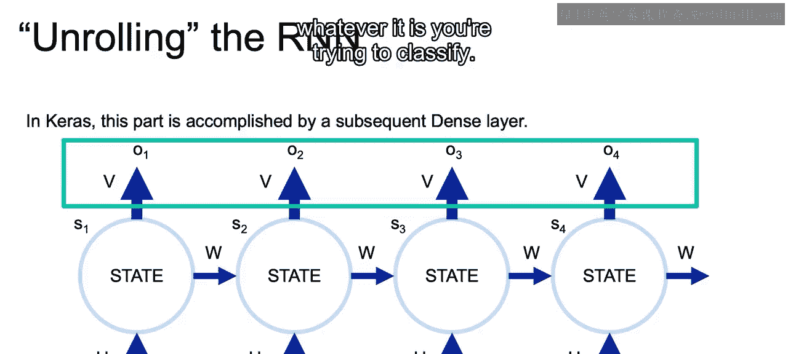

Now what we have here， what we have circled here is really the crux of our recurrent neural net。

 which passes through that save state from all the prior inputs within our sequence。

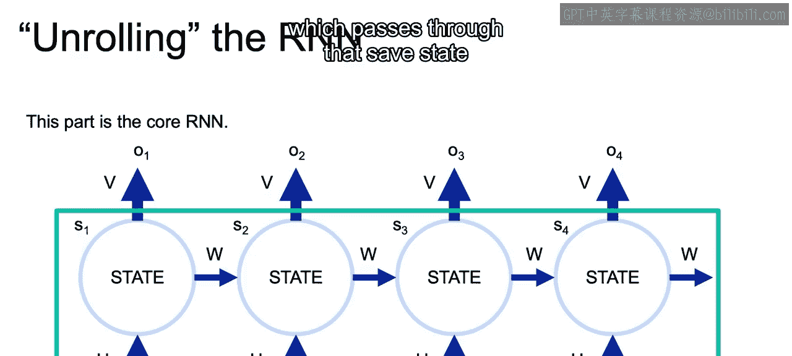

In Cars， we call this part that we have as the input， the kernel。

 and the kernel refers to the matrices used for that input transformations， those use。

 and we can initialize these weights using our kernel initializer and we'll see that in the notebook。

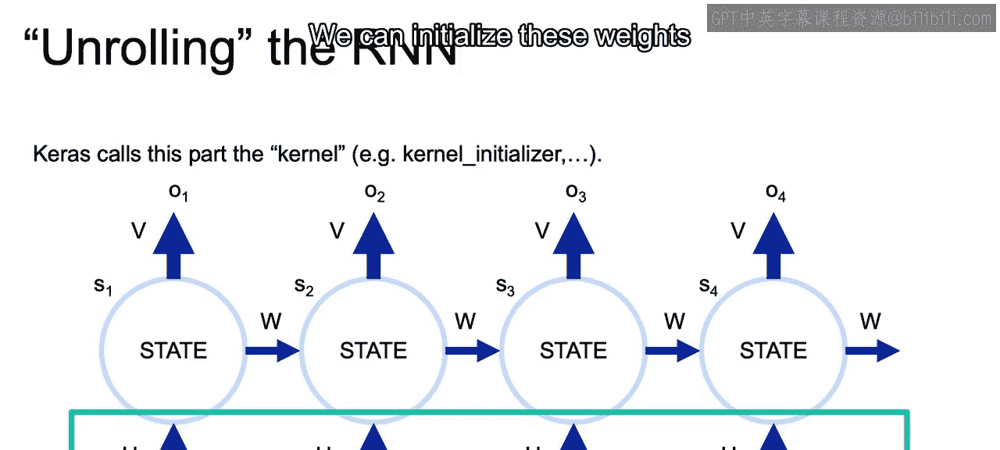

And then we also have weights within our recurrent portion of our network。

 and that will also need to be initialized， and those are going to be the Ws that we see here。

Now that closes out this video and in the next video we'll start to walk through at a high level the actual math of how this all works。

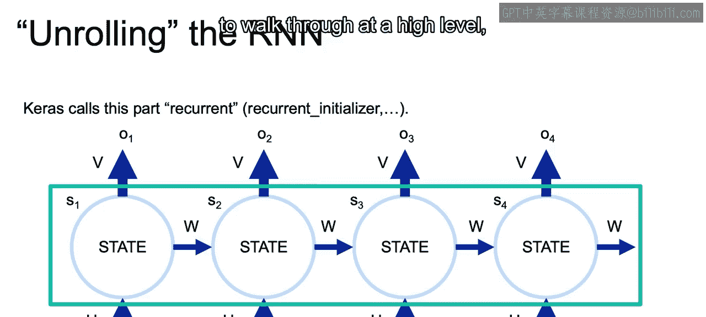

All right， I'll see you there。

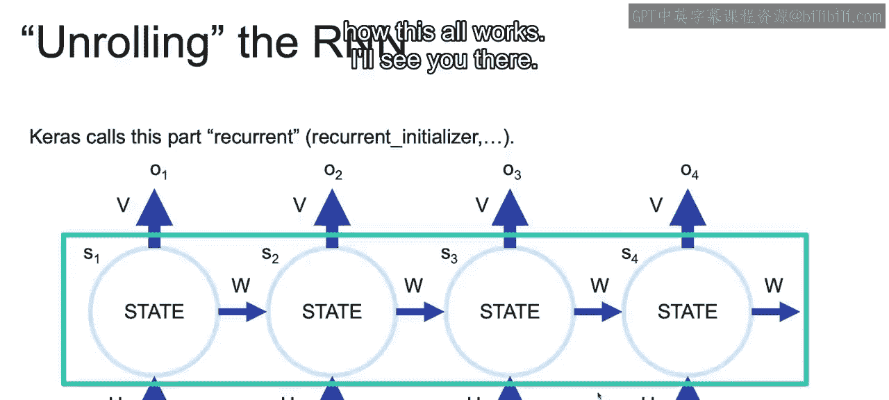

