# 096：IBM《机器学习（无监督学习、深度学习和强化学习、毕业项目）｜machine learning》中英字幕 p96 57_LSTM解释.zh_en -BV1eu4m1F7oz_p96-

Now here we have our LSTM diagram， and if we think back to our unrolls recurrent neural net。

 you recall we unrolls our original diagram。This is going to be a single cell from that unrolled LSDM。

So we can imagine that we are working with some sequence。

And we're going to have here just an input of a single word from that full sequence of words。

Now I know this looks complex， which is what we promise， but let's start off explaining how it works。

 and I promise by the end of this it'll make a bit more sense。So we have our input， which is again。

 just going to be a single word as we're working with that unrolled version。

 whether that's a single word or a single time step， we are passing in that input。

We also have this C of T， which is our cell state at time T。

 which will be new and wasn't a part of ourcurrent neural net。

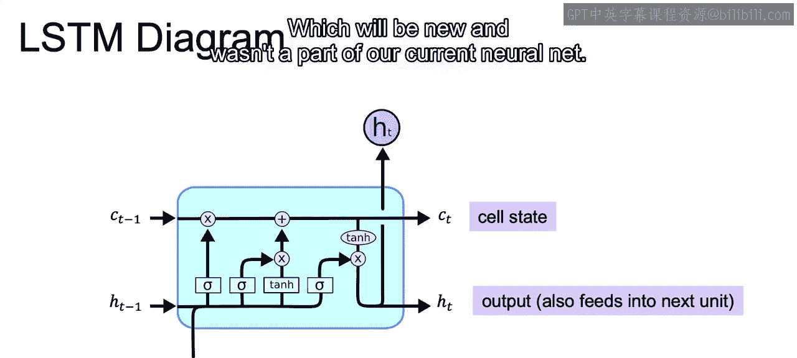

We're also going to have that hidden state， which is something similar to what we saw in the recurrent neural net。

 and this will also feed into the next unit along with that cell state。

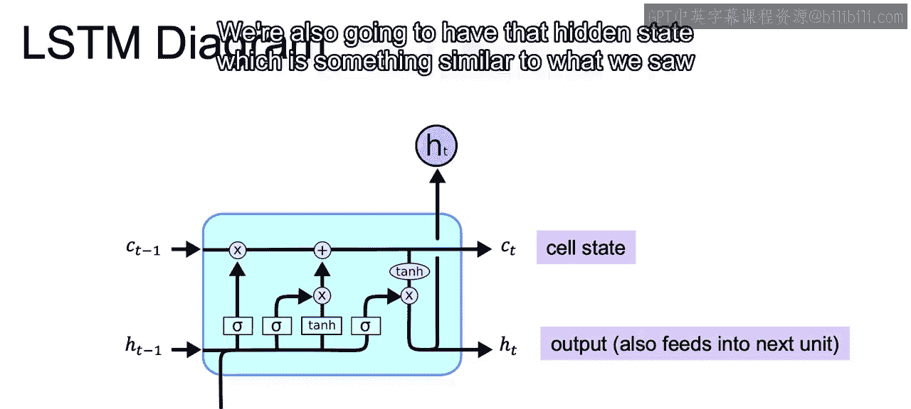

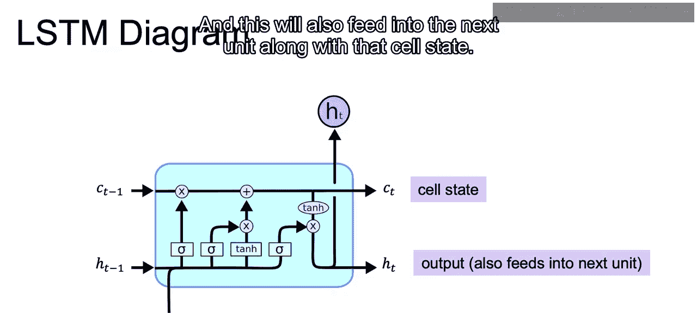

And then we have our output， which will be the same as the H subt that we are passing along to the next cell。

And similar to that recurtin neural net where each one of the cells will have an output。

 but will ultimately matter will be that final output from that final cell of our unrolled version where we have the information from all of our inputs within our sequence。

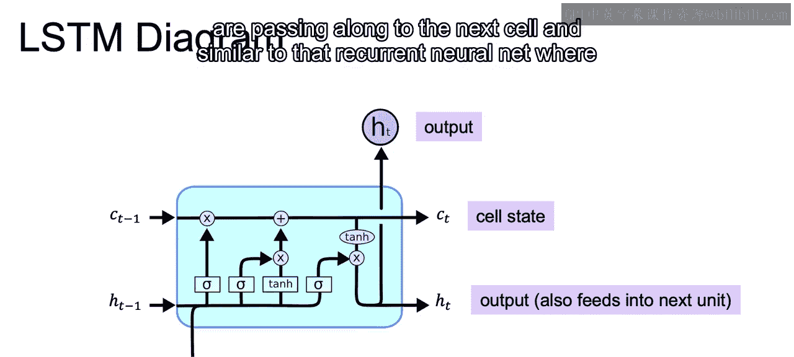

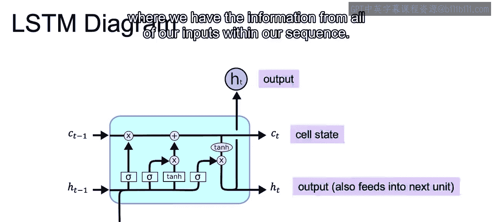

So let's focus now on this new cell state that we're working with。

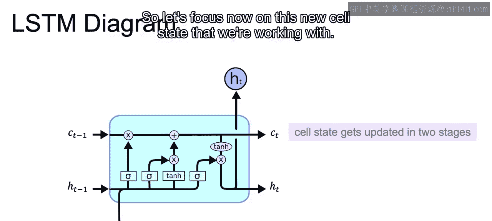

The cell states going to get updated in two stages。We have our。

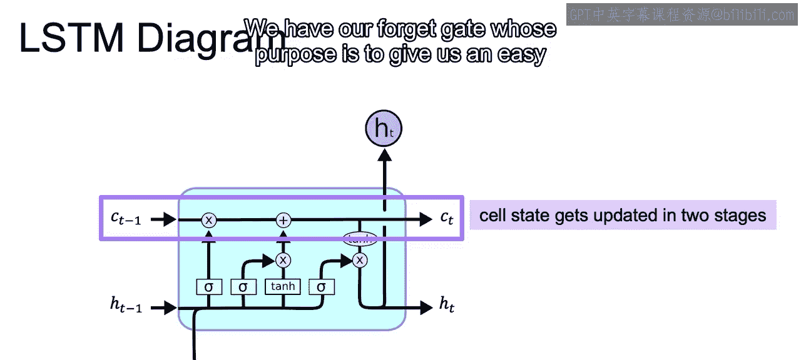

Forget gate。Whose purpose is to give us an easy mechanism to decide what information from that prior cell state。

 as well as the current input coming in to forget。

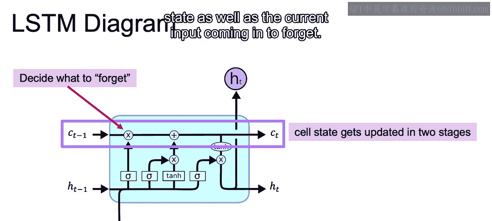

And then we have the add new information portion， which tells us what new information is worth maintaining。

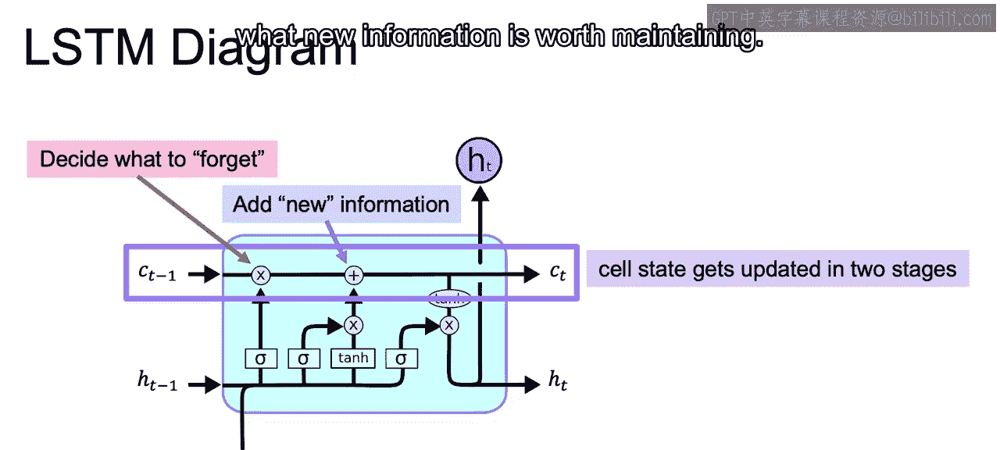

So let's start off with that mechanism built to help us decide what we should forget。

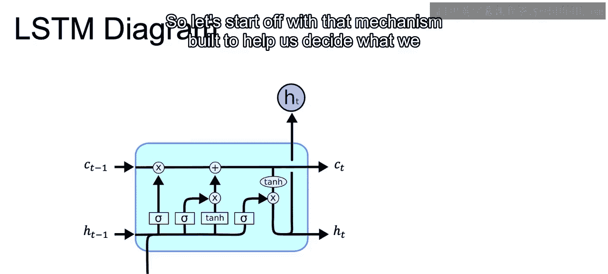

So， here。Our cell is looking at values Ht minus1， so that input of Ht 1 from the prior cell。

 as well as our new input x subt。And that's， again。

 based off of the previous output that H subt minus1， as well as the current input， which is x subt。

We cancatenate these two vectors together。The x of T and the Ht minus1。

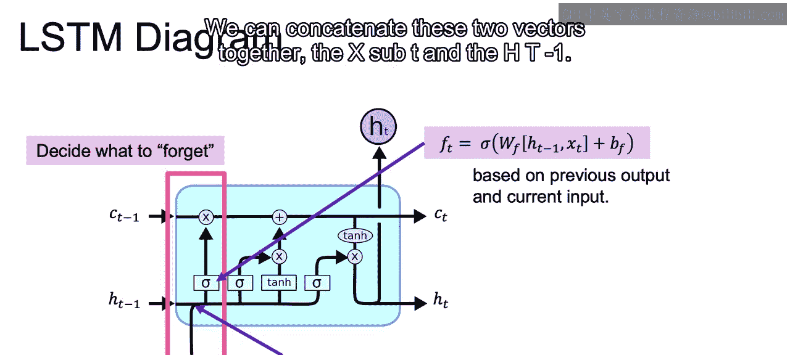

As we see here， so we have a single vector。And once we have that single vector looking back at our equation of F subt。

 we see that we take that single vector， multiply it through， do some transformation using WF。

 some transformation， and pass that through a sigmoid function。

 so it'll output some value between0 and1。

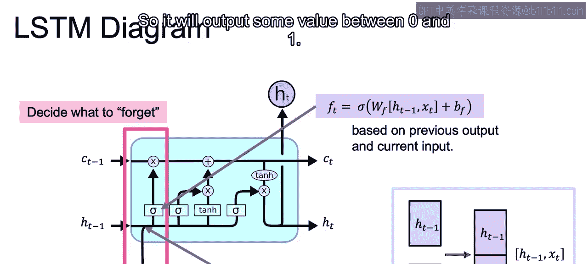

Now let's walk through the portion built for adding in new information。

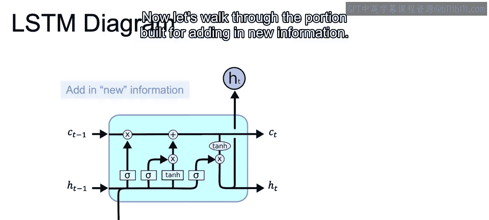

So that's this add in new information， and here we are again calculating that same function of sigmoid of a weight matrix。

Of the concatenation of our input。Except T as well as H T minus-1 here， of course。

 just learning new weights。 So now we're working with W I rather than WF。 but again。

 outputting some value between 0 and 1 as we pass that through the sigmoid。

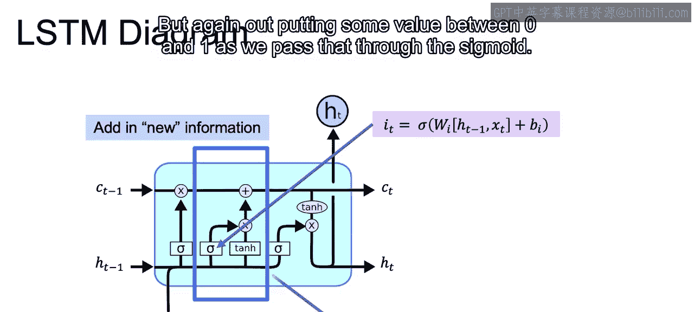

With that， we're also going to be computing at this point a 10h of another weight matrix。

And the concatetnations are the weight matrix multiplied by a concatenation of again。

 that input x of T and Ht minus1。And then we'll pass these values through a 10 H activation。

 so we'll be have resulting values between negative 1 and 1。

And then if you look just above our sigmoid and 10h functions that we just walk through。

We have a multiplication which is meant to multiply those two values together。

The idea being that the 10h is the actual information you are deciding whether or not to add on。

 and then that sigmoid between0 and 1 will tell you ideally what portion of that new information we would want to add on。

 so if it's close to one， we add on all information， it's close to zero。

 we don't add on very much of that new information。

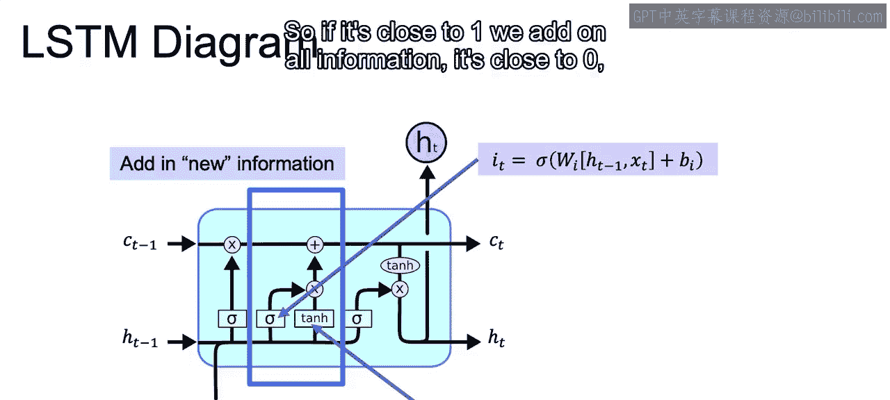

Now， if we've been looking at this diagram throughout。

 we would notice that the arrows from both our forget portion。

 as well as our add on portion that we just discussed will both lead up to our cell state that we're trying to compute。

And our new cell state then will be a function of each of these outputs。

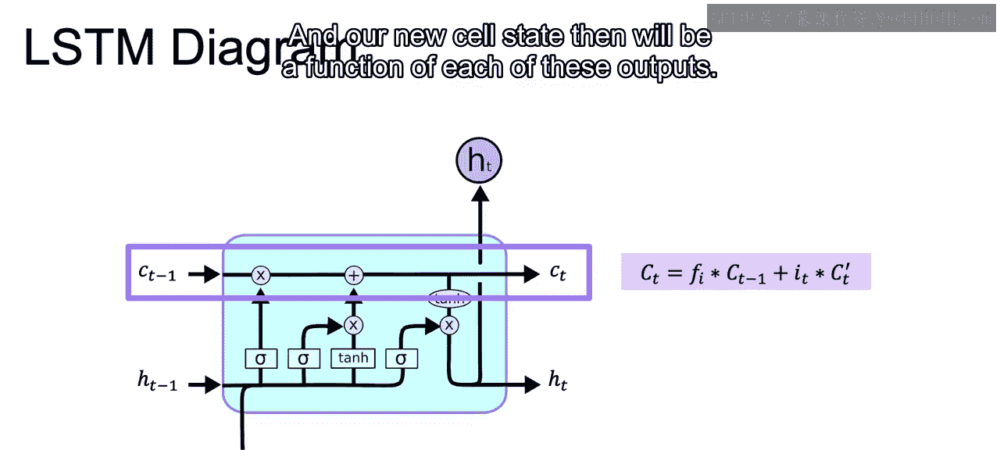

The F I that we calculated， which is， again， that value between 0 and 1。

 will help tell us how much of that old cell， if we're multiping it by some value between 01。

 how much to keep and how much to forget。

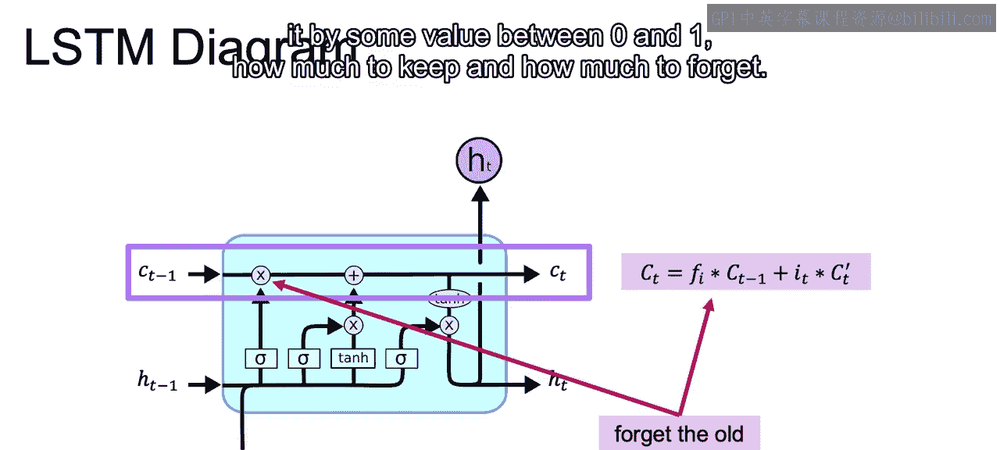

And then from there， we can add on the output of our last calculation of that 10 H and sigmoid multiply together。

 side how much new information to add on。 So that's going to be that addition function to ultimately get to our new cell state C sub T。

 which again， is just going to be F sub I some value between 0 and1。

 multiplied by our prior cell state and then adding on I sub T。😊。

Multiplied by that C subT that we just calculated to figure out how much extra information to add on。

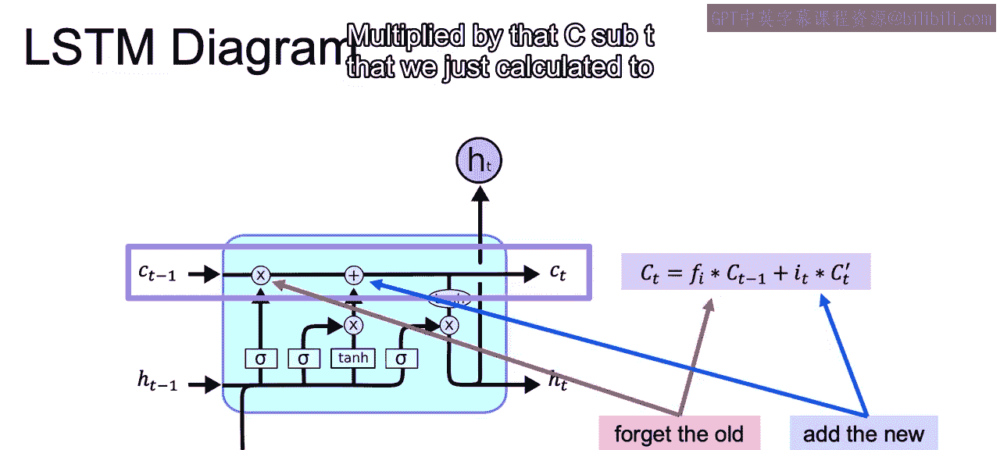

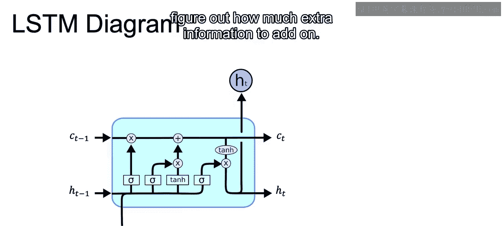

Now。Let's close out by looking at that output。 So we have that similar function again。

 of taking the sigmoid of some weight matrix。 And this time， that weight matrix is W O。

 So not the same weight matrix。Multipliied by the concatenation of H subt -1 and x subt。

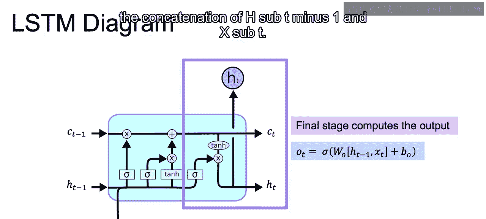

And then net value。Will be multiplied by the 10 H of our new updated cell state。

 that cell state that we just calculated。

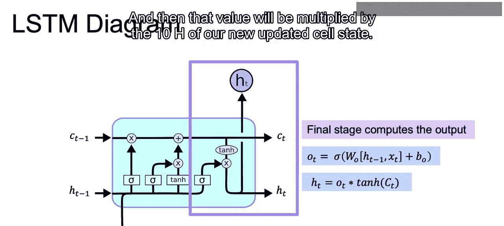

And again， we just computed this C subT so there's no new weights that are needed here。

 we just need to pass that through the 10H activation。And then multiplying those two together。

 we get our H subt， so our hidden state at the current cell。

 and that's going to be both the output value， which we see here at the top。

 as well as the input or that Ht minus1 as we move along to the next cell。

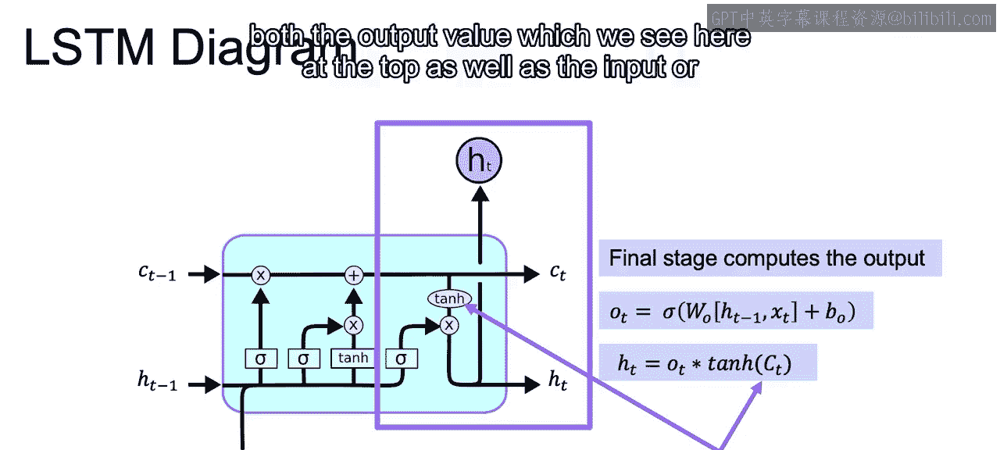

And we see that process here， how that cell state and the H subTs persist as we input each value into the sequence。

And as we've seen， through LSTM。It's going to require a good amount of parameters and thus a lot of memory in order to compute this LSDM that allows us to have this longer term memory deciding what to keep and what to forget。

In the next video， we're going to start off by discussing GRUs。

 which may not always be quite as accurate， but usually does result in similar results while using much less memory than needed for the amount of parameters that are needed here in LSDM。

 Allright， I'll see you there。

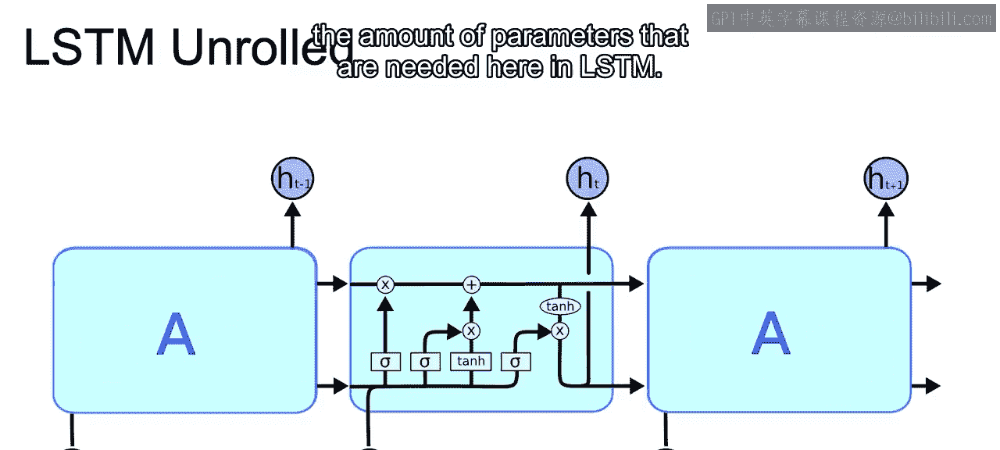

