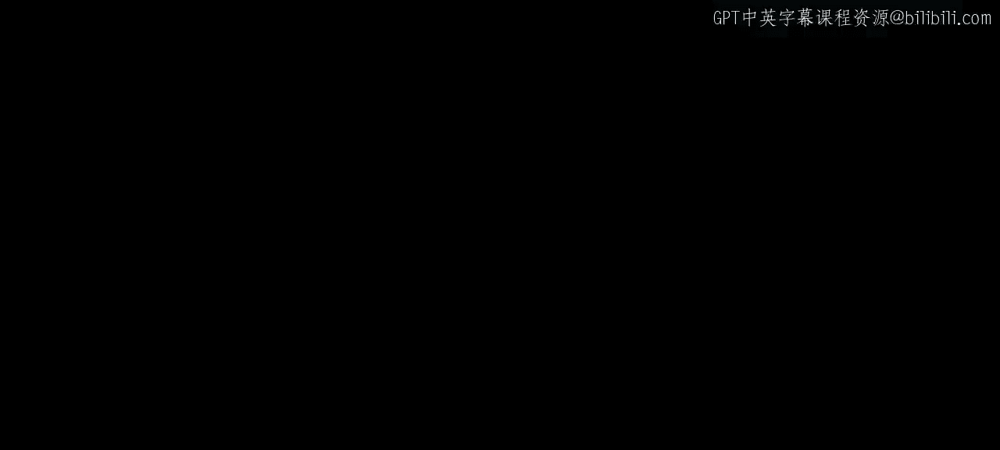
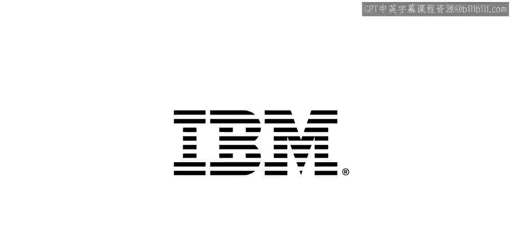

# 097：IBM《机器学习（无监督学习、深度学习和强化学习、毕业项目）｜machine learning》中英字幕 p97 58_门控循环单元（GRU）.zh_en -BV1eu4m1F7oz_p97-

Now let's discuss that gated recurrent unit or the GRU。Now， just to note。

 we're not going to be getting as much into the nitty gritty of the GRU compared to what we did at the LSDM。

 but we will highlight that it has similar functionality overall to the LSDM。Now。

 what makes a difference？Some major differences include that lack of a cell state。

 so we saw that cell state throughout our LSDM here， as we see in the diagram。

 it's just going to have that past hidden state that hidden state will allow for persistence as well as understanding what will be updated and what will be for God。

And as mentioned in the prior video， ultimately we can think of the GRU as a simpler version of the LSDM。

 as if it's still going to accomplish that same functionality of having a longer term memory than our vanilla orcurrent neural net。

 it just will have less weights that' will have to keep in memory throughout。So in our GRU。

 we're going to have our reset gate again。Which if we look at the diagram where we see that R subt within that box we just highlighted that it takes in past hidden state Ht minus1 as well as x subt and passes that through a sigmoid in order to figure out what's going to be reset。

We then have our update gate， which if we look at the Z subt， we can see that again。

 this is a combination of the 8 subt minus1 and our input x sub t passed through a sigmoid。

 and there's going to be a lot more to that inter state， but again。

 the idea remains the same of having some type of functionality decide what we remember and maintaining information from the past。

And another portion of the cell for updating the cell with that new information。

So the question arises shall we use an LSTM or a GRU。

 LSTMs are going to be a bit more complex and may therefore be able to find more complicated patterns。

And of course， on the other side， GRUs are going to be a bit simpler and therefore quicker to train。

In general， GRUs will perform just about as well as LSTNs with that shorter training time。

 especially when we're working with smaller data sets。And luckily in Cars。

 if you're trying to decide whether to use an LSTM or a GRU。

 all we need to do is call that layer type and it wouldn't be too complicated to write up changes between the two and plug and play between the two。

Now I want to discuss another concept so we're moving away from the LST or GRU。

 but it will be built off of the idea of recurrent neural nets。

 I want to discuss this concept of seek to seek or sequence to sequence， which is meant to convert。

A sequence from one domain， say here English to some other domain， such as French。And thus。

 given the examples I just gave， obviously， is going to be very powerful for machine translation。

And if we think about how our recurrent neural nets works。Recall that given a sequence。

As the words are entered into the network， one at a time。And we see these words coming in。

We will have a new updated hidden state that will have accounted for all the past information。

 and that's what we see above with H1 H2 through H6 as the sentence the black cat dranknk milk was fed through our network。

And at the end of our sentence， that final hidden state should have all the information relating to all the words contained within that sequence within our sentence。

And we can leverage this vector that hidden state。As no matter the size of our sentence。

 if we're just looking at that H6， that final hidden state。

 which is just going to be a vector the size of that state vector。

We can take that final hidden state that contains all the information for that given sequence here the English sentence。

And that information from the English words。Will be what we call the encoder portion of a encoder decoder model。

 which is going to be the crux of how we work with the seek to seek modeling。So。We have。

 again these words coming in， and this is towards the end of the sentence， drank milk。

 and then we actually have a term for end of sentence。And from here。

 we have our hidden state from the encoder portion。And now for the decoder portion。

It can now work as a language model just moving forward that's just trying to predict the next word。

And it's going to use as its initial state， what was output from the encoder portion。

And this makes sure that it's not just a language model spitting out French words。

 but it's going to be spitting out new French words in a sequence conditional on that English sentence。

