# 098：IBM《机器学习（无监督学习、深度学习和强化学习、毕业项目）｜machine learning》中英字幕 p98 59_GRU详解.zh_en -BV1eu4m1F7oz_p98-

Now， we went over those basics of the encoder decoder model for sequence to sequence learning。

But maybe you notice that the way that this is currently constructed。

The model is going to be producing a single word at a time。

 and that single word that's being produced will be conditional on whatever that prior word that was produced was。

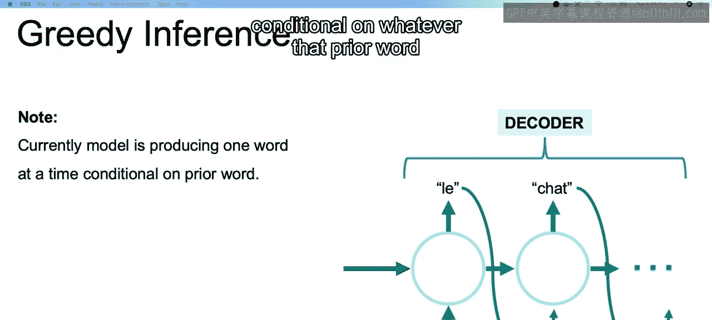

And with that in mind。If at any point it produces one wrong word。

We may end up with a completely different trajectory and that would throw off the entire translation and that entire sequence that we're trying to predict。

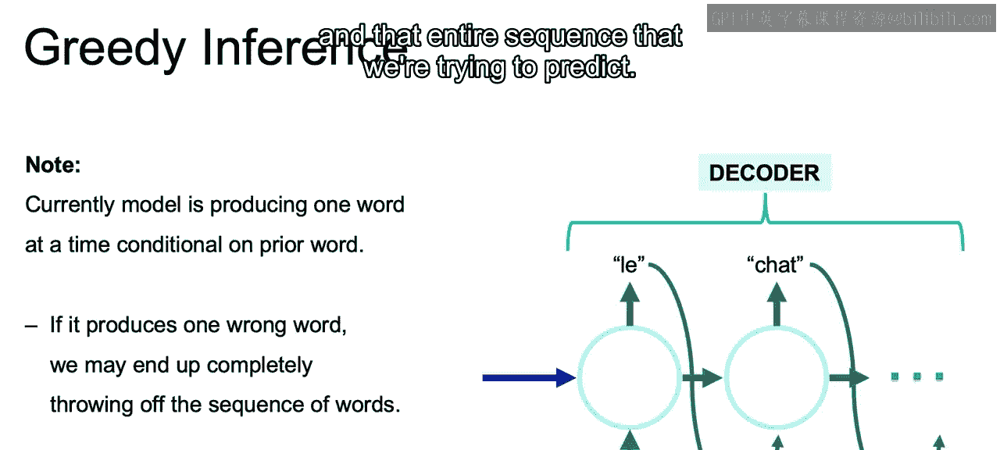

Now， again， the way it's currently constructed is that it will continue to predict new words until it hits this end of sentence term。

Now， a new solution to solve for the problem that we just discussed that we our trajectory can be thrown off。

Would be to produce multiple different sentences through to the end of sentence term that we have。

And then see which one of those full sentences or full sequences is the most likely。

So we can imagine that each of these that we're seeing being built out here would lead to some end of sentence term。

 and given each one of these different branches and once we have some predetermined amount of possible sentences。

 possible sequences，We can then probabilistically determine which one of these full sentences is the most likely。

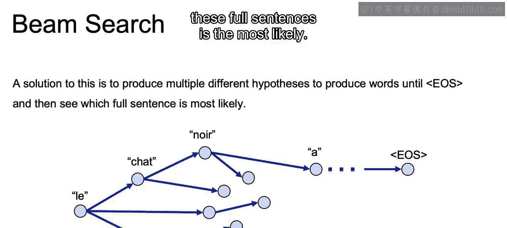

So the way that our encoder decoder model is currently built out。

 our decoder works with that hidden state from the encoder that has information about the entire sentence。

 So the final hidden state is used as that initializer for that decoder。

 whether we're using that beam search that we just discussed where we can look at multiple different sentences and decide the most likely。

 or if we're just looking at one。With that in mind。Each decoder time step。

 so as we're going through producing each one of the different words。

Each one will be depending on that same encoder embedding。And will have no relationship。

As to where in the sentence we currently are within the decoder。In regards to。

 are we at the translation for the cats or we in translation for drink milk。

 And we'd want some way of rather than looking at the entire sentence within the encoder。

 only looking at those terms that are similar to the terms where we're at within the decoder。

And attention is going to solve for that problem and allow us to look specifically at those terms that matter。

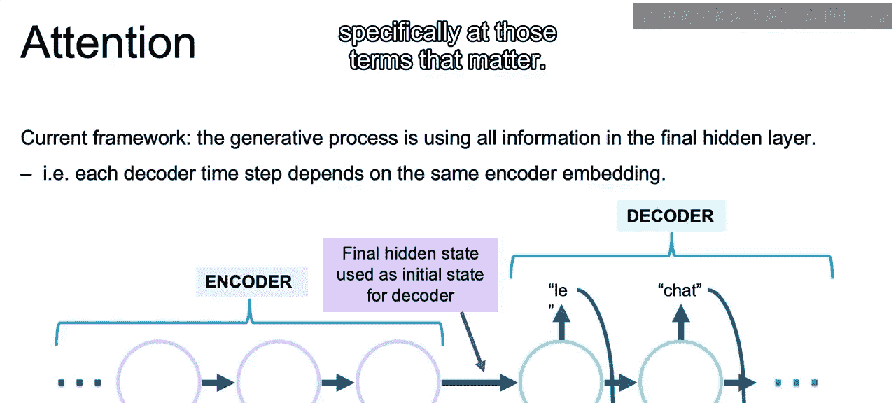

Now， with attention， our goal is to consider the words that are most similar to our current position in our sentence generation。

So rather than just using the hidden state from that entire sentence。 So again， just using H6。

 that final hidden state。

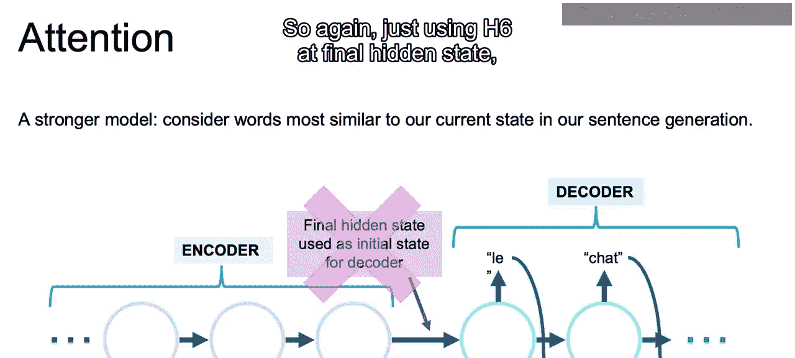

We can actually use the hidden state from each one of the different terms。So how does this work？

We know that each word in either language will be represented by some type of vector。

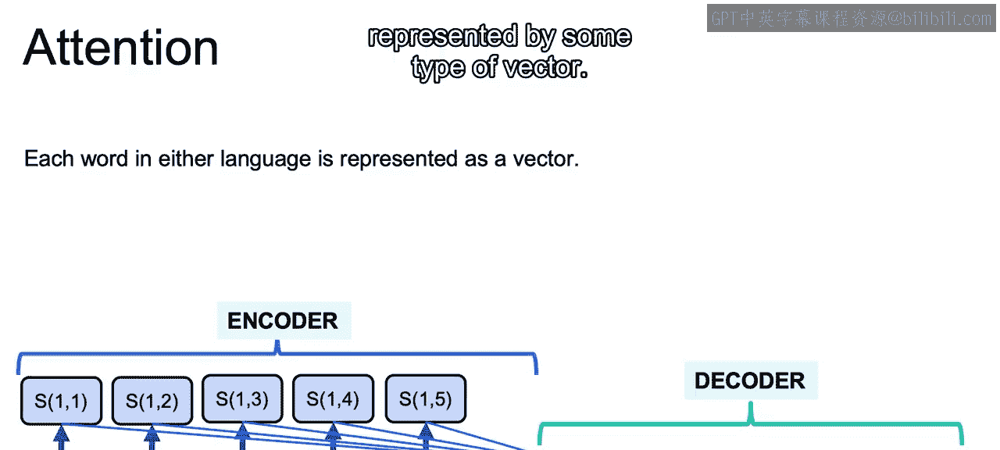

So what we can do is that each word within our decoder。

We can look to see how close that vector in our decoder in that different language。

Is to each word within our encoder， so we'll have some function S。We have that function S of I J。

Which we can just think of as some type of function S。

 which gives the similarity measure between the decoder state I and the encodeder state J。

So that we know how similar each term， so you see this is a function mapping to all the encoder terms to each one of our single decoder terms to decide which one is the most similar。

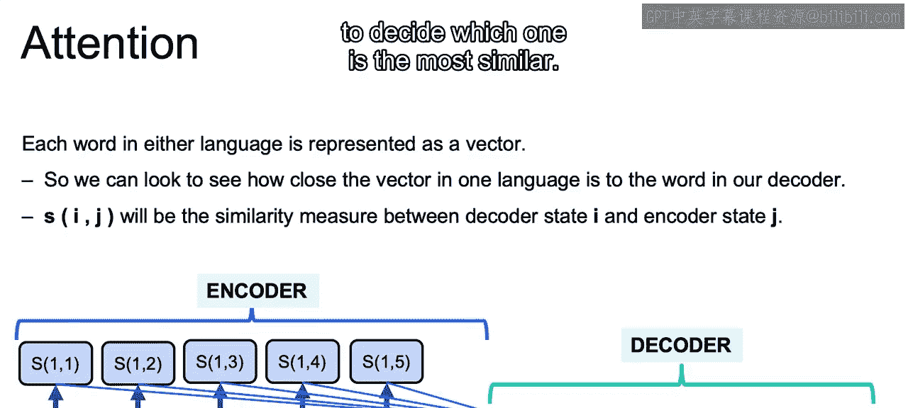

And then this similarity function will then weight the different embedding layers。

Each one of these hidden states from the encoder to give us a better embedding for the prediction of that next word。

 So if。The second term in the encoder is the closest in regards to the vector distance that S measure。

To our decoder term where we currently are， then that will have a much higher weight。

 All the weights adding to one then terms 1，3，4， and 5。

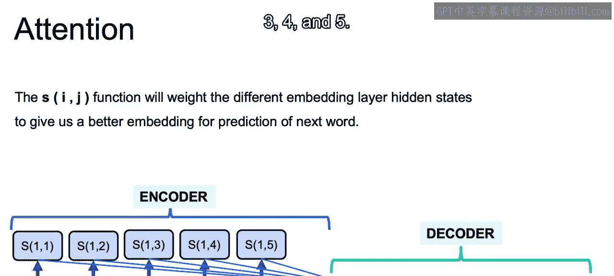

And this will then better allow you to translate between different languages when that ordering of the words are often different so that you know。

 okay， even though we started with the cat and French shoe。

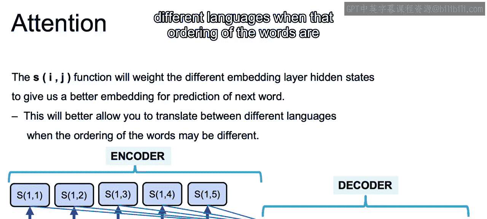

Terms would have the cat at the end of the sentence， would have that noun at the end of the sentence。

 we can still see how close each one of those terms or each one of those final terms are compared to our encoder model。

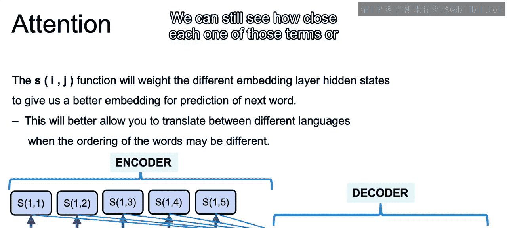

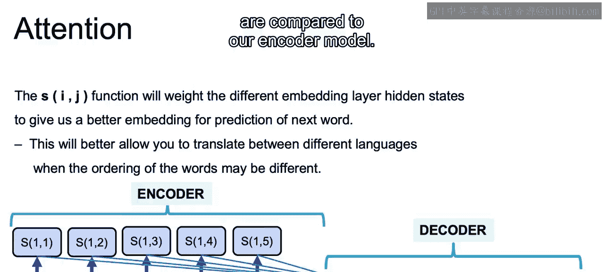