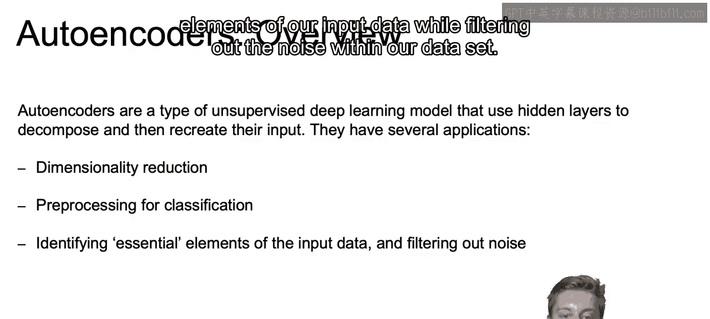
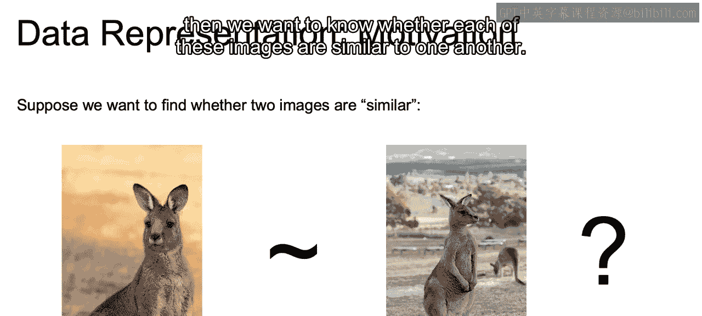
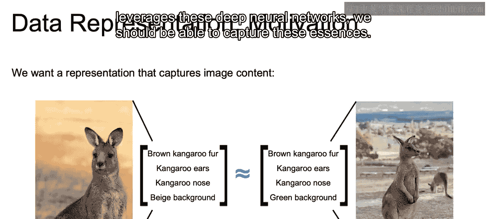
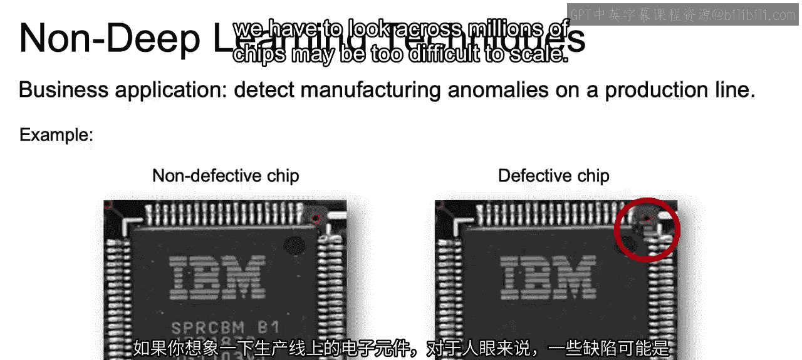
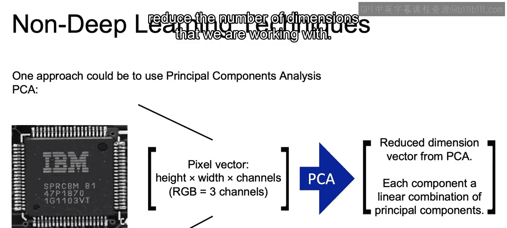

# 099：IBM《机器学习（无监督学习、深度学习和强化学习、毕业项目）｜machine learning》中英字幕 p99 60_自编码器简介.zh_en -BV1eu4m1F7oz_p99-

In this section， we're going to introduce our first deep learning model that's going to be used for unsupervised learning auto Enrs。

Now， let's discuss the learning goals for this section。In this section。

 we'll start off with a review of non-deep learning based techniques for data representation。

 such as PCA and how we can use that to condense our original data set into a smaller representation of that same data set。

After that， we will discuss how auto encoders leverage neural networks to also come up with lower dimensional representations of our data。

Then finally， we'll discuss a bit on how to describe those use of trained autoencors in order to actually generate images。

Now， autoenrs will be our first time looking at deep learning from an unsupervised learning vantage point。

Now， the goal of autoenrs is going to be to use those hidden layers in our neural networks to find a means of decomposing and then recreating our data。

 and we'll see how this is done in just a bit。And this proves to be powerful for things such as dimensionality reduction and fighting that curse of dimensionality。

 as we've seen in prior courses when we were working with PCA。With that。

 this dimensionality reduction can be powerful for preprocesing for classification and identifying only the essential elements of our input data while filtering out the noise within our data set。

Now， as motivation， let's say we want to find whether two images are similar to one another。

 so we have two pictures here each of the kangaroo and we not want to know whether each of these images are similar to one another。

Now one option， and I'll say right off the bat that we probably don't want to do。

It's to look at the pixel wise distance between these two images。

So if we look at the image the left and we look at the pixels there in the top right corner。

Compared to the pixels in the top right corner of the right image。

We see that these two are clearly not the same， and we can even see this with our own eyes that these are very different if we are just looking at these particular pixels。

And the goal would be and our problem here is that if we just look at the pixels as a whole。

 we'll only be able to see the placement of the color scheme of the brightness， etc。

 and not the actual content of our image。So the goal would be to find some type of representation that captures that actual content within the image。

 So if we think about the image here to the left， we're looking at brown kangaroo fur。Kangaroo ears。

 a kangaroo nose， a beige background， and those are going to be content within that left image。

 In that right image， we have brown kangaroo fur， kangaroo ears。

 kangaroo nose and a green background。 So many similarities may just a difference in background。

And the idea would be that with auto encoders and we think about what we've learned with deep learning。

 how it's able to find each of those features that make up the image。

With something like autoencodederrs that leverages these deep neural networks。

 we should be able to capture these essences。

Now， before getting into the actual method of working with autoencoderrs。

 I'd like to introduce here a business application for what we just discussed and how autoencoderrs can be used in business practice。

If you think here of electronic components within a production line。

Some defects might be imperceptible for the human eye or difficult to scale。

 given if we're looking at images of each of these chips and the amount of pixels in each of these images and we have to look across millions of chips may be too difficult to scale。

We may want to then reduce the dimensionality of those pixels so we can look at these defects at a lower dimensionality when we're comparing whether or not they're similar to one another。

 whether or not there's a defect。So one approach to this？

To being able to detect these differences at scale would be to use PCA to reduce the dimensionality of our features。

 which here are going to be pixels。So that each component is some linear combination of our principal components。

 so we start off here with a pixel vector， it's here going to be RGB so we have the three channels and for each one of those channels we have the height and width。

We use PCA。And again， we're able to create a linear combination of our principal components if you recall from courses past and reduce the number of dimensions that we are working with。

Now， just a quick reminder how PCA works before we get into auto encoders and to motivate auto encoders。

PCA works in reducing dimensions of our original data。

 and the goal within PCA is to find the dimensions that capture the most variance from our original data。

So as an example， if we are working with just two dimensions。

 you can think of this again as just two features。The directions of the arrows will represent the principal components or the directions representing the most variance within our data。

And the lengths of these arrows coursed on to the amount of variance in the original data that is explained。

 so we see the diagonal pointing to that upper right， accounting for more of our overall variance。

 the one pointing to our upper left。And we see that each one of these arrows will actually be composed of a combination of both x1 and x2。

 and now just saying which single axis accounts for the most variation won't be what we're doing。

 but rather some combination of those creating new axes coming from that X1 and x2。Now。

 there are going to be limits to working with PCA and why we'd want to move to something like autoone coversrs。

The main thing。Is that learn features will have to be some type of linear combination of our original features。

When in reality， there may be some complex nonlinear relationship between those original features and the best lower dimensional representation of those features。

And finally， how we define the best representation can be different depending on what our problem is。

So that closes out our video just motivating the use of auto encoders in the next video we will pick up and dive into how auto encoders actually work All right。

 I'll see you there。

