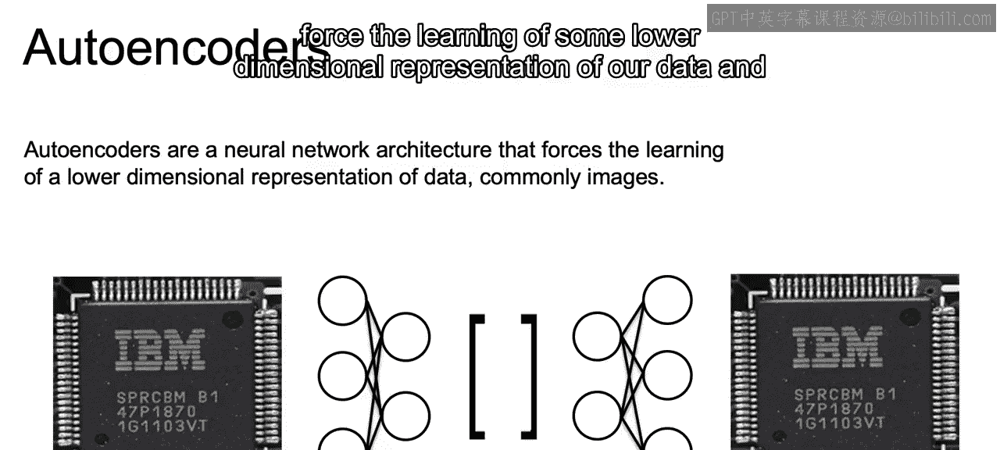
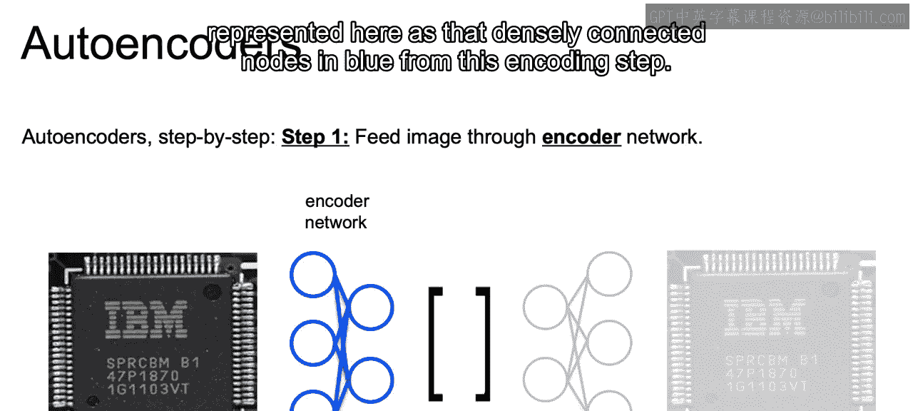
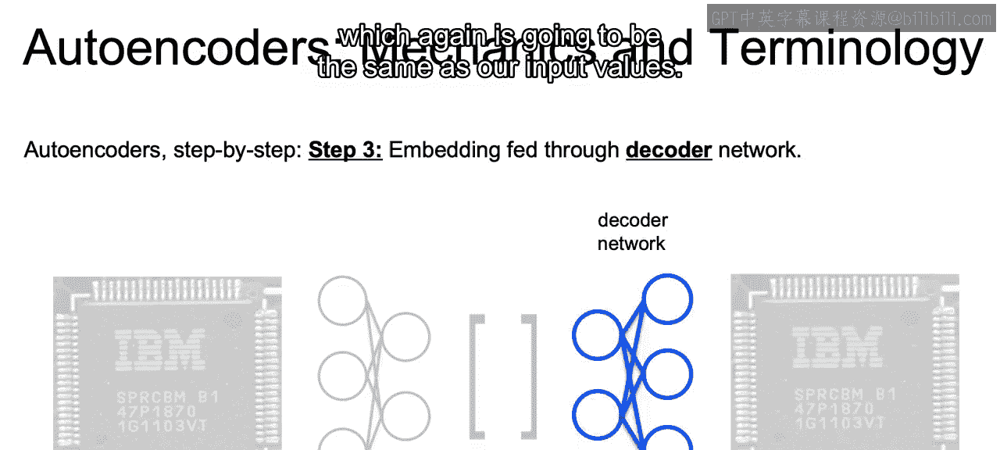
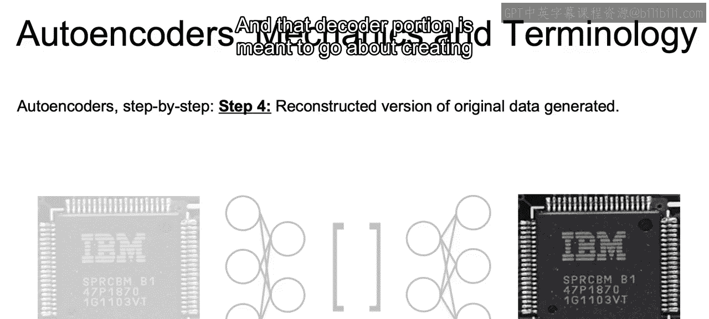
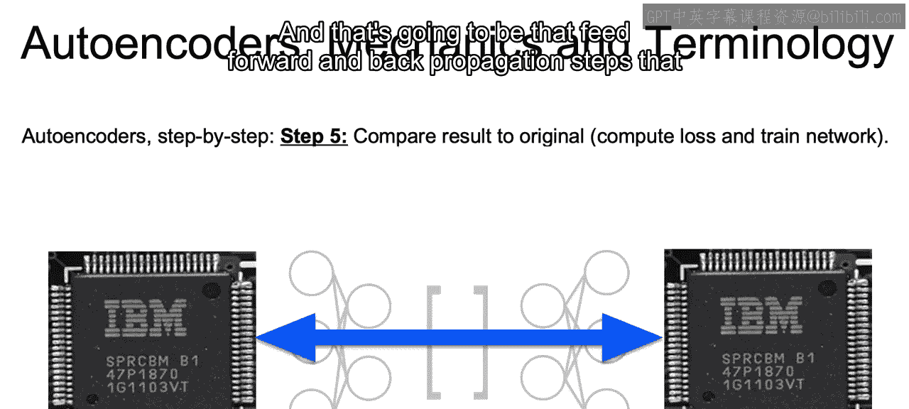
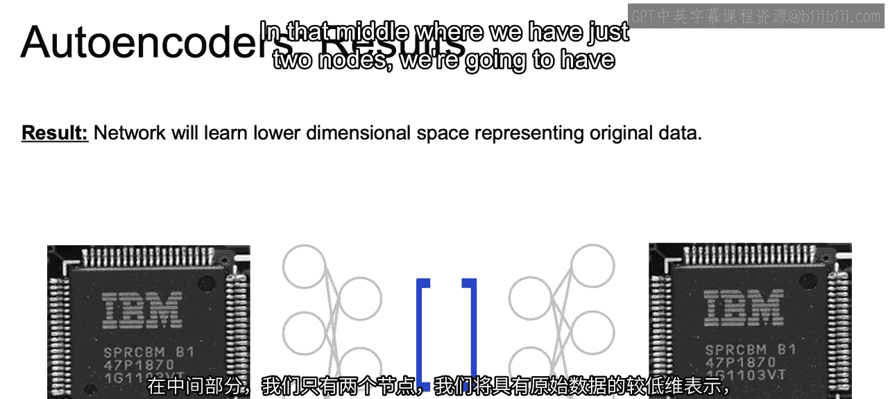
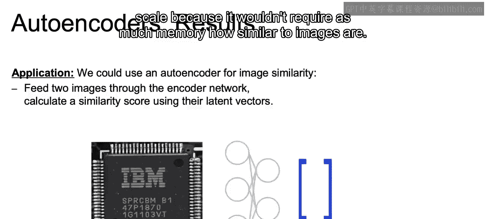
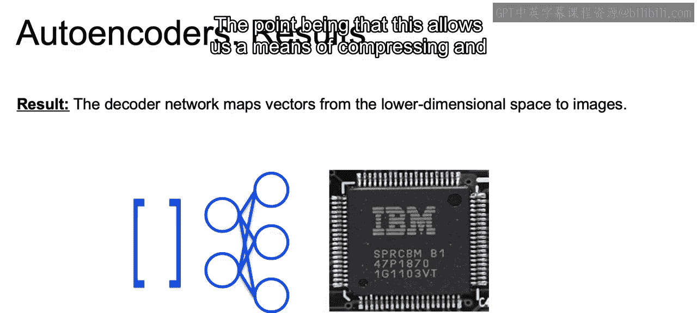
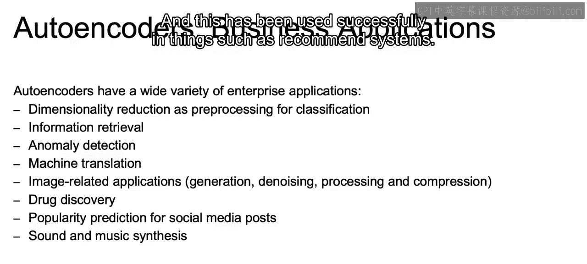

# 100：IBM《机器学习（无监督学习、深度学习和强化学习、毕业项目）｜machine learning》中英字幕 p100 61_自编码器.zh_en -BV1eu4m1F7oz_p100-

So autoenderrs are going to be a neural network architecture that will force the learning of some lower dimensional representation of our data and that's commonly used for images。

So the way that auto encoders work。Step by step。Is that they will have that same value as both input and output as we see in the image。

We'll then feed this input through our encoder network represented here as that densely connected nodes in blue。

From this encoding step， we're going to be able to produce the lower dimensional embedding of our original data。

And that's going to be what we're actually looking for。

 right that lower dimensional representation of our data。

 and that will be here in the middle of our network。And then finally。

 that embedding will be fed through the decoder network。

Which we have there through to our final output， which again is going to be the same as our input values。

And that decoder portion is meant to go about creating a reconstructive version of that original be。

And once we have that reconstructed version of the data。

 we can go about computing the loss between that reconstructed version。And that original input。

And use that to train our actual network。So we take that loss function as we do with any neural net and use it to update the weights within our network。

 and that's going to be that feed forward and back propagation steps that you already used to。

And the result will be that in that middle portion。

Given that if you've noticed the nodes be shrinking in。

 so we start with three nodes then two nodes and it could be 100 to 10。

 whatever it is as those amounts of nodes shrink。In that middle， and then again。

 it shrinks and then expands back to that reconstructed version in the decoder step。

In that middle where we have just two nodes， we're going to have that lower dimensional representation of our original data。

And we can use an autoencoder to find image similarity。

Because we feed two images through the encounter network。

And we can calculate the similarity score of their latent vectors of this lower dimensional representation。

So that allows us to actually see。At a。Version that we'd be able to scale because it wouldn't require as much memory how similar two images are。

And we can always use that decoder portion of the network to map those vectors from our lower dimensional space。

To the full dimensional space of our images。The point being that this allows us a means of compressing and then decompressing our data。

Now， another use of the decoder model is to actually work as a generative model。

And in order to properly do this， we would probably want to actually work with variational autoencors。

 which we'll discuss in the next lesson。But even with variational auto encoders。

 this isn't going to be commonly done。 This generative model due to the fact that in order to get reasonable results。

 some deep convolutional architecture is generally going to be required。And even with that。

 generally speaking， the results of that image generation will generally be inferior to that of Gs。

 which will learn not in the next lesson， but in the lesson afterwards。

So auto encodecors can have a wide variety of enterprise applications。

They can be powerful for pre processing and reducing the dimensionality of our data prior to learning some classification model。

It can be powerful for sending information in a compressed form as well as retrieving such information。

May use for anomaly detection as we discussed with the chip images。

Can help with machine translation as we're generally working in very high dimensional space if we're doing machine translation。

Can be powerful for image related applications such as generating images， denoising。

 or taking fuzzier images and sharpening them， as well as processing and compressing as we discussed。

And for drug discovery， popularity prediction of social media posts and sound and music synthesis that can help find the key components that are key to each one of these。

Different domains and help identify those key components that may be key to the model in drug discovery。

 popularity of a social media post or sound and music synthesis。One last note。

While most auto encodecors will use deep layers。Uutenrs are often going to be trained on just a single layer。

 each for the encoding and decoding step。And an example of working with a deeper network。

Is going to be using sparse auto encoders， which essentially allow for those deeper networks。

 but only certain nodes will be firing within those networks。

 and this has been used successfully in things such as recommender systems。

So just to recap。In this section， we discussed nonde learning based techniques for data representation and remind ourselves how PCA will use a linear combination of our original features to come up with a representation that maintains as much of the variance as possible from our original data set。

We then discuss how auto encodecoders work with the encoder portion coming up with a condensed version of our data。

 which can then be reconstructed using our decoder network。And then finally。

 we discussed a bit how trained autoencoders can be used to generate images。

 and that's especially true using something called variational autoencoderrs。

 which we'll discuss in this upcoming video Allright， I'll see you there。

