# 101：IBM《机器学习（无监督学习、深度学习和强化学习、毕业项目）｜machine learning》中英字幕 p101 62_自编码器笔记本（选修部分）第1部分.zh_en -BV1eu4m1F7oz_p101-

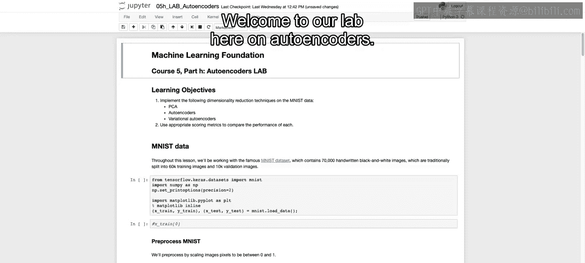

Welcome to our lab here on autoencors in this lab， we're going to be going over Diality reduction techniques on the MNIS data set。

 which is those handwritten digits that we had seen in earlier notebooks。

And we're going to perform dimensionality reduction using first PCA as a baseline。

 which we learned in earlier courses， and then as just discussed in lecture。

 auto encoders and variational autoenrs。

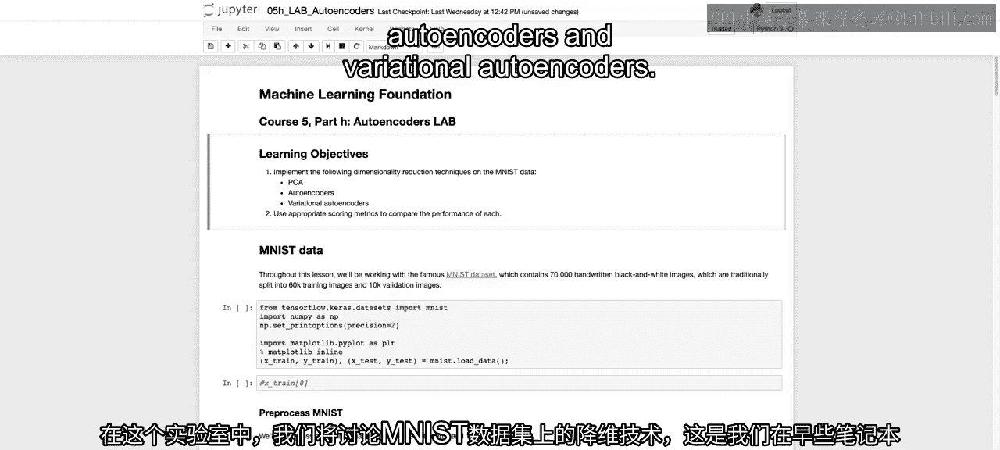

And with each one of these models， we're going to use the appropriate scoring metrics so that we can compare the performance across each。

So a quick reminder of what the MNIS data set is， that's going to be handwritten digits between zero and nine。

 will have 70，000 different handwritten digits。All in black and white。

 and when we run this traditionally， we're going to split this into 60。

000 training images and then 10，000 validation images。

And this is such a common data set that is actually built into CAs， so we pull it out from Cars。

 dataset， we pull out the NNIS functionality， and with MNIS we can call low data once we call that method。

 we get the output of our training set， Xtrain and Y train and our test set X test and Y test。

And I run this。And we can actually look at。Quickly， the Shapeier。

And were working with 28 by 28 images。 And if you're recall， because it's black and white。

 this won't be three dimensional if it had。RGB or some color scheme to it。

 Then it would be three dimensions such as 28 by 28 by 3。 But here it's all black and white。

 So our pixels will all be on the gray scale and nowll be 28 by 28。

 And if we look at just a single image。

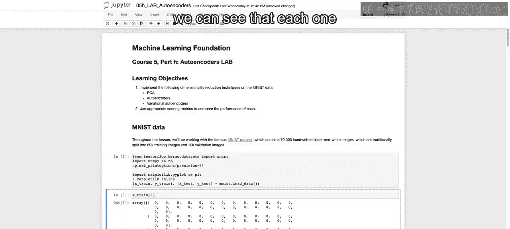

We can see that each one of these different pixels are going to be some number between zero and 255。

 representing the light or darkness of each one of these different pixels。

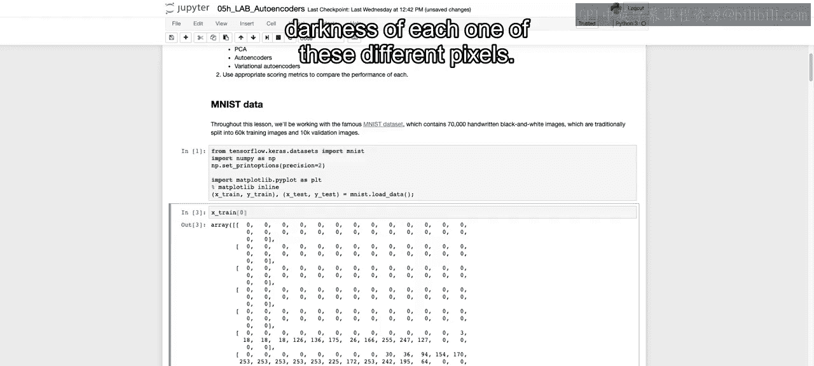

So this takes a lot of space， I'm just going to clear that out。

Now we want to make sure that they're all between0 and 1， so we're just going to divide here by 255。

And then。If you think about it， the max number is 255， we divide by 255， the max number is now one。

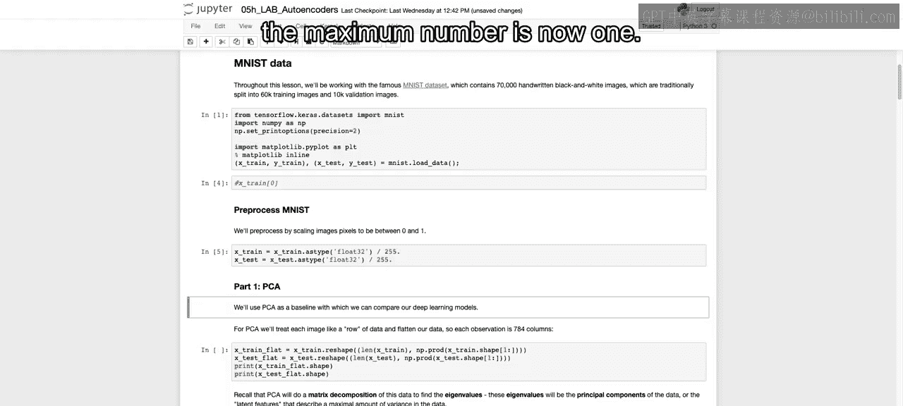

We're going to use now PCA as a baseline with which we can compare against our deep learning models。

 which we'll do later on。

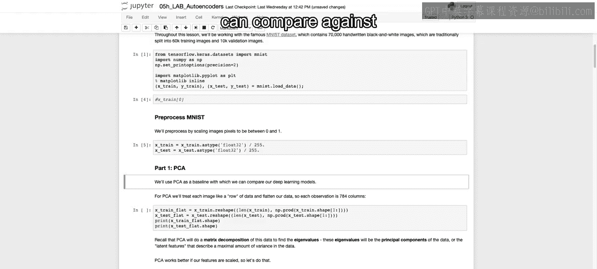

So for PCA， we're going to have to teach each image， treat each image like a row of data。

 so we're going to have to flatten out those 28 by 28 images。

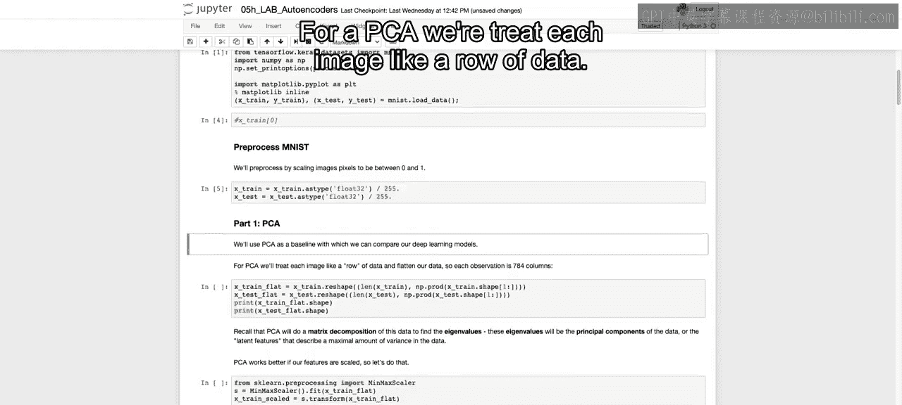

In order to do that， all we have to do is call that xtrain。 reshape。

 we saw that the original shape was 60，000 by 28 by 28， we keep that 60，000。Because we still have 60。

000 different examples。And then we just take a product of that 28 by 28 here。

That's one through dot shape1 through is going to be that 28。

 And then the second 28 NP dot product is the product of the two。

 so that willll end up with 60000 by 784。 And then same for the test set will'll have 1000 by 784。

 And we see those results here。

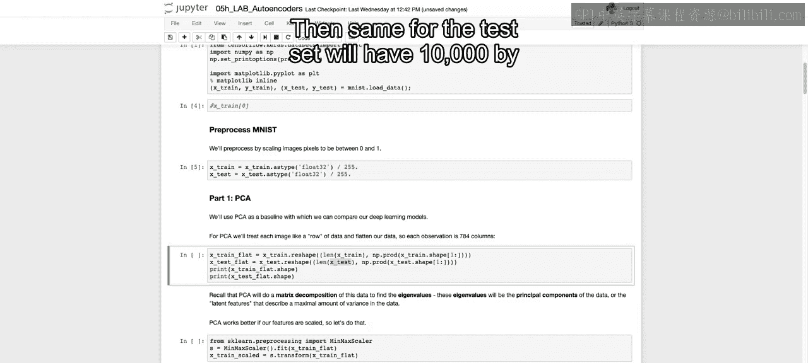

Now， just a quick one sentence reminder on how PCA works。

 so PCA will do a matrix decomposition of this data that we're working with。

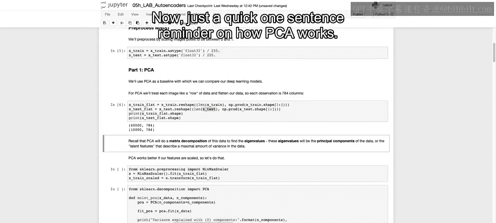

To find the eigenvalues and these eigenvalues will end up being the principal components of our data or those latent features that describe the maximum amount of variance in the data。

 we've been talking about these latent features that lower dimensional space that hopefully represents the important portions of each one of these different pieces of data that we're working with。

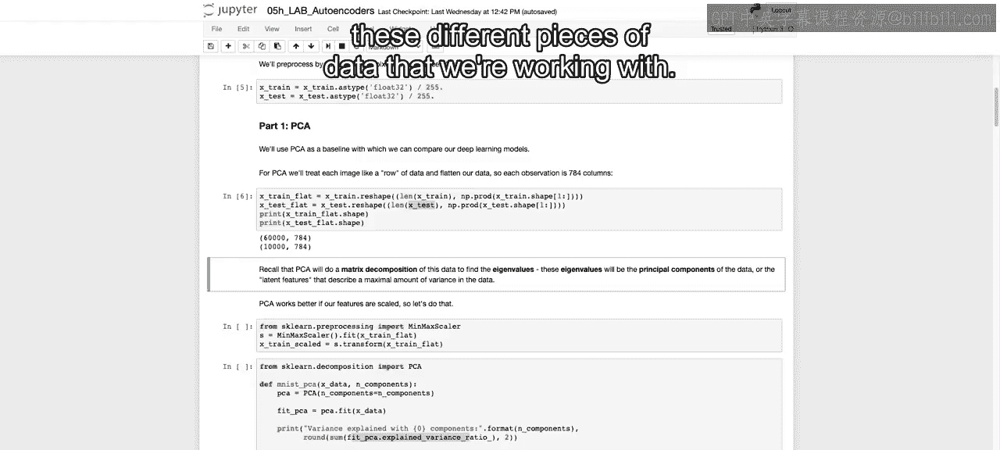

So just to ensure that it's scaled， we already got it between 0 and1。

 but we will just run the Minmac Scalar here， we call Minmac Scalar which we imported from Scalalar not preprocessing。

 we fit it on our Xtrain flat， that flatten data that we just produced。

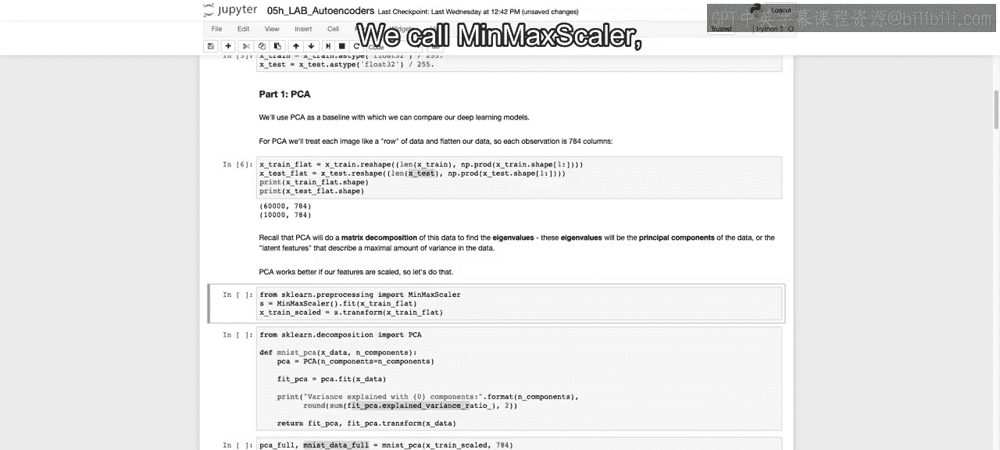

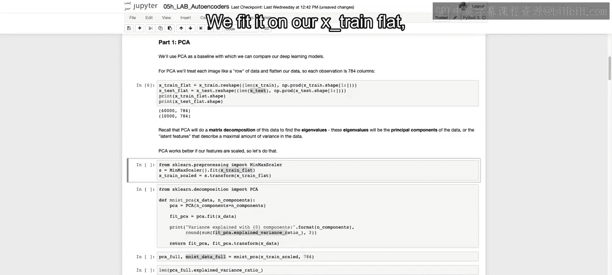

And then we call transform on that Xtrain flat， and now we have our xtrain scales。

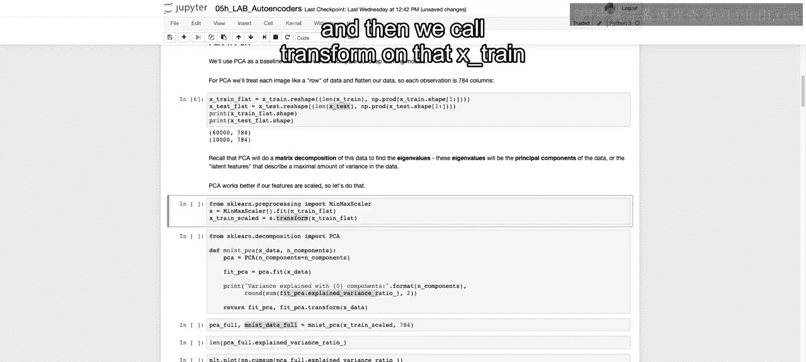

Now， the function that we're going to use for PCA。It's going to take in some data。

 and it will end up being this X train scale to start， at least。And we say the number of components。

 how much do we want to reduce our data set by， That's going to be something that we determine in the preset so we can say we only want two dimensions。

 five dimensions， so on。We then going into the actual function。Are going to call PCA。

And that model needs the hyperparameter of how many components do we actually want。

 we say that we want the number of components that we defined here above in the function。

 and then we have our PCA model。That's been initiated。

We then fit that model to our data set by calling PC。

fit on that X data that we pass here into our function。And now we have this fit PCA。

 we have that model fit to our data。And then we can print out here quickly after we run this。

 how much of the overall variances was explained with the number of components。

That we pass in through our function。So we say variance explained with say two components。

 and then we just print out the actual amount explained and going used that's going to be done by calling that fit model。

Getting the explained variance ratio， which we'll show in just a second what that actually looks like。

 But that quickly is going to be the amount of variance explained by each one of our different components。

 We take that sum and we see the overall amount explaineds where the maximum value suming goes altogether should be equal to one。

We're then going to return our fit model so that we can use that once our function has run。

 as well as our transform data。So that's going to be our data set reduced down to our new number of components。

 that new number of dimensions。So we're going to do this with 784 dimensions。

So that's going to be all the data。 And when I run this， recall。

 it's going to print out the amount of variance explained。

 I would want you to think to yourself how much the variance should be explained。 We run this。

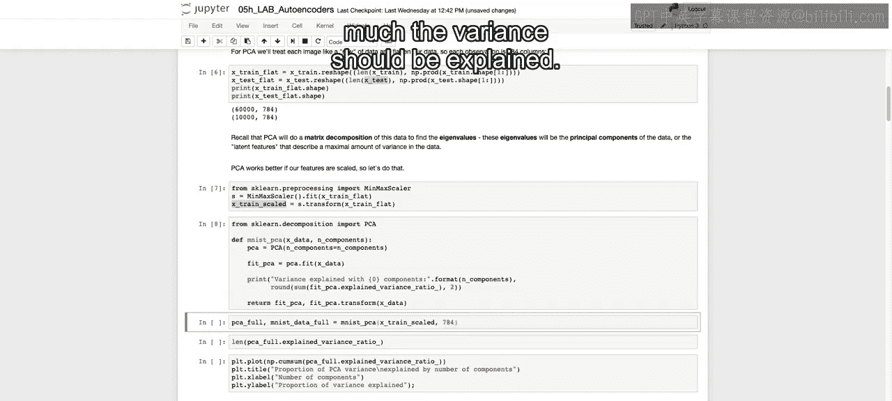

And with all 784 components being taken into account， all of the features being taken into account。

 we see that 100% of the variance was explained， which makes sense。Now。

 just to be clear on what this explained ratio attribute is of our model。

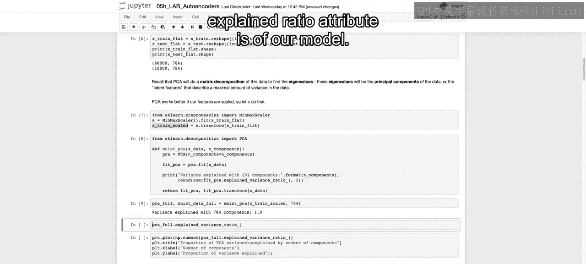

If I run this。This is going to be an array that says， for each principal component。

 what is the marginal amount of variance explained？

So the first component explained this much of the variance， the second one。

 this much I believe it's round。009 and 0。07。 and we can see that the length of this given that our PCA model took all the components。

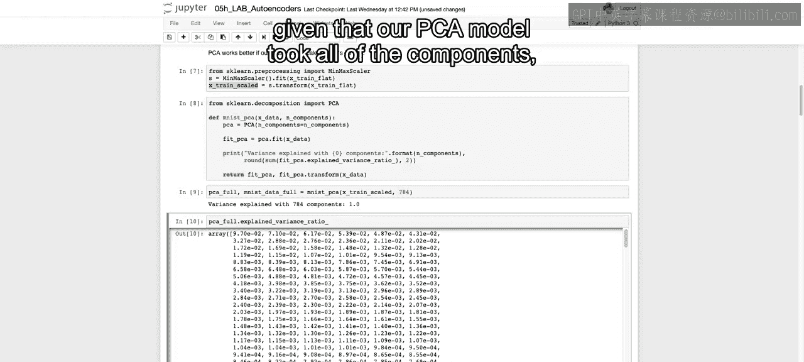

Will be 784。And if we actually plot this out， we can take that cumulative sum across all 784 components。

 And that's what this comes sum does。For this entire array that we just printed out。

And we can see how much of the variance is explained as we add on more and more components。

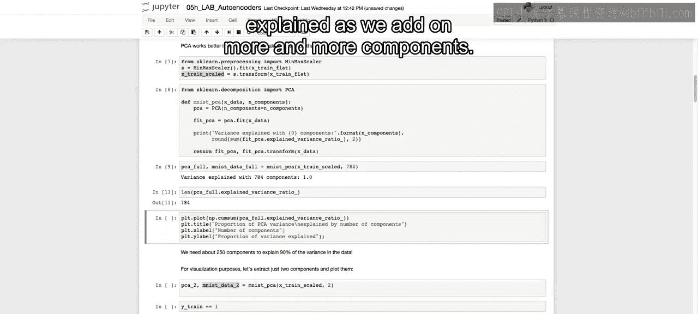

And we can see that we need about 250 components to explain about 90% of our variances there。

Now for visualization purposes。Let's try reducing it down the number of features down to two。

 and if we reduce the number of features down to two。

 then perhaps with those two features we can see whether or not we're able to group together where the ones lie in those two features。

 where the twos lie with with just those two features， so on and so forth。

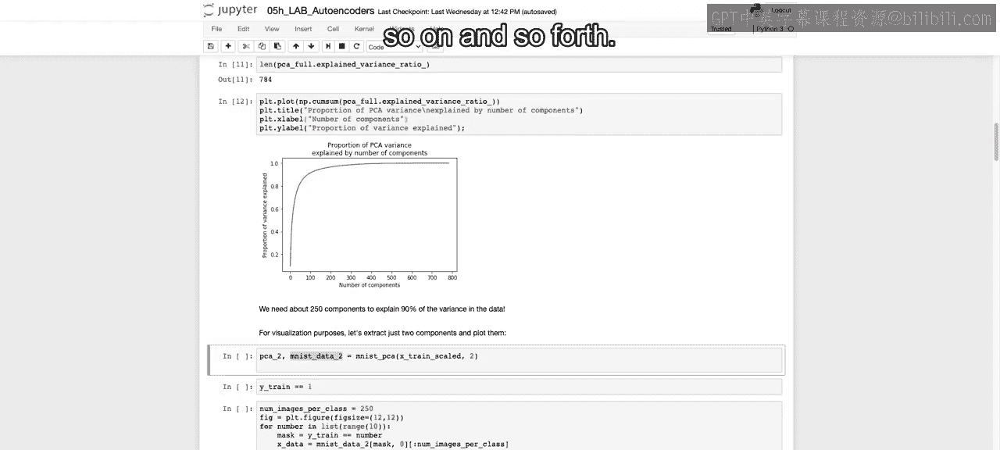

So you run this。And we get our output of both the model， as well as our transform data。

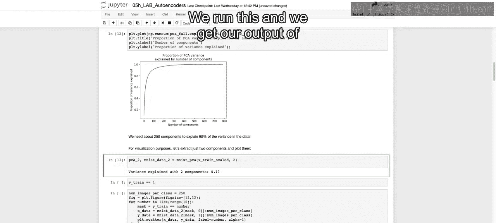

Now I'm going to get to this in just a second， that's just an example of how to explain what we have here。

What we want to do is plot out each one of these numerical values that we have zero through nine。

 and we have those labels available to us。And for each one。

 we want to plot out in these new two dimensional space that we have。

 point where each one of those points lie。So just to ensure that we don't have too large of a scatter plot。

 we're only taking the first 250 examples of each。 remember our xtrain has 60。

000 examples that would be quite a dense scatter plot。Then for numbers ranging between 0，9。

 including 0，9， if we say range 10 doesn't include 10。We're going to create this mask。

Which is just saying does y train equal that number where we currently are， So we can say here。

 let's just start off Y train equals 0， and we can see whether or not that exact example in our full array and y train is going to be of length。

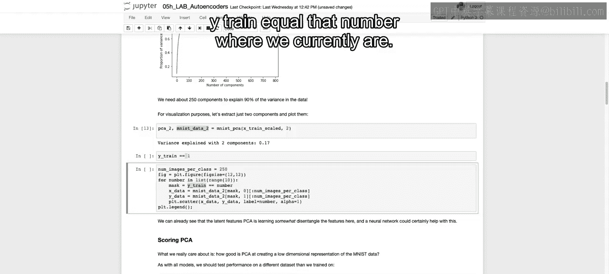

We'll just put that out。6000， right， So it's going to be for each one of the different examples。

 iss it labeled to zero。We're then going to mask our data。

 so this Ms data 2 again is the output from our function， so it's that two dimensional data。

We're only taking the rows from that two dimensional data。

 Where are y trains equal to the current number in our for loop。

And then we're going to say take just that first column， we only have two columns， only two features。

 and then we're only taking the first 250 examples。

And then we're going to do the same thing to get our y data or a second axis by saying， again。

 I only want the rows where we have。equal to the y label specified。

 So starting off at 0 is it equal to0。 and then we want that second column。 and again。

 only the first 250 examples。We then plot that scatter plot of the x data and the y data。We label it。

 We'll call that legend later on。 And once we run this。

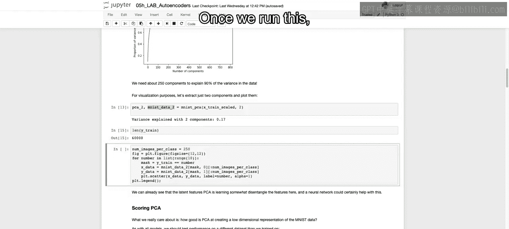

We can see for each one of the different values， whether or not we create clumps in this two dimensional space representing that 0。

1，2， and so on。

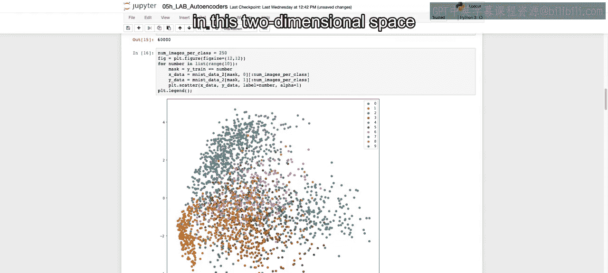

And we can see， for example， the ones here in orange are already disentangled and grouped together on their own。

 We can look at the nines， which are light blue here and the fours， which are purple。

 And we can see that those are fairly close to one another， which makes sense。

 given the way that fours and nines are drawn。 And you can continue to explore where groups are able to separate themselves out or where there seems to be some type of overlap。

😊。

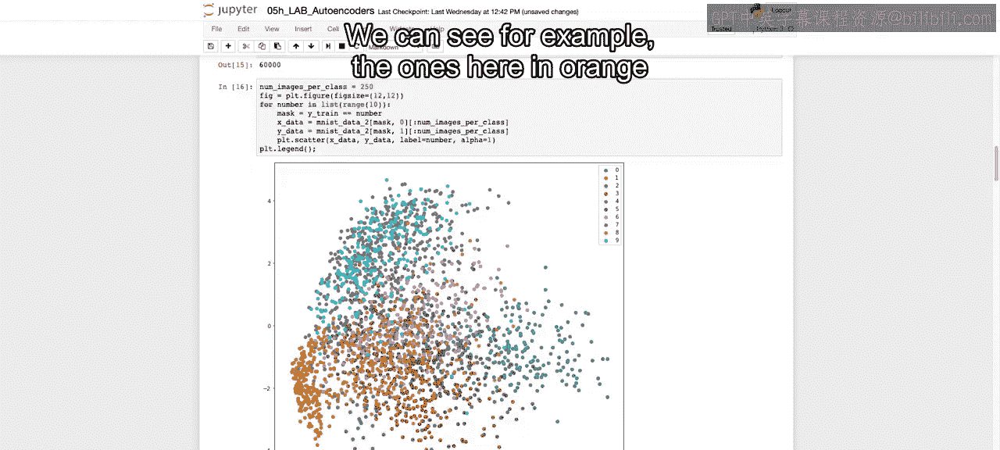

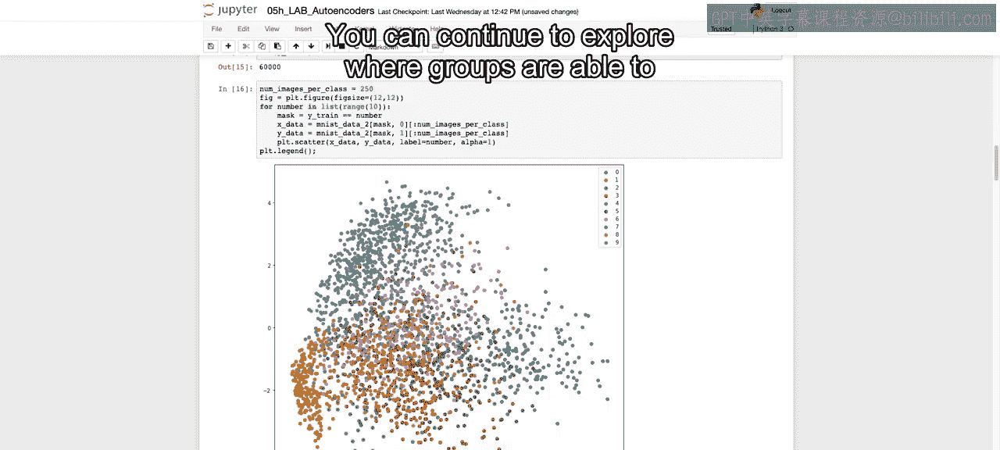

But we can already see that these latent features within PCA。

Are learning somewhat how to disentangle our features and perhaps a neural network could help even further in doing this。

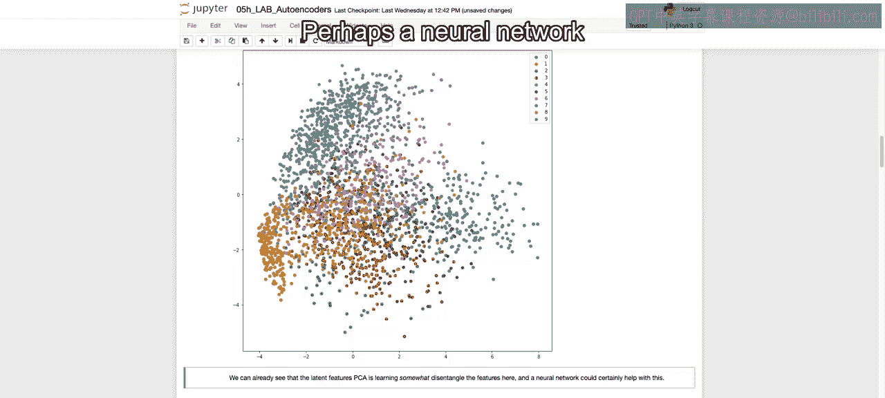

So now we want to score our PCA again， we're going to want to come up with some actual function to decide whether or not we are improving how well we are performing in regards to working with the PCA versus working with our network models。

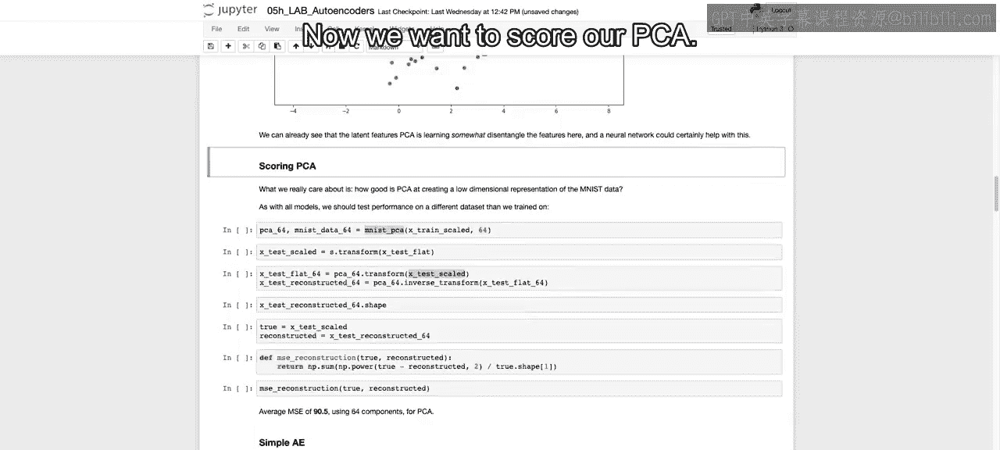

So the number that we're going to be using， the latent features。

 the amount of latent features we're going to be working with， here's going to be 64。

So we call that NNS PCA function that we defined earlier。We call 64 dimensions， we run this。

 we now have our model， as well as besides that model， also the actual transform data。

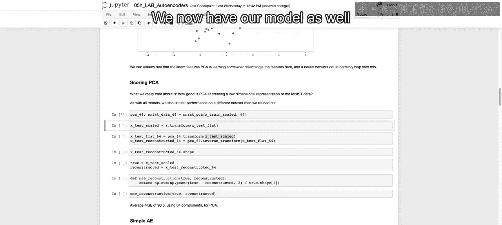

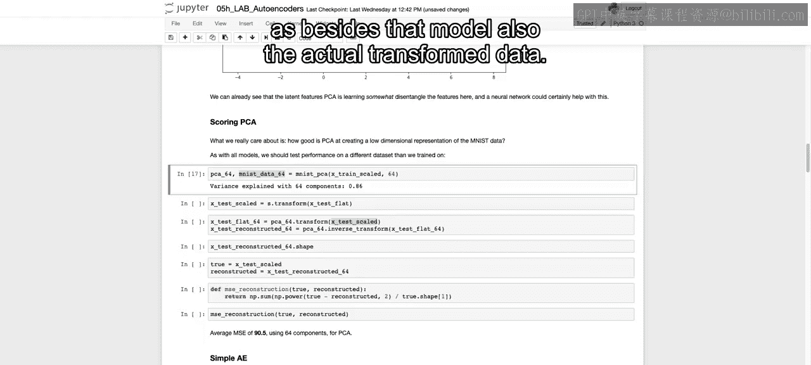

We're then going to take our X test flat that we defined earlier and scale it。

 So it's on the same scaling that we used with the this S was for transforming above。

Here are X trains， so we are're using that same S。

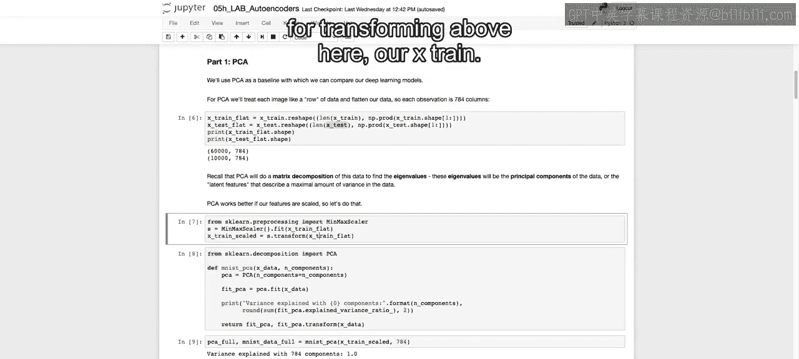

To transform our X test。We're then going to use that PCA 64 that we just fit on our training set。

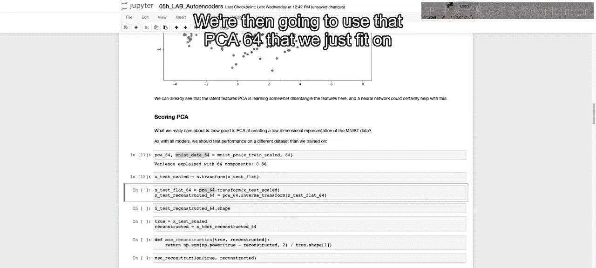

To transform our X test scaled。So that's going to give us x test flat in 64 dimensions。

And then we're going to reconstruct that same image。

Back to the original dimensionality that 784 dimensions that we are working with。

And we do that by calling PCs Exp 64， which is our model inverse transform。

On that X test flat 64 that we just produced。On that 64 dimension data of that we just produced by calling PC64。

transform。So this is that reconstruction that we're trying to do we're reconstructing our original image by reducing the number of dimensions and then going back to that original amount of dimensions that we are working with。

We can look at the shape here and as expected， given that we have the test set， there's 10。

000 different samples and reconstructed their back to that original dimensionality of 784。

We're then just going to call this true and reconstructed。

 so it's clear when we call this into our model， and that's going to be our X test scaled versus our reconstructed data。

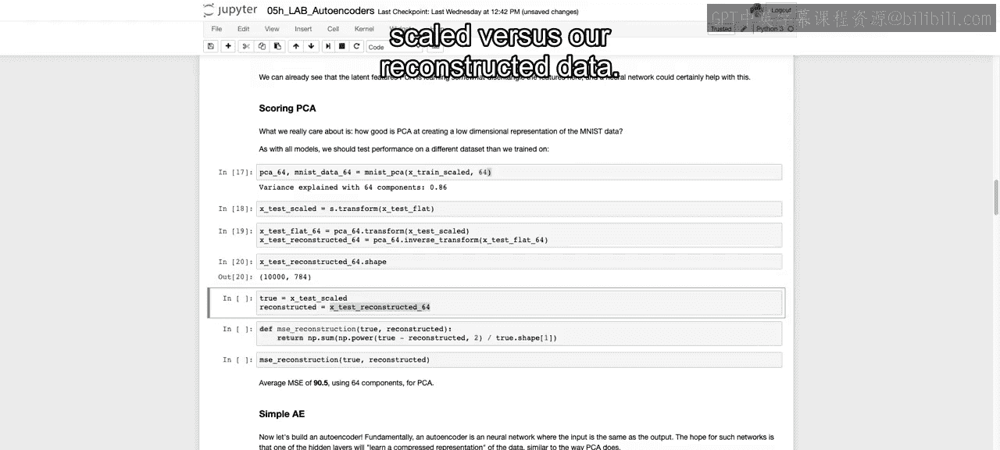

We're then going to come up with the mean squared error of that reconstruction。

 So we just say true minus reconstructed。For all the different pixels。

 And we just average out the total error that we have there。

And we can call that on our now true and reconstructed that we just defined above。

And we see that we have an average mean squared error about 90。5 when you use 64 components for PCA。

So that's going to be the baseline that we're working with。 We see a mean squared error of 90。

6 that closes out our motivation， building out that baseline in the next video。

 we're going to start to work with autoenrs， a simple autoencoder to see if we can do better than this baseline performance that we currently have a 90。

6。 All right， I'll see you there。

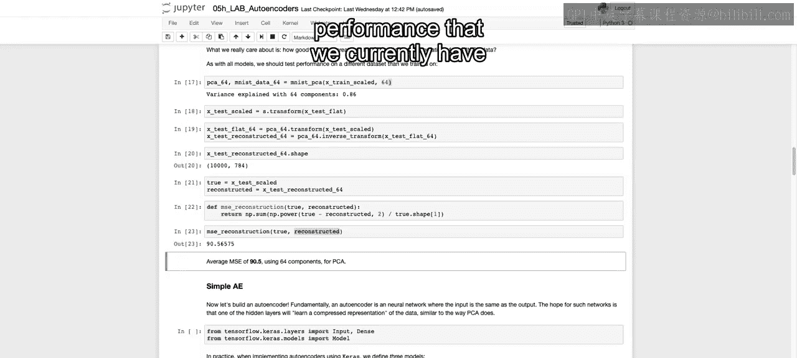

