# 104：IBM《机器学习（无监督学习、深度学习和强化学习、毕业项目）｜machine learning》中英字幕 p104 65_自编码器笔记本（选修部分）第4部分.zh_en -BV1eu4m1F7oz_p104-

Welcome back to our lab on Autoencors。In this video。

 we're going to be working with variational auto encoders specifically。

And if we recall variational autoencodederrs are specifically creating that latent space。

 that's now going to be a mean and a standard deviation that signifies a normal distribution。

 and from that normal distribution we will sample values and then pass those values through to our decoder to try and reconstruct our images。

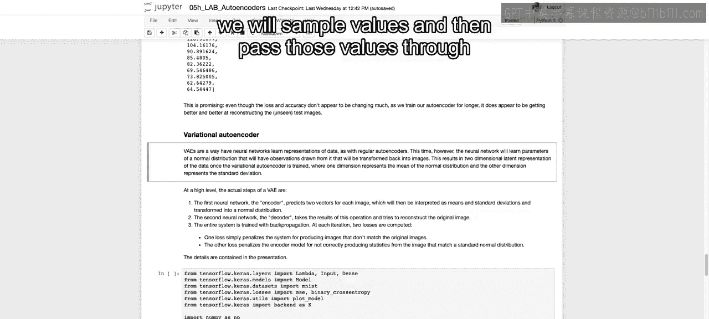

So again， just at a high level， the first neural network is going to be that encoder where we're going to predict two vectors for each one of our images。

Where these two vectors will be interpreted as the mean and the standard deviation。

And that can be sampled and used to pull out something from the normal distribution。

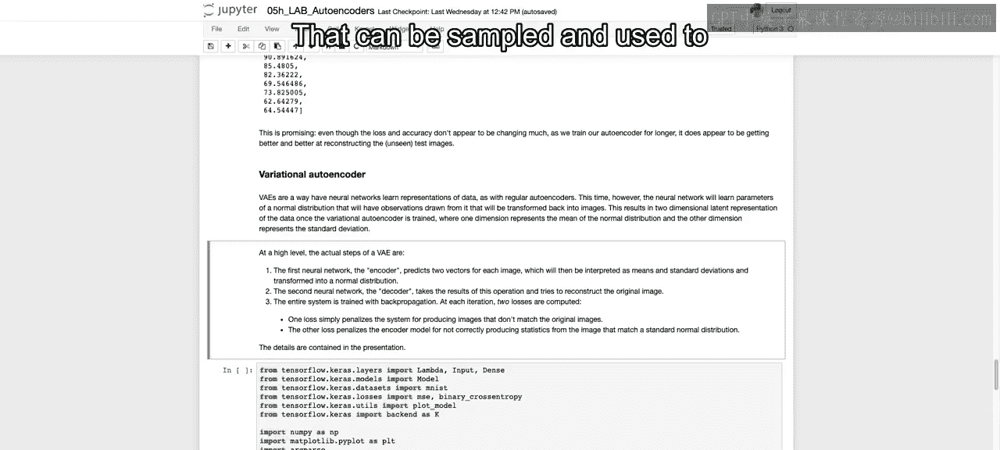

The second neural network will be the decoder that takes the results of our encoder to reconstruct our original image。

And then the entire system is going to be trained using back propagation at each iteration。

 and if we recall with regular autoencors， our input and output are the same。

 that's still going to be the case， and we're still going to try and minimize the amount of error when we're trying to reproduce that image。

 but now we're also adding on another penalization term。 If that values。

 those two values are not going to be standard normal values。

 They're not going to be 0 and1 for our mean and for a standard deviation。

 and that's going to be that Kl dirgence that we discussed in lecture。

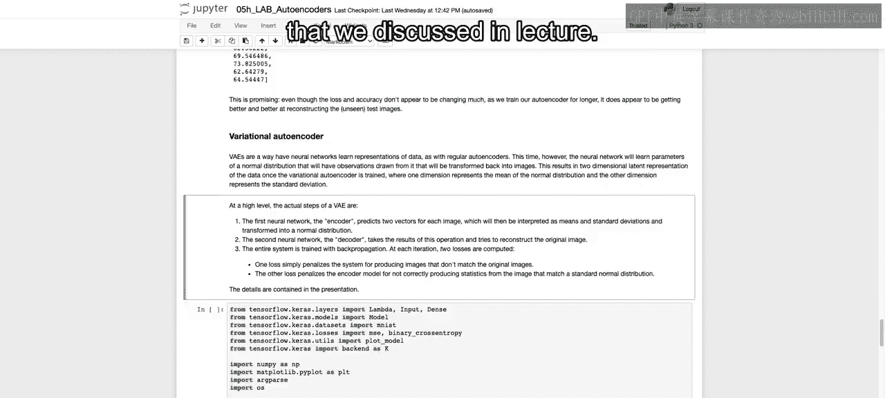

So we're going to import many of the。Libraries that we need， many of these we've seen。

 some of them are new， and I'll touch on the new ones as we get into each one of the different portions within our code here。

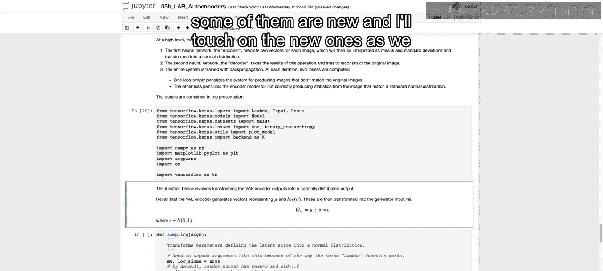

So recall that when we're trying to create our input from the encoded output。

 so that encoded output again is going to be that two dimensional vector。

 and that vector is going to have a mean and a standard deviation。In order to create that。

 to transform that into input for the decoder， we take those means。Add on the standard deviation。

 then multiply it by some random epsilon， where that epsilon is going to be some value sampled from the normal distribution randomly with a mean of 0 and standard deviation of one。

 And that's how there'll be some variation in what's going to be output each time。

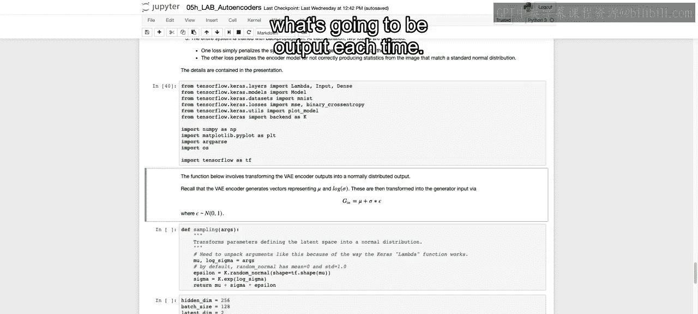

So to create that sample， we're going to create this sampling function here。And we pass in as。

 those args are actually going to be the mu and log sigma。

 It's going to be that output from the encoder， and we're actually going to add this on later on。

 We'll see how we do this in Caras， add this on to our actual encoder model at the back end of our encoder model so that we can produce a single vector。

So we have our mu and log Sigma， those are our as， we unpack them here。

We then set the epsilon equal to juice a random value with a mean of 0 standard deviation of1。

 That's going to be the default when you call random normal。

 And we want it the same shape as the mu so that we can add that on。

 and we'll see that in just a second。 Add that on to the mu plus the sigma。

 According to this formula that we have here。We then set sigma equal to the log of sigma E to the log of sigma so that we just have sigma itself if we recall the output in order to ensure that it always is positive。

 we actually output a log of sigma， so now we need to transform that back into sigma and then from there once we have our mu and our epsilon and our sigma。

 we can produce random values by taking mu plus sigma and multiplying that by that epsilon。

 that randomly sampled value。

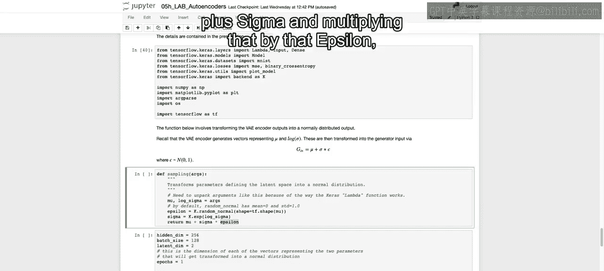

So that's going to be our sampling function。

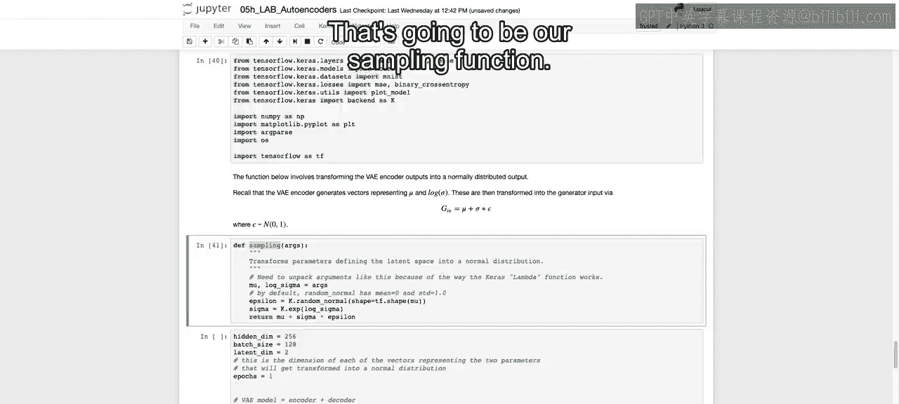

Now we're going to create our actual encoder network。We have our inputs same as before。

We have our dense hidden layer。Which is going to have hidden dim so that 256 dimension。

 so there's going to be some hidden layers this will be a bit of a deeper network。It has its inputs。

 which we define here that are going to be passed in again， we're using the functional API。

Then that x is going to be used as input into both getting the mean as well as the log variance of our z value。

So we can use that X and we wouldn't be able to do this as easily with the sequential API。

 and that's why we use a functional API。 we can pass in the X。

To a dense layer here and a different dense layer here。

 so that we're outputting two different values with that input。

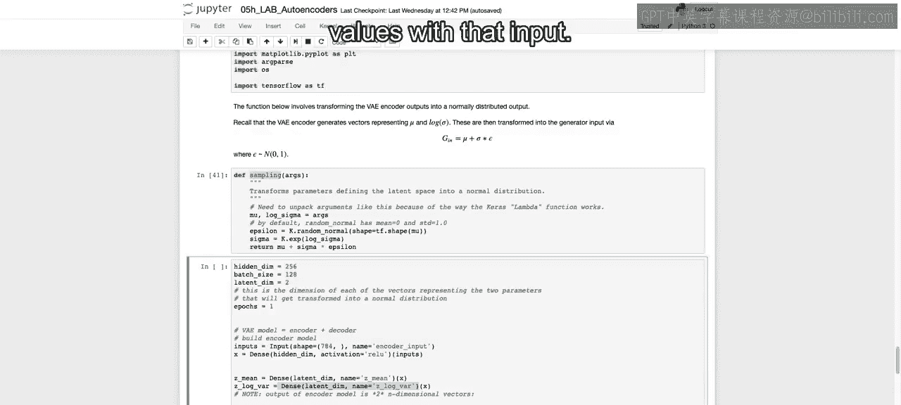

And then to get that final output that we're looking for。We're going to call Lambda。

 and that Lambda function allows you to pass in your own created function。

 which we created above that sampling。So Lada sampling and the input for that sampling is going to be this list。

 which is Xine and Z log ver， and that corresponds to our ags。

 which we were able to unpack up here into mu and log sigma。

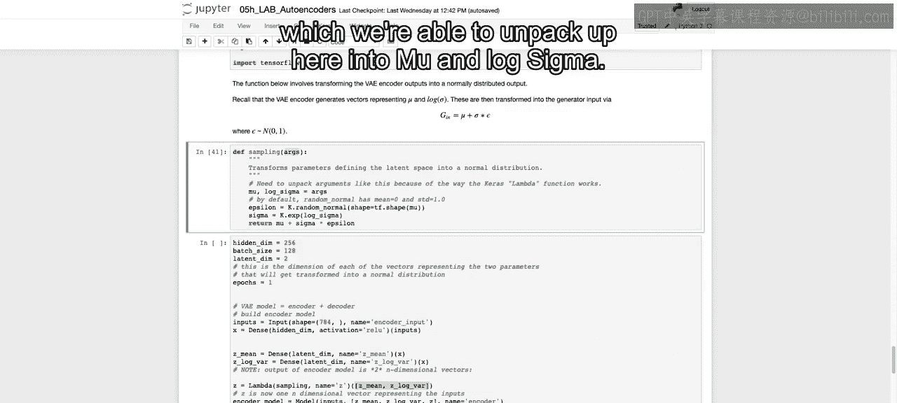

And then at the end of our encoder model， we pass in our model， the inputs going to be input。

 and then the output， we're actually going to output three different values。

 We're going to output the Z mean so that we can track that。 We're going to output the Z log there。

 Then we're going to output that actual Z value， that actual sampled value as well。

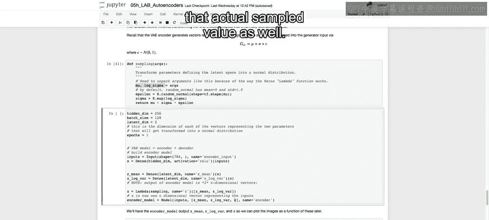

So now we've set up the encoder model。Then we're going to build out our decoder model。

And that's going to take an input of the shape of our latent dimension， those two dimensions。

We're then going to expand it So similar to how we did with the auto encoder。

 where we first shrunk it down with the encoder。 Then we expand it with the。

Decoder here we're doing that again。 So we're expanding that out up to the hidden dimension first。

 up to 256， passing in those latent inputs。 Then finally。

 that final output will be the dense 784 node layers so that'll be the same dimensionality as our original image。

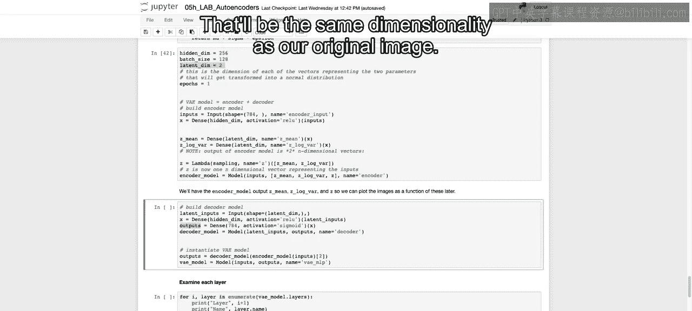

And then we can just say that the model is going to take in those latent inputs。

 then pass out the outputs we defined by passing that into the model。 and then to get the full model。

 we just do decoder model， and we pass in the encoder inputs。 But this time we only want as input。

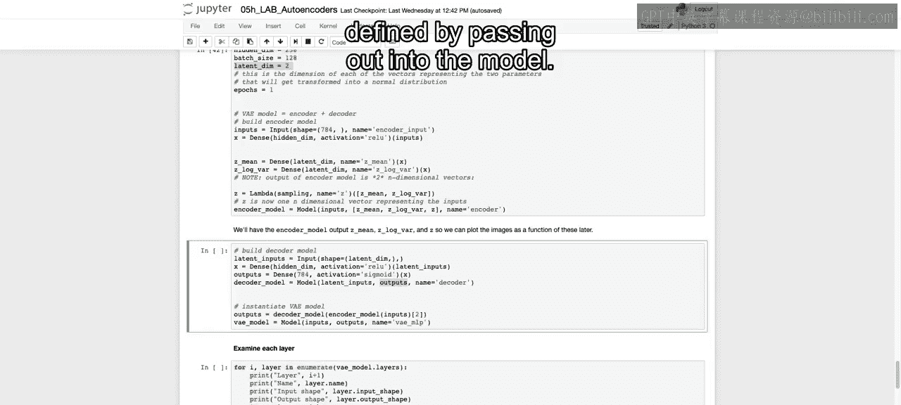

That third value。Recall that we actually are outputting in the encoder model three different values。

 What we really want to pass through into our decoder network is just that third value。

 which is why we specify two here。And then once we have our outputs， we can create our full model。

 which goes from those inputs defined all the way up here in our encoder model to the outputs that we just defined up here。

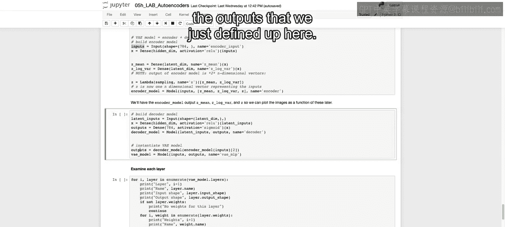

Now， just to take a quick dive in。

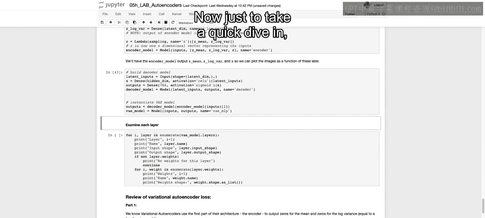

We can look at our model and we're going to look here at each one of the different layers that are involved and within that layer。

 layers are defined a little differently than probably what we are used to in regards to working with our neural networks that have multiple layers。

 but rather the layers are the models that are being used。 So we have the encoder input。

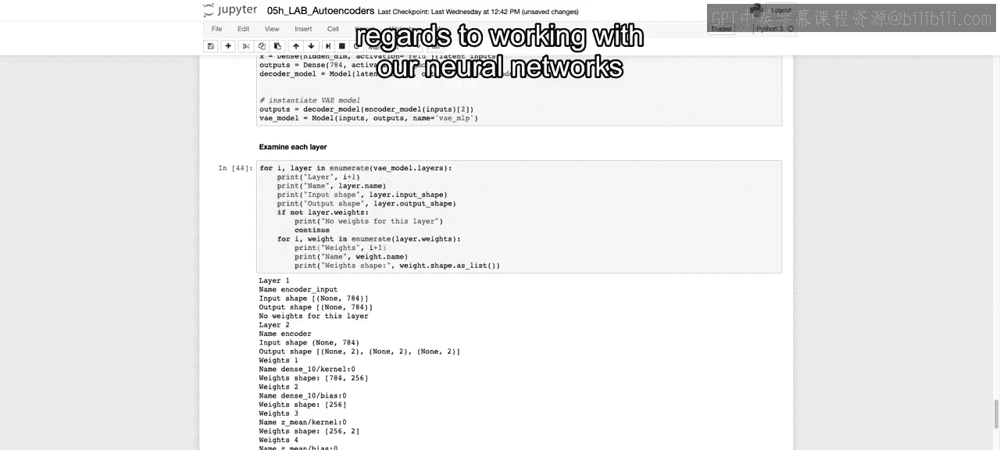

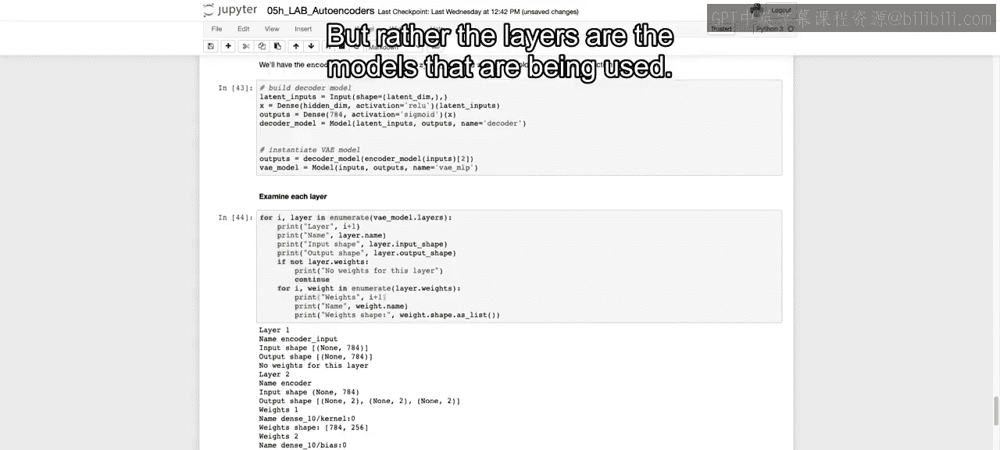

And that's just going to have no weights that are being learned。It's going be of dimension 784。

 and none is just， however many samples we want to pass in。

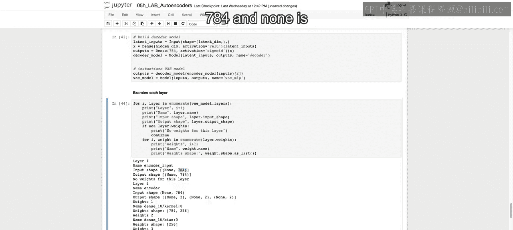

Then in our actual encoder layer outside just the input。We have the input being 784 and the output。

 as we discussed， being three two dimensional vectors，1 being the means。

1 being the sigmas and one being those sampled values。

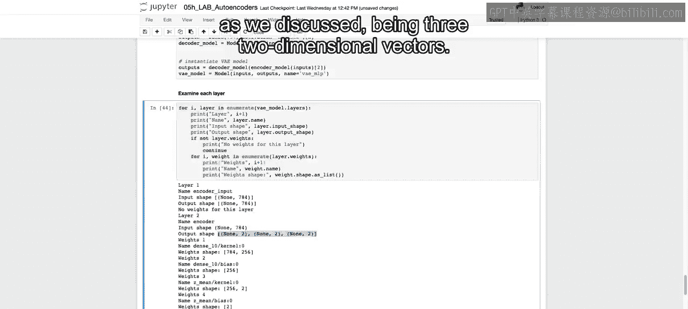

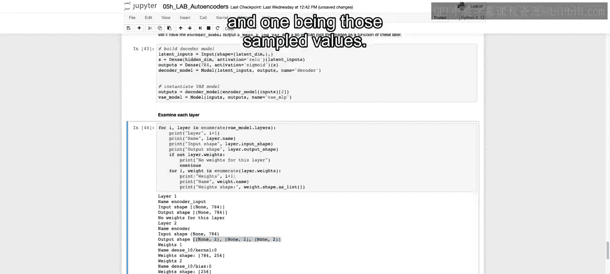

And then within this encoder， still in layer 2。Our first weights are going to be our dense layer。

 which gets us 784 by 256。 Our next weights are going to be the bias term。

 which is just going to be 256 different weights。

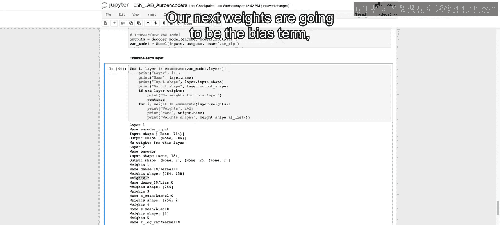

We're then going to get our actual mean values， which is 256 by 2。

 so those are the weights needed there。Our weights 4。 Now， when I says weights 1， weights 2。

 weights 3， weights 4。 that's not the number of weights。 That's just representing weights。

 number one， weights number 2 and so on。 The same way we did layer number one and layer number 2。

And then we have our mean bias and that's just going to be two values。

 and then we're going to have similar for the log variance with 256 and 2。

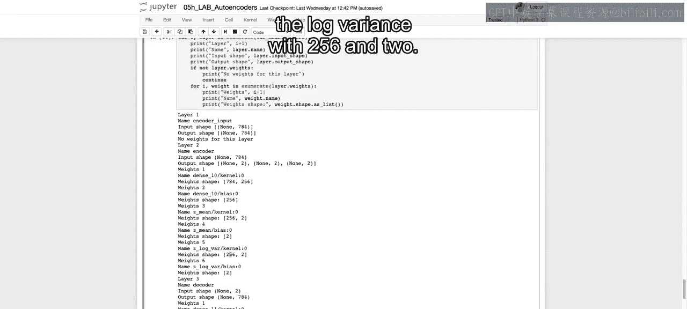

And then in layer 3， we have our decoder starting off with the input of two output of 784。

 and we have all the intermediate weights similar that build up back to that 784 that we discussed。

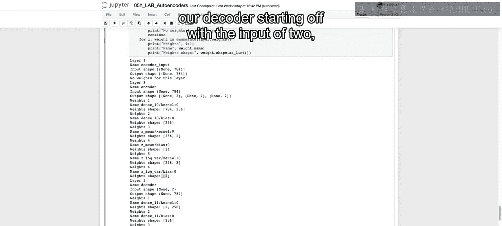

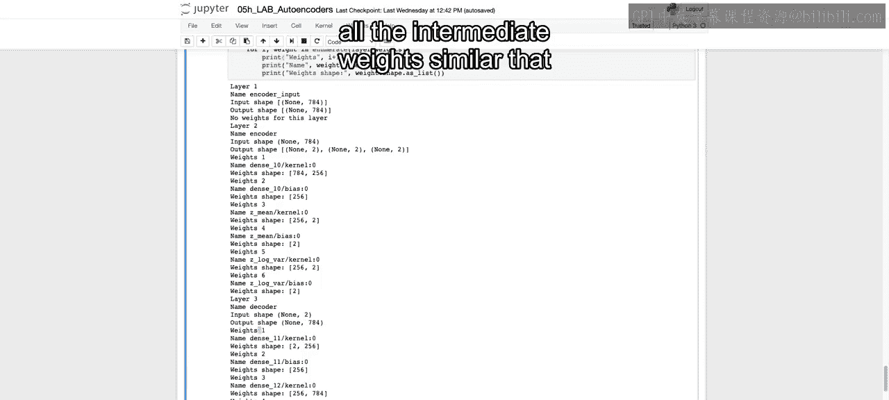

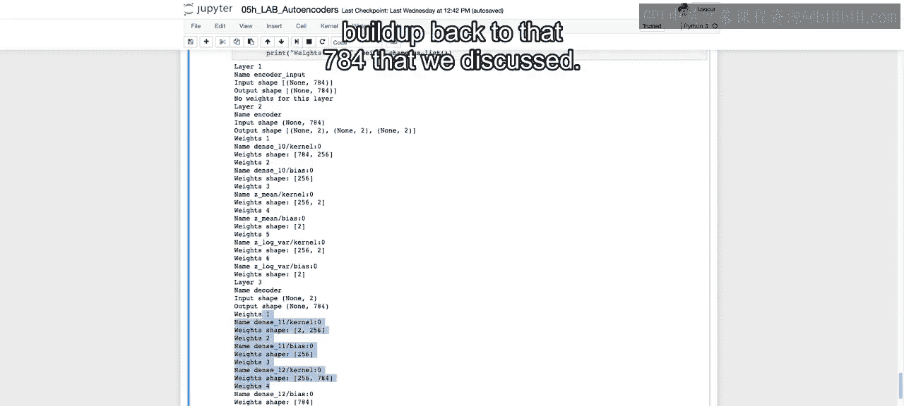

Now， again， if we want to start or go ahead and actually compile this model that we built out。

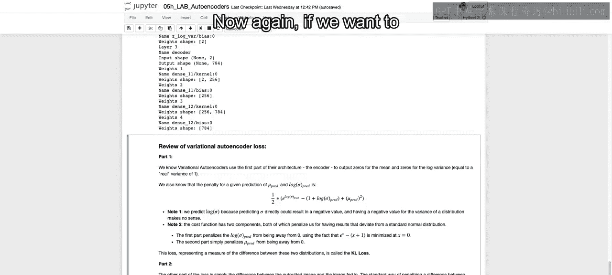

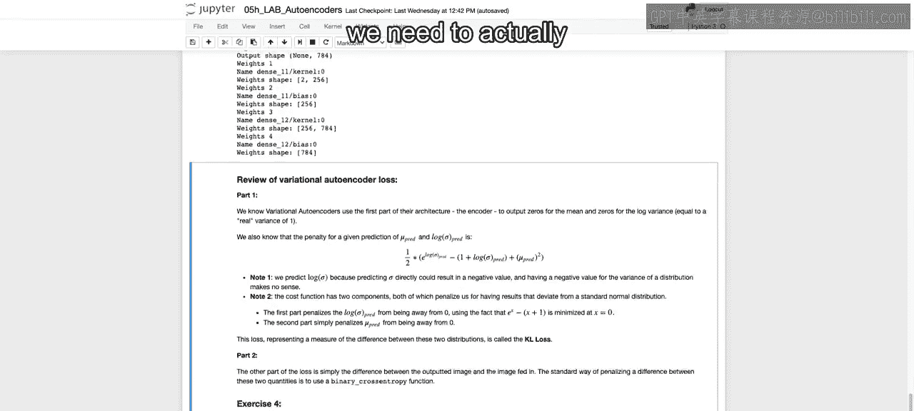

We need to actually reproduce that loss function that we need。

 So I'm going to pause here now that we've built out the variational autoender and the next video will talk through how to actually build out this loss function appropriately so that we can compile our model that we just built。

 Allright， I'll see you there。

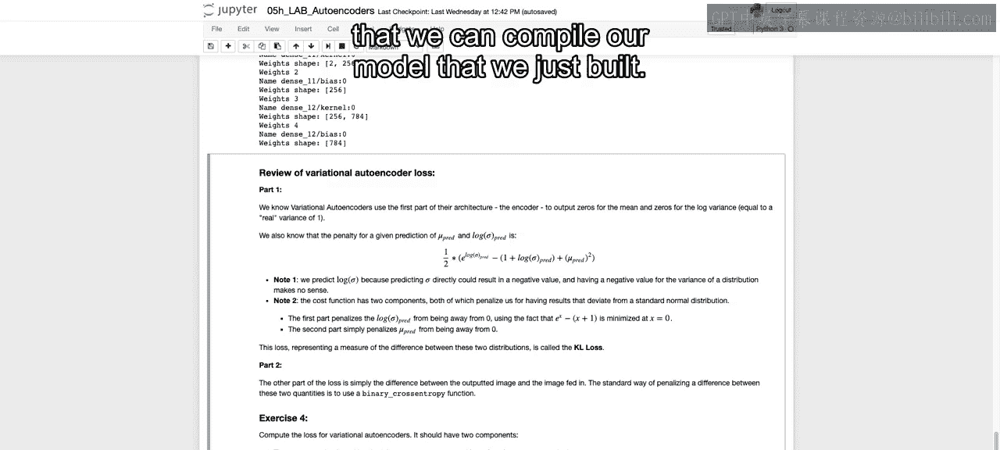

