# 105：IBM《机器学习（无监督学习、深度学习和强化学习、毕业项目）｜machine learning》中英字幕 p105 66_自编码器笔记本（选修部分）第5部分.zh_en -BV1eu4m1F7oz_p105-

So as discussed at the end of the last video， we're going to need a different loss function for our variational autoencoder and the second part of that loss function。

 so we have the first one for the reconstruction error， which is the same as the autoencors。

 the second portion which is specific to variation autoencoderrs is what we have here and we discuss this in lecture how we predict log sigma because predicting sigma directly is going to could result in a negative value and doesn't make sense to have negative variance。

And then the fact that the cost function has two components。

Both of which penalize us for having results that deviate from that standard normal deviation。

 So if log of sigma is far from0， we can use this portion E to the x minus x plus 1 being minimized at x equals0。

 and that's equivalent to what we have here in the first portion of the Kl divergence。

And then the second part simply penalizes the mu value。

 that mean value from being far away from zero。And then again。

 the other part of the loss function is just going to be that reconstruction error。

So our exercise here。Was to actually create this loss function so that we can pass it through and optimize using this loss function。

 minimizing this loss function that we have。So we do this first by starting with the reconstruction loss。

We're going to just multiply by 784 so that we're not working with the average value。

 rather the full value rather than the average overall of the pixels。

 so we're just using this binary cross entropy so far we've been passing in that string as our loss function。

 but if you look at our imports that we had earlier。

We actually pulled in binary cross entropy and that's available from Kara's do losses。

So we pull that in。And we're able to say we want that binary cross entropy for the inputs and outputs。

 and we've defined that as our reconstruction loss， so that's one portion of our loss function。

The other portion is just going to be this formula that we have here above。

And we're going to pass in the Z log there， which is going to be one of our outputs that we specified in our encoder。

 as well as the。Mean value that we have here。 Sorry， we have the log Z log ver there。

And then finally， that square of the mean value。And then we're just going to sum that KL loss。

On that final axis and then the total loss。Is going to be the mean of the reconstruction loss。Plus。

 that KL loss。 So that reconstruction loss that we defined here， plus the KL loss。

That we just defined down below， which is this function that we discussed。

 both in lecture and here in the notebook。So we're going to run those cells。

And then once we have that total VAe loss， we can add on to our model by using this add loss functionality within Cars。

 we can call。Add loss and pass in this total VAA loss。

And then we can just compile and specify our optimizers as well as the metrics we want to track。

Once we do that， we can look a bit at our summary， it gets a bit intense with everything that we're doing。

But we don't have to worry too much about it just here。And then we'll fit that to our Xtrain flat。

So this is training our full model， the number of epochs we defined above as just one。

I'm going to pause the video here as it'll take about 10 seconds to run and we'll come back as soon as I's done learning。

So that should have been a quick second to run or a quick 10 seconds。

 and now we want to look back at the reconstruction error for our new model that we're working with。

 the variational autoencoder model， I want to think whether that reconstruction should be higher or lower than the original autoender without maybe reading what we have here below。

I'm going to run this here。And we're going to see that we have a much higher reconstruction error。

 And the reason being that this latent space is built more for interpretability that is sampling from a distribution rather than being perfectly reconstructed to those original images。

 as now we're kind of sampling rather than taking the direct latent space that we learned。

Now I want to plot out the latent space that we had， so we have our models。

 we're going to create a tuple that's just the encoder model and the decoder model so that we can pass that into our function later。

 and then our data is also going to be this tuple， which is X test flat and the related Y test。

So this is pretty large， I'm going to summarize I'm not going to go through every line of code here。

 but I am going to summarize what the data is actually or what the function is actually trying to do。

So we have our encoder and decoder as well as our X test and Y test。

And the first portion of our function is going to be to actually plot out in two dimensional space as we did with PCA。

 each one of our different numbers， so that's going to be the first portion in order to do that。

 we need to get our z value。So we're going to get each of the predicted Z values and with those z values we're going to also get their related numbers。

 so we're setting the color in our scatter plot according to that Y test that they're related to。

And then we have our two dimensions of00 and z1 in that two dimensional space。

 and those z's are going to be those random samples that we pull out。

 according to what each one of those digits are。And then on the lower portion。

 so we're going to actually plot out two plots here。

We're going to create a grid space ranging from negative four to 4。If you see that are limits。

Here our limit here is four passing into the function or whatever our limits tend to be that we can pass into our function here it's negative four to 4。

 we're going to plot a bunch of values。Here n is equal to 30。

 so 30 different values between negative 4 and 4 on both the x and y axis。

 and we'll see for these different values of x and y。What is going to be and recall we are。

With our Z's， we originally plotted out in two dimensions， which ones。

 which numbers they're closest to， and we'll see this once the picture comes out。

But now we're actually going to generate numbers using the decoder。

 so let's say our first value is negative4， negative4。Then for negative 4， negative4。

 we're going to pass that in by using that X I， Y I， we're going to pass that into our decoder。

And see what kind of sample it actually generates。You can think of the value being zero and 2 or0 and three and remember these are supposed to be samples from something close to normal distribution。

So， you know。Now that function has been initiated。We also， I forgot to run this。

 we need to make sure that we have all that defined。

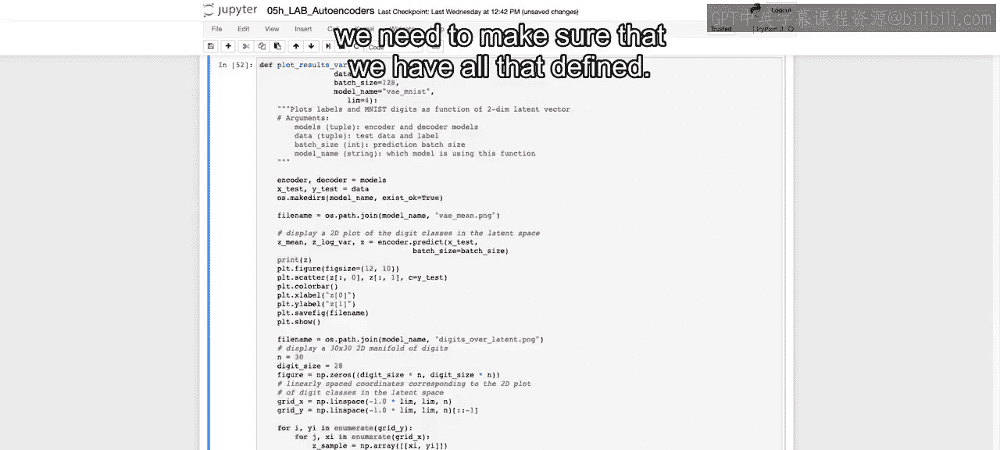

And then we're going to actually plot the results， and this should make what I just discussed a bit clearer。

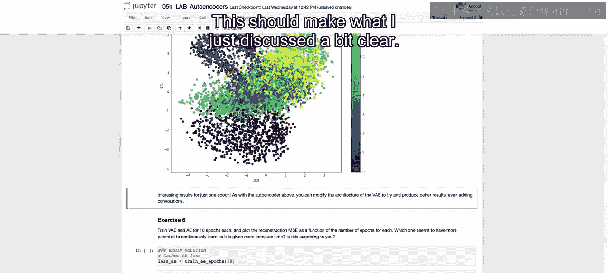

So here we have the different groupings， so we see for our purple here， which is related to our ones。

 those tend to be in the top left corner， which is negative for on the z0 for our first dimension and Z1 being positive for。

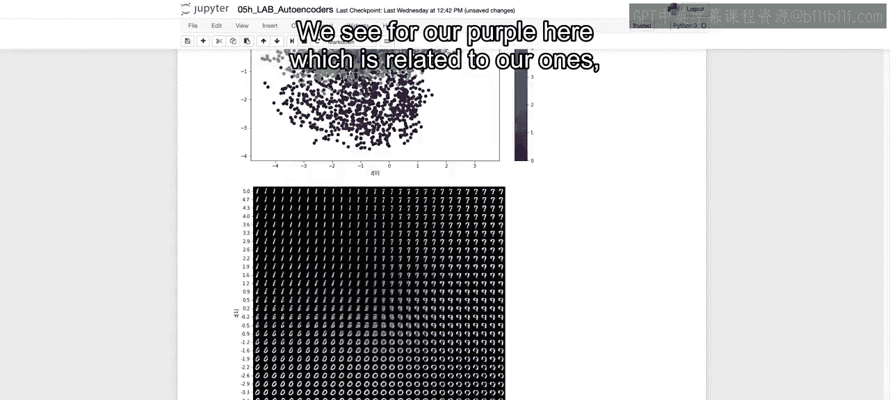

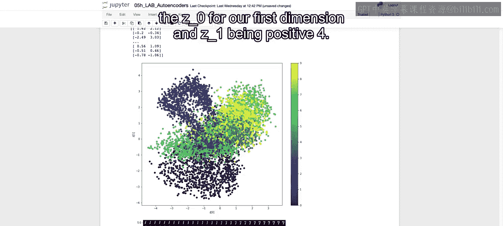

And then when we look at the numbers generated， those tend to be ones。

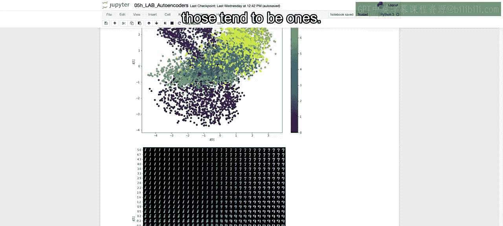

Whereas。You see here on the bottom that darker purple is the zeroes。

 And here it's generating those zeroes。 Top right。 We have the light green。

 which is associated with the sevens。 And we see that that's。

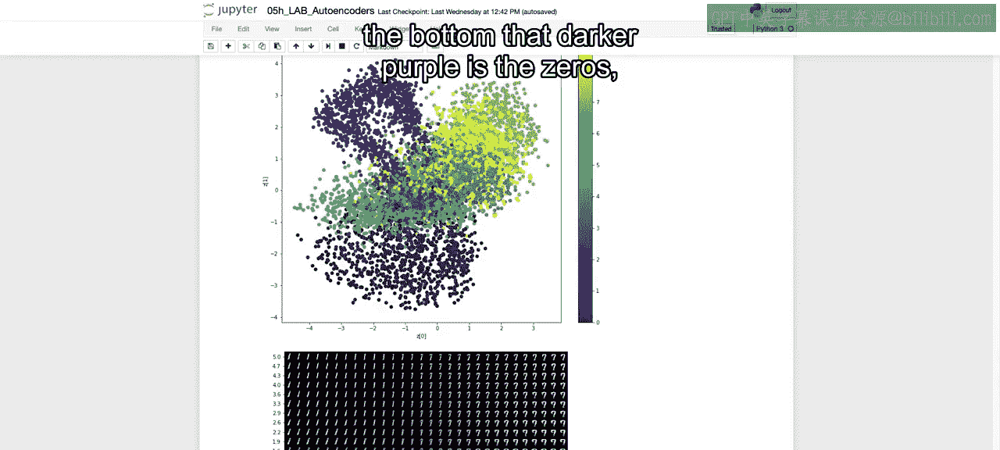

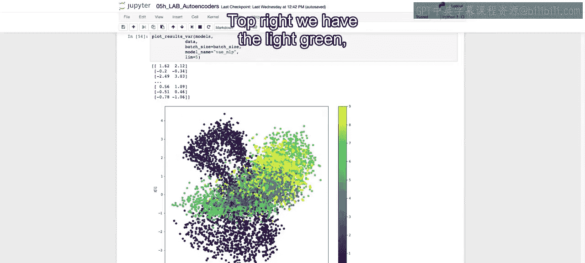

Predicting or generating sevens as well， so we can see this generative process。

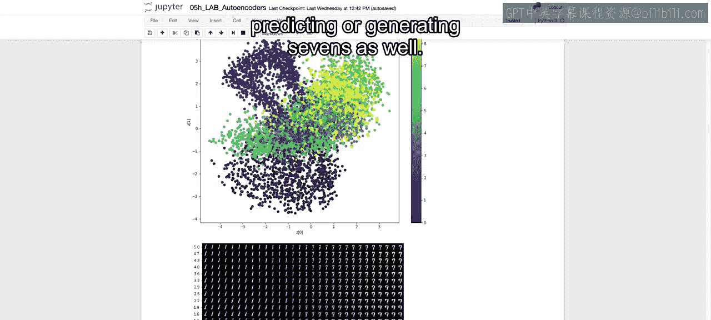

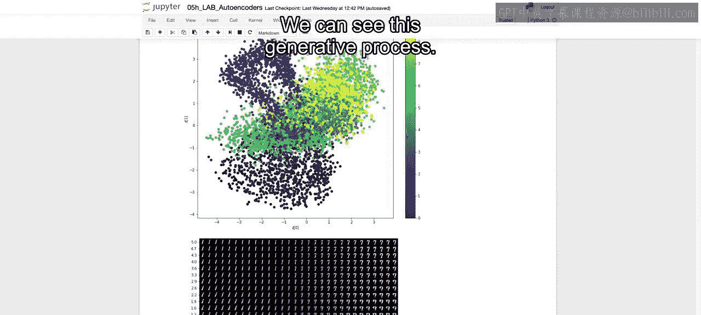

Then finally， in exercise six， we want to train the variational autoencoder as was the autoencoder for 10 epochs each。

 and then plot the reconstruction mean squared to error as a function of the total number of epochs for each one of these models。

And see which one seems to have more potential to continuously learn as it's given more computing time。

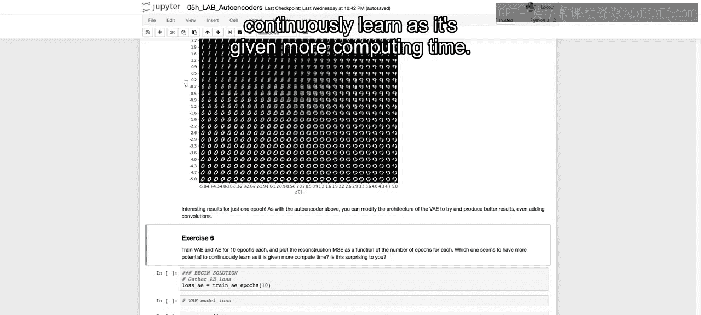

So。We have here。 It's going to start running for 10 epochs。 I'm going to continue running。

 I'm going to talk through what we have here because all we are doing is then running our variational autoenr model for 10 epochs。

 for the autoencoder， we had that function defined find in maybe video 1。

 I believe it was I'm going to scroll all the way up。 maybe as video 2， because video 1 was on PCA。

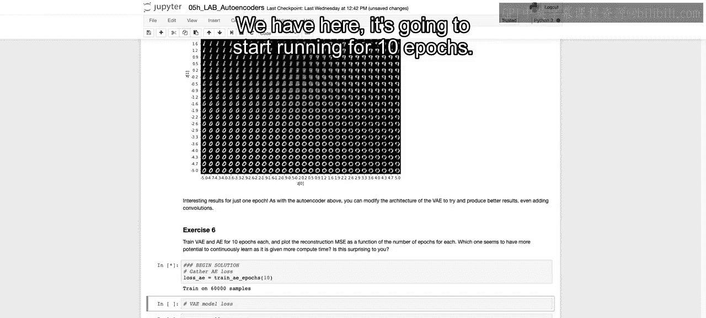

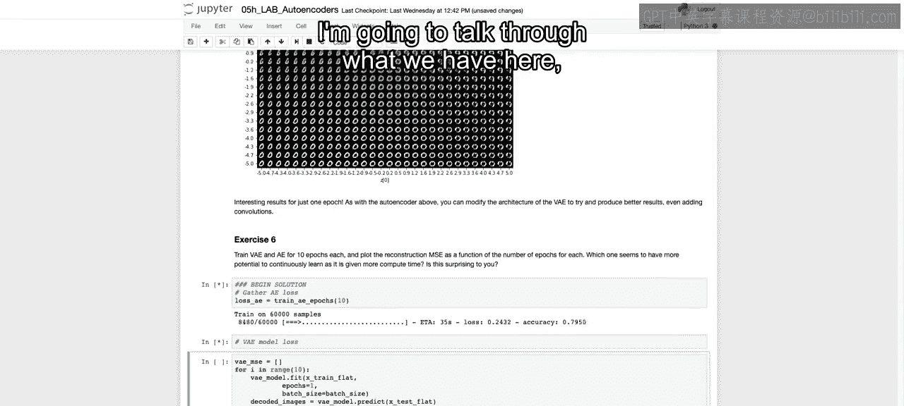

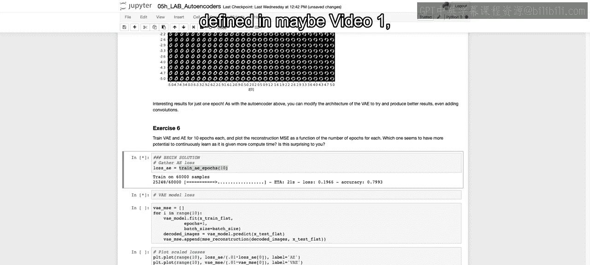

Where we defined。This function here that trains AEE our autoend for a certain number of epos。

We don't have that for the variational autoender， so all we have to do is for I in range 10。

 fit that model each time for one epoch， again， recalling that every time you run it。

 it's going to pick up where the last one left off。

So each of these are going to take some time to actually plot out。

 we'll come back when that's done and then we'll actually plot out the loss functions across each All right。

 I'll see in a bit。Alright， now we have had our autoencoder as well as our variational autoencoder run for 10 epochs each。

 and we can look at the plot over time or over the number of epochs。

 and we see that there tends to be a plateau for those autoencors whereas the variational autoencors are continuing to go down you could probably run this a little bit further if you wanted maybe 1015 more epochs for the autoencos to really plateau。

But。We see that the autoencors are fitting exactly and eventually are going to plateau due to the fact that they're fitting exactly。

 whereas the variational autoencoderrs continue to decrease and will take a little bit more time to get to that same reconstruction rate。

 probably never getting to that same exact reconstruction rate as we see with the autoencors。

Now that closes out our notebook here。And after this。

 we're going to get back into the lecture and discuss a different generative process。

 specifically GNs and generative adversarial networks。 Allright， I'll see you there。😊。

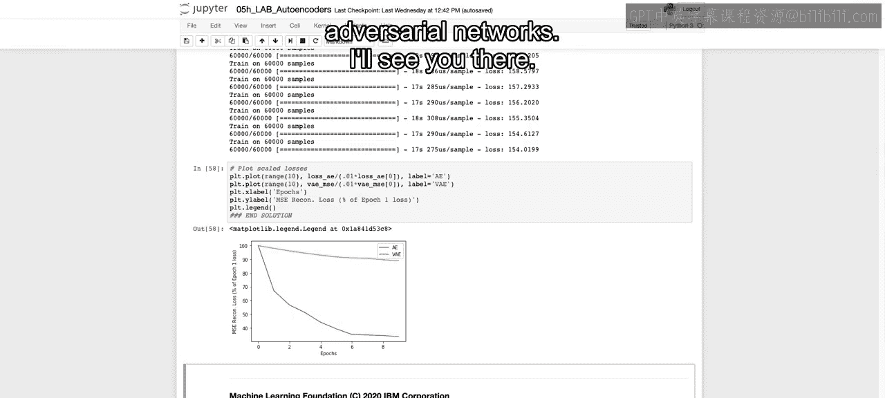

