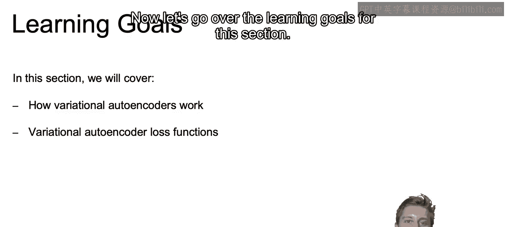
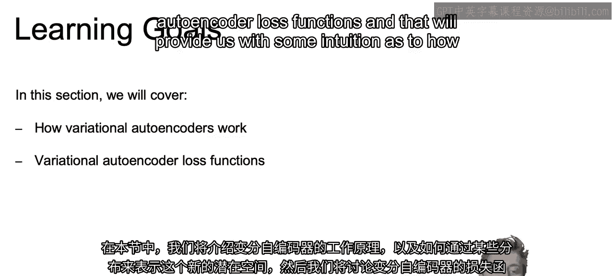
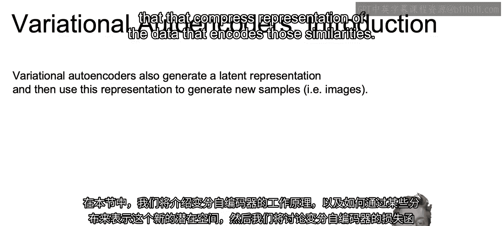
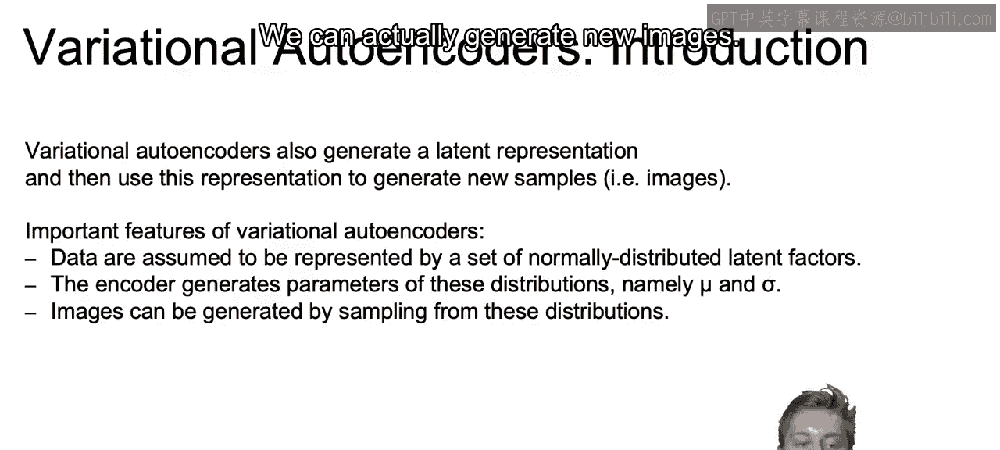
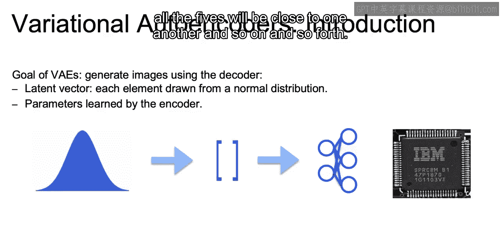
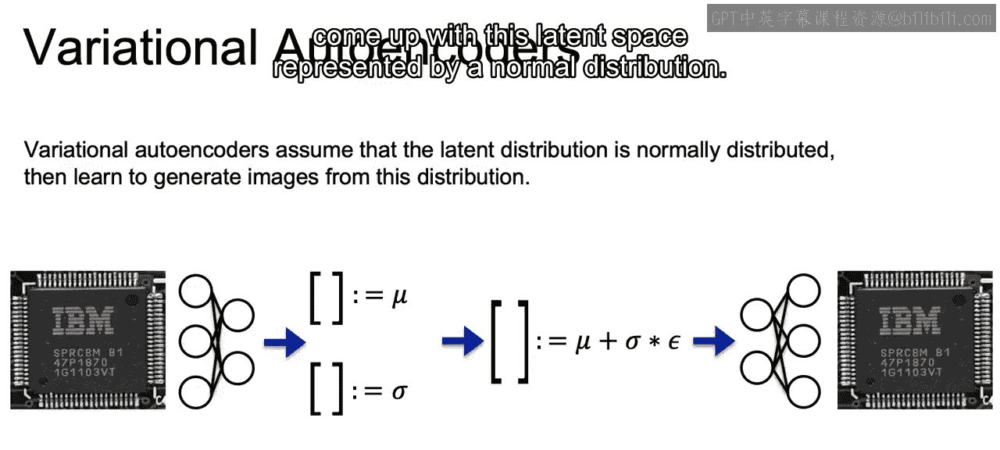
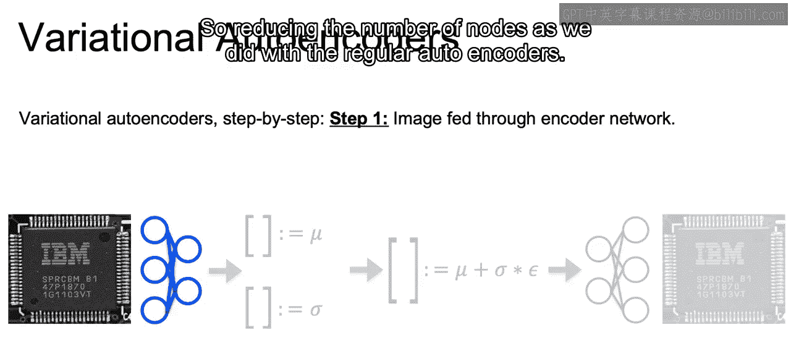
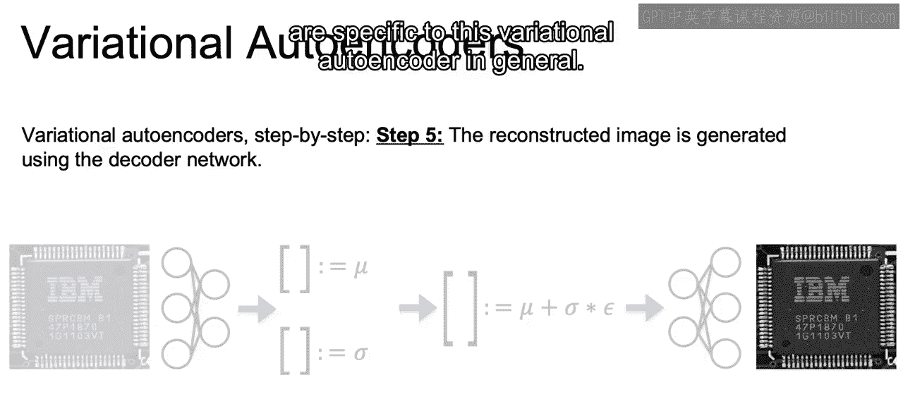

# 106：IBM《机器学习（无监督学习、深度学习和强化学习、毕业项目）｜machine learning》中英字幕 p106 67_什么是变分自编码器.zh_en -BV1eu4m1F7oz_p106-

In the next videos， we will introduce the concept of variational autoencors。

 which will work similar to the autoencors that we just discussed， except now that latent space。

 that hidden space that we're trying to represent is going to be described by distribution rather than exact figures。

Now let's go over the learning goals for this section。

In this section， we're going to cover how variational auto encoders work。

And how we can come up with this new latent space represented by some distribution。

Then we'll discuss variational autoencoder loss functions。

 and that will provide us with some intuition as to how variational autoencoderrs are used and optimized。

Net with variational auto encoders will still be generating that latent representation。

 or again that compress representation of the data that encodes those similarities。

And then similarly， we can reconstruct these to generate new samples。Now。

 some important features of variational auto encoders will include rather than the data being represented by just a single set of vectors。

The values of the data in that latent representation will now be represented by a set of normally disant latent factors。

And now rather than the encoder coming up with a particular value。

It instead generates the parameters of our normal distribution。

 namely the mu and sigma or the mean and the standard deviation。

And then using variational autoencors and the fact that we are going to be sampling from a given distribution rather than some fixed values。

 we can actually generate new images。

Now， the goal of variational auto encoders will be to generate images using the decoder portion of our network。

Now， again， starting off our encoded latent vector will now be represented by some normal distribution。

And the parameters for that normal distribution will be learned by the encoder portion of our network within this variational autoender and then fed through to our learned decoder portion to produce the images。

And a secondary goal that will come along with that is that similar images will be close together within the latent space。

 So as we'll see in our note book later on， for looking at hand drawn values between 0 and 9。

 the latent space for all the zeroes will be close to one another for all the fives will be close to one another and so on and so forth。

So let's walk through the steps of how variational autoencoderrs will come up with this latent space represented by a normal distribution。

The first step will still be to pass through a network with some bottleneck。

 So reducing the number of nodes。

As we did with the regular auto encoders。But now at step 2。

 we're going to be learning a mu and a sigma for each value that are meant to represent a normal distribution from which values can be sampled。

So for example。Here， we may end up coming up with the vectors that we see， which are for the mu 0。

7 and negative 0。6， and then  one in 0。6 for the sigma values。

In the next step for our variational auto encoders。

 we combine these two values into one vector and add on some white noise with a mean of 0 in a standard deviation of one。

So using our example from before， we can come up with this vector at the end of 2。01 and 0。

54 by adding the mean that mu plus the sigma multiplied by our noise term。

And those are the vectors that we see here at the bottom that will tell us what is going to be some sample from our distribution。

This randomly sampled vector is then fed through our decoder network， in step 4。

And we then can produce our reconstructed image。So that's how you walk through this variational autoencoder with the mu and sigma。

In the next video， we're going to touch on a high level some of the math that makes the variation autoenrs work and are specific to this variational autoenr in general。

 Allright， I'll see you there。

