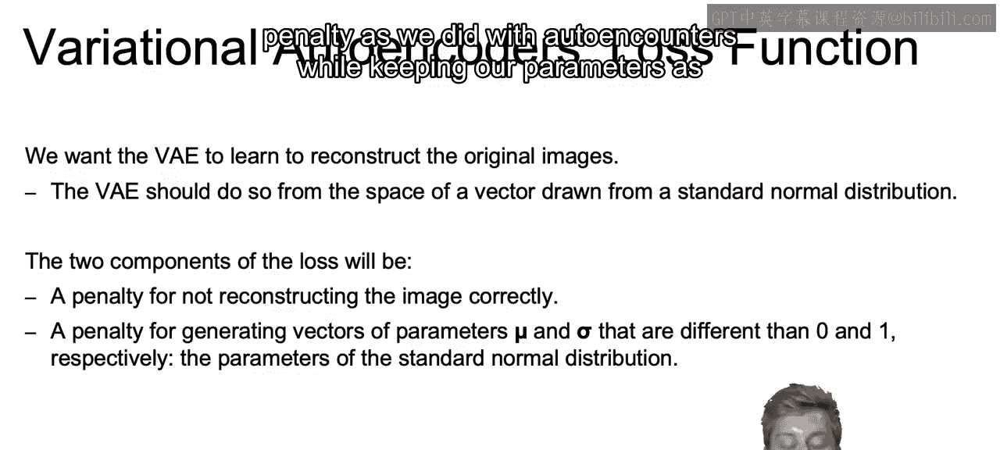
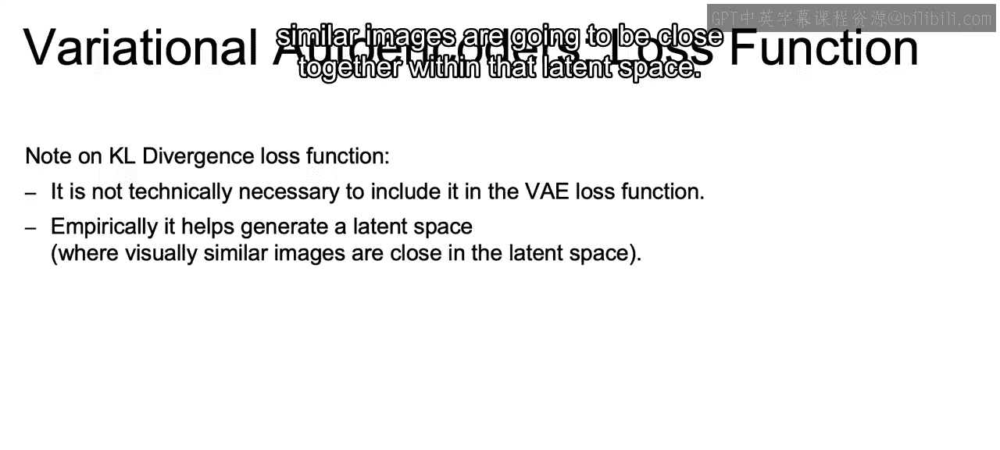
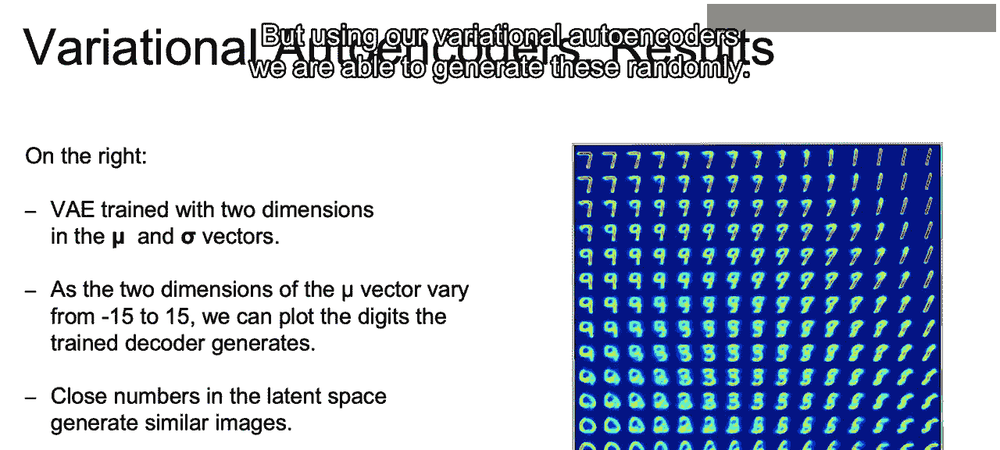

# 107：IBM《机器学习（无监督学习、深度学习和强化学习、毕业项目）｜machine learning》中英字幕 p107 68_变分自编码器的工作原理.zh_en -BV1eu4m1F7oz_p107-

In this video， I want to start off by discussing the loss function of the variational autoenr compared to that of what we would do with just the autoenr。

 So our goal will be to reconstruct the original image， as we did in our auto encoders。

Now we know that a major difference is that the variational autoender will be reconstructing a vector drawn from a standard normal distribution。

And with that in mind， we're going to have two components to our variational autoenr loss function。

First， we have what we had for the normal autoenrs。

 which is just the error measuring how far off our reconstructed image was from that original image。

The second part of the loss function will be a penalty associated with generating vectors of the parameters mu and sigma that are both different from 0 and 1。

 So mu being different than 0 and sigma being different than one。

As our goal will be to balance between that low reconstruction penalty， as we did with autoens。

While keeping our parameters as close to the standard normal distribution as possible。

So this comes down to the pixel wise difference between the reconstructed and original image for that first component。

And in order to calculate this， we can use a loss function such as mean squared error to see the distance between the reconstructed image and the original image。

And then again， the second component will be the difference between the vectors produced by the encoder and the parameters of a standard normal distribution。

So how do we go about calculating that second component of our loss function？For this。

 autocutters will use something called KL divergence between the data that we generated and the standard normal distribution。

So here we have， for example， our mu values versus a mu of0。

And then we're actually going to take the log of sigma。 And if we think about our sigma。

 the ideal sigma would be one。 the log of one would be。0。

 so we're going to be comparing the log of our values versus 0 again。 Since again。

 the log of sigma is going to be。 the log of  one is going to be 0。

And we use the log to ensure that we end up with strictly positive values as a negative value for variance doesn't really make any sense。

Now， the actual KL diversionence formula will be what we have here。

 where E to the log of sigma minus the log of sigma plus 1。

Is going to penalize the sigma for straining from one。 And we can know if sigma is 1。

 then log of sigma is 0。 And if we replace log of sigma with 0 here。

 we would see that this comes out to 1-1。And is thus minimized at sigma equal to one。

And then from mu， obviously， mu squared will be minimized when that mu value is equal to 0。

 because if it goes a little bit to the right to 0。5 or even up to 1， then mu squared would be1。

 If it goes a little to the left to negative one。 again， you'll have a value of  one。

 So it'll be minimized when mu is equal to 0。And in regards to that sigma portion。

 we can somewhat see graphically if we imagine subtracting that orange line from the blue line。

That again， e to the x minus x plus1， which is similar to our sigma portion that we discussed in our KL divergence formula that again is going to be minimized at x equal to0。

Now a note on kale divergence。It's not technically necessary to include this component in our loss function。

But the reason that we do like to include it， though。

 is that it helps generate a desired latent space where visually similar images are going to be close together within that latent space。

So as an example， what we have here is a variational autoencoder trained with two dimensions in the mu and sigma vectors。

And because this is a generative model， we can scan the latent plane and sample points at regular intervals and actually generate corresponding digits。

 Given what we sampled for each one of these points。

And as long as our sample values are close within that latent space。

 within that lower dimensional space， which is represented by our mu and sigma。

 they will generate similar images。 And that's why you see sevens up to the left and some nines in the middle。

 none of these were actual images within our data set。 But using our variational autoencodederrs。

 we are able to generate these randomly。😊。

Now， just a recap。That will close out our section here on variational autoenrs。

 We went through the basics of how variational autoenrs work and how they differentiate from regular autoenrs and that they produce a probabilistic means of describing our latent space。

And with that， we also discussed the loss function used and why adding on K L divergence to measure the distance from the normal distribution can be very powerful。

Now let's take a look at some actual code as to how we can actually build out auto encoders as well as variational auto encoders of our own Allright。

 I'll see you there。

