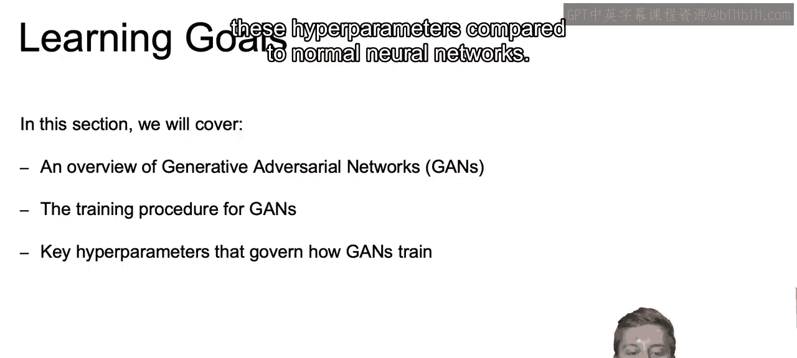
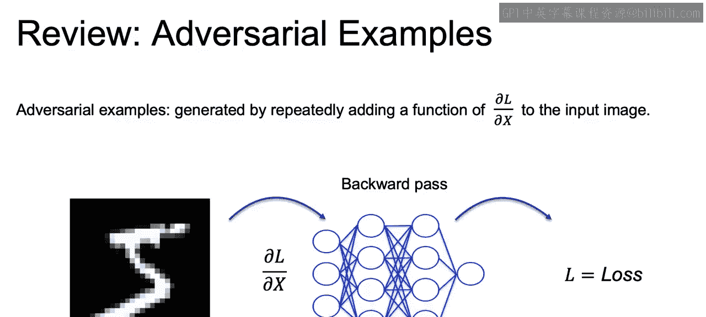
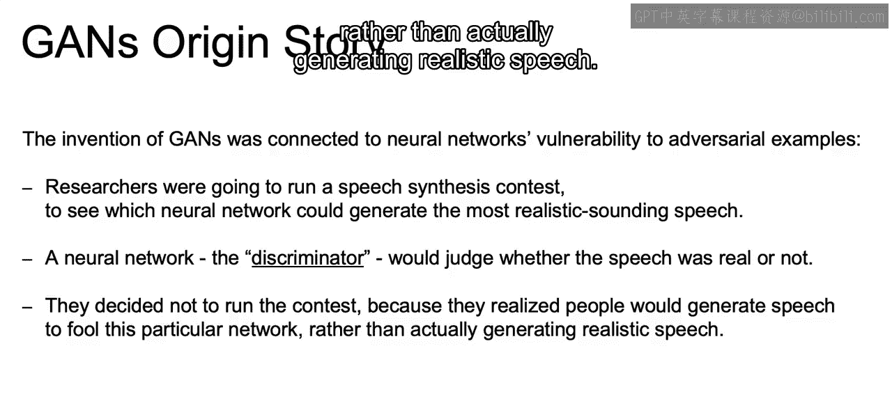
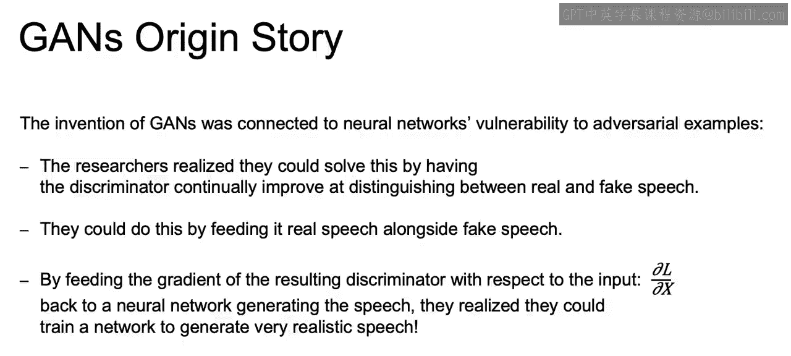
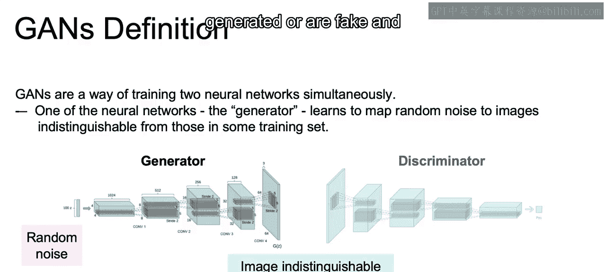
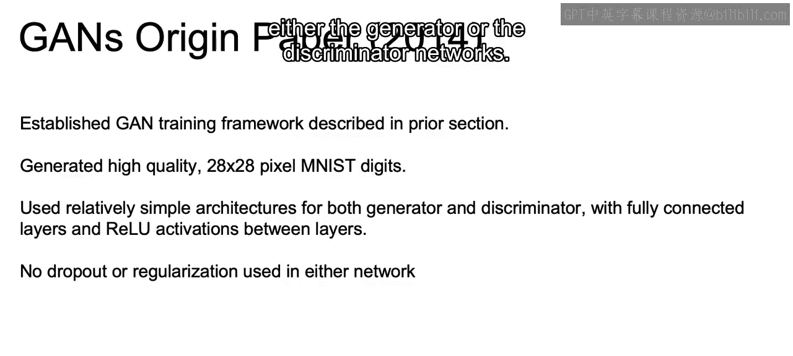
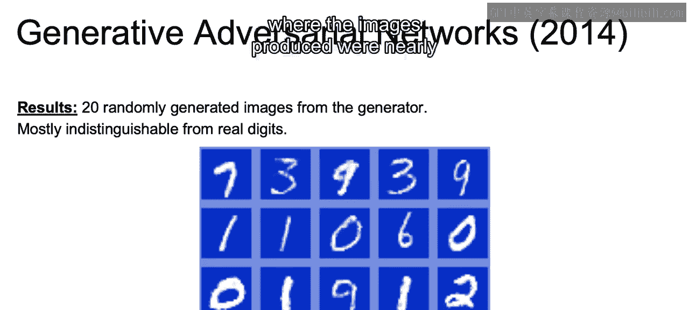
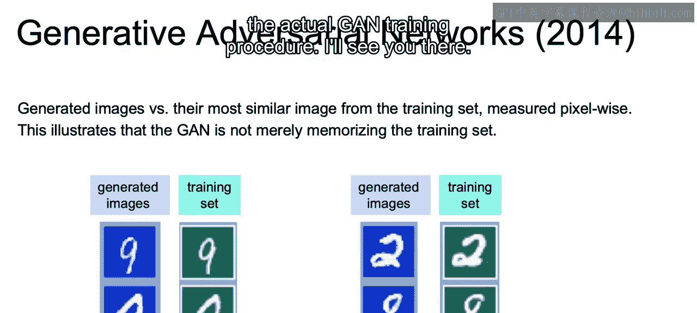

# 108：IBM《机器学习（无监督学习、深度学习和强化学习、毕业项目）｜machine learning》中英字幕 p108 69_生成对抗网络（GAN）简介.zh_en -BV1eu4m1F7oz_p108-

In this next set of videos， we're going to introduce another unsupervised learning and an often more powerful generative model。

 namely generative adversarial networks。😊，Now let's go over the learning goals for this section。

In this section， we'll have an overview of generative adversarial networks or Gms。

 and we'll discuss their origin story as well as the motivation behind why they work。

We'll discuss the actual training procedure for GANS and how we'll use two adversarial networks。

 one for generating classes， and one for discriminating which classes are real。

And then we'll discuss some key hyperparameters that govern howganNs train and whyganNs may be even more sensitive to these hyperparameters compared to normal neural networks。

Now， part of the motivation of GNS is the realization that the means by which neural networks interpret a new example make them vulnerable to adversarial examples。

So a broader example， if you were to think of trying to learn a spam filter。

 and once a neural net has learned what makes an email spam versus not spam。

It then becomes possible using that same network to begin designing emails that look as much as possible like the non spam emails that can trick our actual network。

 and these are adversarial examples。And if we look here at our image and are trying to determine whether or not this is a handwritten image。

If our neural net learned a bunch of handwritten images。

Then it actually knows all the features that make up a handwritten image。

According to that neural network。And therefore， we can replicate that to produce something that according to the neural network。

 will be classified as a handwritten image。Now， we won't get into the math。

But a way that we have learned to generate these adversarial examples。

 such as that spam that looks like it's not spam or nonwritten digits that look like handwritten digits is to take a training set。

And then focus on adjusting our original images in that backward pass in relation to each one of our gradients。

So the invention of GANS was connected to the neural networks' of vulnerability to these adversarial examples。

Researchers were going to run some speech synthesis contests to see which neural network would generate the most realistic sounding speech。

And they would have a neural network， the discriminator。

 to judge whether that speech was real or not。But they decide not to run the contest because they realize with neural networks。

 it would be possible for people to generate speech that were just going to fool this particular network。

 given the way that it would be trained rather than actually generating realistic speech。

The researchers realized they could solve this by having the discriminator continually improve at distinguishing between real and fake speech。

They could have， or they could do this by feeding it real speech alongside fake speech。

 or in other words， introducing their own adversarial examples。

And by incorporating the gradient of the resulting discriminator with respect to the input that loss in respect to X back to another neural network that was actually generating that speech。

They realized that they could train a network to generate very realistic speech。

 and this is the root of our adversarial networks。 we're trying to improve both our generator model so that it creates better fake output。

As well as our discriminary model， which is meant to differentiate real and fake output at the same time。

They are going to be adversarial networks with opposite goals。Again。

 we're going to have that generative model trying to trick the network so that it cannot discriminate between false and true examples。

 whereas we're going to have discriminator working hard to get better at discriminating between the two。

And as both networks try to beat the other， they continue to improve。

So with this in mind。What exactly are GANs or generative adversarial networks？

GANs provide a way of training two neural networks simultaneously。

One of the neural networks works as the generator and learns to map random noise to images with the goal of making them indistinguishable from those within our training set。

So looking at this image， we start off with our generator network。And that starts with an input。

 which is just going to be some random noise。And then tries to create an image indistinguishable from the training set images。

And not the same as any particular image， but rather trying to find similar properties of the image value distributions in that training set。

And then that produces an image which is fed through the discriminator。

 and that discriminator is meant to decipher which images are generated or are fake and which ones are the actual images from our training set。

Now。Going back to Gs in their original paper。Gens was established as a training network in 2014 in a paper by Ian Goodfeelow。

And they showed how they were able to generate new high quality 28 by 28 pixel MIS digits。

 so those MIS digits again are those handwritten digits。

The model relied on simple architectures for both the generator and discriminator。

 where there were no convolutional layers。But rather just fully connected layers and relo activations between each layer。

There was also no dropout and no regularization using either the generator or the discriminator networks。

And the results were what we see here below where the images produced were nearly indistinguishable from the handwritten values in our training set。

And again， none of the images just shown existed in that original data set。

And just to show these alongside the actual training set images。

 we see the generated nine and the generated zero versus that from the training set。

 and then the same for the respective twos and8s that we see here。

Now that closes out this video and the next video we dive a bit deeper into the actual G training procedure。

All right， I'll see you there。

