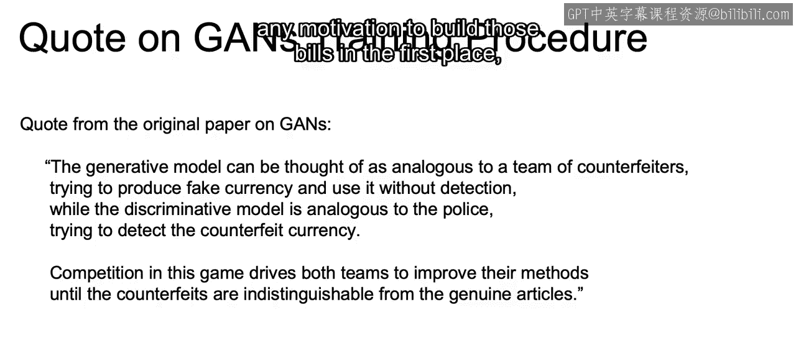
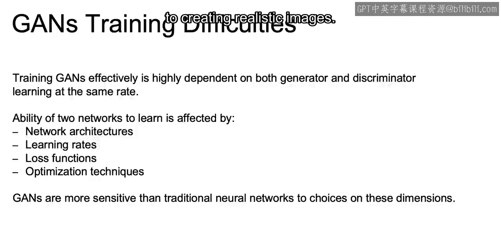
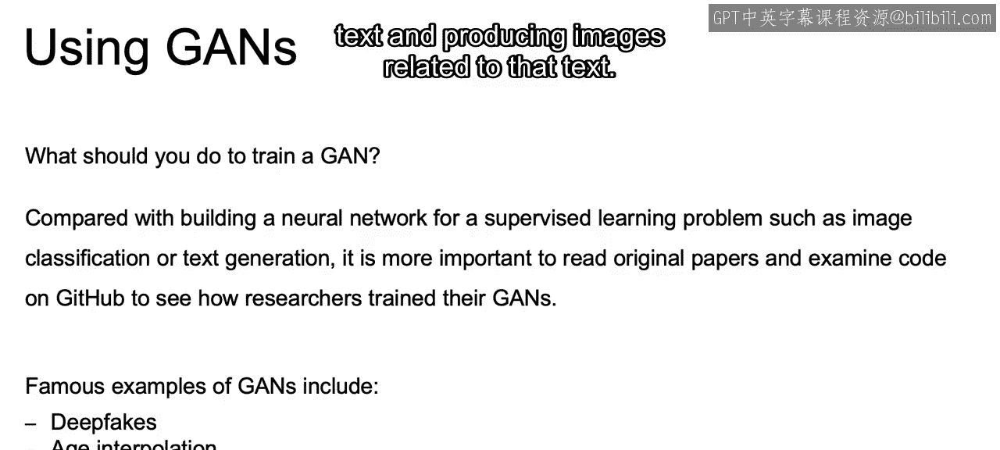
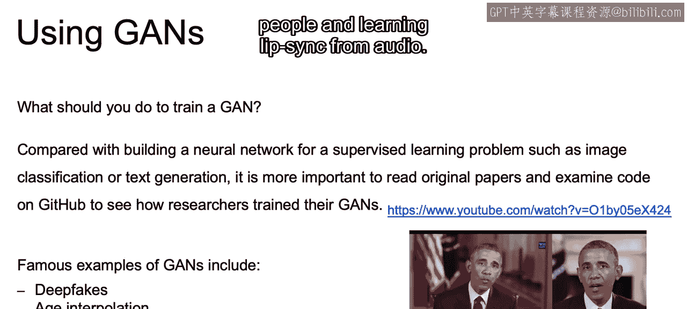
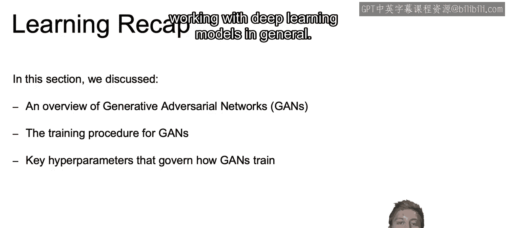

# 110：IBM《机器学习（无监督学习、深度学习和强化学习、毕业项目）｜machine learning》中英字幕 p110 71_GAN训练的问题.zh_en -BV1eu4m1F7oz_p110-

Now I wanted to pull out here a quote from the original paper on GNs。

The generative model can be thought of as analogous to a team of counterfeiters。

 trying to produce fake currency and use it without detection。

While the discriminative model is analogous to the police trying to detect counterfeit currency。

Competition in this game drives both of these teams to improve their methods until the counterfeits are indistinguishable from the genuine articles。

So if we think if the police are too lax， then the counterfeiters won't have any incentive to create better bills。

If the police are too good， then perhaps they won't have any motivation to build those bills in the first place。

So there's going to be this balance that we also want to take into account。Now。

 training Gs effectively is highly dependent on both the generator and discriminator learning at the same rate。

So the ability of two networks to learn is affected by network architectures。

 different learning rates， different loss functions， different optimization techniques。

And in general， GNs are going to be more sensitive than traditional neural networks to choices on any of these dimensions。

So if you think about what I just discussed in relation to the dangers of overfitting。

In regards to that balance when he talked about the counterfeiters and the police。

We know that in regards to overfitting， we now have that compounded by the fact that we are working with adversarial networks with competing goals。

 so if the discriminator is too good for example， wouldn't be able to train at all as fake examples will have too high of an error with the discriminator。

And if the discriminator is too lenient， on the other hand。

 there would not be much learned in respect to creating realistic images。

So what you should be doing。To train gangs yourself。Since GNs are fairly new。

 it'll be that much more important to actually take a deeper dive into the research and original papers on the subject。

 such as Ian Goodfeelow's original paper。And some examples of wheregans are used currently are deep fakes。

 which you may have seen in some spoof videos where you can take an existing photo or video and replace it with someone else's likeness。

Age interpolation or making people in images look older or younger than they actually are。

 and even taking text and producing images related to that text。

And here we have some links and some examples of Gs being used for generating fake images of people and learning lip sync from audio。

Now， just to Ricap。In this section， we discuss an overview of generative adversarial networks or GNs and the idea of how we can leverage adversarial examples to generate more realistic samples。

We discussed the training procedure for GANS and how we use specific loss functions to update the weights of our discriminator and generator networks to optimize our model。

Then finally， we discuss some key hyper parameterss that govern how GNs train and how we need to be careful when fine tuning them due to the problem of stability with working with both generator and discriminators within the same network。

Now that closes out our video here on GANS， in the next video we're going to discuss some other topics that you should be aware of when working with deep learning models in general。

