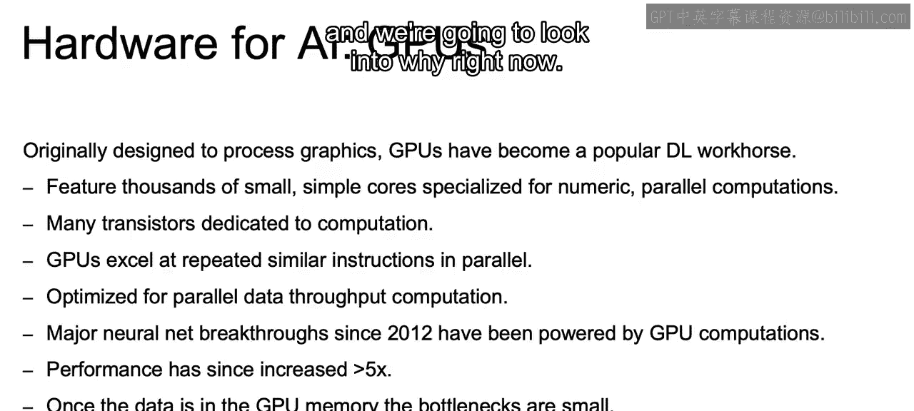
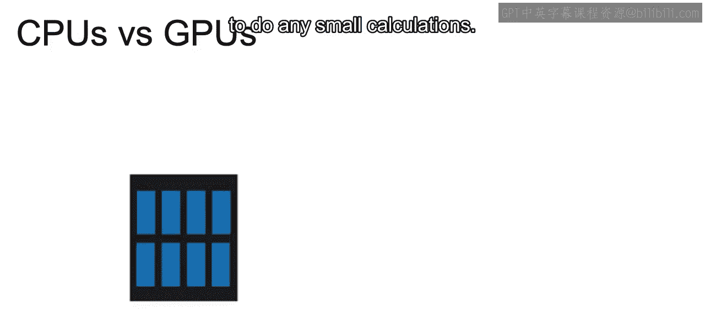
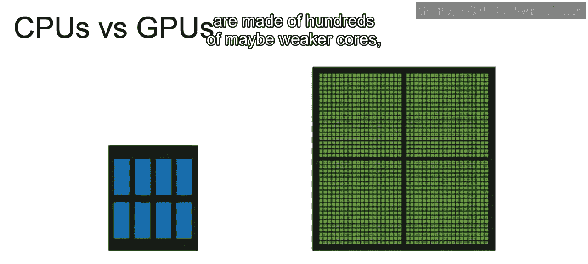
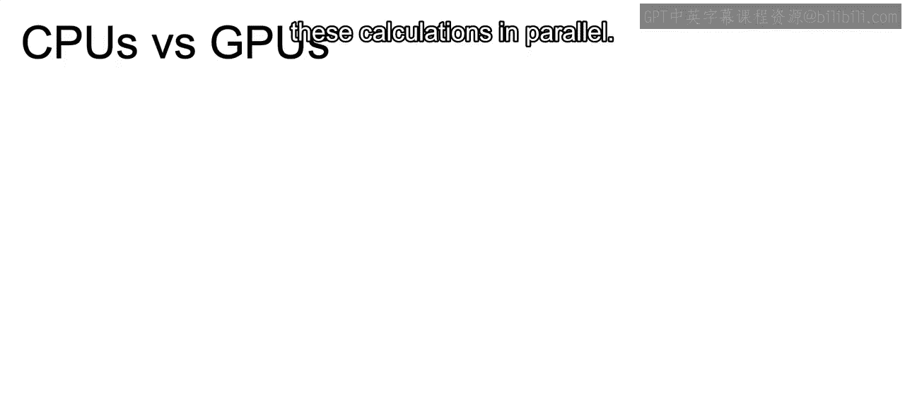
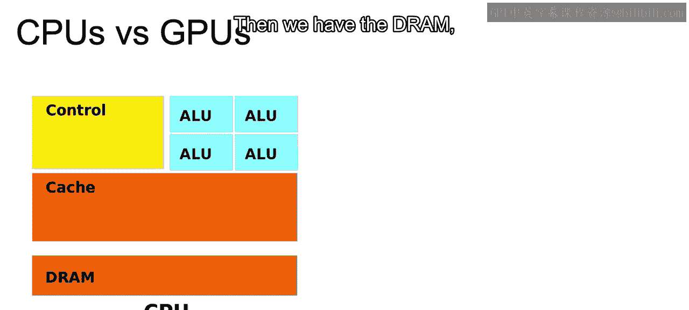
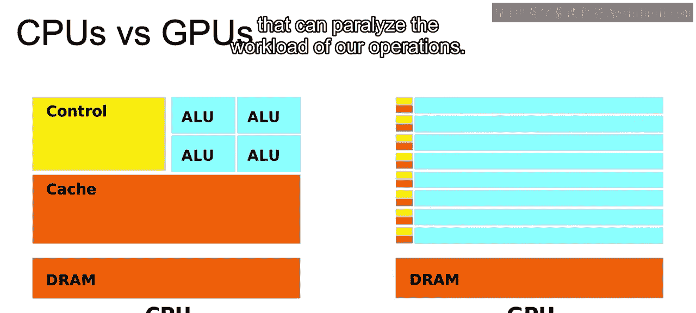
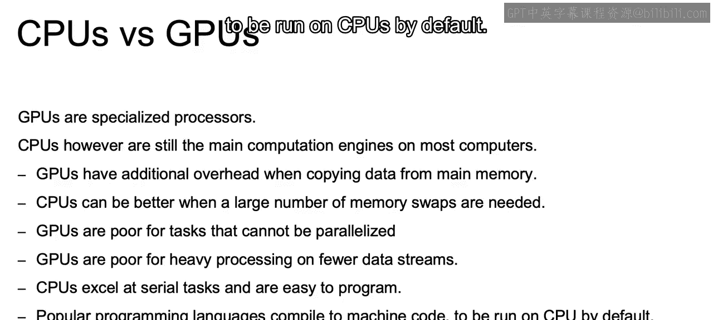

# 111：IBM《机器学习（无监督学习、深度学习和强化学习、毕业项目）｜machine learning》中英字幕 p111 72_深度学习的其他主题.zh_en -BV1eu4m1F7oz_p111-

In this video， we're going to touch on some final additional topics that we should be aware of when working with deep learning models。

Now let's go over the learning goals for this section。

In this section we're going to discuss computational issues and with that specialized hardware when working with these deep learning models。

And then finally， just to ensure that we have the interpretability of our models。

 we're going to briefly touch on locally interpretable model explanations or limes to help us gain some interpretability when working with these deep learning models that are generally more on the black box end of a model。

Now we're going to jump right in here to hardware for artificial intelligence， specifically GPUs。

Originally GPUs were designed to process graphics， and GPUs have become a popular deep learning workse。

Reasons being that they feature thousands of small， simple cores specialized for numeric。

 parallel computations。There's going to be many transistors dedicated to computation。

The GPUs excel at repeated similar instructions in parallel。

GPUs are going to be optimized for parallel data throughput computation。

And major neural net breakthrough since 2012 have been powered by these GPU computations。

With that performance with GPUs has since increased by more than 5 x， what we talked about in 2012。

And once the data is in the GPU memory， the bottlenecks are actually very small。

And if you're looking for a popular GPU on your own， VD is a very popular GPU used for deep learning。

And just to highlight the main takeaway from all this is that GPUs are great at parallelization。

And we're going to look into why right now。

So the CPU is only made of a couple dozen cores， where cores are the powerless CPU to do any small calculations。

Whereas JeU， on the other hand。Are made of hundreds of maybe weaker cores。

 but they're able to run all these calculations in peril。

So looking at the CPU and the breakdown， we have the ALU or the aritic arithmetic logic unit。

 and that's a portion that can execute simple arithmetic and logical operations。

We have control and control here is to decode instructions into commands and calls on that ALU to perform the necessary calculations。

We have here the cache， which serves as high speed memory where instructions can be copied to and retrieved。

And then we have the DRA。

Which is for more longer term memory。And then if we look at this breakdown for the GPUs and all the colors should fit accordingly。

We see that for the GPUs， we spread out the control and cache and they're much smaller for each portion。

 and for each we have a ton of ALU units that can paralyze the workload of our operations。

Now GPUs are specialized processor great for specific tasks such as gaming and deep learning。CPUs。

 however， are still going to be the main computation engines on most computers as they are much more versatile。

Now， some differences between the two will include that CPUUs have dozens of cores。

 whereas GPUs have thousands of less powerful cores。Which allows for high parallelization。

But for GPUs， if tasks are not being paralyzed， this may not work as efficiently as CPUUs。

CPUs are going to have fewer ALUs。And a lower compute density than GPus。

 And we saw this in the image in our prior slide。CPUs are lower latency and have larger cache memory。

 so compared to GPUs， they can make data more immediately available to our users。

GPUs are designed for parallel tasks， which is incredibly powerful for high amounts of major computations such as what we have in gaming and deep learning。

GPPUs in general will perform well for a single instruction performed over a large amount of data that can be paralyzed。

 whereas CPUUs will perform better for a wider variety of tasks that don't use as much data and don't require as much parallelzization。

Now again， GPUs are specialized processors。And CPUs， however， are again。

 still that main computation engine， so a bit more on that。

GPUs will have additional overhead when copying data from the main memory。Compared to CPUs。

CPUs will be better when a large number of memory swaps are needed as they have more efficient memory units than GPUs。

GPUs are poor for tasks that cannot be paralyzed。As mentioned earlier。

 that is really the specialty of GPUs being able to paralyze in general。

GepUs are poor for heavy processing on fewer data streams。

 it's really better for those larger data streams。CPUs excel at serial tasks and are easy to program。

 so when there is some type of ordering to the tasks to be done and parallelization isn't leveraged。

 CPUUs will usually outperform GPUs。And finally， most popular programming languages will be compiled will compile to machine code to be run on CPUs by default。

