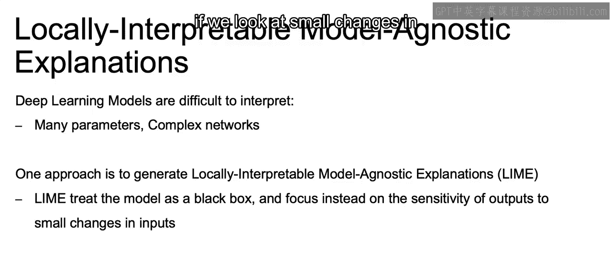
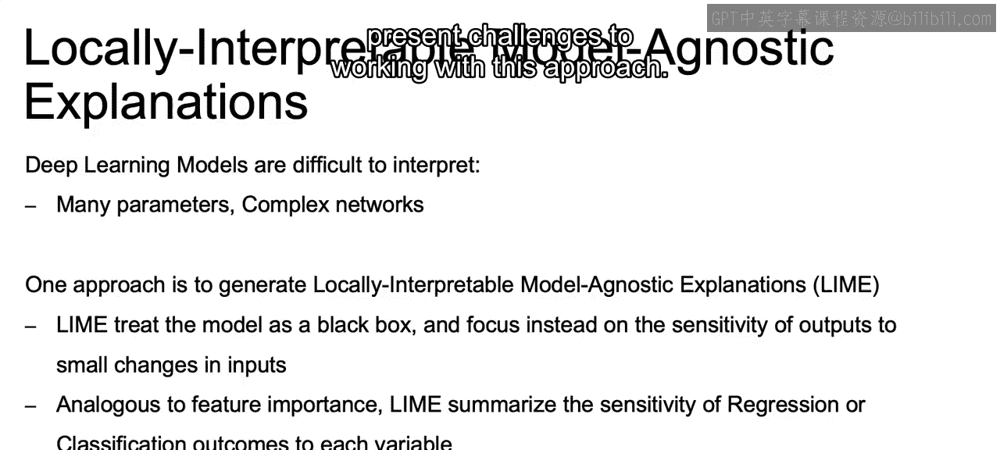
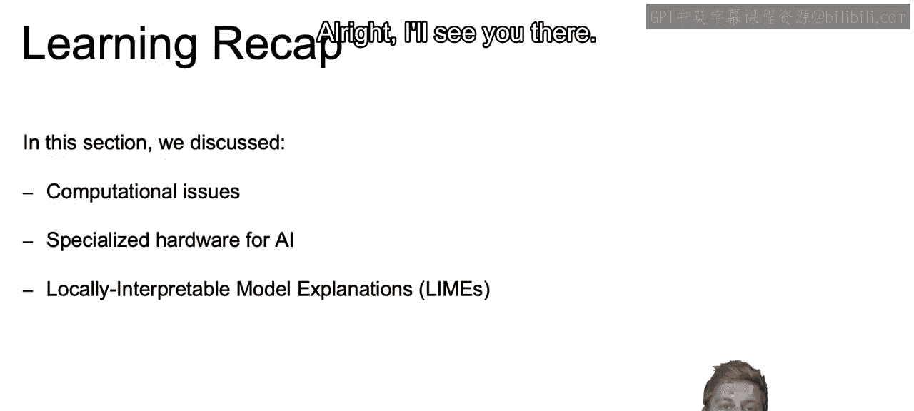

# 112：IBM《机器学习（无监督学习、深度学习和强化学习、毕业项目）｜machine learning》中英字幕 p112 73_模型可解释性AI.zh_en -BV1eu4m1F7oz_p112-

Now， on a different note， because this is just some topics in regards to deep learning。

Deep learning models in general are difficult to interpret。

There are going to be many parameters and complex networks and connections within any one of our deep learning models。

So one approach is to generate locally interpretable model， agnostic explanations or a align。

And Lyme treats the model as a black box and focuses instead on the sensitivity of outputs to small changes in the inputs。

So we'll test how well simpler models will perform if we look at small changes in feature values for specific samples。

This will be analogous to feature importance in this respect that Lyme will summarize the sensitivity of regression or classification outcomes to each one of our variables。

And it will lean on linear models to produce the feature importance。

 and thus nonlinearities and variables that cannot be perturbed or can't be changed。

 such as say binary variables that can really only take on values of  zero and1 and can't just be perturbed slightly will present challenges to working with this approach。

So to briefly recap。We discuss the computational issues on working with deep learning models and how we may want to use GPUs versus CPUUs。

 depending on the model that we're building out， and we also even touched on why it's important that CPUs are still being used in our current computers。

Then finally， we closed out with the locally interpretable model explanations and discuss how we can use that in order to dive deeper into a model。

 pertuurrbing some of our examples in order to understand some of the feature importance within our deep learning models。

Now that closes out our video here in our final video。

 we're going to discuss reinforcement learning All right， I'll see you there。

