# 113：IBM《机器学习（无监督学习、深度学习和强化学习、毕业项目）｜machine learning》中英字幕 p113 74_强化学习（RL）.zh_en -BV1eu4m1F7oz_p113-

In this video， we will provide a high level introduction to reinforcement learning。

Now let's go over the learning goals for this section in this section we're going to cover an overview of reinforcement learning at a very high level。

We'll have a discussion about the understanding bit of the approaches and implementation for reinforcement learning。

Then finally， we'll introduce reinforcement learning implementation using Python。

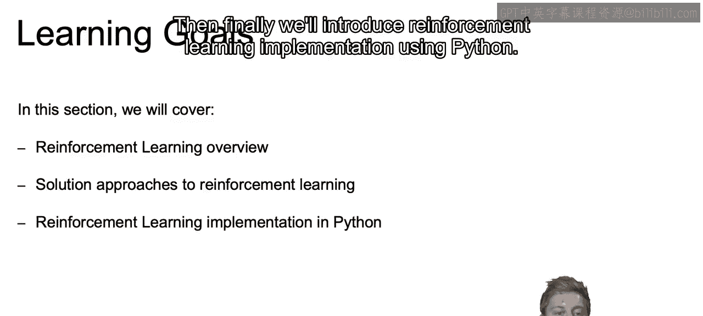

So let's start off with a reinforcement learning overview as we promised。

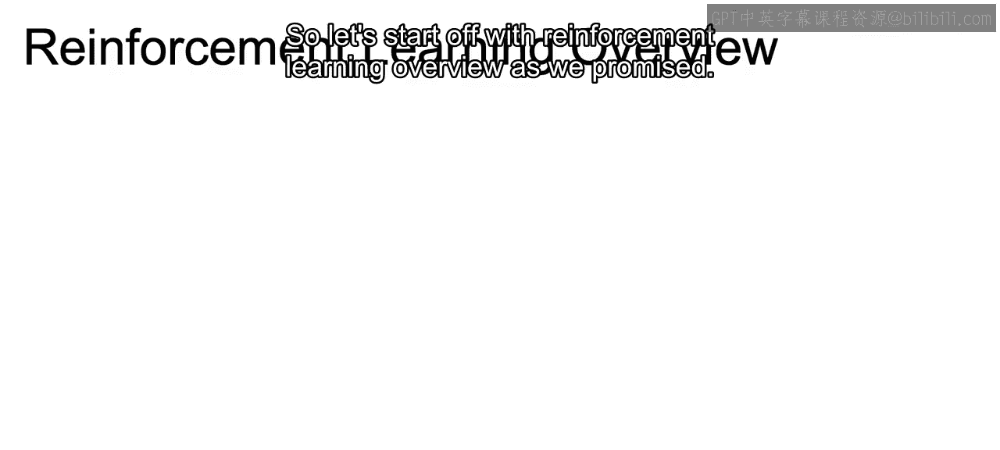

Now in reinforcement learning， the idea is that agents will be interacting with an environment。

And agents then are going to be the thing that ultimately takes the action。

 So if you think in regards to games which are very popular for reinforcement learning。

 Currently this would be the actual player。 if we were thinking through a model that was meant to figure out。

 for example， where to place ads on a web page， the agent would just be that program that makes the decision where the ad will be placed。

And the environment。Is going to be the world through which our agent moves。

 So if you're playing games such as chess， this would be the actual chess board for' thinking something like ads on a web page。

 this would be the entire web page。And they choose from a set of available actions。 and again。

 using the game example， this would be all possible moves that an agent or player can make in our game In our ads example。

 this may be either adding an ad， removing an ad or take an option of neither removing or adding an ad from the current page。

And the actions that we take are going to impact the environment。Which， in turn。

 impacts the agents via rewards。 So when an action is taken。

 we have impacted the environment where our agent exists。

 So if you think if we move a piece in our game， we have adjusted the environment of our game。

If our move resulted in us getting more points or winning the game。

 this would be an example of our award。And our system would learn that the actions taken were good actions。

And similarly， for ads example， our award could be a result in increase in clicks or increase in revenue。

Now， something to note is that rewards are generally unknown and must be estimated by the agent。

 so oftentimes it will take many steps to reach towards that reward stage of your game if that's just to win the game or to get to a certain place within the game。

So think for any game of any kind， oftentimes it'll take multiple moves before you get any type of reward。

And this process again repeat dynamically so agents continuously learn how to estimate rewards over time。

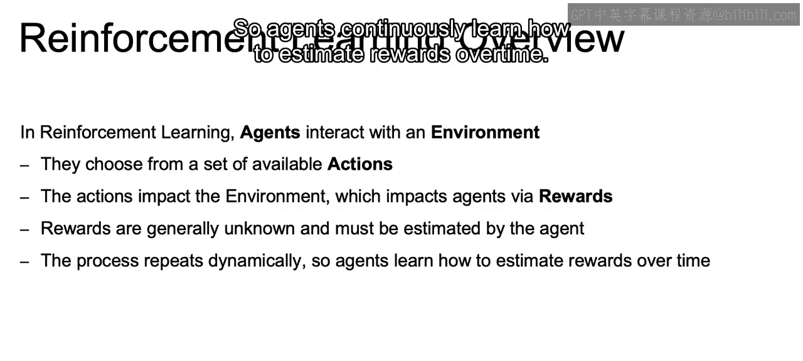

Now， advances in deep learning have led to many recent reinforcement learning developments。

For example， in 2013， researchers from DeepMd developed a system to play Atari games and actually beat humans in Atari games。

And in 2017， the Alpha Go system defeated the world champion in Go。 So for the first time。

 the machines were able to beat a human champion in a complex game such as Go。

 using reinforcement learning。

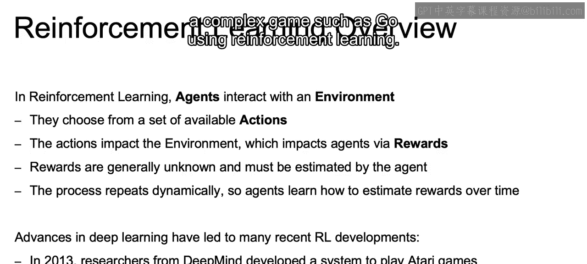

Now， in general， reinforcement learning algorithms have been limited due to significant data and computational requirements。

 So if you think about the infinite number of possibilities at every juncture。

 if you're adjusting for every person that visits your site or even for games。

 which is the example that has proven to be successful。

 But the reason why it's taken so long is that you think about something like go or chess。

 the infinite amounts of moves that anyone can make。

 along with the following move and reaction to those moves。😊。

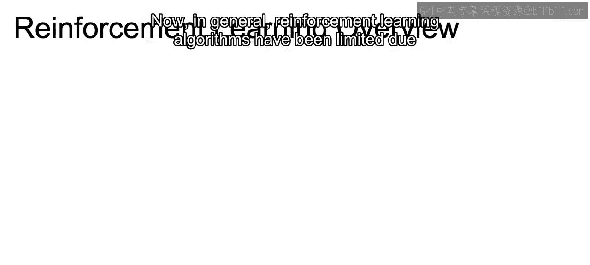

It lead to us needing a lot of data to train our reinforcement learning models。Now， more recently。

 progress has been made in areas with more direct business applications。

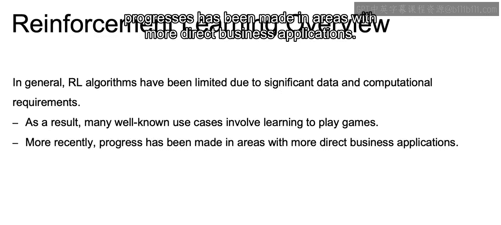

And examples include recommendation engines where recommending correctly could perhaps be a reward marketing with higher revenues or higher clicks。

 again， being that reward mechanism and automated bidding if you are able to optimize the amount spent or paid per an item and setting up some reward system in that sense as well。

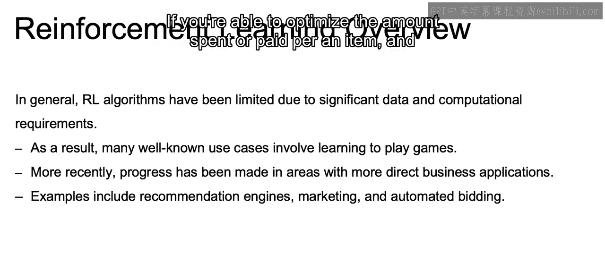

Now the idea here。Is that the agent， again， if you think about reinforcement learning。

 the agent takes an action。That action affects the current environment。

And then feedback from that environment is passed back to the agent in terms of a reward。

 so if it resulted in a positive results in relation to our reward system。

 the agent's actions are then reinforced。And then vice versa for negative results。

 if it ended up in a bad state， then the agent is reinforced not to take those same steps。

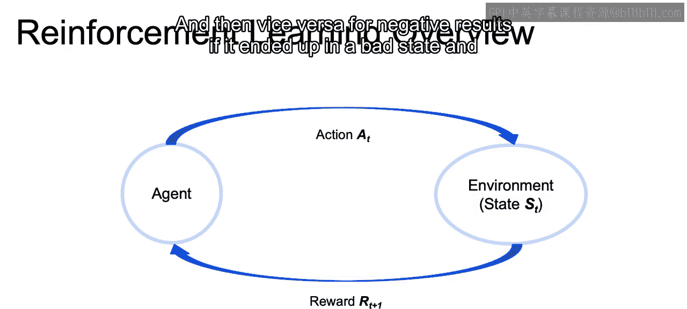

Now， reinforcement learning problems will vary significant。

And solutions represent a policy by which agents choose actions in response to the current state。

Or in other words， since this is not directly supervised learning。What takes our input？

And comes up with the resulting action is the policy。

 and that is what we ultimately try and optimize whatever that policy is defined as。

And agents typically work to maximize expected rewards over time。

And this differs from typical machine learning problems because unlike with labels。

 rewards are not known and often highly uncertain， we may not know at every juncture whether actions resulted in immediate rewards or even if it did。

 if those intermediate rewards will lead to our larger goals of our network。

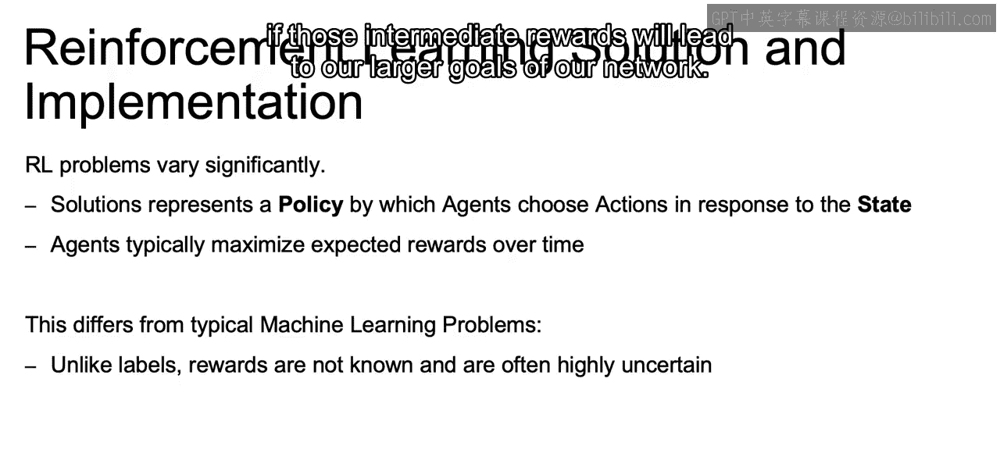

Whereas with typical machine learning problems， the solutions remain static。

With reinforcement learning， as actions impact the environment， the state changes。

 which continuously changes the problem that we are working with。Then finally。

 agents face a trade off between rewards in different periods。

 again pointing to this uncertainty that revolves around this reward system。

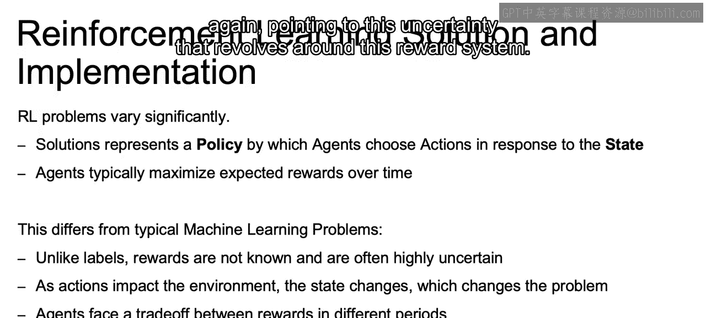

Now just a quick introduction， we will get into a notebook， but in Python。

 the most common library for reinforcement learning is going to be open AI gym。

So we're going to want to import our gym library。To create an environment we call gym。

Make and there are actually some environments that are going to be available to us according to the strings that we pass and we'll see this in the notebook so that we can specify the game or environment that world in which we are living。

And then end dot render now that we've created that environment object will show the current state of our environment。

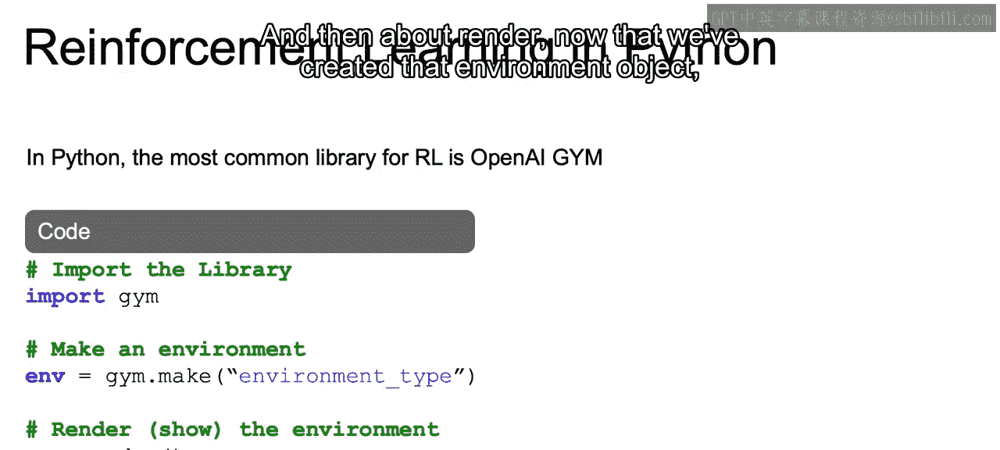

Now， just to recap in this section， we discuss reinforcement learning overview with an understanding of that feedback loop。

 where the goal is for an agent to interact with the environment。

 to choose from a set of available actions to increase possible rewards。

And those rewards lead to reinforcement of those actions within the environment。

And we discuss how solution approaches to reinforcement learning relied on the policy by which agents chose actions in response to the given state。

 and as those actions impact the environment， the state changes which changes the problem we are currently working with。

Then finally， we closed out with a quick introduction to reinforcement learning。

 implementation in Python， which we're going to go into further in our final notebook。

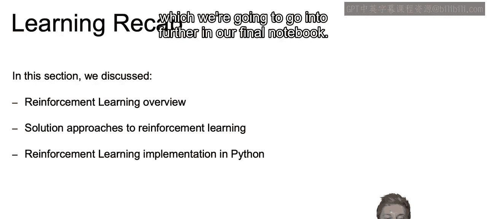

