# 114：IBM《机器学习（无监督学习、深度学习和强化学习、毕业项目）｜machine learning》中英字幕 p114 75_RL笔记本（选修部分）第1部分.zh_en -BV1eu4m1F7oz_p114-

Welcome to our notebook here on reinforcement learning。In this notebook。

 we're going to use the library Open AI gym， which you can install using PIip install or following the instructions that we have linked here。

Some key concepts that we should be aware of before we get started with AIGin are the idea of an observation。

 and that's going to be the current state of the game。

And that will describe where your agent currentlyly is within that environment。

 within the world of the game。There's going to be actions and those are the different moves that the agent can make and we discuss that in lecture。

There're going to be this idea of an episode。And one full game played， we're just playing games here。

 one full game played from the beginning， which we initiate with environmentment。

 reset until the end where done equals true is going to represent a single episode and we'll see this clearly as we walk through the actual examples。

And then the step is the part of the game that includes one action。

 so that's just one specific action and the game transitions from one observation where you currently are in the game to the next。

 where you will be after that action is taken。

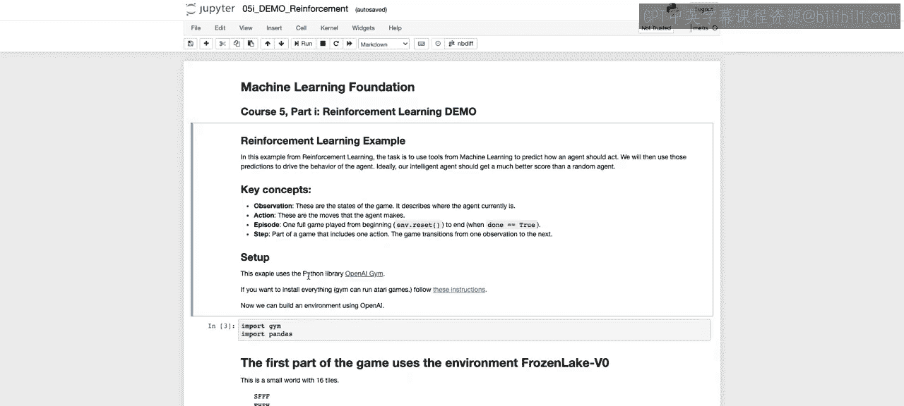

So we're going to import gym and we're going to import pandas as we'll use that as well。

And we're going to play this game using the environment frozen Lake。V0 here。

 line zero for frozen Lake。And if you're curious， I'm going to load it up in just a second。

 there's going to be a lot of games available in the open AI gym and you can click on this link that we have here。

And that will allow you to look at what goes into each one of the different environments。Now。

 this environment， the goal of the game。Is that you start at this S portion？

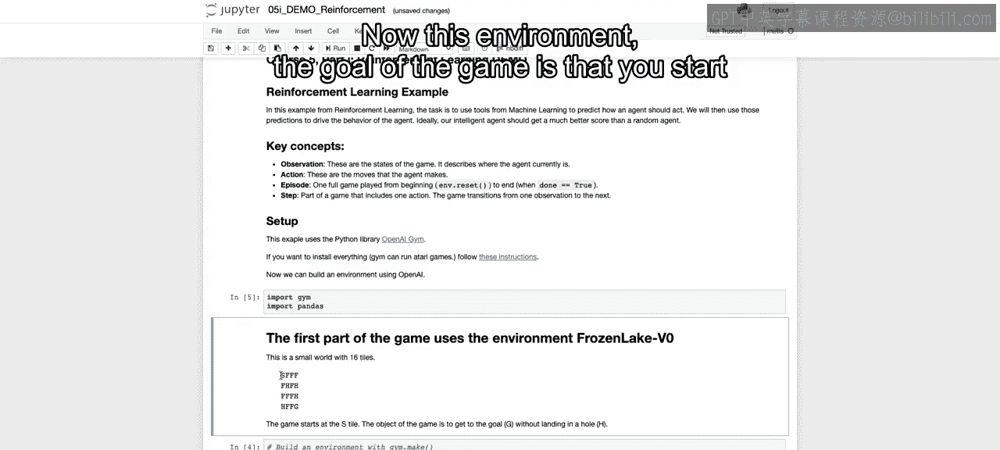

And you try to make it to the G here at that end。

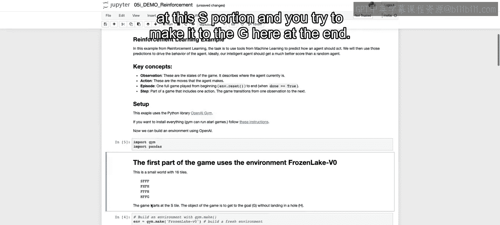

So you see， the object of the game is to get to the gold G without landing in any holes。

 So the idea is that you're walking across some frozen pond。And you can go into the frozen portions。

 and you should be fine。 But if you step on an H， if you step on a hole。

 then you will fall into the hole and you lost the game。

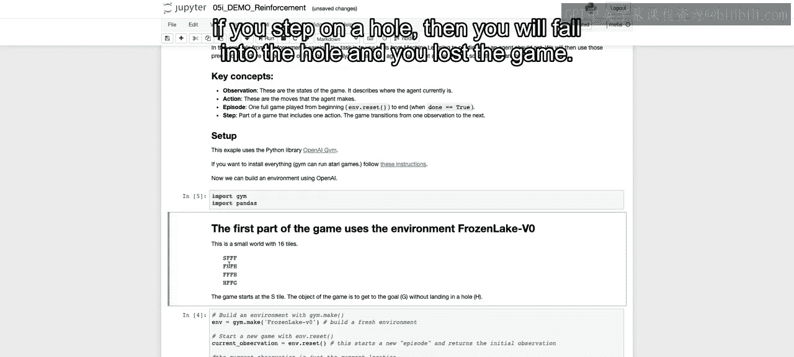

Now， built into that and we'll discuss this a bit later。

It's not going to be that you can always necessarily go in the direction that you're trying to go。

 if you choose to go to the left， down， right or up， you may， by some small probability。

 end up going the wrong direction and falling in a hole。

 So we have to take that into account as well。 And that's going to be what we're trying to learn in terms of the probabilistic。

 best path to take。 Otherwise it would be obvious where to go in order to get to G。

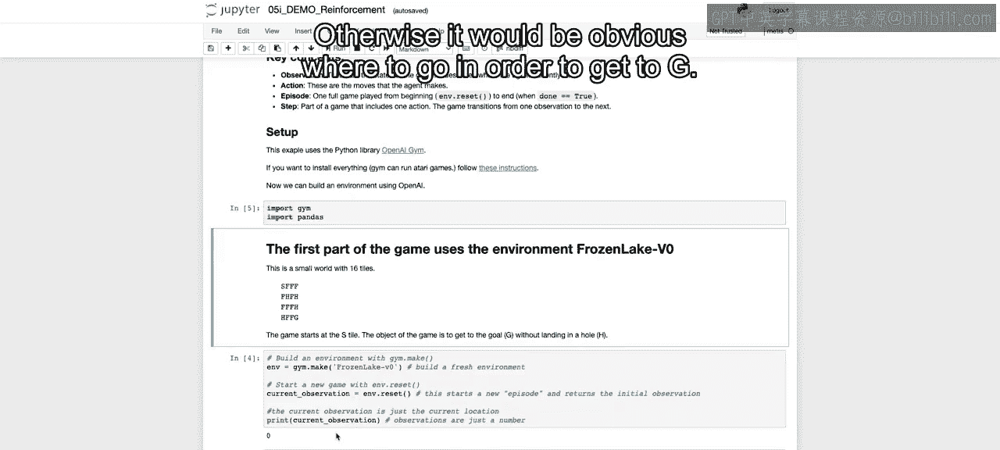

So we're going to create our environment by callingG。tMake and passing in this string frozen link V0。

 and there's going to be a bunch of environments that are available within the gym and again you can look at the documentation in order to get to this。

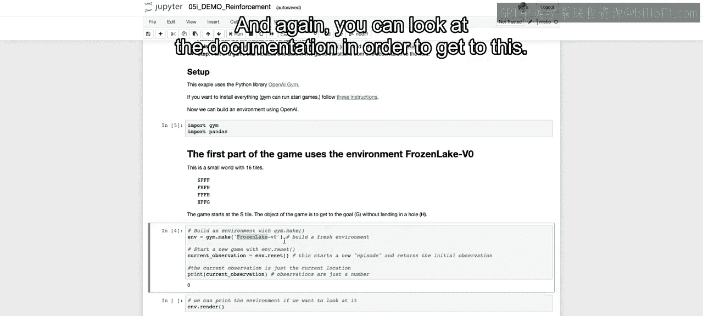

We're then going to get our current observation。And when we call environment。reset。

 what we're doing is we're resetting that our values so that we are starting at that starting point at S。

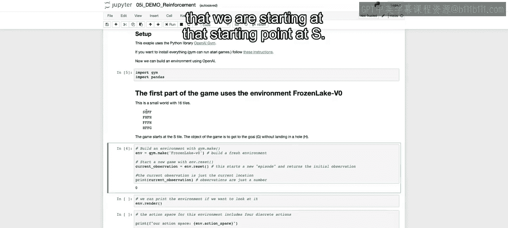

And we'll see that current observation in just a second， we print that out。

 and we see that we're at observation zero and zero should indicate that we're at the beginning of our process。

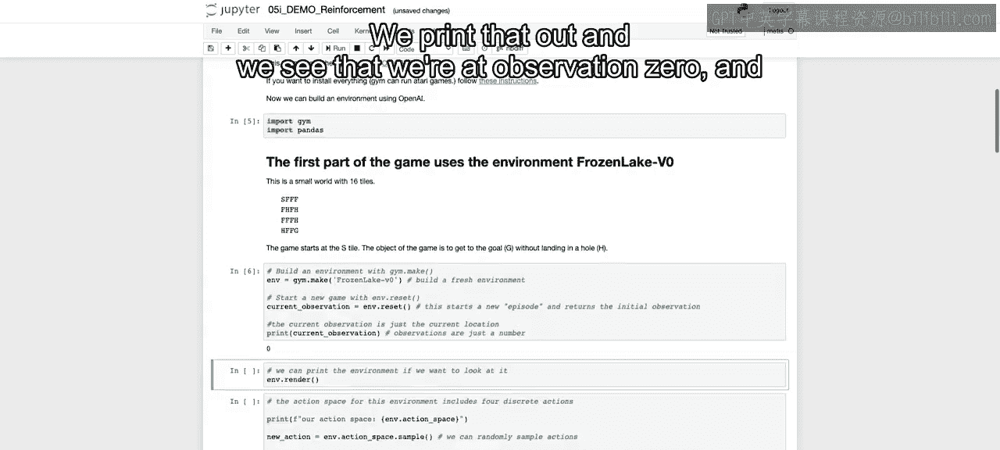

Now。I want to look a bit deeper into what our environment actually is。 I'm going to call environment。

 which is the environment we just initiated， the environment for this specific environment。

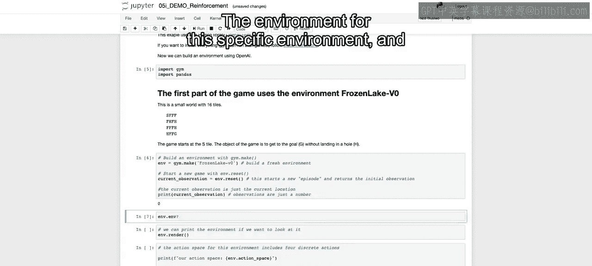

And look at the documentation。And in the documentation， we can see more about the game。

 So you read here that winter is here and you and your friends were tossing around to Frisbee at the lake at the park when you wild throw left of Re out in the middle of the lake。

😊，And the goal is to get to that Frisbee and they have a cute story here about the water is mostly frozen and there's a frisbee shortage so you need to get to that disk。

 but the ice is slippery so you won't always move that direction that you intend。

 which I mentioned earlier。And the surface is described using the grid that we have here。

Where again S is that starting point， F is the frozen surface， H is a whole。

 and G is the goal that you're trying to get to。

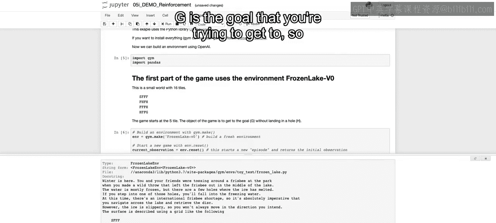

So that's how this game actually is going to work。If we want to look at the actual environment。

 whether it's this game or another， we can look at our current environment。

 where that orange highlight indicates where we currently are， what is our current state。

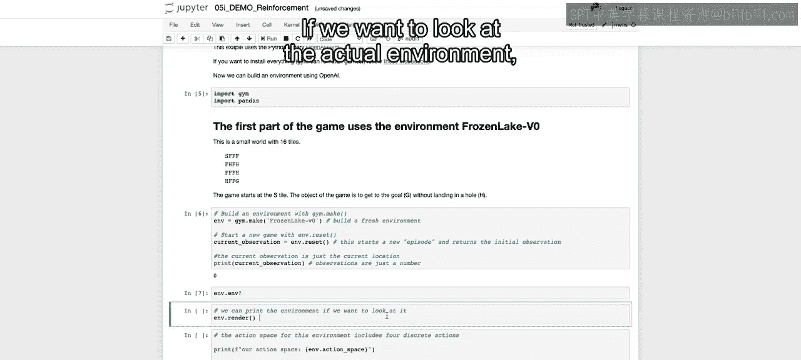

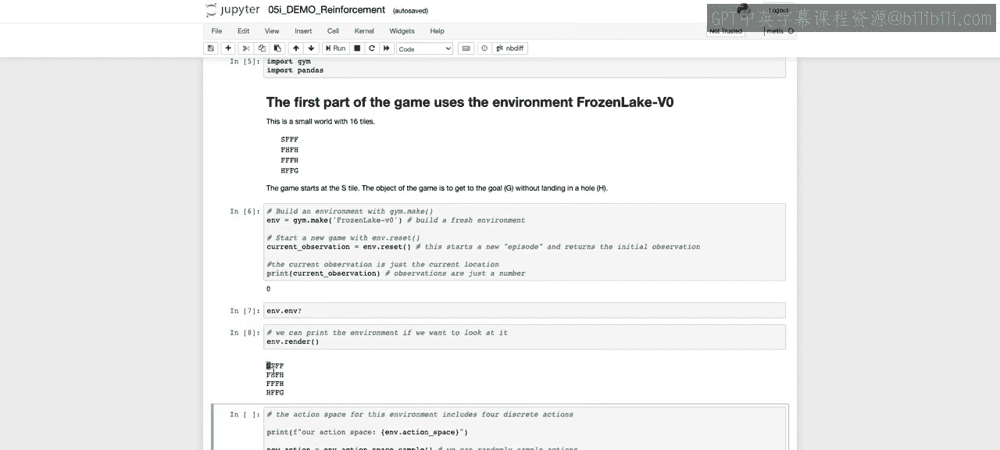

So I'm going to print out our action space and the action space will include four discrete actions that we can take It'll just say here we'll print this out so we can see it just says here discrete4 but that describes that we can go up down。

 right or left。

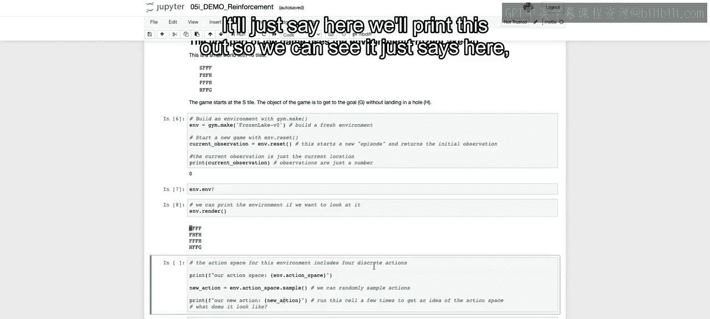

And then if we want to take an action。What we can do because we don't know which actions to take。

 we can take a random action， so we go environment do action space。

 which is that attribute we just pulled out and we pull out this method sample it just randomly chooses moving。

Up down right or to the left。 And each one of those different directions are going to be indicated by some number。

 And we see here on that first try that randomly we took the third direction or actually the fourth because Python starts at 0。

And I can run this again， still at three。And I run this again。

 and we see that it chose a random different sample of one。

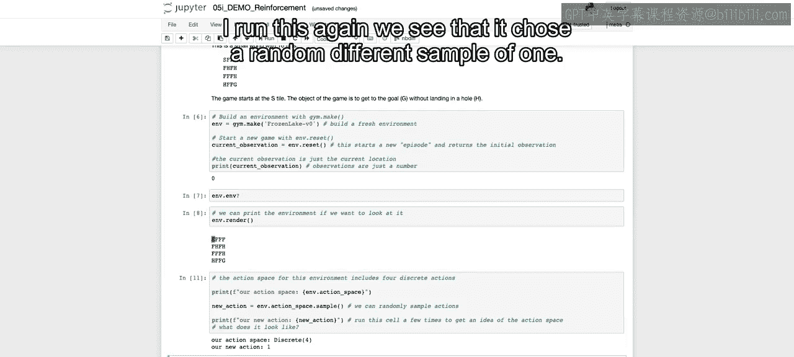

So now let's act， let's actually take this action。So our new action is equal to。

That sample that we're taking。So we're going to move up down right or left。

And then we take a step and that step's going to indicate actually taking an action within our environments。

And we're going to take a step in the new action direction。And that will output this tuple here。

And we're saving these as observation， reward， whether or not it's done in some extra information。

And we'll discuss this a bit further later on， we're actually going to print them out right here and we can take a look。

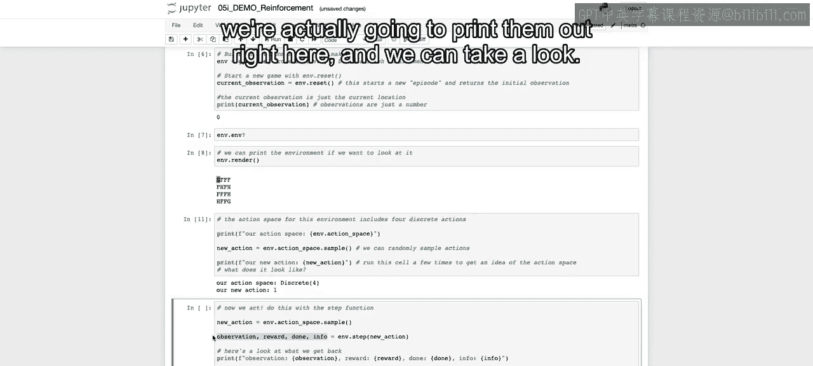

So we see that the observation we cell observation0。 there's no reward。

 We only get a reward for getting to the end of the game。Are we done with the game no。

 and then there's this extra information， something about probabilities in regards to the steps that we're taking。

So if we run this again， we see that we now took a different step and now our state is different。

Our orange square is now below。 Again， our reward will still be 0 because we haven't reached the end of the game。

 Are we done， No， and that same information holds in regards to those probabilities。

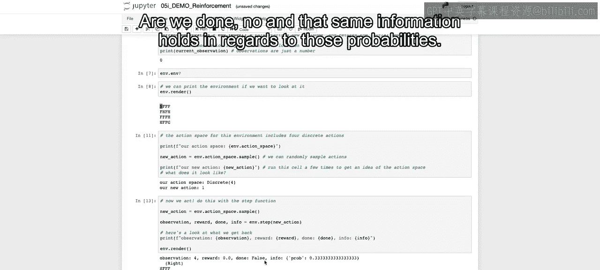

Now we're going to take five different moves。So for I range 5。

 we just continually do what we just did and we're going to print out at each one of these steps。

What our observation is， what the reward is， whether or not we're done， that extra information。

 and then we're also going to render the actual state， the actual environment at each step。

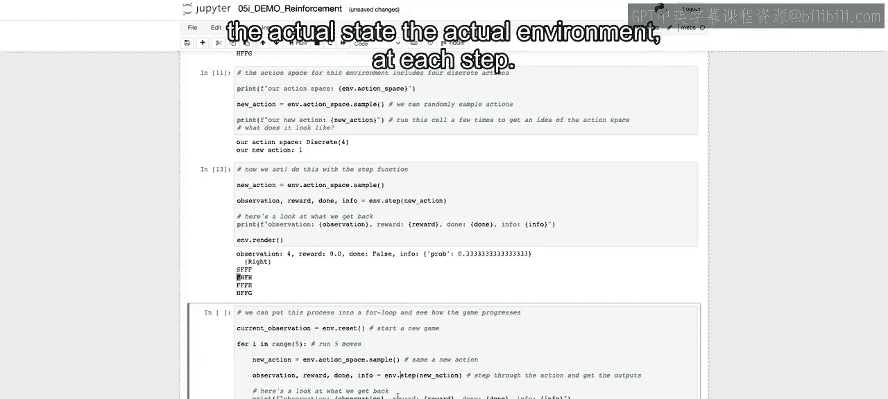

So we see we moved down， then we moved down again， then we moved up。

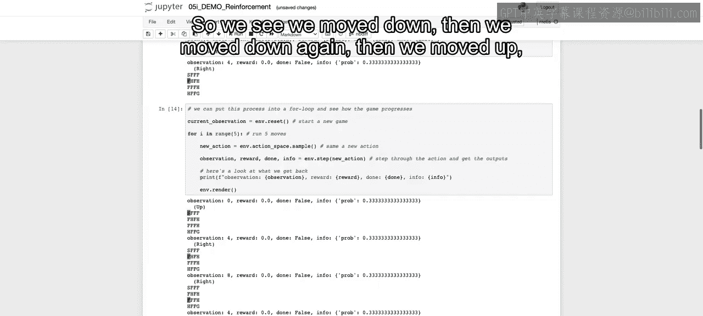

Went to the right， and we see that we made each one of these moves throughout。 Again。

 the move isn't necessarily indicative of where we end up。

 There's a probability that we go in a different direction， and we have to take that into account。

The reward stays at zero unless we reach the end of the game。And here it says done。

 and the reason why we're done is because we hit a hole。And if you hit a hole。

 then your game is over。then you have lost the game， the game's over， you get zero award。

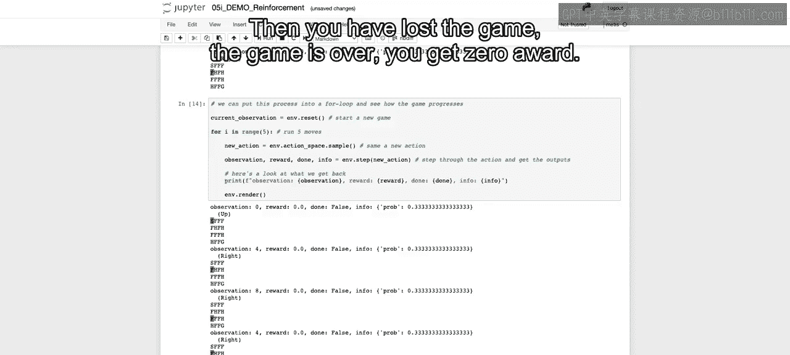

So that's why we have done actually equal to true here。

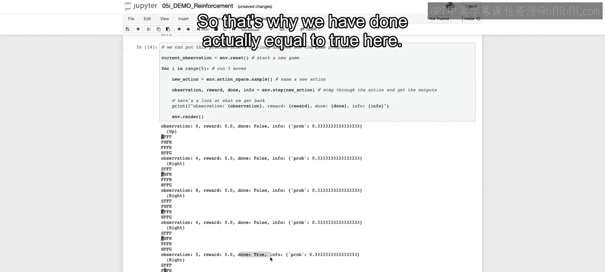

Now， hopefully we have a clear idea or a guess as to what each one of these outputs mean。

 given that our observation starting off was zero， then it moved to four。As we see here。

 But if we think about those observations， it would make sense that we start off at 0。

 and these are the numerical values for every single state within our environment。 So 0，1，2，3，4，5，6。

 And we see this is 5。

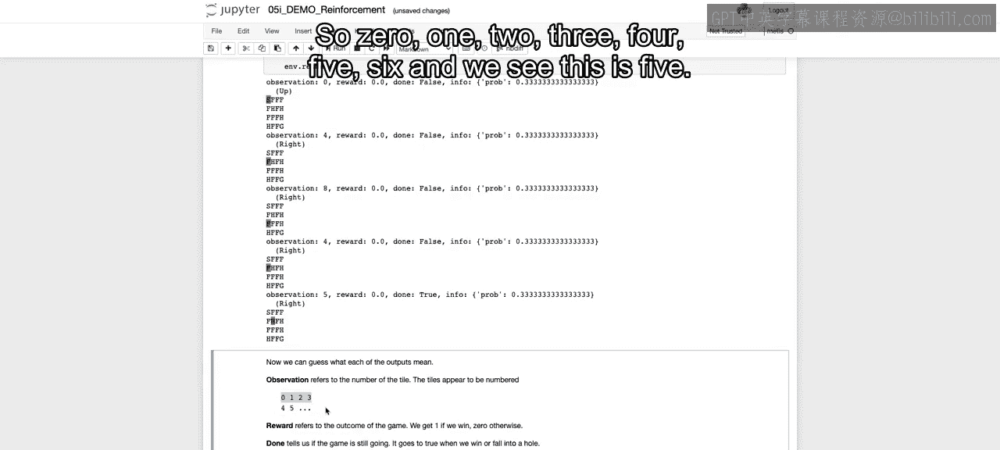

And that's observation 5。The reward refers to the outcome of the game and we only get a one if we're at that G。

Done tells us if the game is still going and again。

 that game ends either at G or once you land in a hole。

Then the info gives us extra information about the world。 And here its probabilities。

 And we ask you to perhaps guess what this means here， and we'll talk about this a bit further on。

 But again， it's the idea of there's some type of probilistic determination rather than just a clear determination in regards to each step that you're going to take。

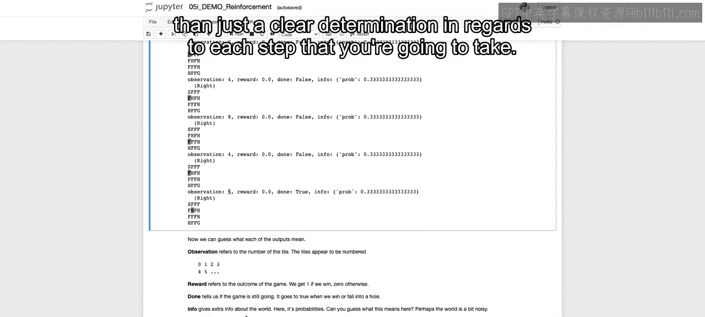

So now we want to simulate an entire episode。So again。

 we described an entire episode as a game that's played from start to finish。

 whether you land in a hole or if you land at G。So we start off at the current environments。

 current observation being at zero by resetting our environments。

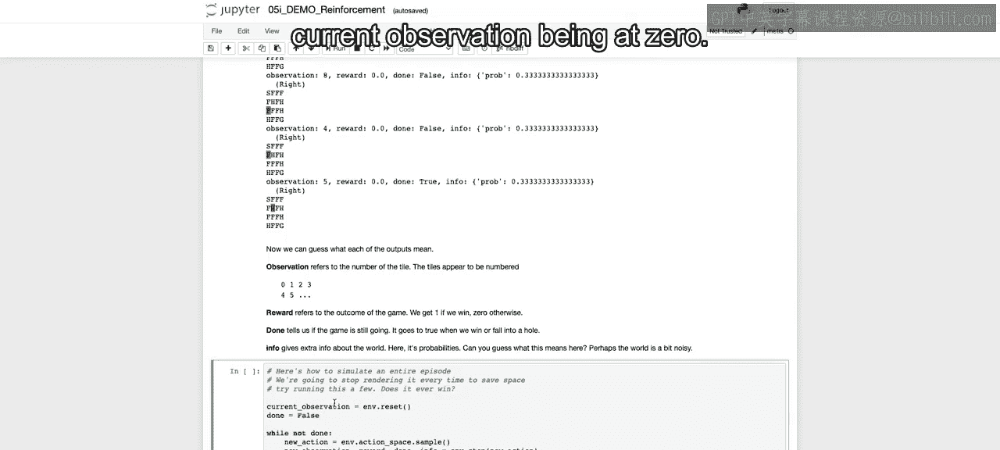

We know that done is equal to false to start off。

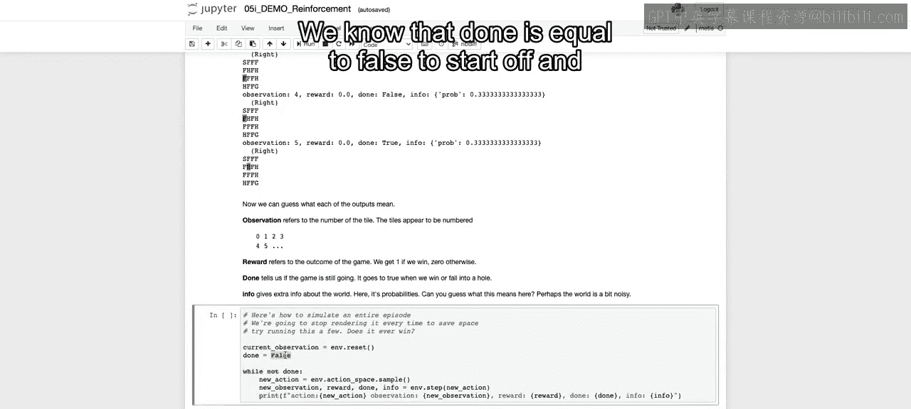

And while that's false。We set that new action equal to the sample。We then take a random action。

And we keep doing this again since we have this while loop until done is set to true。

 And each time we run this， we're going to print out the new action， the new observation， the reward。

 whether or not we're done and that information。 So we run this。

And we see each one of the actions taken。The observations where we ended up。 And then finally。

 we ended up again at that observation 5。Which is the same hole we fell into before。

 and our game ended。

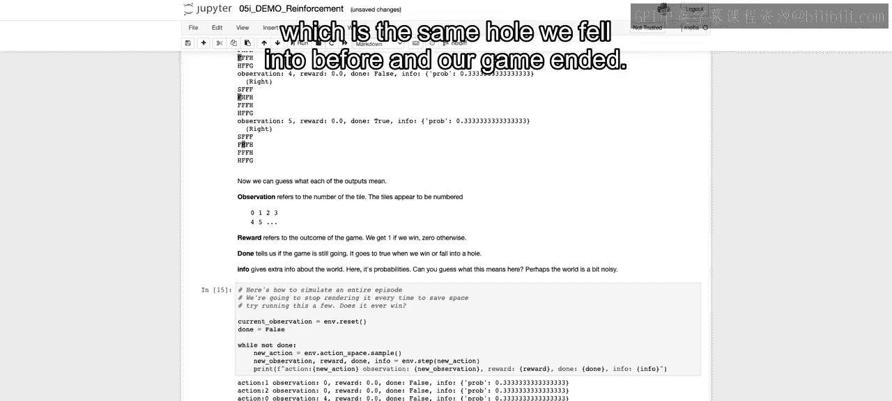

So some things to notice about the actions taken。And where we ended up。If we look at。

Some of the actions。And where we end up， so we see here action0 at observation 4。

 but we ended up at observation 8， whereas here we were back at observation 4 and we took action 0。

 and we stayed that observation 4。 So there's a probability that we don't end up actually taking that same action。

 or ending up in that same state， given that we took that same action。

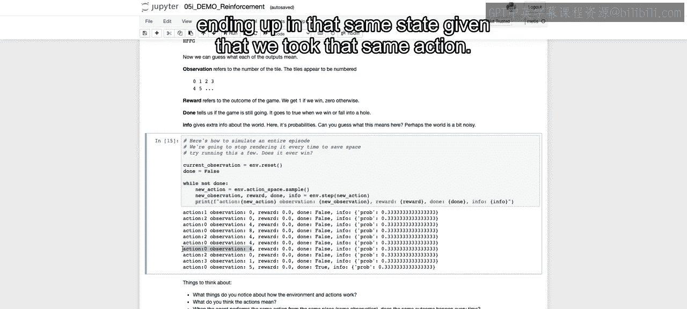

And。If we think about it， action seems like， again up down left or right。

 but they also have some type of stochastic term built into that。

 and there seems to be a one third chance of going into a different square rather than the square that you're trying to。

 given that you chose a certain direction。

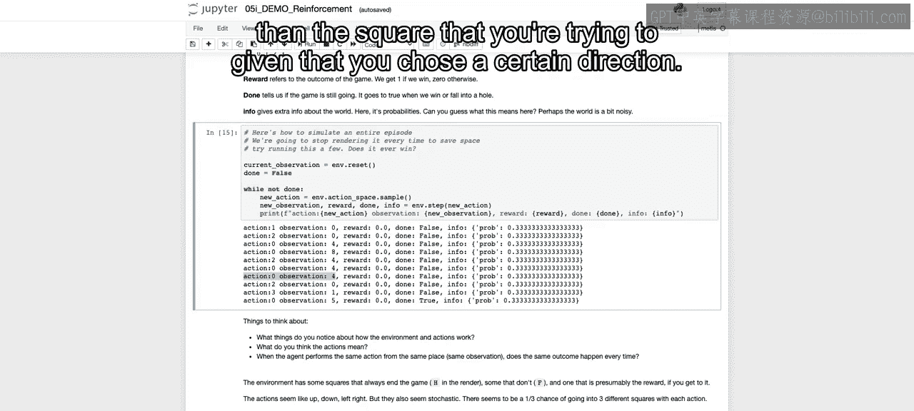

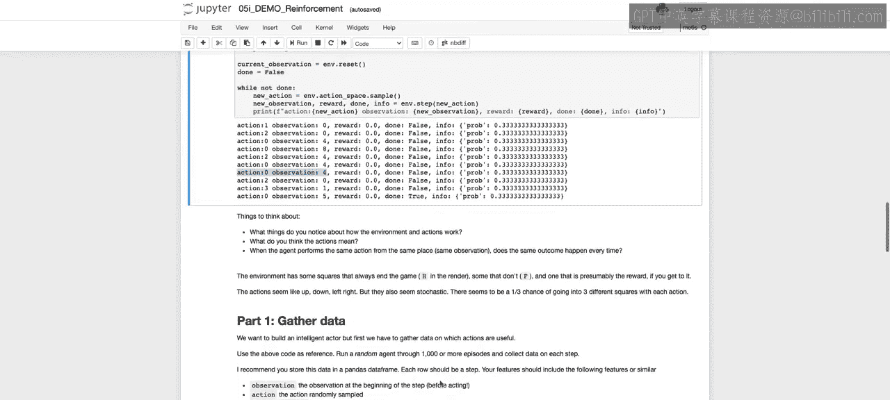

Now， I'm going to pause the video here as we walk through just this setup here of working with Jim。

 And in the next video， we're going to start to gather information so we can start to figure out our reward system and whether or not certain actions throughout all of our steps are good actions or bad actions。

 All right， I'll see you in the next video。😊。

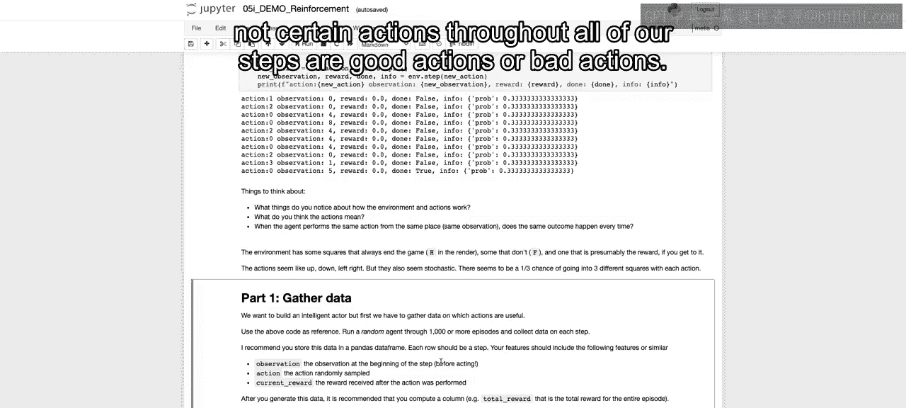

