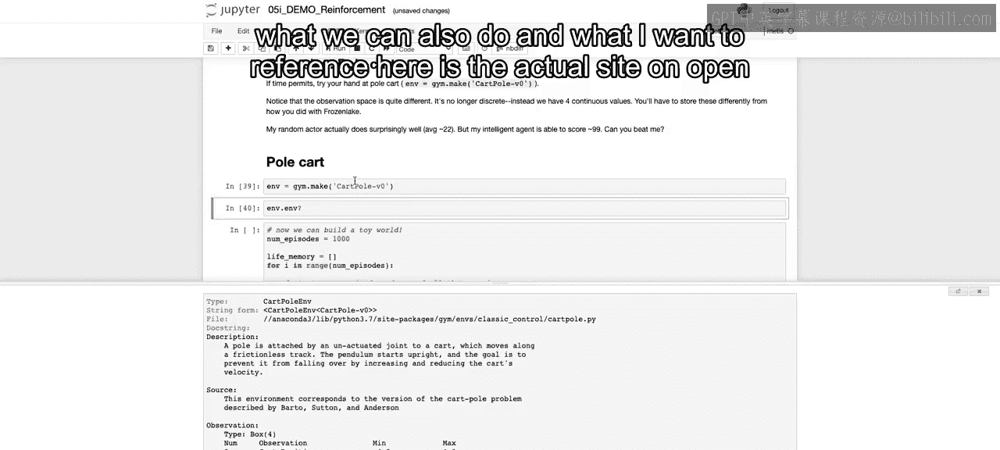
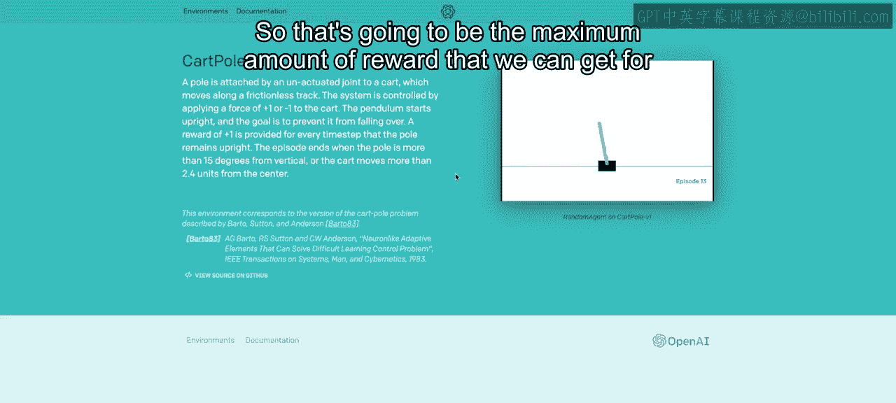

# 117：IBM《机器学习（无监督学习、深度学习和强化学习、毕业项目）｜machine learning》中英字幕 p117 78_RL笔记本（选修部分）第4部分.zh_en -BV1eu4m1F7oz_p117-

Welcome back to our final video here on reinforcement learning。In this video。

 we're going to touch on a new environment， so we're going to be working in a new environment so that you'll learn how to work outside of just that frozen environment that we discussed earlier。

So here we're going to work with the cart pole V0。And as before， you can look at the documentation。

 which can be helpful。But what we can also do and what I want to reference here is the actual site on open AI discussing this environment。

 and then we'll come back to the documentation as well as there's more details。

So the idea of cartpo is that there's a pole attached by an unanctuated joint to a cart as we see in the picture to the right。

 which moves along a frictionless track。And that system is controlled by applying a force of either plus one or minus one to the cart。

And the pendulum starts upright and the goal is to prevent it from falling over。

So a reward of plus one is provided every single time set that the poll remains upright。

So now our reward systems different rather than there're just being a reward at the end of the game。

 there can be a reward at every single step。And then the episode ends when the pole is more than 15 degrees from the vertical。

 so if we are。Move further than 15 degrees from the vertical。

 or the cart moves from that center more than 2。4 units。

So if you're able to move it over while keeping it upright for 2。4 units， then you also end the game。

And the goal is to keep it up without moving 2。4 units for as long as possible。

 and the maximum it also max is out at 200， so that's going to be the maximum amount of reward that we can get for a single episode。

Now some details that are worth knowing that are。In our documentation here。Is that at each time step。

 at each observation to know our state， we can get the cart position。Decarte velocity。

 and we have the min and max for it each。 This only goes from negative 4。8 to 4。8。

 The velocity can go as fast or as slow as possible or as fast in the opposite direction。

 We have the angle that goes from negative 24 degrees to 24 degrees。

 and then the velocity at the tip。 and that's going to be different observations that will be available to us。

 And if we think about it， again， we're going to want to leverage those observations。

 In order to come up with our modeling of how to optimize on rewards。

And there's only going to be two different actions rather than the four that we had before。

 either pushing the cart to the left one unit or pushing the cart to the right one unit。

So now many of these steps are going to be very similar to what we did before。

 so first we're going to gather our data by just taking random actions。

So we see here that we're using the M dot actionspace do sample。

 so we're doing a random action for each random action。We get the observation。 and now again。

 the observation is going to have four different values。We're going to get the reward and again。

 we can get a reward now at every single step。Whether or not it's done。

 and we talked about the criteria of it being done。

 either it moves a certain amount of units without falling， it does go beyond a certain degrees。

 so therefore does fall， or if we are able to keep it balance for 200 time steps。

And then some extra information。Now， our total reward also is going to be more important。

As each time step， we can add on more rewards and we can end the game and have a pretty successful game without maxing out the total reward。

 which would be 200。And then we're going to append to our memory。

 and this is going to be something we put into our data frame。What the observation0 was。 And that's。

 I don't recall which one is which， but we had the velocity we can call this again if you're curious。

 we had the position， the velocity， the angle and the velocity at the tip。

 Those are going to be our different observations。Then we have the action taken。

 given the state that we are in， which is highlighted by observation 0 through three。

We get whether or not we had a reward and we keep track of what episode are're in。

And then we set the old observation to the new observation。

 and we continue until we reach the end of the game。And then at the end of the game。

 we're also going to save in our dictionary what the total reward is as we did so that when we get our data frame at the end。

 we can look at that as well。So we run this and we put this into data f as we did before。

 and we see that the mean number of steps that we were able to take without it falling。

 without us failing is 22。And we can look at our memory DF and we see the observations and the average values for each one of the observations。

 the different actions taken， which should average out at 50% because see there's 01。

The reward average most of the time was very close to one， it only failed at zero。

 and that only happened at the end of the game so on the 23rd step。

And then what' will make this clear is if we look again as we did before。Let's first。

Go here and let's actually look where memory Df dot total reward。Is the max value。And hopefully。

 we have one here where it got all the way to 200。And we don't， we only got up to 94 here。

 and I guess that's because we're taking random steps， probably once we optimize。

 we'll be able to get to 200。And we can see that we took either an action of 100 throughout。

 and we were able to keep it balanced without moving 2。4 units for 94 different time stepss。

Now as before， let's create our aggressor， we're also going to have to create our Y variable that we're trying to optimize on。

So if we see here， we're going to create this comb reward or that combined reward。

And that's going to be 0。5 times the actual reward at each time step。Plus， the total reward。

 So we're going to optimize more on whether we able to。Remain higher on that total reward。

And then we're going to fit here our extra trees regressor。On those different observations。

And the actions taken。And that's similar to before。

 except before our observation or our state could only take on one value here it has four different values that describe that state。

And we have our action and we're trying to optimize on this memorydf。com reward。

 So given all these different values， what's going to be the predicted reward。

 combined reward that we just came up with。Now that we have our model fit。

 we're going to use the same steps that we did before here we're taking that old observation here that's actually。

Again， show this above。Oh， first， we have to run this。And then we're going to look at this above。

 and we see that we have all the observation values and then the action that we'd want to take either0 or one。

 so we have either0 or one， and that's going to be that plus I in range 2。

And that's going to be our input values and given those input values。

 we can come up with a prediction as we did before， so we call model dot predicts。

And we get the two different values and we just choose that maximum value again。So at each step。

 we choose whether to go left or right， according to which one maximizes the potential output given the data that we've gathered。

And then all the steps from there are essentially the same， saving it all into memory。

 And then we can see， given our new model。😊，How much further we ate。

 how much further along we were able to keep that cart balanced。 So I'm going to run this。

And we'll pause the video again， and we'll come back once it's done running and discuss those results。

Now， as we see here in our results in our output 49。We were able to get up to 113。

77 on average in regards to how many different steps we're able to take。

 and each step is going to add on to that reward。So we see by optimizing our model on our combined rewards。

 we're able to greatly increase from 22 up to 113。77。

Now I also pulled out here from our new data frame。

 the actual total rewards and where those total rewards max now， as mentioned if we get up to 200。

 it'll stop the game and say that you've accomplished that highest goal possible。

So we see we got here up to 200 for 2000 rows。And this is for every action so that means we got there about 10 times。

 so we see we're able to max out what you were not able to do when you're only taking random steps。

Now that closes out our video here on reinforcement learning。

 I encourage you to dive into the OpenAAA website and keep playing around with different environments that may be available to you to keep learning more and more about reinforcement learning。

