# 118：IBM《机器学习（无监督学习、深度学习和强化学习、毕业项目）｜machine learning》中英字幕 p118 0_机器学习毕业项目简介.zh_en -BV1eu4m1F7oz_p118-

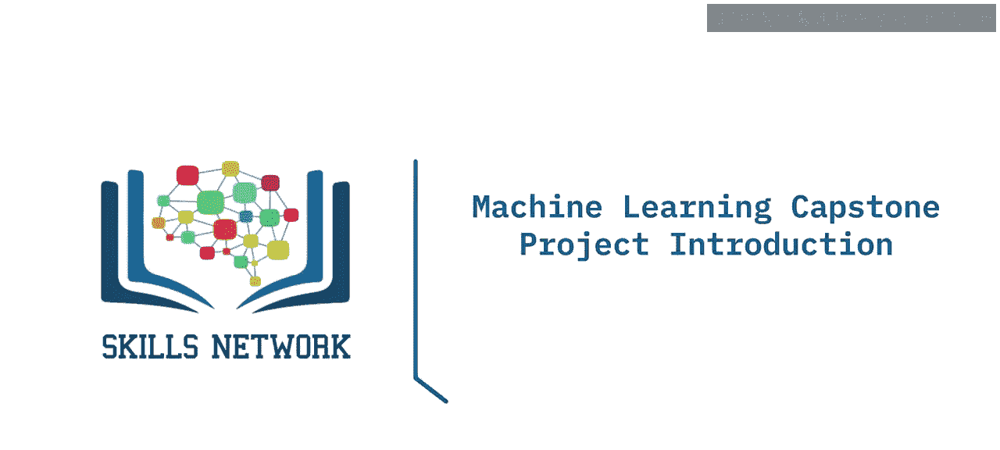

Welcome to the Machine Learning Capstone Project Introd。

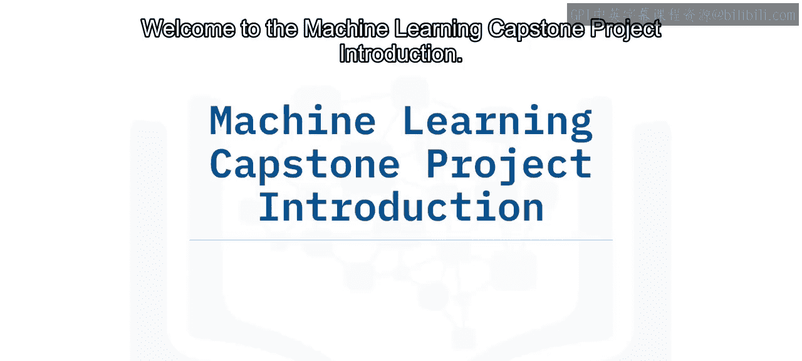

Yan Luo PhD is a data scientist and developer at IBM Canada。

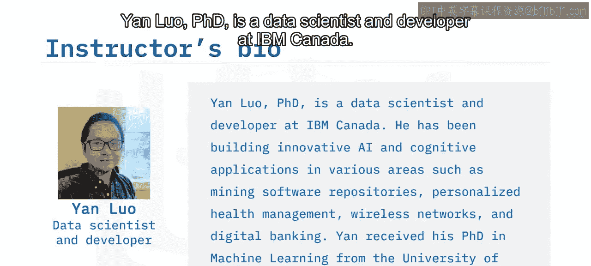

He has been building innovative AI and cognitive applications in various areas。

 such as mining software repositories， personalized health management， wireless networks。

 and digital banking。

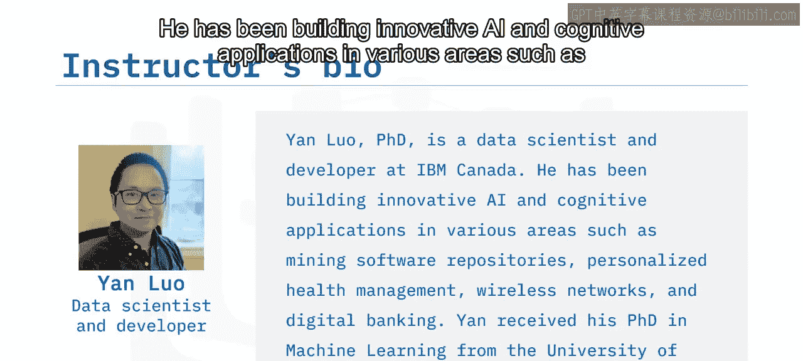

Yan received his PhD in machine learning from the University of Western Ontario。

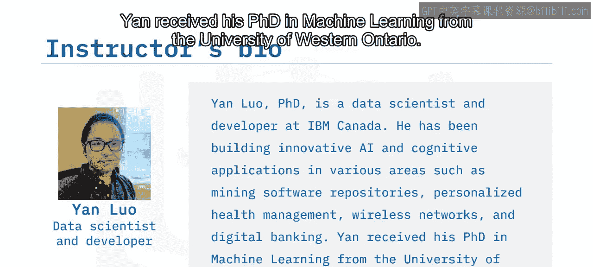

In previous machine learning courses， you learned four types of machine learning algorithms。

 let's briefly recap those。Regression algorithms belong to supervised learning。

Regression aims to map a feature vector onto a numerical target variable。

 and the learned coefficient of each feature in relation to the target variable。

Classification algorithms also belong to supervised to learning They map a feature vector onto a categorical target variable such as customer churn versus no churn。

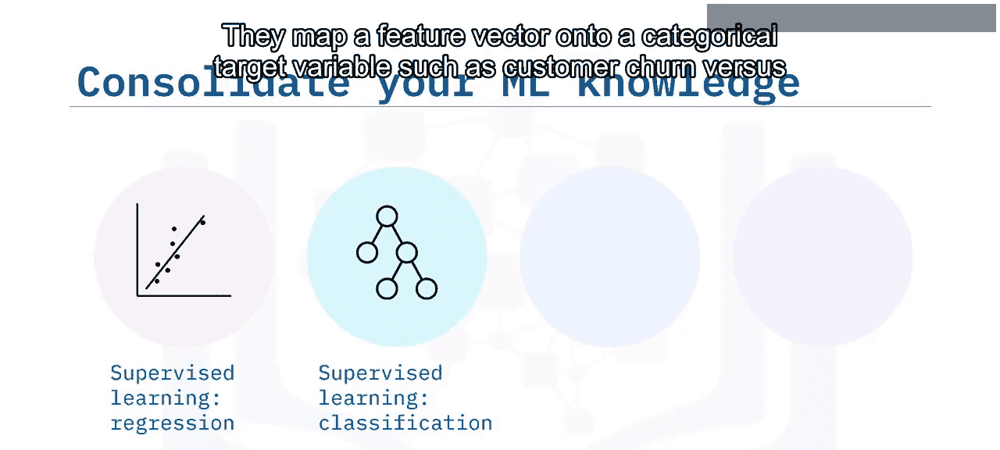

For unsupervised learning and dimension reduction， you do not have a target variable。Instead。

 in unsupervised learning， you try to find the patterns within the data itself。

 typical tasks are similarity measurement， clustering， principal component analysis， and so on。

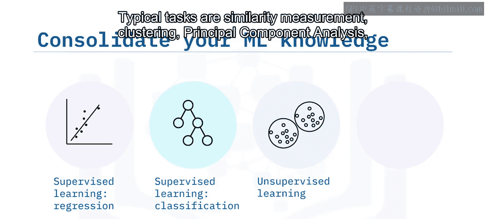

Lastly， you also learned about deep learning， which involves building deep and complex machine learning models such as neural networks to solve complicated tasks like computer vision and natural language processing。

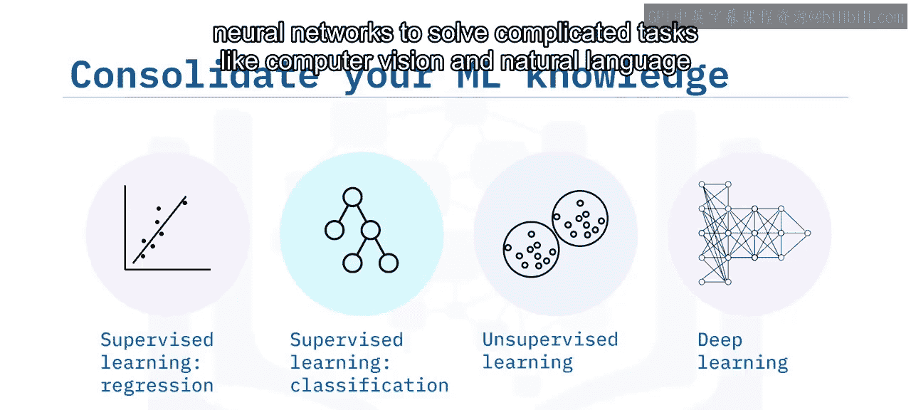

Now in this capstone project， you will have opportunities to apply the machine learning knowledge and skills you acquired from previous courses。

You will be given an industrial scenario with real-worl data sets and you will solve valuable real- worldor problems using machine learning Finally。

 after you have completed the project， you will have the opportunity to showcase your comprehensive machine learning skills to your peers more specifically in this project you will be asked to apply a wide range of machine learning algorithms such as regression。

 classification and clustering to predict if a user will like an item or not this problem setting that is user item interaction prediction is fundamental to many successful machine learning systems such as recommender systems。

 social network mining and advertising prediction in this capstone project。

 we will focus on recommender systems。

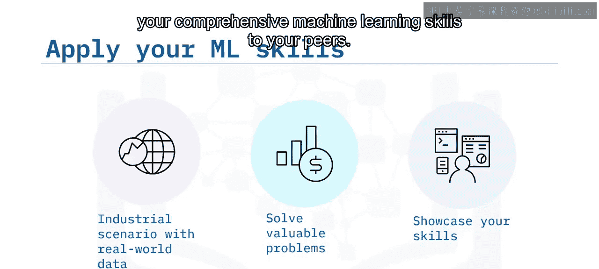

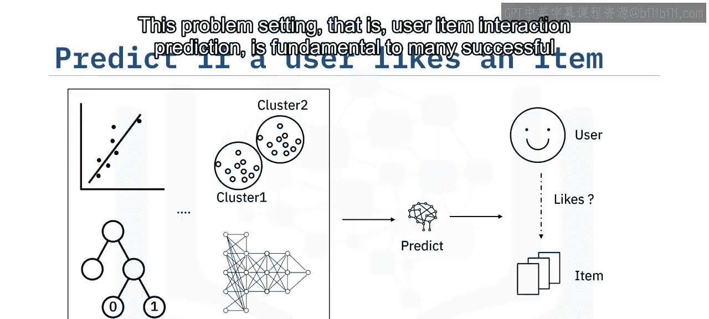

With this in mind， we believe this capstone course will be an asset to your machine learning portfolio。

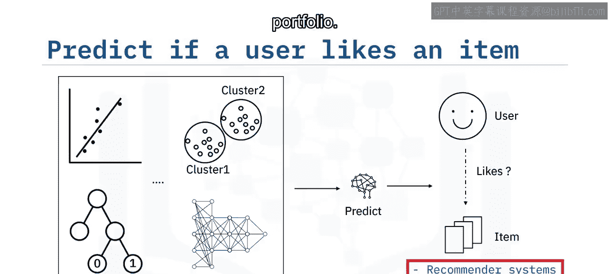