# 119：IBM《机器学习（无监督学习、深度学习和强化学习、毕业项目）｜machine learning》中英字幕 p119 1_推荐系统简介.zh_en -BV1eu4m1F7oz_p119-

Hello and welcome In this video， we'll be going through a quick introduction to recommendation systems。

 so let's get started。😊。

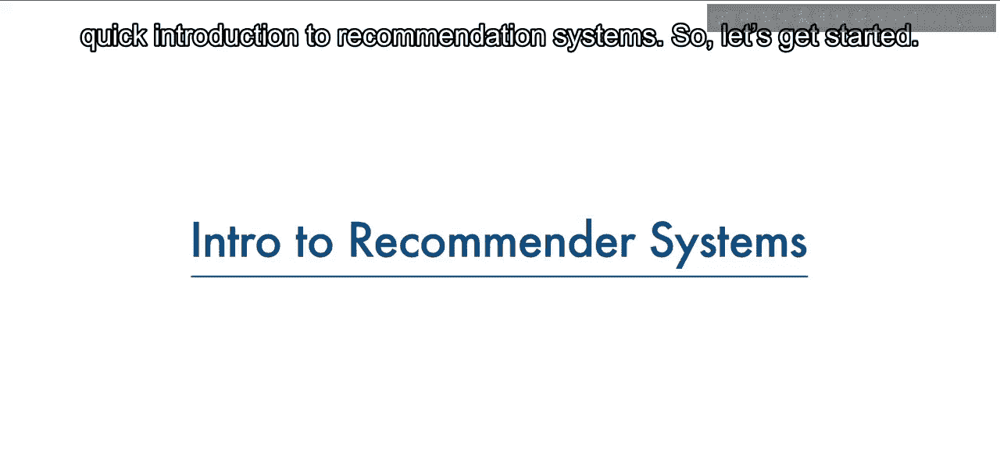

Even though people's tastes may vary， they generally follow patterns。By that。

 I mean that there are similarities in the things that people tend to like。

Or another way to look at it is that people tend to like things in the same category or things that share the same characteristics。

For example， if you've recently purchased a book on machine learning and Python and you've enjoyed reading it。

 it's very likely that you'll also enjoy reading a book on data visualization。

 People also tend to have similar taste to those of the people they're close to in their lives。

Recomander systems try to capture these patterns in similar behaviors to help predict what else you might like。

Recommenander systems have many applications that I'm sure you're already familiar with。 Indeed。

 recommender systems are usually at play on many websites。 For example。

 suggesting books on Amazon and movies on Netflix。 In fact。

 everything on Netflix's website is driven by customer selection。

 If a certain movie gets viewed frequently enough。 Netflix's recommender system ensures that that movie gets an increasing number of recommendations。

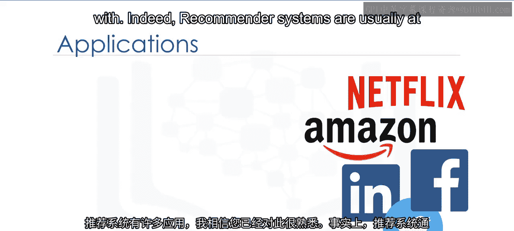

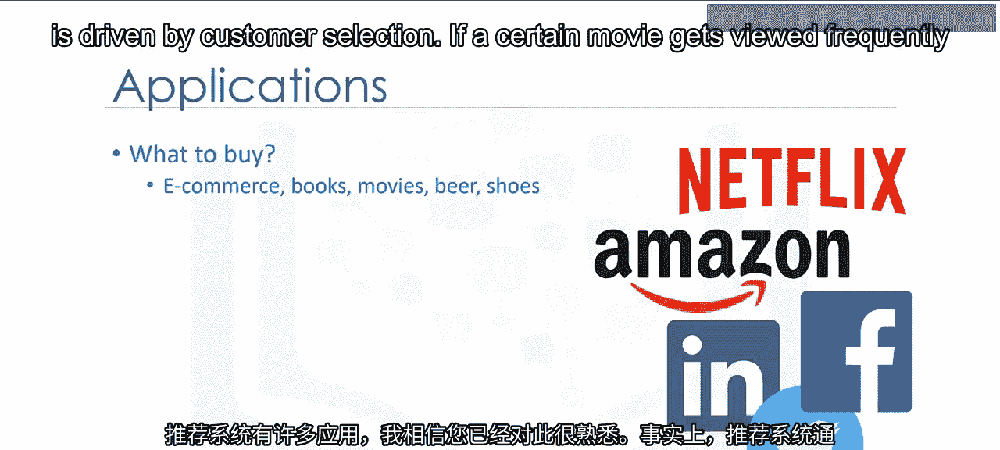

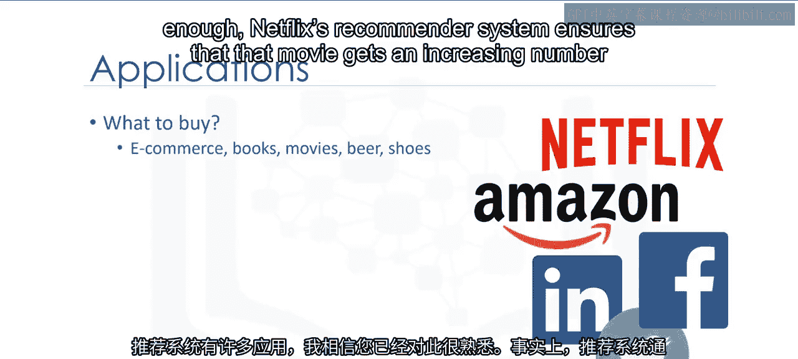

Another example can be found in a daily use mobile app where a recommender engine is used to recommend anything from where to eat or what job to apply to。

On social media， sites like Facebook or LinkedIn regularly recommend friendships。

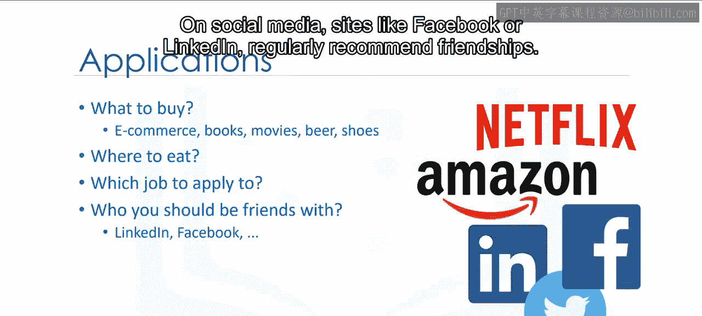

Recommenander systems are even used to personalize your experience on the web。For example。

 when you go to a news platform website， a recommender system will make note of the types of stories that you clicked on and make recommendations on which types of stories you might be interested in reading in future。

 There are many of these types of examples， and they are growing in number every day。

 So let's take a closer look at the main benefits of using a recommendation system。

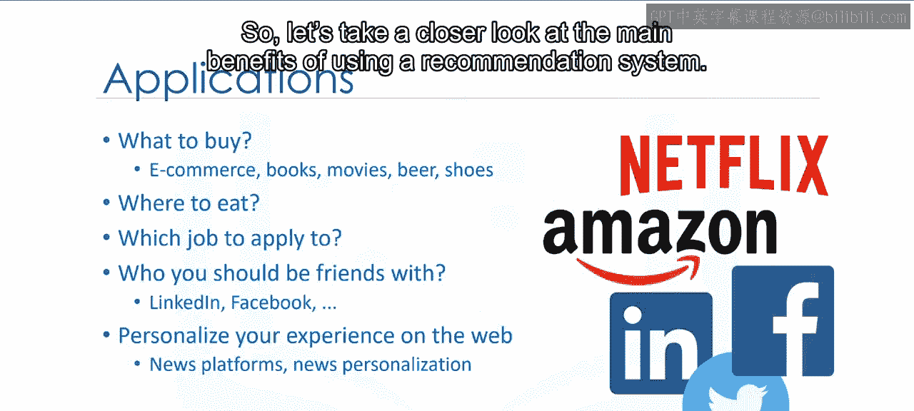

One of the main advantages of using recommendation systems is that users get a broader exposure to many different products they might be interested in。

This exposure encourages users towards continual usage or purchase of their product。

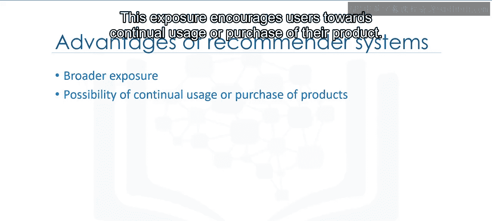

Not only does this provide a better experience for the user。

 but it benefits the service provider as well， with increased potential revenue and better security for its customers。

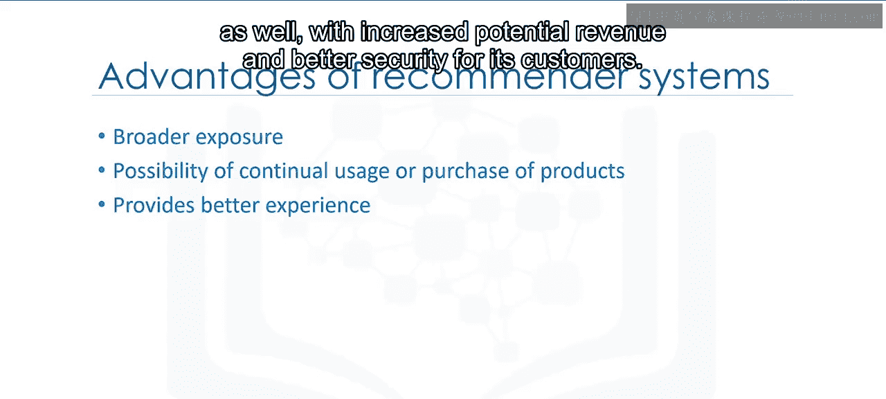

There are generally two main types of recommendation systems。

 content based and collaborative filtering。

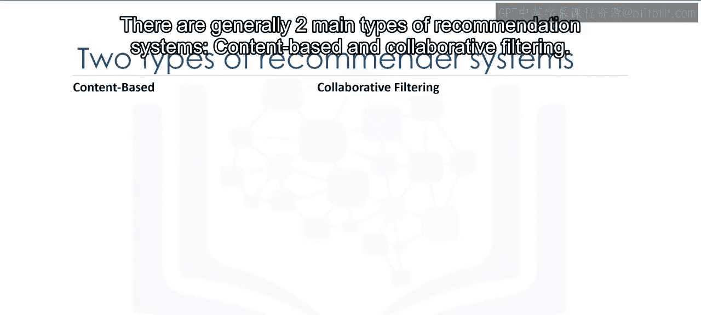

The main difference between each can be summed up by the type of statement that a consumer might make。

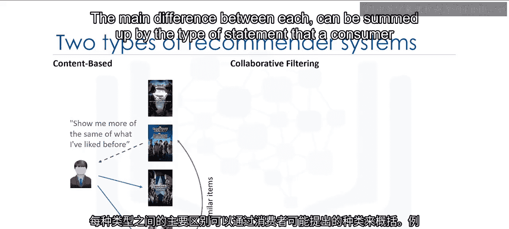

For instance， the main paradigm of a content based recommendation system is driven by the statement。

 Show me more of the same of what I've liked before。

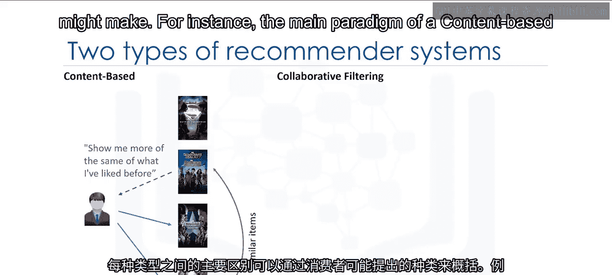

Content based systems try to figure out what a user's favorite aspects of an item are and then make recommendations on items that share those aspects。

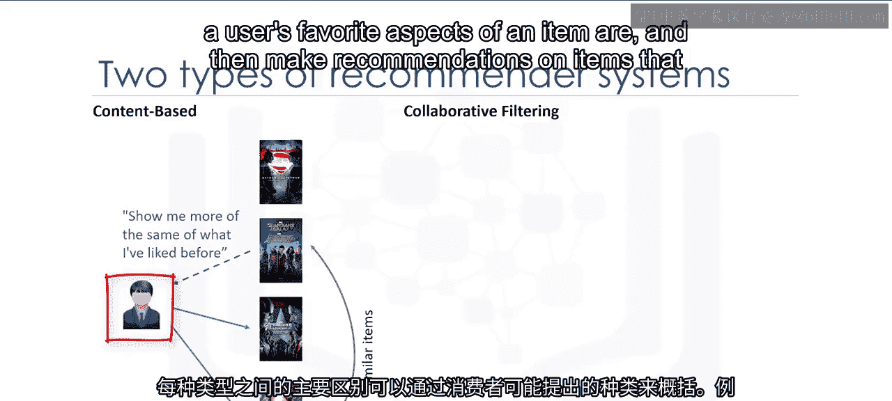

Collaborative filtering is based on a user saying， tell me what's popular among my neighbors because I might like it too。

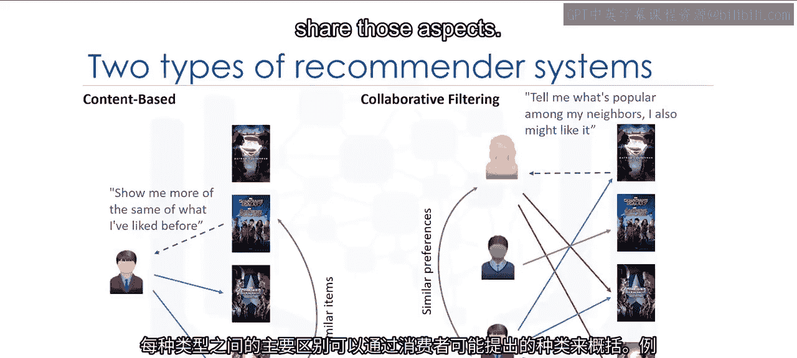

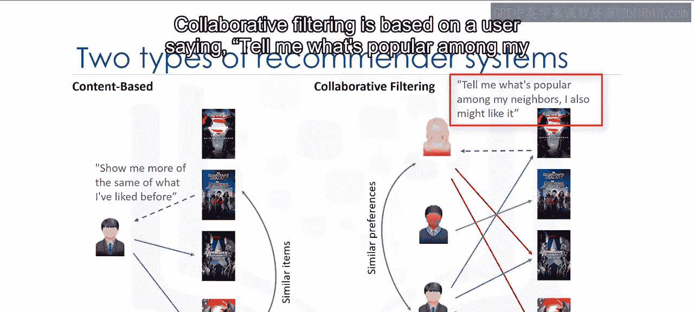

Collaborative filtering techniques find similar groups of users and provide recommendations based on similar tastes within that group。

 In short， it assumes that a user might be interested in what similar users are interested in。 Also。

 there are hybrid recommender systems， which combine various mechanisms。

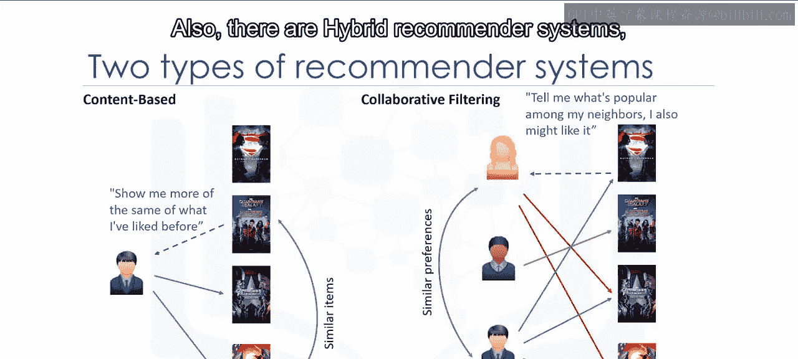

In terms of implementing recommender systems， there are two types， memory based and model based。

In memory based approaches， we use the entire user item data set to generate a recommendation system。

 it uses statistical techniques to approximate users or items。

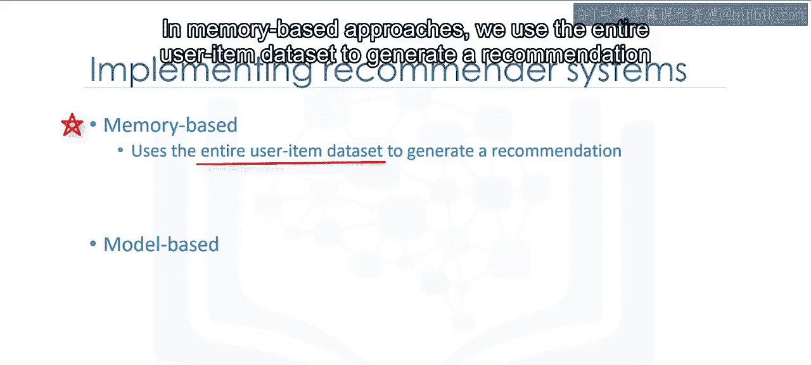

Examples of these techniques include pearson correlation， cosine similarity。

 and Euclidean distance among others。In model based approaches。

 a model of users is developed in an attempt to learn their preferences。

 models can be created using machine learning techniques like regression， clustering， classification。

 and so on。

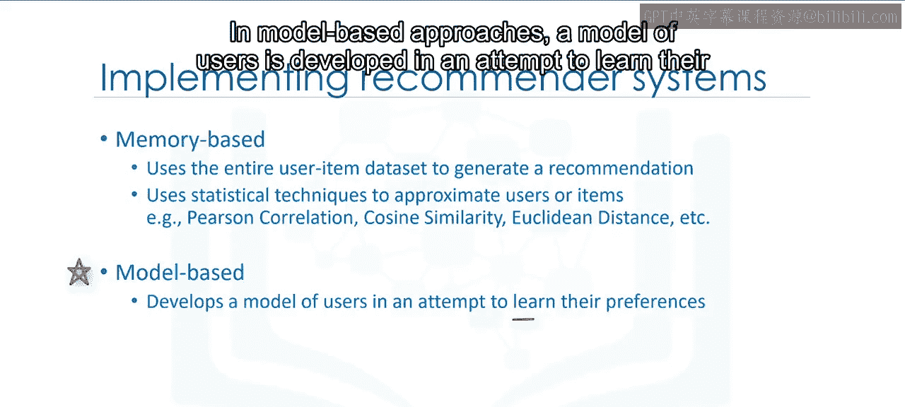

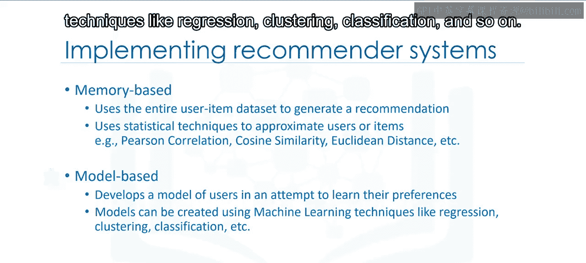

This is the end of our video Thanks for watching。