# 121：IBM《机器学习（无监督学习、深度学习和强化学习、毕业项目）｜machine learning》中英字幕 p121 3_基于协作过滤的推荐系统.zh_en -BV1eu4m1F7oz_p121-

Hello and welcome In this video we'll be covering a recommender system technique called collaborativellabor filtertering。

 so let's get started。

Collaborative filtering is based on the fact that relationships exist between products and people's interests。

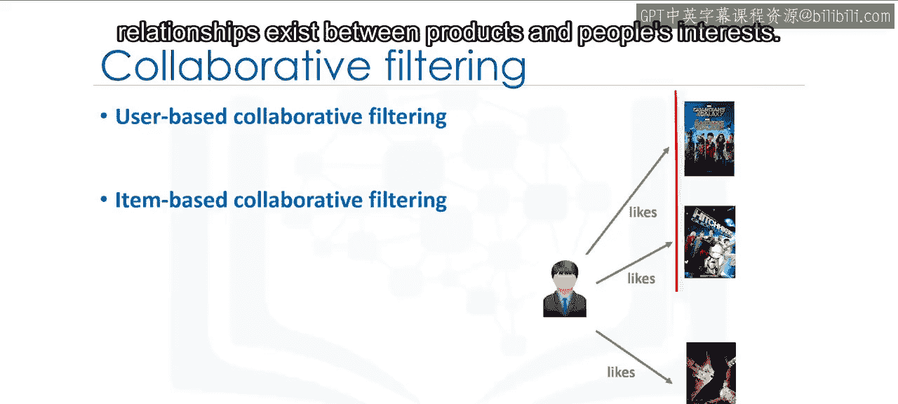

Many recommendation systems use collaborative filtering to find these relationships and to give an accurate recommendation of a product that the user might like or be interested in Collabor filtering has basically two approaches。

 user based and item based user based collaborative filtering is based on the user's similarity or neighborhood。

😊。

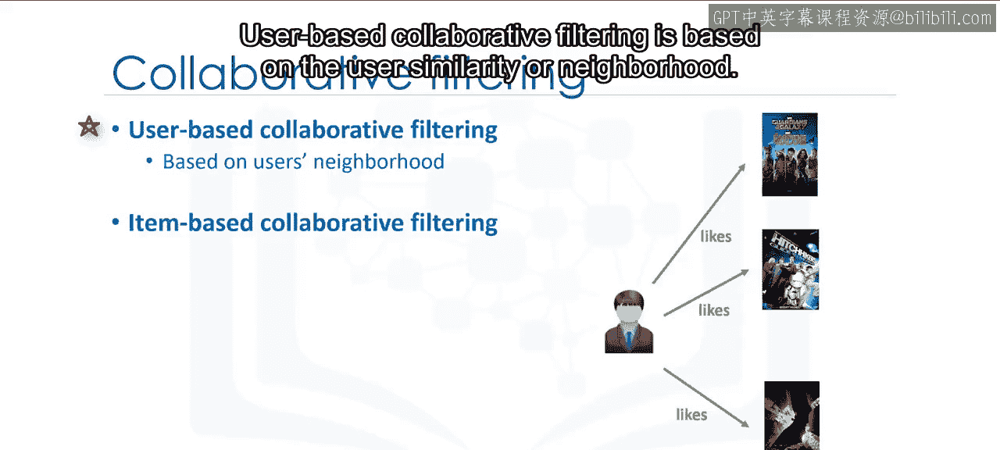

Item based collaborative filtering is based on similarity among items。

Let's first look at the intuition behind the user based approach。

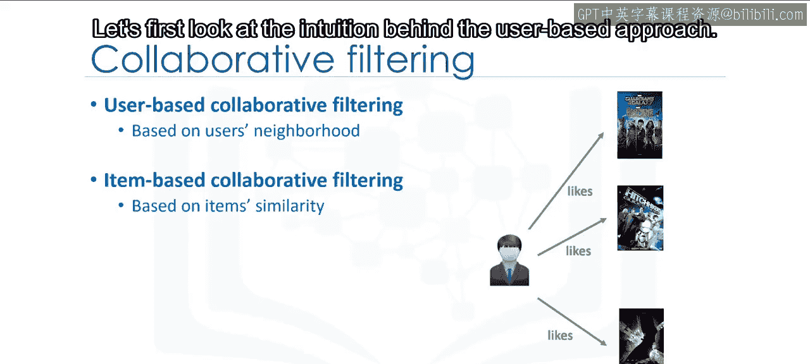

In user based collaborative filtering， we have an active user for whom the recommendation is aimed。

The collaborative Fing engine first looks for users who are similar；

 that is users who share the active users' rating patterns。

Collaborative filtering bases this similarity on things like history。

 preference and choices that users make when buying， watching or enjoying something。 For example。

 movies that similar users have rated highly。

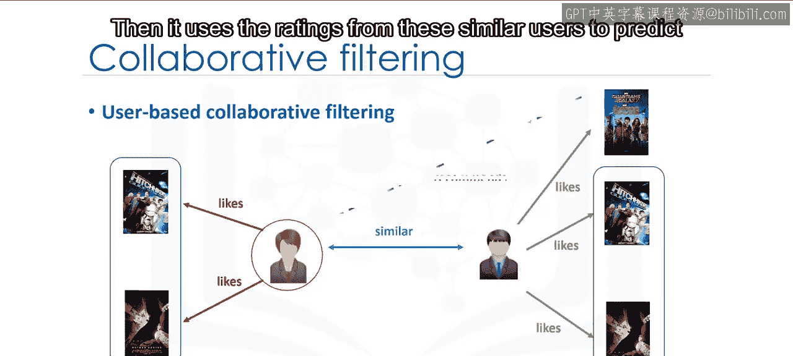

Then it uses the ratings from these similar users to predict the possible ratings by the active user for a movie that she had not previously watched。

 For instance， if two users are similar or are neighbors in terms of their interest in movies。

 we can recommend a movie to the active user that her neighbor has already seen。

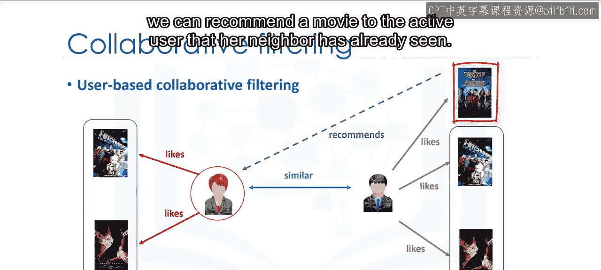

Now， let's dive into the algorithm to see how all of this works。

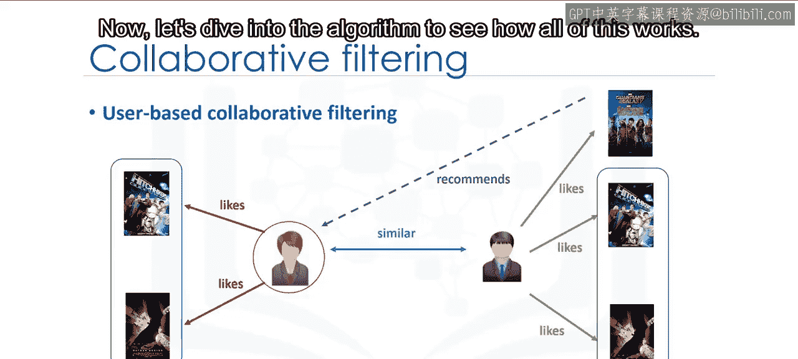

Assume that we have a simple user item matrix， which shows the ratings of four users for five different movies。

Let's also assume that our active user has watched and rated three out of these five movies。

Let's find out which of the two movies that our active user hasn't watched should be recommended to her。

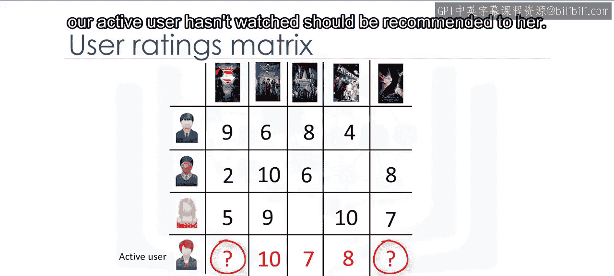

The first step is to discover how similar the active user is to the other users。 How do we do this？

 Well， this can be done through several different statistical and viial techniques such as distance or similarity measurements。

 including Euclidean distance， Pearson correlation， cosine similarity and so on。

To calculate the level of similarity between two users。

 we use the three movies that both the users have rated in the past。

Regardless of what we use for similarity measurement， let's say， for example。

 the similarity could be 0。7，0。9 and 0。4 between the active user and other users。

These numbers represent similarity weights or proximity of the active user to other users in the dataset。

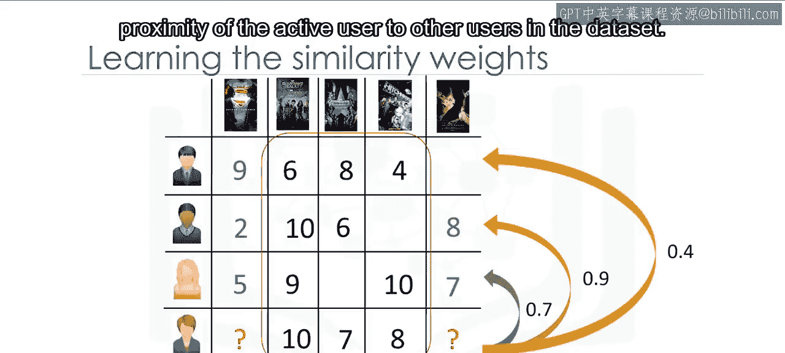

The next step is to create a weighted rating matrix。

 We just calculated the similarity of users to our active user in the previous slide。

 Now we can use it to calculate the possible opinion of the active user about our two target movies。

This is achieved by multiplying the similarity weights to the user ratings。

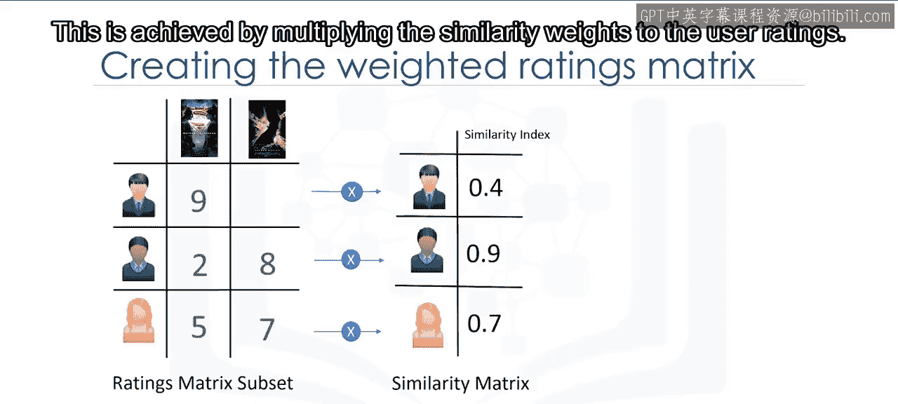

It results in a weighted ratings matrix， which represents the user's neighbor's opinion about our two candidate movies for recommendation。

In fact， it incorporates the behavior of other users and gives more weight to the ratings of those users who are more similar to the active user。

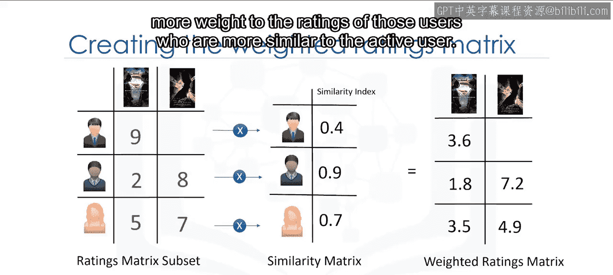

Now we can generate the recommendation matrix by aggregating all of the weighted rates。

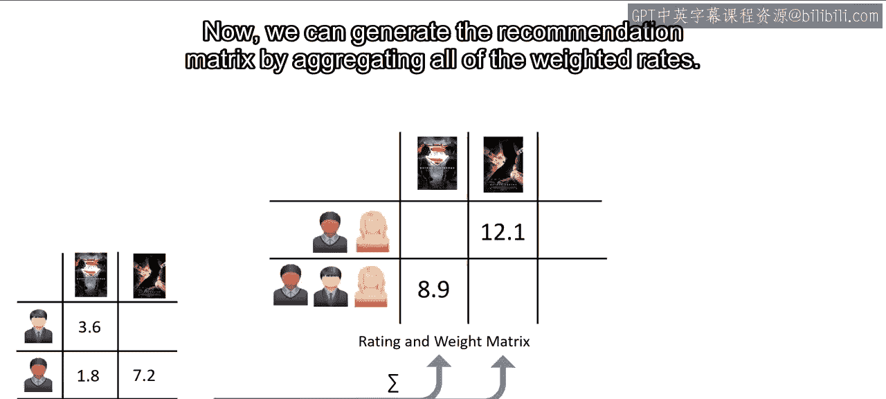

However， as three users rated the first potential movie and two users rated the second movie。

 we have to normalize the weighted rating values。We do this by dividing it by the sum of the similarity index for users。

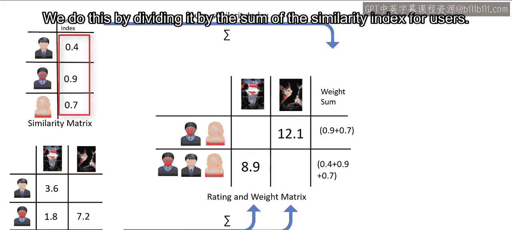

The result is the potential rating that our active user will give to these movies based on her similarity to other users。

 It is obvious that we can use it to rank the movies for providing recommendation to our active user。

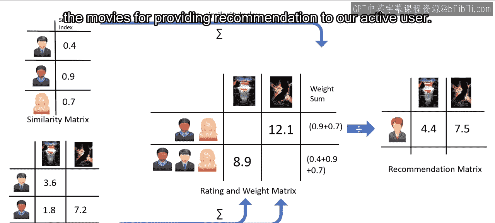

Now， let's examine what's different between user based and item based collaborative filtering。

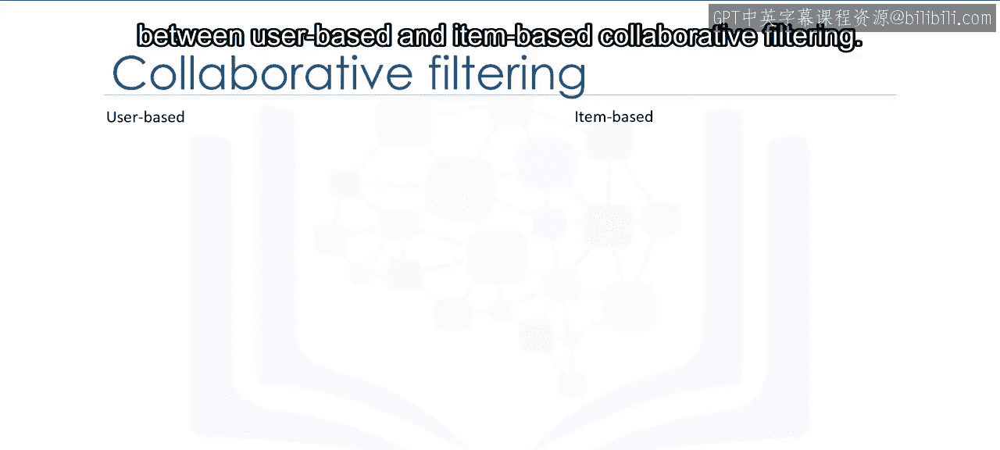

In the user based approach， the recommendation is based on users of the same neighborhood with whom he or she shares common preferences。

 For example， as user 1 and user 3， both liked item 3 and item 4。

 we consider them as similar or neighbor users。And recommend item1。

 which is positively rated by user one to user3。

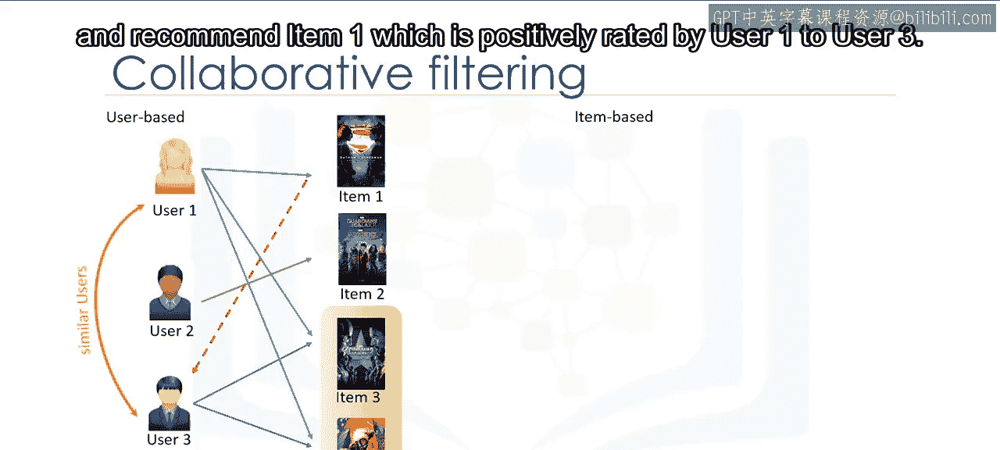

In the item based approach， similar items build neighborhoods on the behavior of users。 Please note。

 however， that it is not based on their contents。 For example。

 item 1 and item 3 are considered neighbors as they were positively rated by both user 1 and user 2。

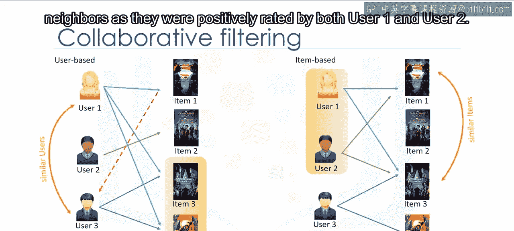

So item1 can be recommended to user3 as he has already shown interest in item 3， therefore。

 the recommendations here are based on the items in the neighborhood that a user might prefer。

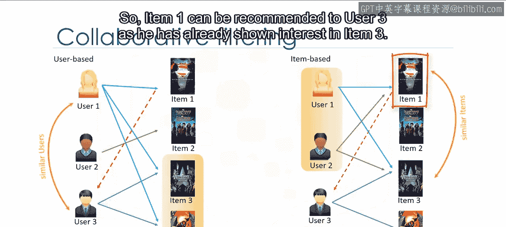

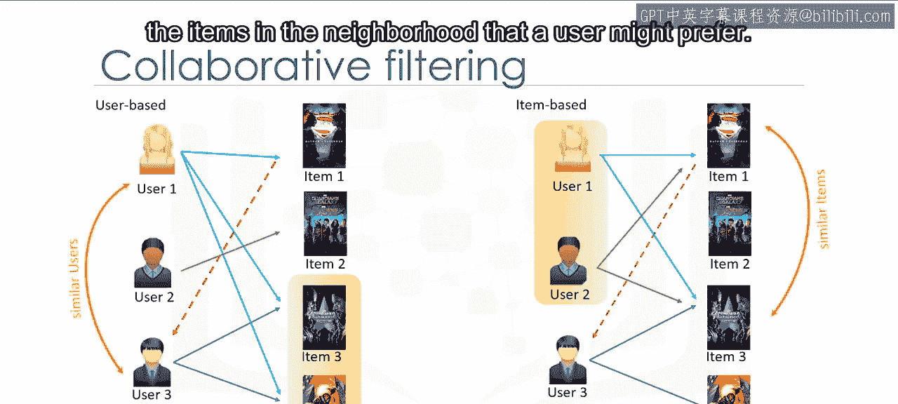

Collaborative filtering is a very effective recommendation system， however。

 there are some challenges with it as well。One of them is data sparsity。

Data sparsity happens when you have a large data set of users who generally rate only a limited number of items。

As mentioned， collaborative based recommenders can only predict scoring of an item if there are other users who have rated it。

Due to sparsity， we might not have enough ratings in the Use item data set。

 which makes it impossible to provide proper recommendations。

Another issue to keep in mind is something called Cold Start。

Coalstart refers to the difficulty the recommendation system has when there is a new user。

 and as such， a profile doesn't exist for them yet。

Cold start can also happen when we have a new item， which is not received a rating。

Scalability can become an issue as well as the number of users or items increases and the amount of data expands。

 collaborative filtering algorithms will begin to suffer drops in performance。

 simply due to growth in the similarity computation。

 There are some solutions for each of these challenges such as using hybrid based recommender systems。

 but they are out of scope of this course。Thanks for watching。

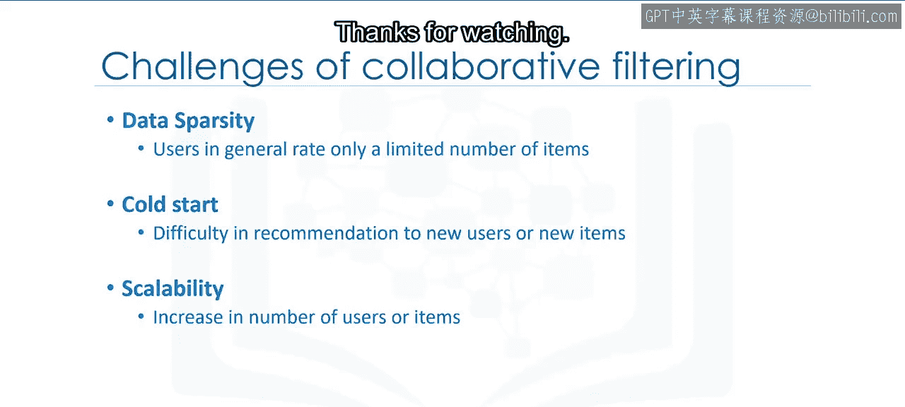