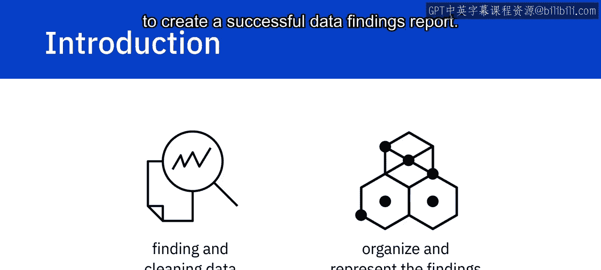
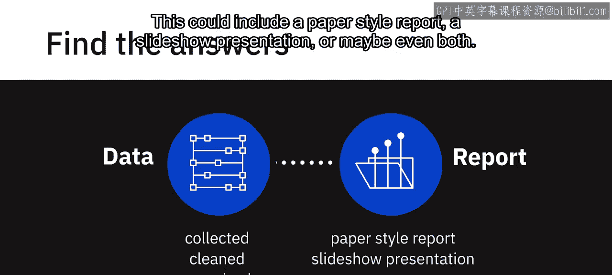
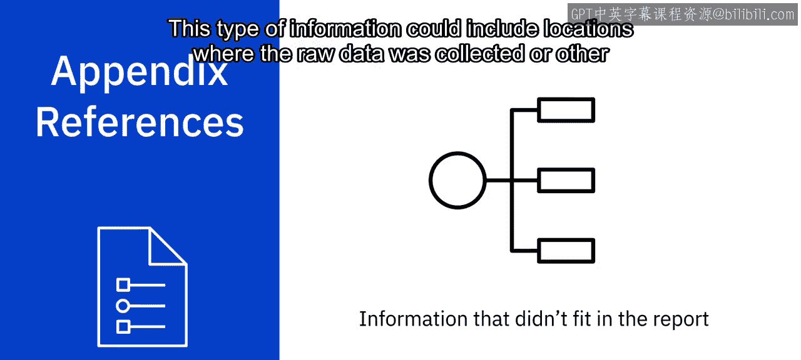

# 122：IBM《机器学习（无监督学习、深度学习和强化学习、毕业项目）｜machine learning》中英字幕 p122 4_成功数据分析报告的要素.zh_en -BV1eu4m1F7oz_p122-

While finding and cleaning data is an important first step in data analysis。

 a concept can be lost if you are not able to organize and represent the findings effectively to your audience In this video。

 you will learn how to represent your findings by focusing on specific elements to create a successful data findings report。

 After the data has been collected， cleaned and organized the work of interpretation begins。

 You are now able to obtain a complete view of the data and hopefully answer the questions that were formed before starting the analysis。

 Now， you typically begin to compose a findings report that explains what was learned。

 depending on the stakeholders and how they receive the information。 The report could vary in form。

 This could include a paper style report。 a slidehow presentation or maybe even both。

 The findings report is a crucial part of data analysis。

 as it conveys what was discovered when beginning this process。

 the collected data and information may seem。

Little overwhelming。 The best way to get through this block is to begin by creating an outline by completing an outline。

 you can then get a complete picture and begin to write in a precise but simple manner。

 While there are many different formats for creating a data drivenrin presentation。

 We have created a simple outline that is easy to follow yet effective。 When creating your outline。

 always remember to structure it towards your audience and create a presentation that is appropriate for your situation。

 You first begin with your cover page。 This beginning section will have the title of your presentation。

 your name and then the date。 The next section in your outline will be an executive summary and then the table of contents。

 The table of contents will contain the sections and subsections of your report in order to give your audience an overview of the contents。

 This also enables readers to go directly to a specific section that may be more important to them。

 Coninue your presentation with the introduction methodology。😊，Discussion， conclusion， and finally。

 the appendix。 note that the depth and length for each element may vary depending on the audience and format of report。

 The first step in creating your report is properly creating an executive summary。

 This summary will briefly explain the details of the project and should be considered a standalone document。

 This information is taken from the main points of your report。

 And while it is acceptable to repeat information， no new information is presented。

 The next section after the table of contents is the introduction。

 The introduction explains the nature of the analysis states the problem and gives the questions that were to be answered by performing the analysis。

 The next section is methodology。 methodology explains the data sources that were used in the analysis and outlines the plan for the collected data。

 For example， was the cluster or regression method used to analyze the data。 Next。

 we have the results section。This section goes into the detail of the data collection。

 how it was organized and how it was analyzed。 This portion would also contain the charts and graphs that would substantiate the results and call attention to more complex or crucial findings by providing this interpretation of data。

 You are able to give a detailed explanation to the audience and convey how it relates to the problem that was stated in the introduction。

Next， discuss the report findings and implications for this section。

 you would engage the audience with a discussion of your implications that were drawn from the research。

 For example， let's say you were conducting research for top programming languages for college graduates。

 Would you find they need to learn multiple languages to remain competitive in the job market。

 or would one language always reign supreme。We have now reached the conclusion of the report findings。

 This final section should reiterate the problem given in the introduction and gives an overall summary of the findings。

 It would also state the outcome of the analysis and if any other steps would be taken in the future。

 And last， we have the appendix。 This section would contain information that really didn't fit in the main body of the report。

 but you deemed it was still important enough to include This type of information could include locations where the raw data was collected or other details such as resources。

 acknowledgments or references。 In this video， we learned about the important elements in creating a successful data findings report。

 In the next video， we will learn the best practices when presenting your findings。

