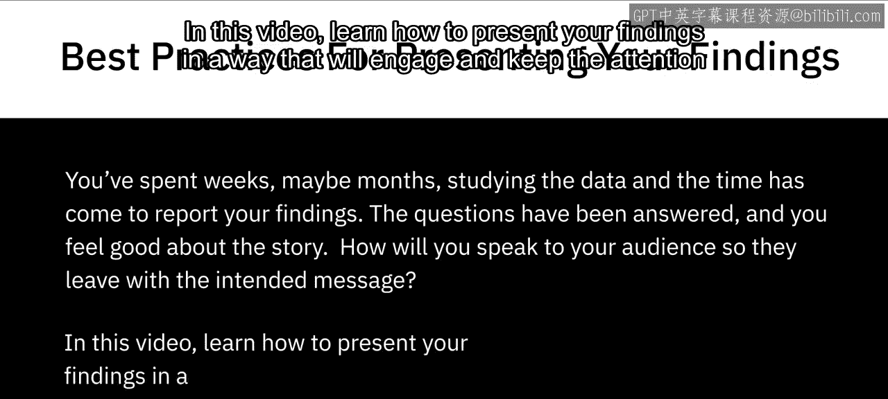

# 123：IBM《机器学习（无监督学习、深度学习和强化学习、毕业项目）｜machine learning》中英字幕 p123 5_展示发现的最佳实践.zh_en -BV1eu4m1F7oz_p123-

嗯。🎼Okay， you've spent weeks， maybe months studying the data。

 and the time has come to report your findings。 The questions have been answered。

 and you feel good about the story。 So how will you speak to your audience so they leave with the intended message。

 In this video， learn how to present your findings in a way that will engage and keep the attention of your audience。

 Delivering data driven presentations may seem easy。

 but there are a few important factors to remember in accurately conveying your message。

 Make sure charts and graphs are not too small and are clearly labeled。

 Use the data only as supporting evidence。 Share only one point from each chart or graph and eliminate data that does not support the key message。

😊。

Have you ever SAT through a presentation and the information being presented was difficult to read or understand。

 While this may seem apparent， small charts and labels can be easily overlooked。

 Make sure to test the visualizations by sitting at different distances like your audience。

 And if the data cannot be seen clearly， then maybe a redesign should be considered。

When preparing the report， you may feel the only way to explain the findings is to pack the slides with data。

 While this may seem sensible as a data analyst， your audience will probably not appreciate the intricacies of the data and just see a pile of numbers to resolve this issue。

 begin by forming the key messages that need to be conveyed to the audience and build the story around these messages After forming the outline。

 go back and insert the data to support your findings by not relying heavily on the data and using this method to create the presentation。

 You will create a story that is engaging and interesting to your audience。

Presenting your data using charts and graphs is the best way to get your message across。 However。

 if you are supplying too much information， it can be confusing。 For example， look at this pie chart。

 Can you decipher what the key message is and what the presenter is trying to convey In the example。

 the chart has so much information。 It is hard to determine what point the presenter is trying to make and what the focus should be for the audience by sticking with one idea and not summarizing multiple points into one visualization。

 You are able to accurately convey the idea to the audience and avoid any confusion。

 Data analysts can spend months researching data。 However。

 some items that seem interesting to the analyst may not be relevant to the project。

 Try to explain every little detail to your audience and not recognizing irrelevant data could damage the key message by eliminating this unnecessary data and highlighting only data points that support your key ideas you will。

🎼Keep the presentation clear and concise In this video。

 we learned about creating a data driven presentation that will keep your audience engaged and how to deliver a clear and concise message。

