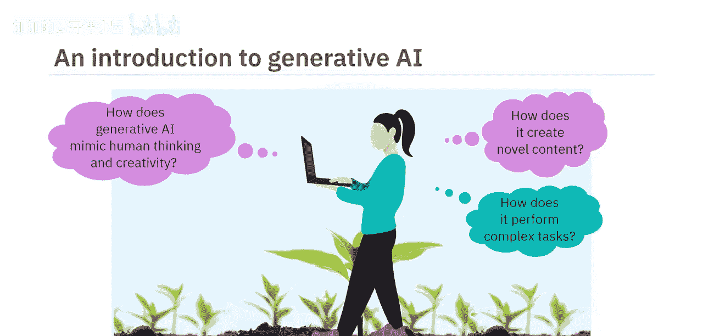
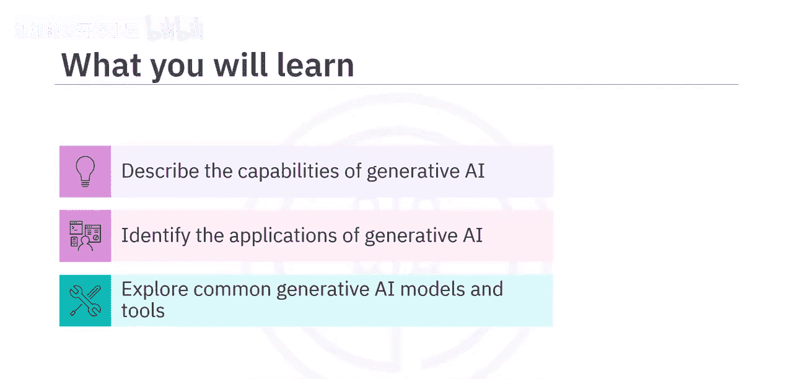
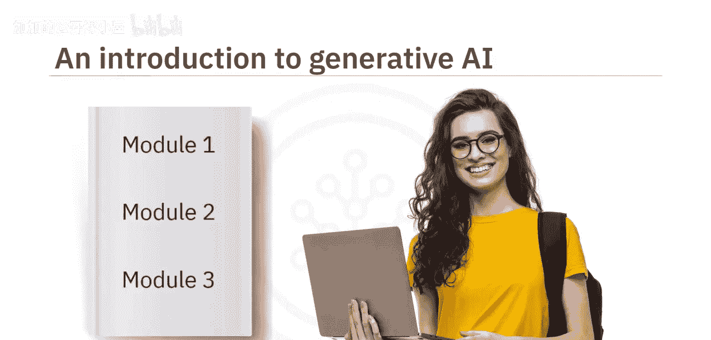
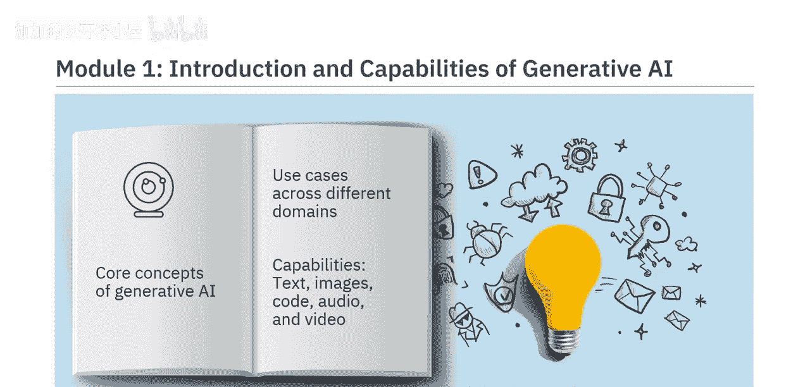
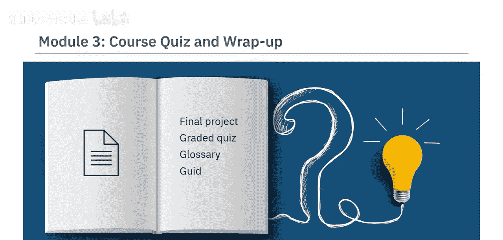
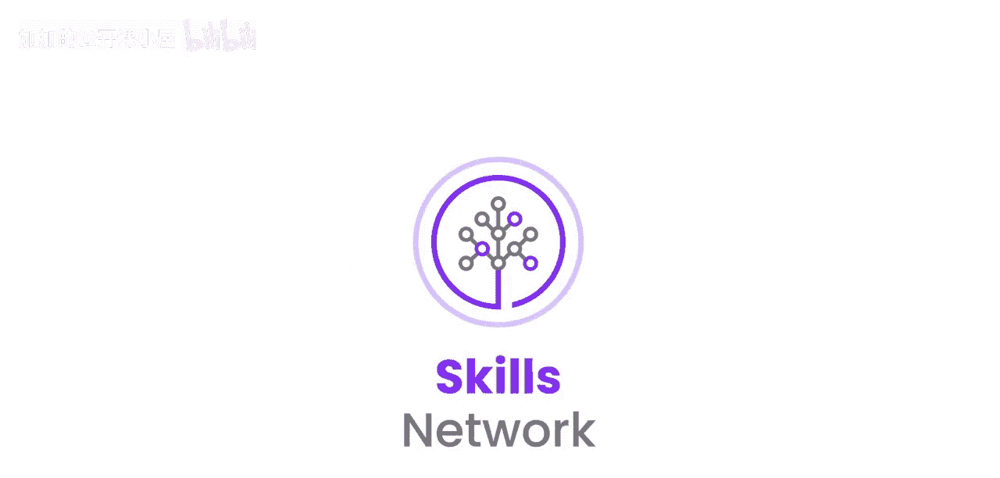

#  001：课程介绍 🚀

在本节课中，我们将要学习生成式AI的基础概念、其广泛的应用领域以及本课程的结构与学习目标。

想象一个由AI驱动的世界，它能让我们工作更高效、寿命更长、能源更清洁。这个世界已经到来。生成式AI已经深刻改变了我们的生活方式。

生成式AI模型能够模仿人类的思维和创造力，以生成新颖的内容并执行复杂的任务。组织可以利用生成式AI来提高生产力和盈利能力。个人可以使用生成式AI工具来提升效率、为工作增添实际价值、节省成本并最大化其品牌价值。

如果你尚未涉足此领域，本课程正适合你。我们欢迎所有对快速发展的生成式AI领域抱有真诚兴趣的专业人士、爱好者、项目经理和学生。无论你的背景或经验如何，这是一门面向所有人的课程。

本课程旨在让你扎实理解生成式AI的能力、应用以及常见的模型和工具。完成本课程后，你将能够描述生成式AI的能力及其在现实世界中的用例，识别不同行业和领域中生成式AI的应用，并探索常见的生成式AI模型和工具。

这是一门由三个模块组成的精炼课程，预计每个模块需要花费一到两小时完成。

以下是本课程三个模块的简要介绍：

*   **模块1**：你将学习生成式AI的核心概念，查看其在不同领域中的应用案例，并理解其在生成文本、图像、代码、音频和视频方面的能力。
*   **模块2**：你将探索信息技术、娱乐、教育、金融和医疗保健等不同行业如何利用生成式AI。此外，在本模块中，你还将学习用于生成文本、图像、代码、音频和视频的常见模型和工具（如ChatGPT、DALL-E和Synthesia）的能力与特性。
*   **模块3**：你需要参与一个最终项目，并完成一个分级测验，以检验你对课程概念的理解。你也可以访问课程术语表，并获得关于后续学习路径的指导。

本课程融合了概念讲解视频和辅助阅读材料。观看所有视频以充分掌握学习材料的潜力。你将享受到实践实验室和一个展示生成式AI跨多个领域常见用例的最终项目。每节课后都有练习测验，帮助你巩固所学知识。课程结束时，你还需完成一个分级测验。课程还提供讨论论坛，方便你与课程工作人员联系并与同伴交流。最有趣的是，通过专家观点视频，你将听到经验丰富的从业者分享他们对生成式AI不同方面的见解。

当生成式AI正在全球范围内增强个人、组织和社区的创造力表达与专业能力时，你为何不参与进来？本课程为你提供了一个创造新体验的机遇。

本节课中，我们一起学习了生成式AI的初步介绍、其变革潜力以及本课程的具体学习路径和目标。在接下来的模块中，我们将深入探讨其核心概念与实际应用。