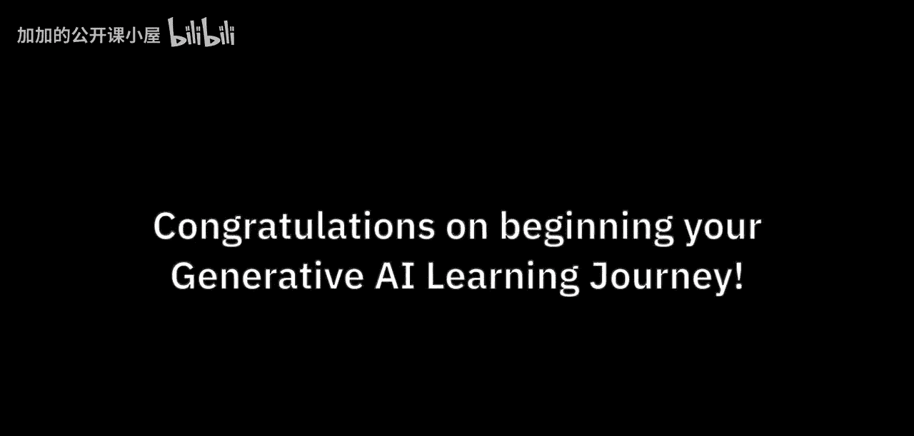
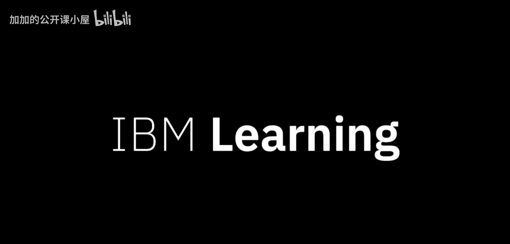

生成式AI项目经理专项课程：P2：为何学习IBM的生成式AI

在本节课中，我们将探讨学习生成式AI，特别是IBM相关课程的重要性。我们将了解生成式AI的普及性、它带来的职业机遇，以及掌握相关技能的必要性。

生成式AI是每位领导者都在思考的问题。在每个组织、企业或政府中，皆是如此。

兴趣随之带来机遇。组织正在寻找理解这项技术的人才。

最重要的是，他们需要具备应用这项技术技能的人才。与以往许多趋势性技术不同，生成式AI几乎触及每个行业的每个角色。

生成式AI技能预计将变得非常重要。不仅对计算机科学家，对所有人都是如此。

这些技能将变得像文字处理、电子表格甚至基本商业素养一样必不可少。这就是为什么这些课程名为“面向所有人的生成式AI”。

目前，人们对AI产生了许多新的兴趣。

企业关注的视野已超越消费级AI。聊天机器人界面是展示生成式AI潜力的绝佳方式。

然而，真正的应用场景是将生成式AI嵌入现有流程，使其成为几乎每个业务工作流不可或缺的功能。IBM很自豪能帮助企业将生成式AI整合到其运营中。

作为这些课程的一部分，你将获得的技能应有助于你的职业生涯，并能立即应用于你的工作。

企业对生成式AI的潜力感到兴奋。

但他们也对潜在的危险感到担忧。这项使命太重要，不能允许你危及它。

这些课程将赋予你处理AI伦理问题的技能，这些技能基于IBM开创的负责任方法。

---

本节课中，我们一起学习了生成式AI的广泛影响和重要性。我们了解到，生成式AI技能正成为各行各业的基础要求，而IBM的课程旨在提供实用、负责任的知识，帮助学习者在把握机遇的同时，有效管理风险，从而在职业生涯中立即应用并创造价值。