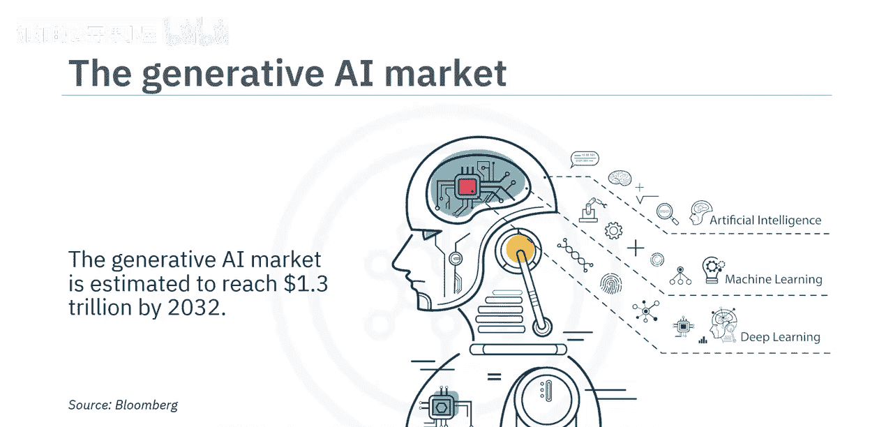
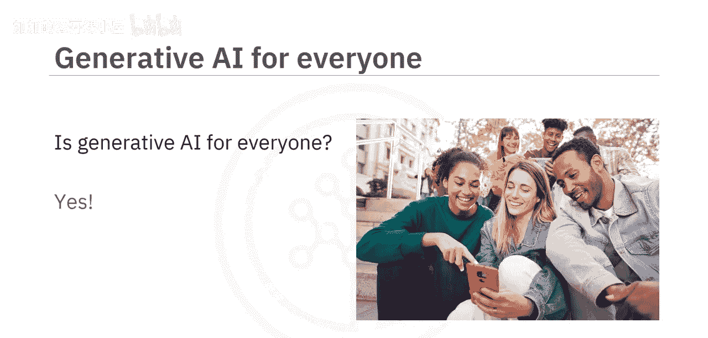
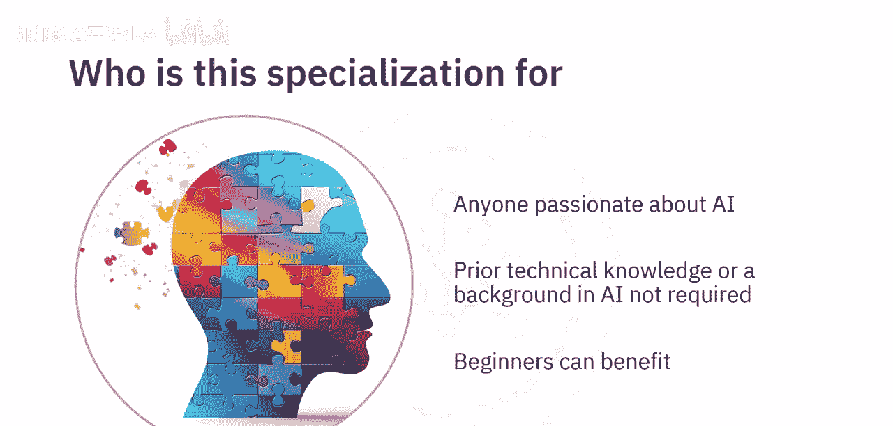
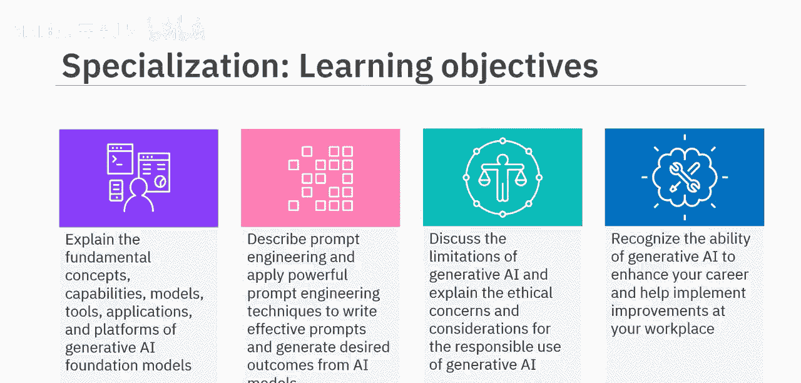
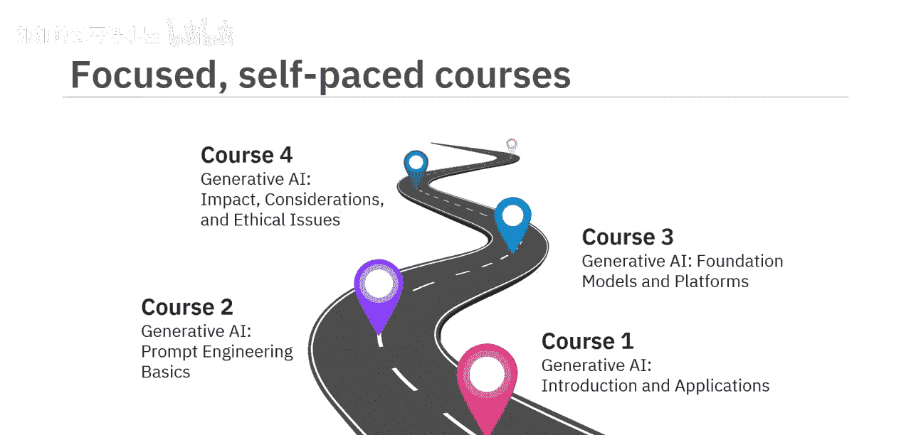
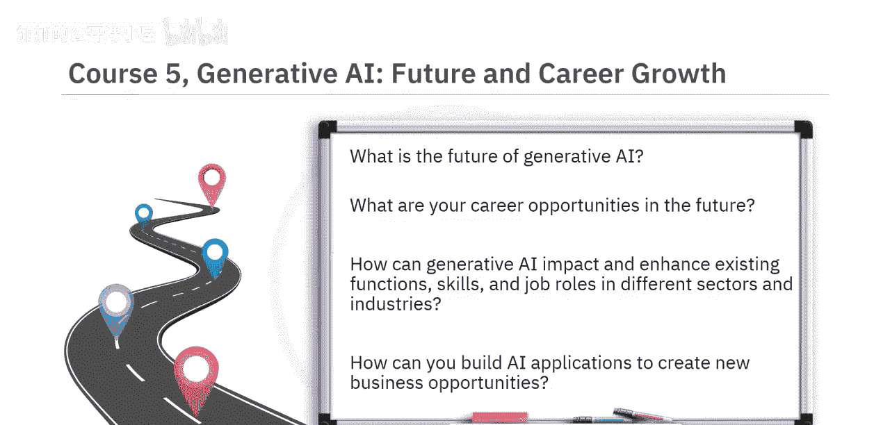
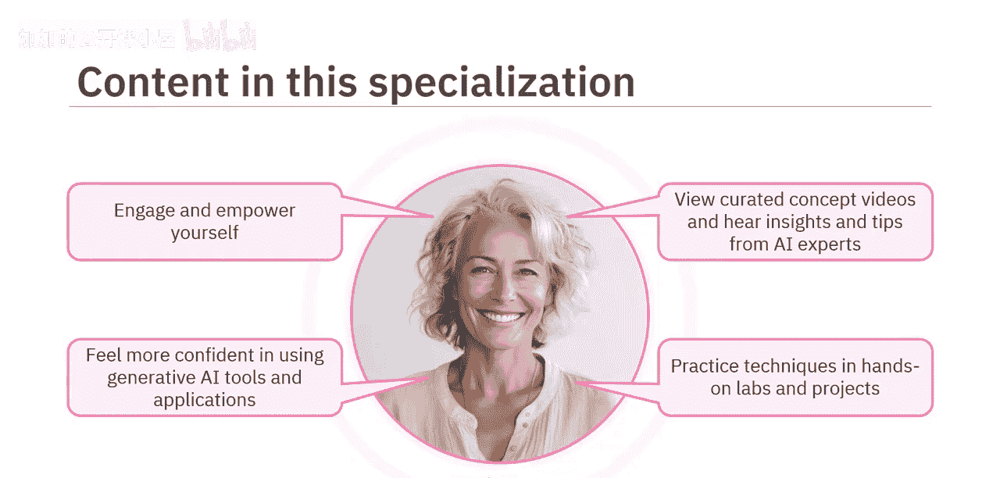
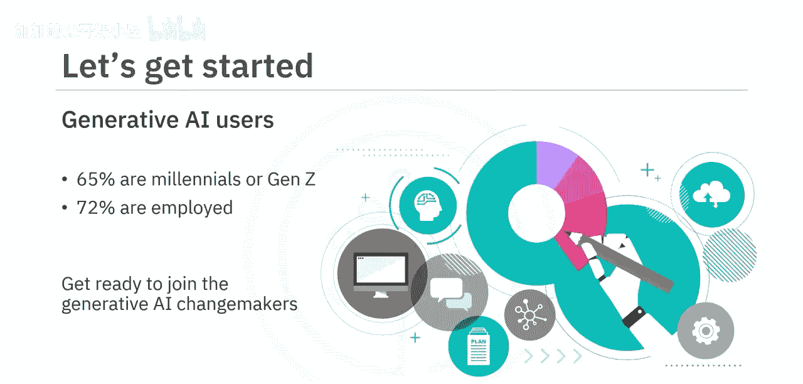
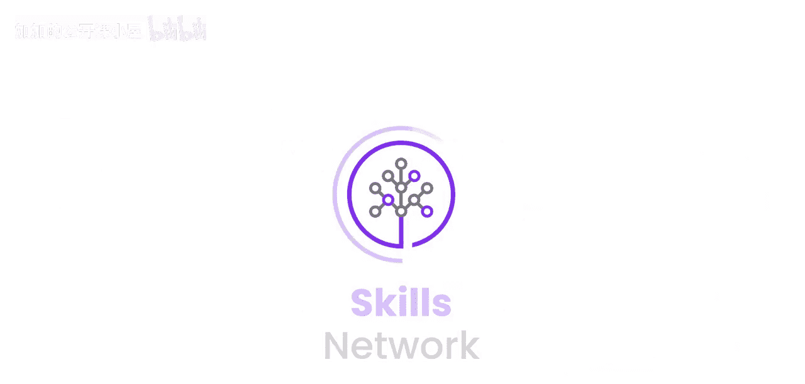

#  003：专项课程导论 🚀

在本节课中，我们将要学习“生成式人工智能基础”专项课程的概览。我们将了解课程的目标、结构、核心内容以及学习完成后你将能够掌握的知识与技能。

你知道吗？全球的营销人员已经在使用生成式AI来创作内容、撰写文案、激发创意、分析市场数据以及生成图像。

根据彭博社的数据，预计到2032年，生成式AI市场规模将达到1.3万亿美元。

因此，你肯定希望更好地了解生成式AI。

然而，生成式AI适合所有人吗？是的，它适合。你可以利用它的潜力，为自己创造更好的职业和生活。本专项课程适合任何热衷于探索生成式AI力量的人，**不要求具备先前的AI技术知识或背景**。即使是初学者也能从中受益，因为它提供了对生成式AI基本概念、模型、工具和应用的全面理解。

在本专项课程结束时，你将能够：
*   解释生成式AI基础模型的基本概念、能力、模型、工具、应用和平台。
*   描述提示工程，并应用强大的提示工程技术来编写有效的提示，从而从AI模型中生成期望的结果。
*   讨论生成式AI的局限性，并解释负责任使用生成式AI的伦理关切与考量。
*   认识到生成式AI在提升你的职业生涯和帮助你在工作场所实施改进方面的能力。

本专项课程包含五个自定进度的课程，每个课程需要3到5小时完成。

以下是各门课程的简要介绍：

**课程1**是你理解生成式AI能力的第一步，其能力涵盖文本、图像、音频、视频、虚拟世界、代码和数据等不同领域。你将了解不同行业如何应用常见的生成式AI模型和工具，例如GPT、DALL-E、Stable Diffusion、IBM Granite和Synthesia。

上一节我们介绍了入门课程，接下来我们看看如何与AI更有效地交互。

**课程2**介绍了提示工程的概念，以及它如何帮助你解锁像ChatGPT这样的生成式AI工具的全部潜力。你将探索开发有效提示的技术、方法和最佳实践，并使用IBM Watsonx.ai Prompt Lab、Spellbook和Dust等常用工具。

在掌握了交互技巧后，我们需要深入理解其背后的原理。

**课程3**侧重于生成式AI的核心概念和构建模块，例如深度学习、基于Transformer的大型语言模型、扩散模型和基础模型。你还将了解不同的生成式AI平台，如IBM Watsonx.ai和Hugging Face。

理解了技术基础，我们必须关注其应用带来的影响。

**课程4**探讨与生成式AI相关的伦理考量。它如何影响数据隐私和安全、版权侵权、劳动力以及环境？你还将描述其局限性，例如数据偏见、缺乏可解释性、透明度和可理解性，并识别生成式AI的常见误用，如深度伪造和幻觉。

最后，让我们展望这项技术的未来。

**课程5**讨论生成式AI的未来。你难道不想知道在那个未来里，你的职业机会是什么吗？你将学习生成式AI如何影响和增强不同行业中的现有职能、技能和工作角色，以及你如何使用生成式AI构建自己的应用程序以创造新的商业机会。

本专项课程的内容旨在吸引并赋能你。通过观看精选的概念视频、聆听AI专家分享他们的见解和技巧，以及在动手实验和项目中练习技术，你将在日常生活中使用生成式AI工具和应用程序时感到更加自信。

目前，65%的生成式AI用户是千禧一代或Z世代，72%的用户是在职人员。通过本专项课程的学习，你将准备好加入生成式AI变革者的行列。

生成式AI适合所有人。

本节课中，我们一起学习了“生成式人工智能基础”专项课程的完整导览。我们了解了课程面向所有人、无需技术背景，并概述了五门课程的核心内容：从AI能力入门、提示工程技巧、技术原理剖析，到伦理风险探讨，最后展望未来职业机遇。完成学习后，你将能够自信地解释、应用并负责任地使用生成式AI技术。