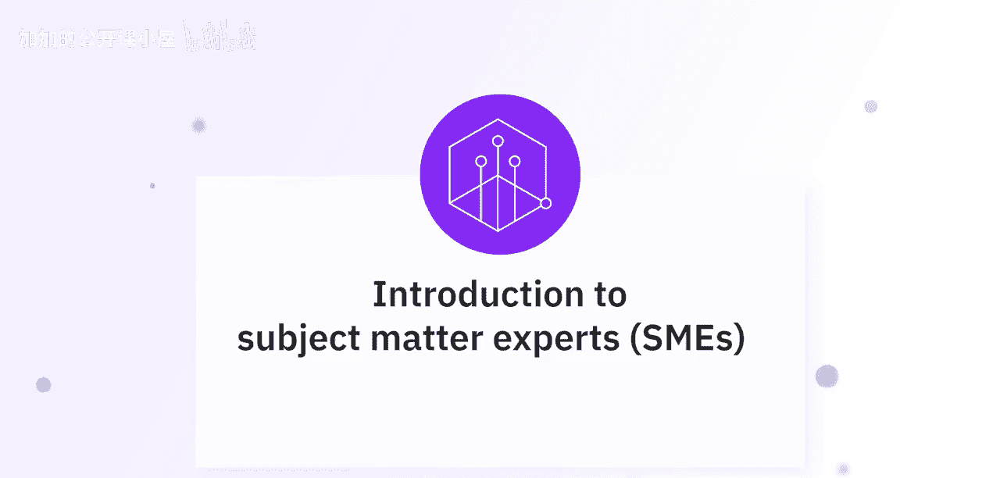
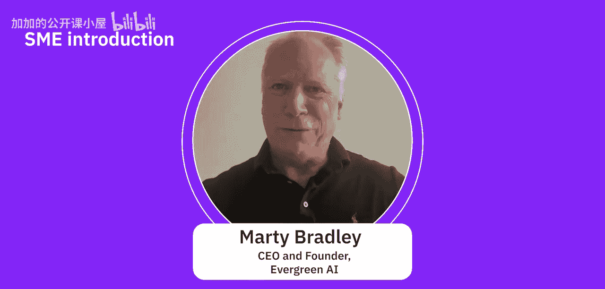
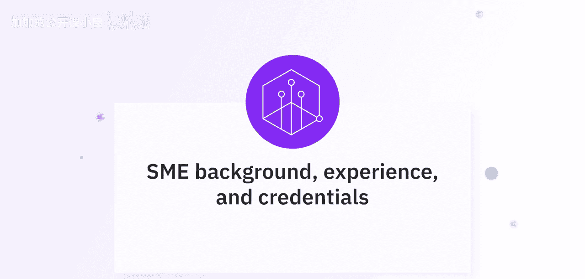
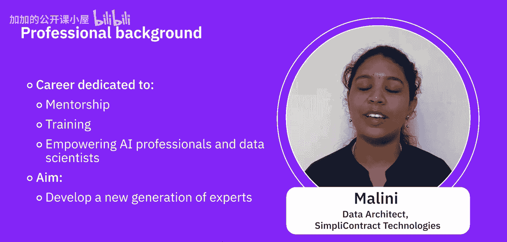

#  004：专家观点-中小企业介绍

在本节课中，我们将聆听来自人工智能领域多位专家的自我介绍。他们将分享各自的背景、专业领域以及在生成式AI方面的经验，帮助我们了解不同视角下的行业实践。

## 专家自我介绍

以下是参与本课程分享的专家们。

*   **Abhi Gagneja**：我是Abhi Gagneja，IBM的人工智能主题专家和研究员。
*   **Sepideh Sajadi**：我是Sepideh Sajadi，IBM K工程团队的一名AI工程师。很高兴能在这里与大家探讨生成式AI。
*   **Bradley Steinfeld**：我叫Bradley Steinfeld，是IBM的高级软件架构师。
*   **Mael**：我是Mael，在人工智能和数据工程领域拥有超过12年的经验。目前，我在Simply Contract Technologies担任数据架构师。
*   **Marty Bradley**：大家好，我是Marty Bradley，是Evergreen AI的首席执行官兼创始人。

## 专家背景与经验

上一节我们认识了各位专家，本节中我们来详细了解他们的专业背景和行业经验。

以下是专家们分享的个人经历与专长。

*   **Abhi Gagneja**：我的背景方面，我在加拿大滑铁卢大学获得了人工智能领域的博士学位，在此之前攻读的是机器人学硕士学位。完成学业后，我开始在这一领域工作，从事大数据分析。之后移居美国，我仍然在同一领域继续工作。最近，随着大语言模型和生成式AI的新趋势兴起，我一直在为我们的客户在不同的应用场景中实施和使用这项技术。
*   **Bradley Steinfeld**：我在IBM工作了超过10年，大部分时间都在教育领域的Skills Network团队工作。
*   **Marty Bradley**：我们在Evergreen AI从事多项业务，但专注于生成式AI。我们提供生成式AI培训、生成式AI战略咨询，帮助您理解生成式AI在组织中的定位。我们还有一个小的开发部门，可以帮助进行一些集成工作。但我为我们的一些培训项目感到自豪，这些课程旨在培训您组织中的每个人，包括AI基础、面向领导者的AI和高管AI。它向您展示如何使用现有的工具来完成工作，适用于那些希望了解如何立即在工作流程中使用AI以提升工作效率、实现百倍改进的人们。
*   **Mael**：我曾在银行、金融、电子商务、制造和制药行业工作过。每个行业都有其独特的挑战，这些经历丰富了我对数据和人工智能实际应用方面的专业知识和视角。除了处理数据和算法，我还将职业生涯的相当一部分投入到了指导和培训有抱负的AI专业人员及数据科学家。我的目标是培养新一代的专家，准备好应对我们数字世界不断演变的挑战。很高兴能与大家合作、学习并做出有意义的贡献。感谢大家的欢迎，我期待与大家一起踏上这段激动人心的旅程。

本节课中，我们一起聆听了来自IBM及行业其他公司的多位AI专家的介绍。他们分享了各自的角色、丰富的行业经验以及对生成式AI应用的见解，为我们理解这项技术在不同规模企业中的实践提供了宝贵的视角。