#  006：生成式人工智能的能力 🚀

在本节课中，我们将学习生成式人工智能（Generative AI）的核心能力，并探索其在现实世界中的应用。生成式AI能够根据给定的输入，创造出全新的、连贯的内容，其应用范围非常广泛。

## 概述

生成式AI的能力多种多样，几乎涵盖了人类能够设想的各种潜在应用场景。接下来，我们将逐一深入探讨这些核心能力。

## 文本生成能力 📝

上一节我们概述了生成式AI的多种能力，本节中我们来看看其文本生成能力。这是生成式AI生成清晰、流畅且符合上下文语境的文本响应的能力。

生成式AI文本生成能力的核心是先进的大语言模型（Large Language Models, LLMs）。这些模型在大型数据集上进行训练，能够生成类似人类的文本。

**核心模型示例**：
*   **GPT**：OpenAI的生成式预训练变换器。
*   **PaLM**：Google的Pathways语言模型。

这些模型可以执行多种语言相关任务，以下是其主要应用：

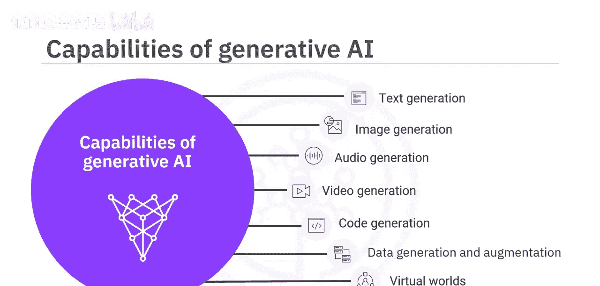

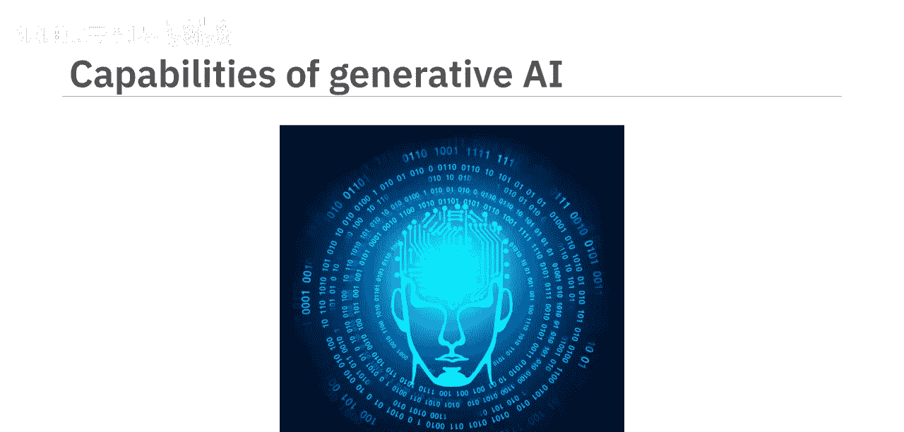

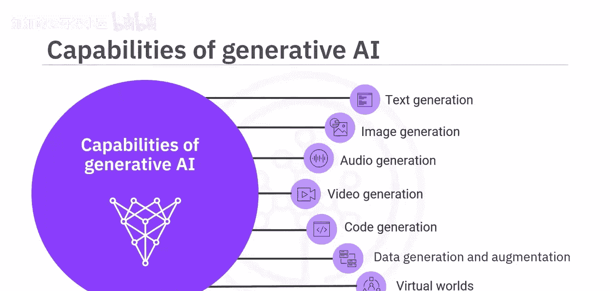

*   **文本补全与创作**：根据提示完成句子或文章。
*   **摘要**：将长文本浓缩为简短摘要。
*   **问答**：根据上下文回答问题。
*   **翻译**：在不同语言之间进行翻译。
*   **代码生成**：根据描述生成代码片段。
*   **图文配对**：为图像生成描述文本，或根据文本生成图像。
*   **对话交互**：为聊天机器人和虚拟助手提供动力。

## 图像生成能力 🎨

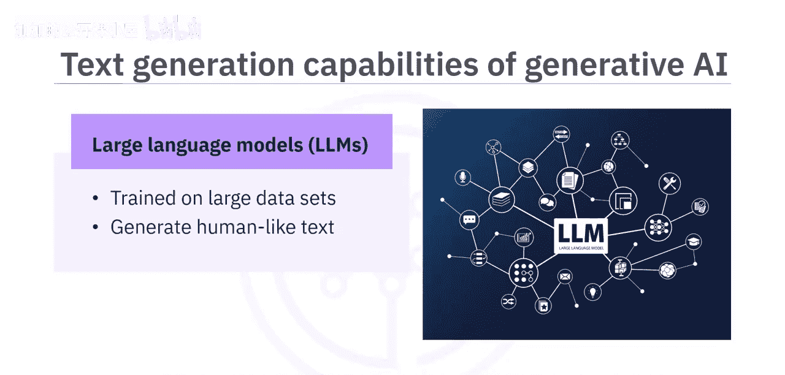

了解了文本生成后，我们转向视觉领域。生成式AI的图像生成能力是指其合成具有艺术性和真实感、与真实图像高度相似的图像。

这项能力主要基于生成对抗网络（GANs）和变分自编码器（VAEs）等深度学习技术。生成的图像具有逼真的纹理、自然的色彩和精细的细节。

以下是几个著名的图像生成模型及其应用：

*   **StyleGAN**：能生成高质量、高分辨率的虚构人脸、动物或自然景观图像。
*   **DeepArt**：能将简单的草图转化为完整的艺术作品。
*   **DALL-E**：能根据用户的文字描述生成全新的图像。

除了艺术、设计、娱乐和游戏领域，生成的图像还可用于**增强训练数据集**，并辅助**医学成像**和**科学可视化**。

## 音频生成能力 🎵

从静态图像过渡到动态声音，生成式AI在音频领域同样强大。其音频生成能力包括创作新的音乐作品、将文本转换为语音（TTS），以及创造合成语音和自然音效。

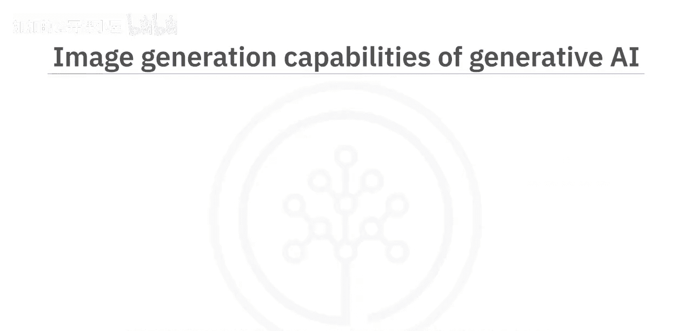

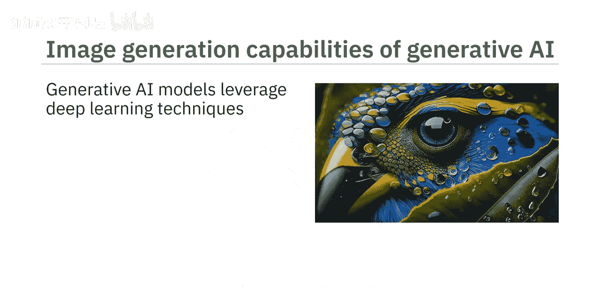

这些模型可以转换、修改、净化人声，降低噪音并提升音频质量，甚至能以相当高的相似度模仿人类声音。

以下是音频生成的应用实例：

*   **WaveGAN**：可以生成新的、逼真的原始音频波形，包括语音、音乐和自然声音。
*   **MuseNet**：能够结合多种乐器、风格和流派，生成新颖的音乐作品。
*   **Tacotron 2 & Mozilla TTS**：使用先进的TTS系统创建合成语音，模仿人类的音调、音高、节奏和表达。

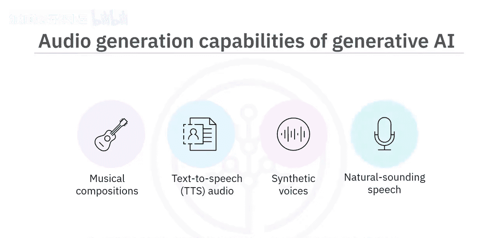

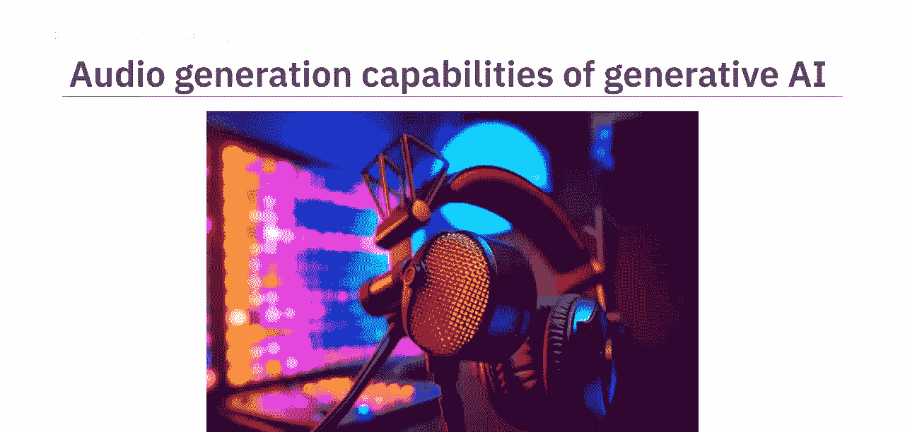

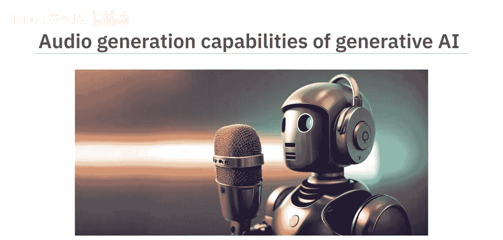

音频生成技术在**媒体制作、创意娱乐、教育培训、游戏及虚拟现实**等领域有广泛应用。

## 视频生成能力 🎬

接下来，我们看看生成式AI如何创造动态内容。生成式AI模型能够创建从基本动画到复杂场景的动态、清晰的视频。

这些模型通过融入**时间连贯性**，将图像转化为动态视频。时间连贯性确保了视频中动作的流畅性和过渡的自然性。

一个典型的例子是**VideoGPT**模型，它可以根据用户提供的文字提示生成新视频。用户可以指定期望的内容，从而指导视频的生成、编辑、合成和风格迁移。

生成的视频可用于**艺术、娱乐、教育、游戏、医学和研究**等多个领域。

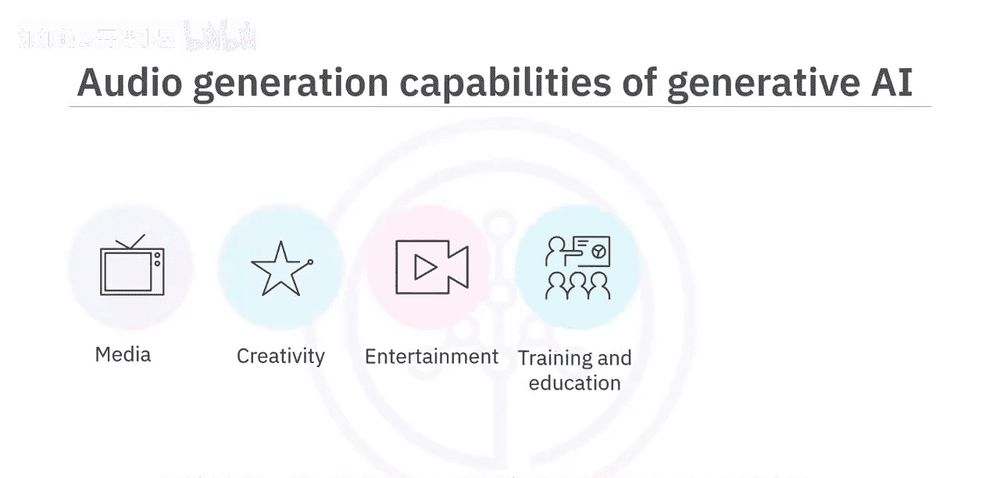

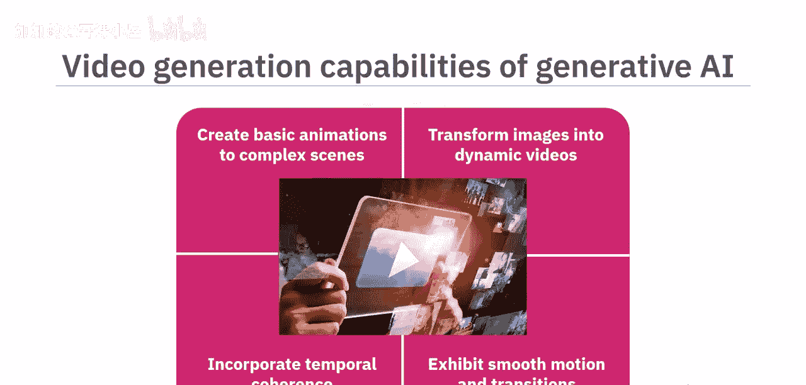

## 代码生成能力 💻

除了创作内容，生成式AI还能辅助生产工具。其代码生成能力是指模型根据所需功能，生成新的代码片段、函数或完整程序。

这些模型在现有代码库上进行训练，能够完成或创建代码、重构代码、识别并修复错误、测试软件以及生成包含注释和示例的文档。

以下是代码生成的应用工具：

*   **GitHub Copilot**：AI编程助手，帮助自动补全代码。
*   **IBM Watson Code Assistant**：基于AI的编程辅助工具。

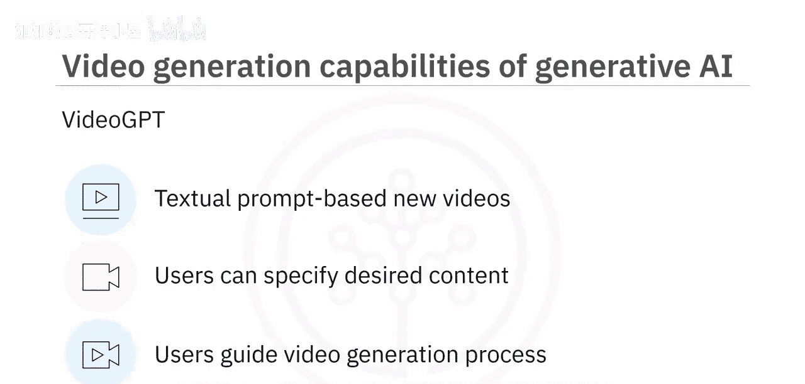

生成的代码可应用于**软件开发、机器学习、数据分析、机器人自动化以及游戏和AR/VR环境开发**。软件开发人员可以利用此能力来编写、调试和测试代码。

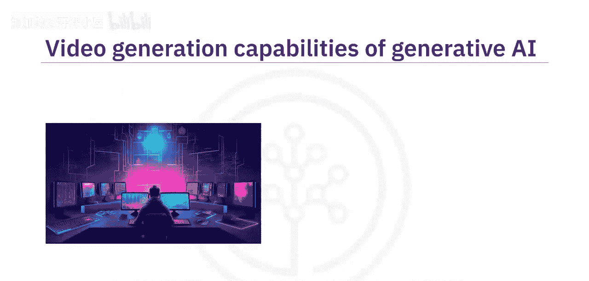

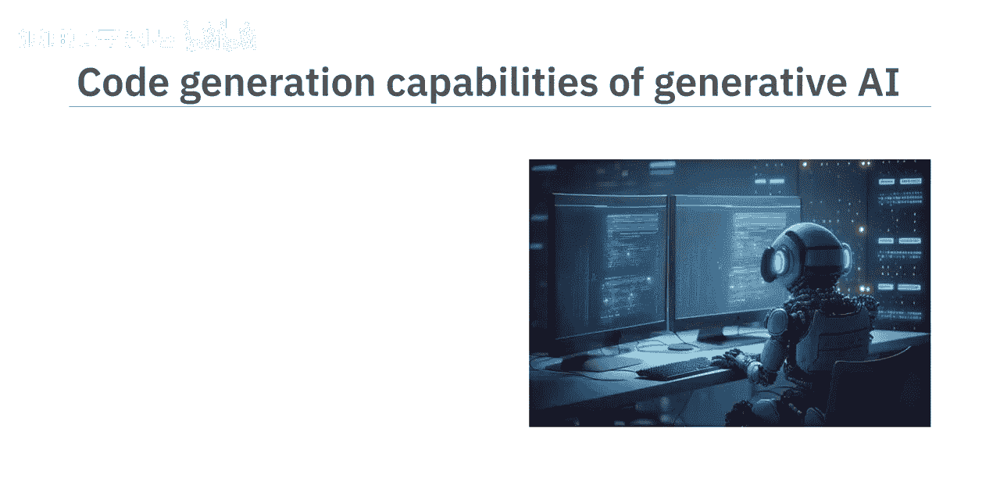

## 数据生成与增强能力 📊

在机器学习和数据分析中，数据至关重要。生成式AI的数据生成与增强能力是指模型能够生成新数据并扩展现有数据集。

生成合成数据集有助于增加数据的多样性和可变性，从而带来更强大、更有效的模型性能。

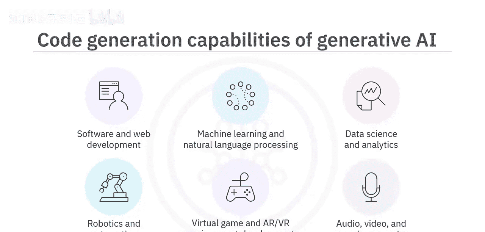

这些模型可以为以下类型的数据生成新样本或增强数据集：

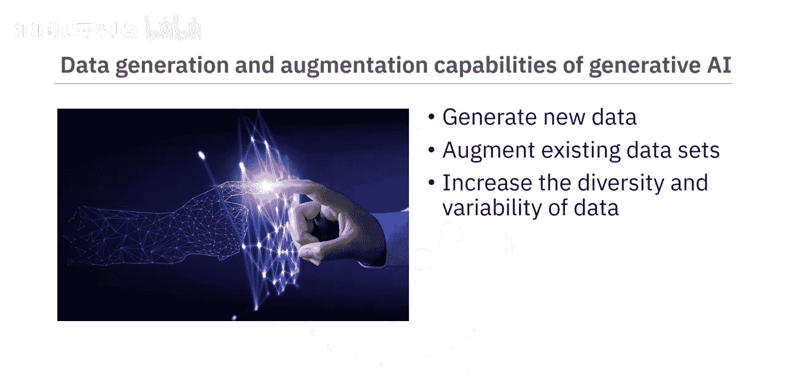

*   图像、文本、语音
*   表格数据和统计分布
*   时间序列数据、金融数据等

数据生成与增强能力在**医疗健康、游戏、教育培训、艺术创作以及自动驾驶**等领域有重要应用。

## 虚拟世界创造能力 🌐

最后，我们来探索生成式AI一个非常前沿的能力——创造高度逼真和复杂的虚拟世界。

你可以创建模拟真实行为、表情甚至决策的**虚拟化身**。也可以构建具有逼真纹理、声音和遵循物理世界规则的物体的**复杂虚拟环境**。

元宇宙平台利用生成模型为个体用户创造独特且个性化的体验。生成式AI还能创造具有独特个性的虚拟身份，其行为和交流能反映特定的个人特质。

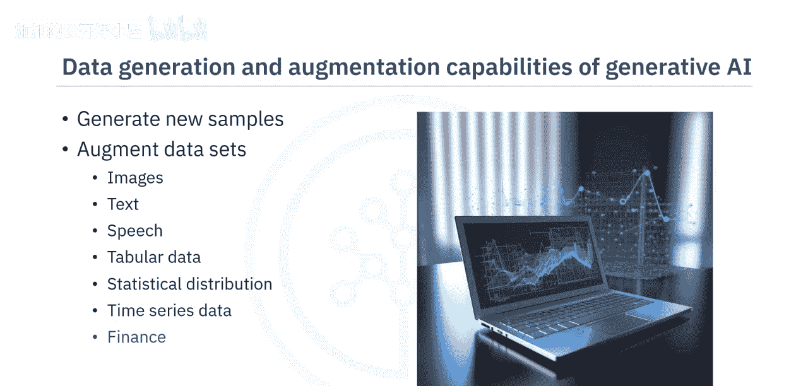

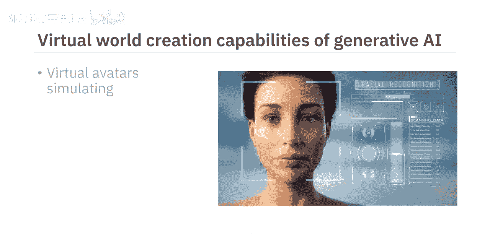

虚拟世界创造能力主要应用于**游戏娱乐、教育培训、增强与虚拟现实、元宇宙平台以及虚拟偶像和数字人格**。

## 总结

本节课中，我们一起学习了生成式人工智能模型的多种核心能力及其现实应用。我们了解到，生成式AI能够：

1.  创造连贯且符合语境的文本内容。
2.  生成逼真的高质量图像。
3.  合成语音、创作新音频和动态视频。
4.  生成和补全代码。
5.  合成新数据以增强现有数据集。
6.  创造高度逼真和复杂的虚拟世界，包括虚拟化身和数字人格。

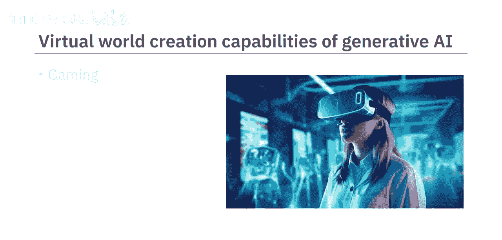

这些能力正在深刻改变内容创作、软件开发、数据分析和虚拟体验等多个领域。