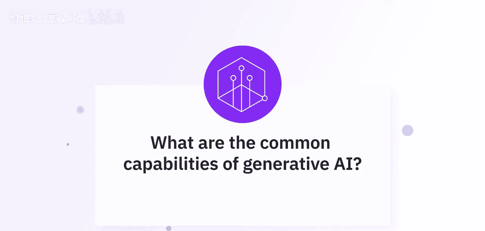
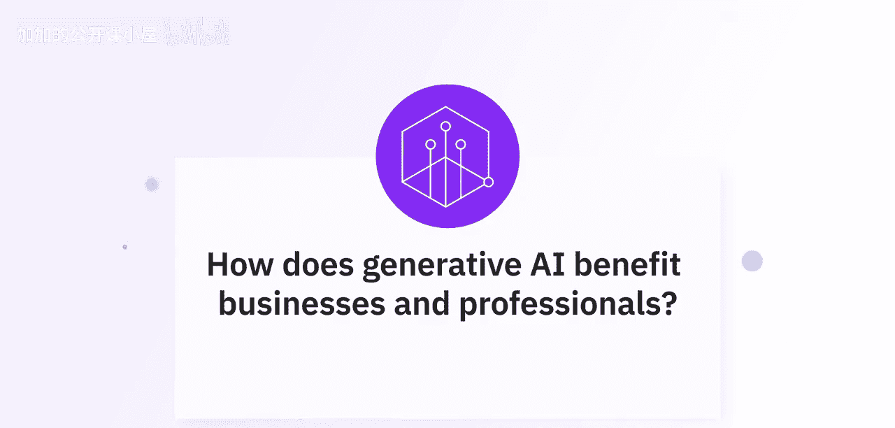
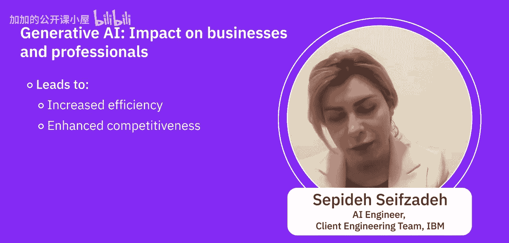

#  007：生成式人工智能的能力 🧠



在本节课中，我们将聆听AI专家们对生成式人工智能（Generative AI）核心能力的见解，了解它如何为企业和专业人士带来变革。

---

## 概述

生成式人工智能提供了一系列强大的能力，能够显著提升商业效率和专业工作流程。它不仅在内容创作方面表现出色，还能通过合成数据、增强检索等方式解决行业特定问题。本节我们将深入探讨这些核心能力及其应用场景。

## 生成式AI的核心能力

上一段我们提到了生成式AI的广泛影响，本节中我们来看看专家们具体列举了哪些关键能力。

以下是生成式人工智能的几个常见应用方向：

*   **内容创作**：生成式AI擅长创建文本、图像、音乐甚至视频，从而简化和加速市场营销与创意流程。
*   **文本处理**：基于大语言模型（LLM）的常见用例包括**摘要**、**信息提取**、**文本生成**和**分类**。
*   **模式与配置生成**：生成式人工智能的应用不仅限于生成原始数据，还包括生成模式、配置和设置等多种形式。


## 行业应用与典型案例



了解了基础能力后，我们进一步看看这些能力在具体行业中是如何落地的。

专家特别指出了生成式AI在行业中的广泛应用方式，其中合成数据能帮助各类行业解决实际问题。一个非常普遍且流行的用例是：

**检索增强生成（RAG）**
```python
# 概念性示例：RAG结合了信息检索与文本生成
retrieved_info = retrieve_from_private_documents(user_query)
final_answer = generate_answer_based_on(user_query, retrieved_info)
```
许多企业拥有大量不愿公开的私有文档，RAG技术可以帮助他们快速从这些文档中检索信息，而无需将数据暴露给公有云或公开环境。

## 生成式AI带来的商业价值

那么，这些技术能力具体能为企业和专业人士带来哪些益处呢？我们接下来听听专家的分析。

生成式AI并非华而不实的技术，它是一个改变游戏规则的工具。想象一个能激发创造力、理解需求并节省时间的数字助手，这正是生成式AI的作用。

以下是生成式AI带来的主要好处：

*   **提升效率与降低成本**：AI驱动的内容生成节省了时间，并通过自动化撰写报告、创建社交媒体帖子和设计图形等任务来降低成本。
*   **增强客户体验**：通过个性化推荐和交互式聊天机器人，生成式AI提升了客户参与度和满意度。
*   **加速创新与设计**：在设计和产品开发领域，它有助于快速原型制作，并通过快速生成多种设计变体来探索创新解决方案。
*   **赋能数据驱动决策**：所有上述任务共同助力于增强创造力、实现个性化体验并支持数据驱动决策。

## 跨行业应用实例

这些好处在不同行业中有更具体的体现。让我们看看专家分享的几个例子。

*   **医疗健康**：在医疗行业，合成数据生成和合成图像生成可以保护患者隐私（例如，为有特定医疗状况的人生成模拟图像），同时用于药物研发模式分析。
*   **金融**：生成式AI可用于欺诈检测和财务分析。
*   **创意与零售**：它能绘制精美的图画、撰写引人入胜的故事、像专家一样翻译语言，并提供个性化的产品、电影甚至职业路径推荐。
*   **培训与模拟**：在医疗保健和航空等领域，它可以创建逼真的模拟训练环境，使学习过程既安全又高效。

## 总结




本节课中，我们一起学习了生成式人工智能的核心能力与商业价值。总结来说，生成式AI通过自动化任务、激发创意和提供深度个性化，正在帮助各行各业提升效率、增强竞争力并最终提高客户满意度。它远不止是一个时髦概念，而是真正推动未来工作方式变革的实用技术。