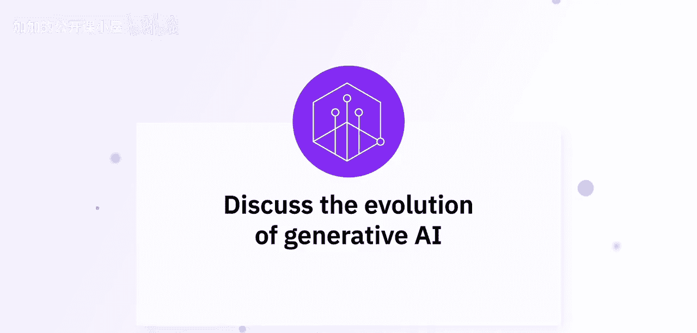
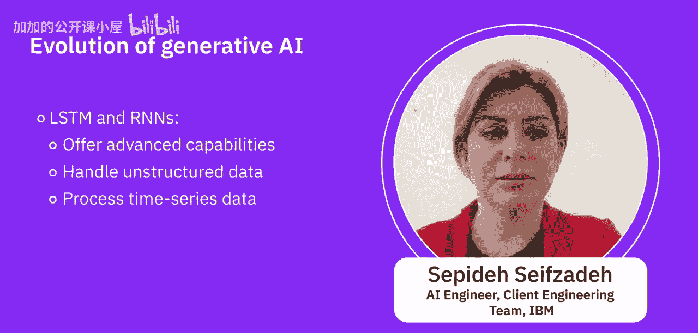
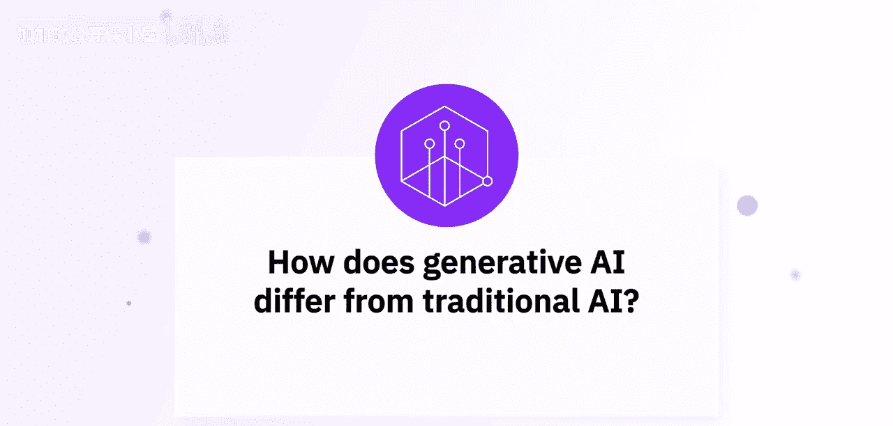

#  008：探索生成式AI的演变之路 🧠

在本节课中，我们将聆听专家们的见解，共同探索生成式人工智能的演变历程，并了解它与传统人工智能方法的区别。

---

## 概述

生成式人工智能并非全新概念，它已伴随人工智能领域发展超过二十年，但直到近年才获得广泛关注。随着技术的突破，它已成为行业的未来方向。本节我们将回顾其演变的关键阶段，并阐明其与传统AI的核心差异。

---

## 生成式AI的演变历程 📈

上一节我们介绍了课程概述，本节中我们来看看生成式AI是如何一步步发展至今的。其演变历程以创造新颖原创内容能力的显著进步为标志。

早期的生成式AI模型在内容的连贯性和质量上有所不足。但自从GPT-3、GPT-4以及DALL-E等模型出现后，它们能够生成高度复杂的文本和图像，极大地增强了各领域的创造力和自动化水平。

以下是其演变过程中的几个关键阶段：

1.  **规则驱动模型**：最初的系统严格遵循预设的规则和上下文工作，灵活性有限。
2.  **机器学习与统计模型**：这类模型能够从数据中发现模式。通过**半监督学习**、**监督学习**或**强化学习**，它们比规则系统更智能，能识别复杂模式。
3.  **深度学习与神经网络**：这类技术能以更先进的方式处理数据集中的模式，并有效应对非结构化数据。
4.  **生成对抗网络**：GANs的诞生标志着生成任务的新时代，能够生成全新的数据。
5.  **Transformer与大型语言模型**：以2017年《Attention Is All You Need》论文为里程碑，基于Transformer架构的模型（如各类GPT模型）开启了新纪元。其核心思想是使用海量数据预训练一个基础模型，然后可以轻松地针对特定任务进行微调。

如今，我们拥有像变分自编码器和GANs这样的“超级英雄”模型。VAE学习数据模式以生成类似内容，而GANs通过一个巧妙的“对抗”过程，能制作出超逼真的图片和艺术作品。自回归模型则逐步生成内容，特别擅长处理语言相关的任务，如对话和写作。

---

## 生成式AI与传统AI的区别 ⚖️

了解了生成式AI的发展路径后，我们自然会问：它和传统AI究竟有何不同？本节将重点探讨这一区别。

传统AI主要专注于分析和预测现有数据，典型任务包括**分类**、**回归**和**推荐**。它是在已有信息中寻找答案或规律。

相比之下，生成式AI，特别是在GANs和Transformer模型出现后，其核心目标是创造新的、与训练数据相似的内容。可以说，传统AI是执行指令的分析师，而生成式AI是能够自主创新的发明家。

人工智能在过去五六十年里，经历了从基础理论到应用和预测层面的发展。而生成式AI更侧重于利用AI技术生成类人的高质量输出内容，这代表了AI能力从“理解与预测”向“创造与生成”的范式转变。

---

## 总结

本节课中，我们一起学习了生成式AI的演变之路及其与传统AI的根本区别。我们回顾了从规则系统到现代大型语言模型的技术发展脉络，并明确了生成式AI的核心特征在于其**创造性**——它不仅能分析世界，更能生成全新的文本、图像和想法。理解这一演变和区别，是掌握生成式AI潜力的关键第一步。