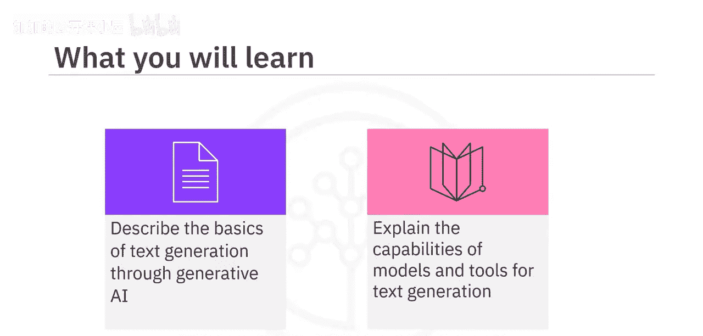
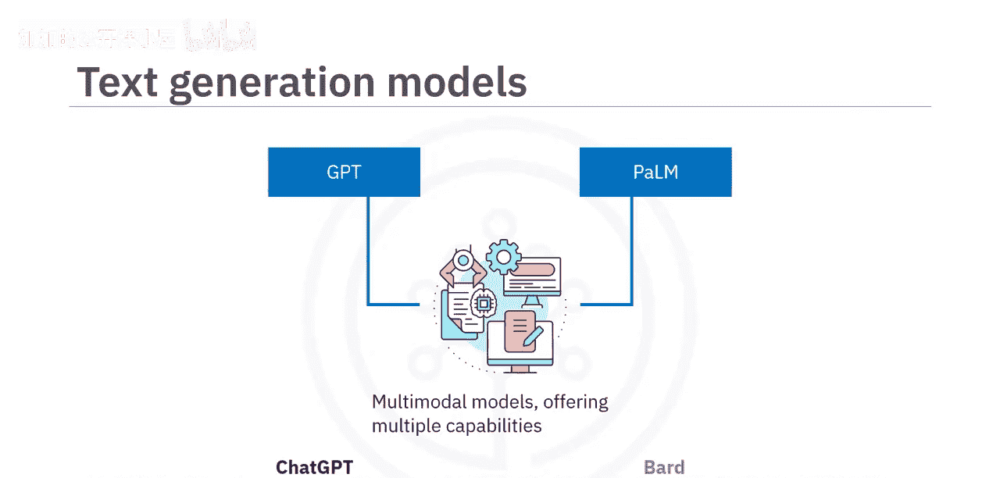
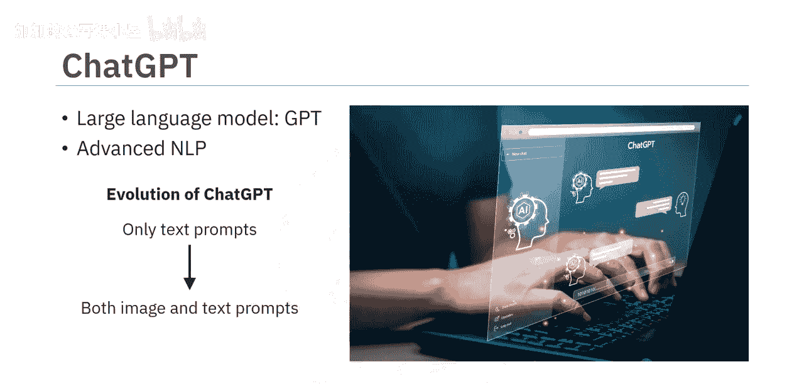

#  010：文本生成工具 🛠️

在本节课中，我们将要学习文本生成工具的基础知识。你将能够描述生成式AI进行文本生成的基本原理，并解释常见模型和工具的核心能力。

## 文本生成的核心：大语言模型

生成式AI文本生成能力的核心是大语言模型。大语言模型基于训练期间学习到的模式和结构，通过解读上下文、语法和语义来生成连贯且符合语境的文本。它们通过分析词语和短语之间的统计关系，能够适应任何给定语境下的创意写作风格。

大语言模型是许多文本生成模型的基础，其中两个典型例子是生成式预训练变换器（GPT）和PaLM。这些模型已发展为多模态模型，提供多种能力。

上一节我们介绍了文本生成的基础模型，本节中我们来看看基于这些模型的具体工具。

## 两大流行工具：ChatGPT 与 Bard

让我们通过两个流行工具来了解这些模型的能力：ChatGPT 和 Bard。

### ChatGPT

ChatGPT 基于 **GPT** 这一大语言模型，并使用了先进的自然语言处理技术。最初，ChatGPT 仅接受文本提示作为输入来生成新内容。而在新版本中，它已能同时接受图像和文本输入。

ChatGPT 为文本生成提供了多样化的能力，尤其擅长进行流畅且基于上下文的对话。

以下是 ChatGPT 的一些关键能力示例：

*   **进行对话式学习**：你可以开启一段对话来学习一个概念。例如，输入提示：“我听说过生成式AI，想了解更多。” ChatGPT 会根据上下文提供基本信息。当你进一步推进对话，提出更具体的问题时，它也能基于你提供的上下文和问题进行回应。
*   **协助创意任务**：它可以帮助你完成各种创意任务。例如，输入提示：“帮我创建幻灯片来展示一个学习平台的功能。” ChatGPT 会为特定幻灯片提供标题、内容和视觉元素的建议。
*   **多语言支持**：虽然 ChatGPT 最精通英语，但它也能理解并用多种其他语言进行回应。例如，提示它“用法语和西班牙语写‘你好’”，它就能生成所需的输出。因此，它也是学习新语言或任何科目的有用工具。

### Google Bard

另一个流行的文本生成工具是 Google Bard。它基于谷歌的先进语言模型 **PaLM**。PaLM 是变换器模型与谷歌 Pathways AI 平台的结合。Pathways AI 基于“路径”构建，这些路径是负责特定任务的专门模块，例如自然语言处理或机器翻译。

除了庞大的文本和代码训练数据集，Bard 还会从互联网上的资源中提取信息来回应提示。你可以尝试不同的提示来探索 Bard 的能力。

以下是使用 Bard 的示例：

*   **获取信息摘要**：尝试使用提示来获取某个主题的最新新闻摘要。例如：“提供关于乌克兰战争的最新新闻摘要。” Bard 会提供多个版本的草稿作为回应，你可以选择其中一个或重新生成。
*   **生成创意或解决问题**：尝试让它为推广一个时尚品牌提供数字营销活动的策略。它会为营销活动提供一个逐步推进的方法。

## 其他能力与工具选择

ChatGPT 和 Bard 还提供其他有价值的用例能力。例如，它们可以通过这些科目帮助你进行基础数学、统计和问题求解。它们也精通财务分析、投资研究、预算编制等。此外，ChatGPT 和 Bard 可以生成代码，并跨多种编程语言和框架执行与代码相关的任务。

在与 ChatGPT 和 Bard 都进行交互后，你会发现：**ChatGPT 在生成动态响应和维持对话流方面更有效**；而 **Bard 在研究某个主题的最新新闻或信息方面可能是更好的选择**，因为它可以通过谷歌搜索和谷歌学术访问网络资源。

需要认识到的是，包括 GPT 和 PaLM 在内的生成式AI模型都在不断发展，因此它们的能力和特性可能会发生变化。

## 更多文本生成工具

除了 ChatGPT 和 Bard，还有其他文本生成工具。

以下是其他一些商业文本生成工具：

*   **Jasper**：生成符合品牌声音的、任意长度的高质量营销内容。
*   **Writesonic**：为博客、电子邮件、SEO元数据和社交媒体广告创建高质量内容的宝贵工具。
*   **Copy.ai**：擅长为社交媒体、营销和产品描述创建内容。
*   **Rytr**：为不同类型的文本（如文章和博客、广告和营销）提供特定模板。

还有一些工具可用于特定用例：

*   **摘要工具**：例如 `resumer`，可以通过提取关键思想或概念来生成文本摘要。
*   **分类工具**：例如 `youclassifier`，用于为一段文本分配一个或多个类别。
*   **情感分析工具**：例如 `Brand24` 和 `Repustate`，用于生成反映人类语言中所表达的基础情感的文本。
*   **多语言翻译工具**：例如 `Language Weaver` 和 `Yandex.Translate`。

## 隐私考量与开源替代方案

需要注意的是，许多开源的生成式AI工具会收集并审查与其共享的数据，以改进其系统。这是在交互时需要考虑的重要因素，以避免共享任何机密或敏感信息。

那么，我们是否有开源的、保护隐私的替代方案呢？答案是肯定的。

以下是开源且注重隐私的文本生成工具示例：

*   **GPT4All**：可以安装在你的机器上，作为一个无需互联网或图形处理单元的、具有隐私意识的聊天机器人运行。
*   **H2O AI** 和 **PrivateGPT**：这些聊天机器人旨在通过在没有互联网连接的本地机器上运行，利用大语言模型的能力来保护用户隐私。

不仅如此，你还可以通过将这些工具链接到你组织的文档和数据库，为在特定组织内使用而定制它们。

## 文本生成工具的优势

基于生成式AI的文本生成器提供了多项优势：

*   **优秀的学习助手**：提供分步解释。
*   **提升效率**：能够快速生成不同形式的文本，为作者和创作者提高效率。
*   **激发创造力**：增强创造力并激发新想法。
*   **充当虚拟助手**：通过实现引人入胜的互动对话，可用作虚拟助手和聊天机器人。
*   **提高生产力**：通过自动化重复性写作任务，可以提高组织的生产力。
*   **支持全球化**：借助多语言支持，能够实现全球受众的沟通和内容本地化。

## 总结

本节课中我们一起学习了文本生成工具。我们了解到，大语言模型通过解读上下文、语法和语义来生成连贯且符合语境的文本。大语言模型是许多生成模型的基础。两个流行的生成工具是 OpenAI 的 ChatGPT 和 Google 的 Bard。ChatGPT 基于 GPT，而 Bard 基于 PaLM。两者都能生成不同类型的文本、翻译语言，并以互动和信息丰富的方式回答你的问题。我们还讨论了一些其他工具，包括 Jasper、Copy.ai、Writesonic。开源的、保护隐私的文本生成器包括 GPT4All、H2O AI 和 PrivateGPT。