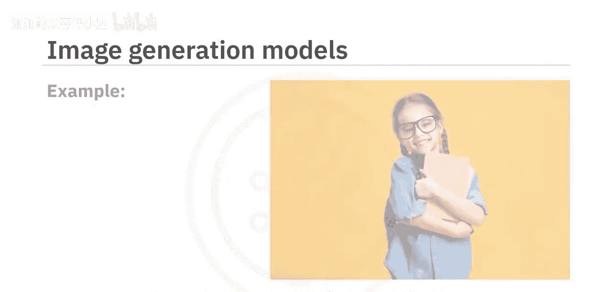
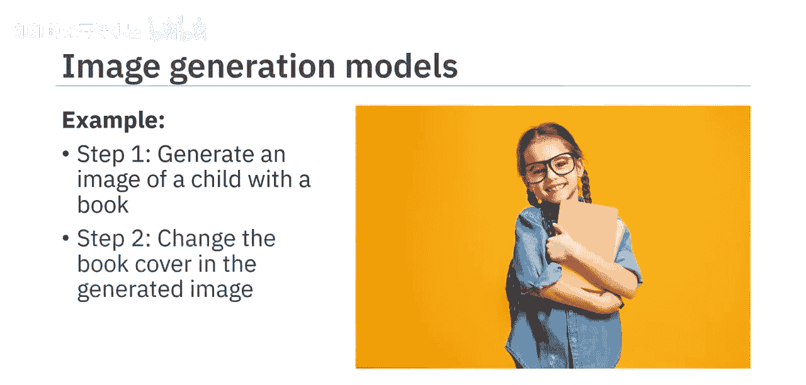
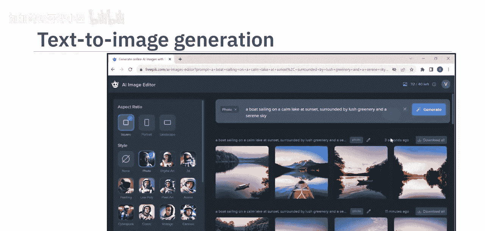
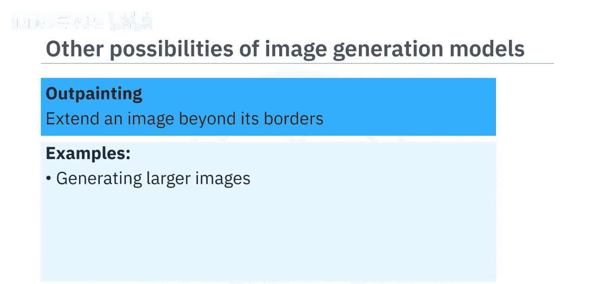
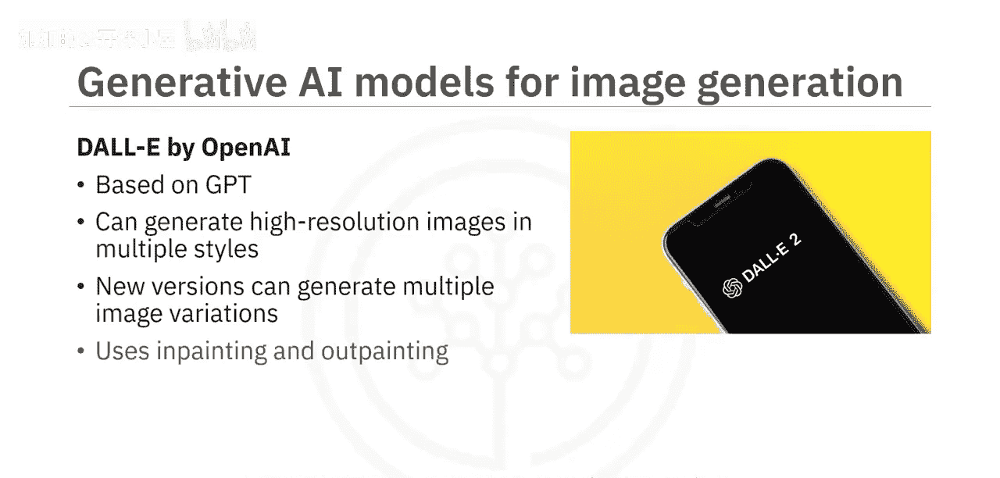
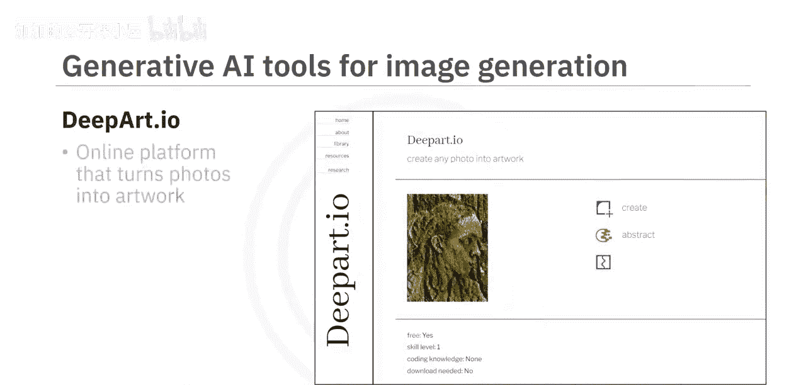
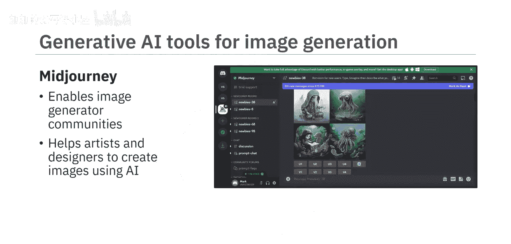
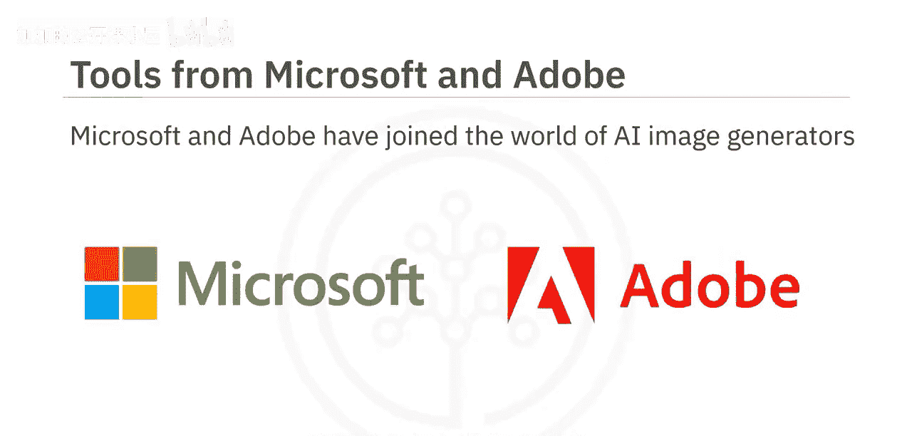
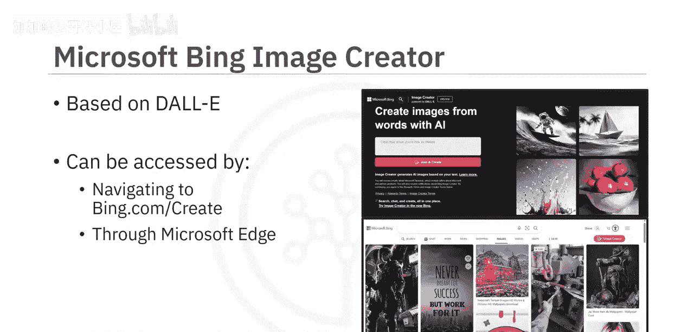
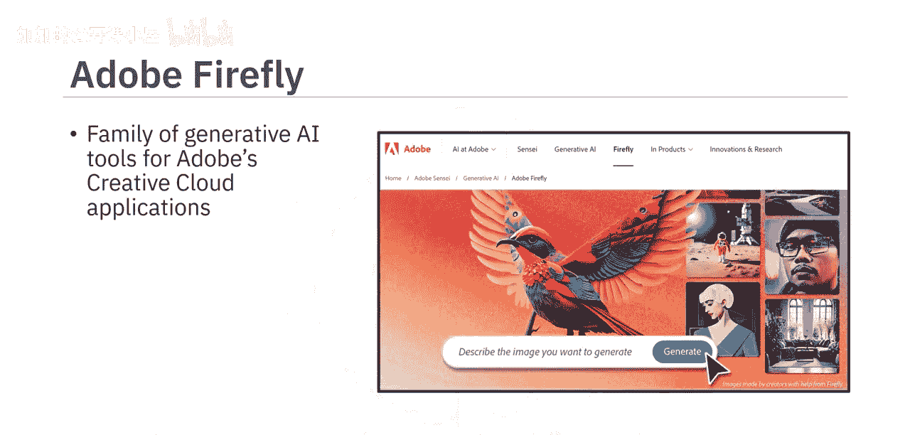

#  011：图像生成工具 🎨

在本节课中，我们将学习生成式AI在图像生成领域的基本能力，并介绍几种主流的图像生成模型与工具。通过学习，你将能够描述这些模型的核心功能，并了解如何利用它们来创造和编辑图像。

## 图像生成基础

生成式AI图像生成模型能够根据文本描述创建全新的图像，并能对现有图像（无论是真实的还是生成的）进行定制化修改，以获得期望的输出。例如，你可以生成一个“小女孩手拿一本书”的图像，随后还可以将书中封面的颜色更改为你想要的色彩。

## 实践：使用免费工具生成图像

接下来，我们通过一个免费的AI图像生成器FreePik来实际生成一张新图像。操作的核心是输入一段描述你想要的图像的文本提示。

例如，你可以输入以下提示词：“一艘船在日落时分的平静湖面上航行，周围是郁郁葱葱的绿树和宁静的天空。” 请记住，**提示词中描述图像的词语决定了生成图像的准确性和质量**。

选择你偏好的风格后，点击生成。工具会生成多张候选图像供你选择下载。如果对结果不满意，你可以通过修改提示词来重新生成。

## 图像生成模型的进阶能力

上一节我们体验了基础的文本生成图像，本节中我们来看看图像生成模型更广泛的应用可能性。

以下是几种关键的图像处理能力：

*   **图像到图像转换**：指将图像从一个领域转换到另一个领域，同时保留原始的内容和风格。例如：
    *   将草图转换为逼真图像。
    *   将卫星图像转换为地图。
    *   提升安防摄像头图像的分辨率与细节。
    *   增强医学影像。
*   **风格迁移与融合**：提取一张图像的风格，并将其应用到另一张图像上，从而创建混合或融合图像。例如，将一幅画作的风格应用到一张照片上。
*   **图像修复**：重建图像中缺失或损坏的部分，使其变得完整。可用于：
    *   艺术品修复。
    *   法证分析。
    *   移除图像中不需要的物体，同时保持画面的连续性和上下文。
    *   在增强现实中，将虚拟物体无缝融入真实场景。
*   **图像扩展**：通过生成与原始图像风格一致的新部分来扩展原图边界。可用于：
    *   生成更大尺寸的图像。
    *   提升图像分辨率。
    *   创建全景视图。

## 主流图像生成模型

生成模型和工具的能力随着其底层模型的进化而不断发展。以下是几个重要的模型：

*   **OpenAI的DALL-E**：基于GPT模型，在庞大的图像及其文本描述数据集上训练而成。DALL-E能够生成多种风格的高分辨率图像，包括照片级真实感图像和绘画风格图像。其新版还提供了生成多种图像变体，以及通过图像修复和扩展进行图像转换的能力。
*   **Stable Diffusion**：一个开源的“文生图”扩散模型。扩散模型是一类能创建高分辨率图像的生成模型。Stable Diffusion主要根据文本提示生成图像，但也支持图像到图像转换、修复和扩展。
*   **NVIDIA的StyleGAN**：该模型将图像内容和图像风格分开建模，从而能精确控制风格，并操纵特定特征（如姿势或面部表情）。StyleGAN已进化到能生成具有更逼真细节的高分辨率图像。

## 常用图像生成工具

了解了核心模型后，我们来看看一些可供使用的具体工具。

以下是几款可以探索生成式AI文生图能力的免费工具，它们能以不同的形式和风格生成图像：

*   **Craiyon**
*   **FreePik**
*   **Pixlr**

此外，**Photoor**和**Deep Art Effects**提供了多种预训练风格，允许你创建自定义风格。**DeepArt.io**是一个在线平台，能将照片转化为不同艺术风格的作品。

**MidJourney**是一个独特的平台，它构建了一个图像生成社区，帮助艺术家和设计师使用AI创作图像，并相互探索彼此的作品。

## 集成与商业应用

许多生成式AI图像生成器也提供API接口，允许开发者将其功能嵌入到不同的软件程序和工具中。一些提供API的流行图像生成器包括DALL-E、MidJourney和Craiyon。

科技巨头也已涉足AI图像生成领域。

*   **Microsoft Bing Image Creator**：基于DALL-E模型。你可以通过访问`Bing.com/create`或在Microsoft Edge浏览器中使用此工具。这使得Microsoft Edge成为首个集成AI图像生成器的浏览器。

*   **Adobe Firefly**：这是一系列生成式AI工具，旨在与Adobe Creative Cloud应用程序（如Photoshop和Illustrator）集成。Firefly使用Adobe Stock图片、公开授权内容和公共领域内容进行训练。

Firefly支持超过100种语言的文本提示，并包含多种工具，允许你操控颜色、色调、光照、构图，以及使用生成式填充、文本效果、生成式重新着色、3D转图像和图像扩展等功能。

## 总结

本节课中我们一起学习了生成式AI在图像生成领域的核心知识。我们了解到，基于生成式AI的模型和工具不仅能通过文本或图像提示生成新图像，还具备图像到图像转换、风格迁移、图像修复和扩展等能力。几个突出的图像生成模型包括**DALL-E**、**Stable Diffusion**和**StyleGAN**。市场上有多种图像生成工具，提供多样化的图像生成与变换功能，部分工具还能通过API集成。最后，我们还介绍了**Adobe Firefly**——一套旨在与Adobe创意云应用程序深度集成的生成式AI工具家族。

