#  012：音频与视频生成工具 🎵🎬

在本节课中，我们将学习生成式AI在音频和视频内容创作领域的应用。我们将了解这些工具如何工作，它们具备哪些关键能力，以及如何利用它们来制作有影响力的媒体内容。

---

## 概述

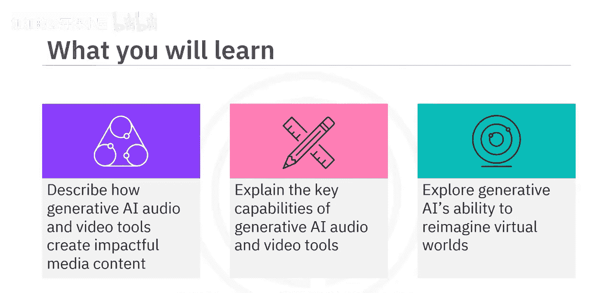

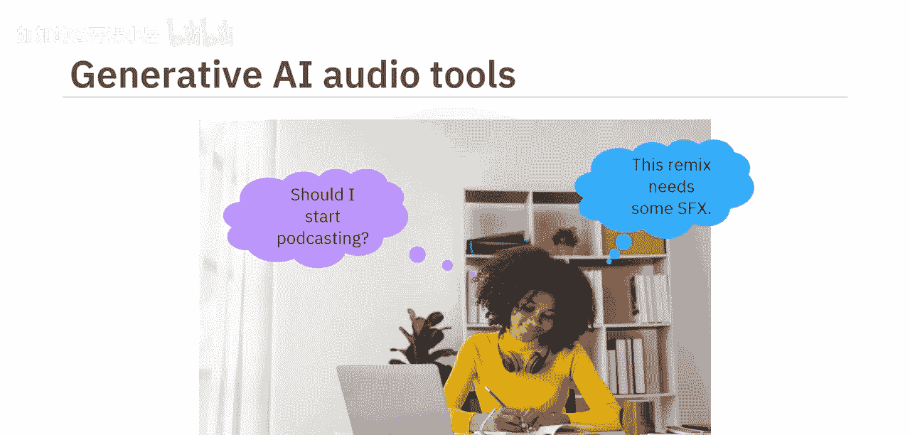

生成式AI正在改变音频和视频内容的创作方式。市场研究机构Market US估计，生成式AI音乐市场在2022年价值2.29亿美元，预计到2032年将以28.6%的年复合增长率增长至26.6亿美元。生成式AI音乐正是利用其音频生成能力创造的。过去几年，这些能力帮助公司和个人，无论是新手还是经验丰富者，简化了流程，将复杂的创意变为现实。

## 生成式AI音频工具

生成式AI音频工具主要分为三类：语音生成工具、音乐创作工具和音频质量增强工具。

### 语音生成工具

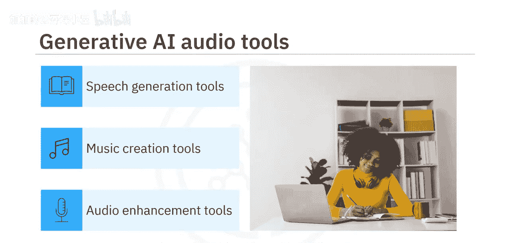

语音生成工具主要是**文本转语音**工具，它们将文本转换为音频。虽然朗读技术并不新鲜，但生成式AI架构升级了这项技术的工作方式。深度学习算法在大量人类语音数据集上反复训练，使它们能够分解并高效复制发音、语速、情感和语调等声音特征。因此，生成式AI TTS工具能创造出更准确、更自然的语音，这对有视觉障碍、语言障碍或其他阅读困难的人尤其有帮助。

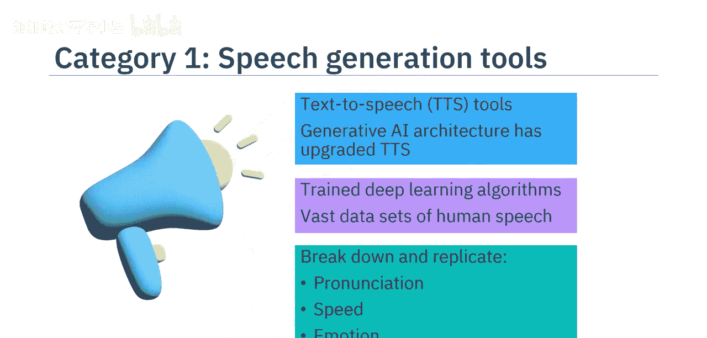

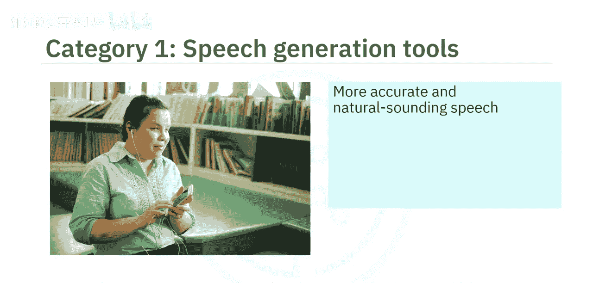

从趣味性角度看，这些工具可以帮助你“听”文章、反馈和笔记，这可能比阅读它们更容易。它们还能帮助你更好地沟通。

以下是语音生成工具的一些应用示例：
*   如果你想以一种出众的方式为你的演示文稿配音，你可以登录**LOVO**、**Cynthesia**、**Murf.ai**或**Listnr**等平台。
*   你可以从庞大的AI语音库、语言或情感中选择。
*   你甚至可以创建独特的声音或克隆你自己的声音。
*   一些工具还允许你编辑音轨的发音、语调和语速，以制作出听起来专业的最终产品。

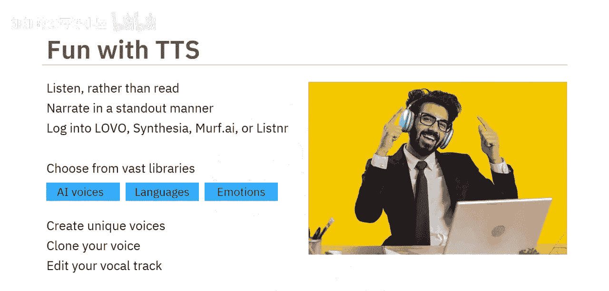

### 音乐创作工具

假设在一个阳光明媚的下午，你内心的业余音乐家感到灵感迸发。你可以尝试**Meta的AudioCraft**，这是一个在音效和20,000小时Meta自有或授权音乐上预训练的生成式AI工具。

以下是可用的音乐创作工具及其功能：
*   还有**Shutterstock的Amper Music**、**AIVA**、**Soundful**、**Google的Magenta**和**G4驱动的Wave工具**。
*   这些工具让你可以从广泛的音乐库、不同的音乐流派、乐器风格和旋律中进行选择。
*   你只需要输入一个基于你需求的文本提示，工具就可以根据你的请求创作简短的旋律或即兴重复段、建议或添加乐器、创作一首新歌，或为你的下一个YouTube或Instagram视频制作配乐。
*   生成式AI还可以帮助你混音、母带处理，并将最终的音乐作品发布到流行的流媒体平台上。

### 音频增强工具

你甚至可以使用音频增强工具。这些工具经过预训练，能够识别特定声音，可以为你的音频添加有趣的声音或去除不需要的噪音。

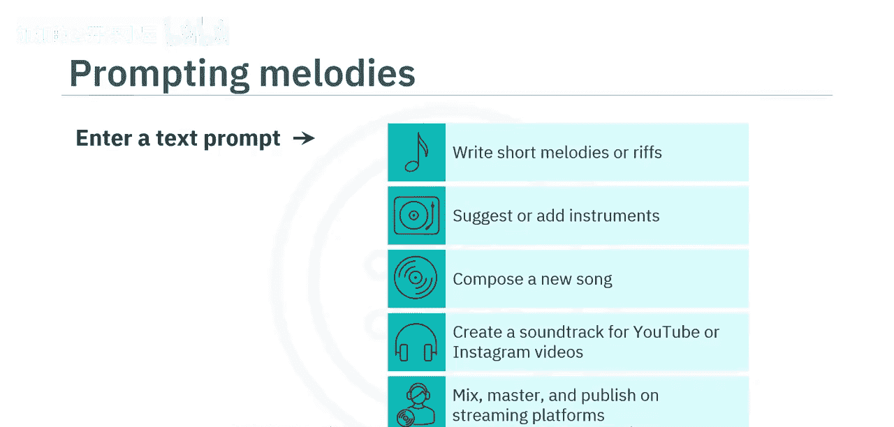

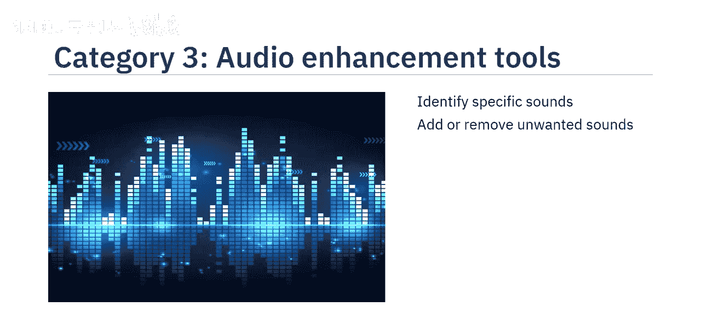

以下是音频增强工具的例子：
*   例如，**Descript**可以帮助你消除背景噪音、增强低质量录音并添加所需的音效。
*   **Adobe Audition**可以清理文件中的 unwanted noise。
*   许多音乐生成工具也具备音频编辑和增强能力。

## 生成式AI视频工具

有些项目需要的不仅仅是精选的音效。在2022年，**Runway AI**利用生成式AI能力制作了奥斯卡获奖电影《瞬息全宇宙》。即使你不制作大型电影，也可以在日常生活中使用生成式AI视频工具。

假设你正在制作一部关于你所在城市树木缺乏的纪录片。你可以登录**Runway的Gen-1工具**，它将现有的视频片段转换成不同的风格；或者使用**Runway的Gen-2工具**，通过文本、图像或视频输入来创建视频。

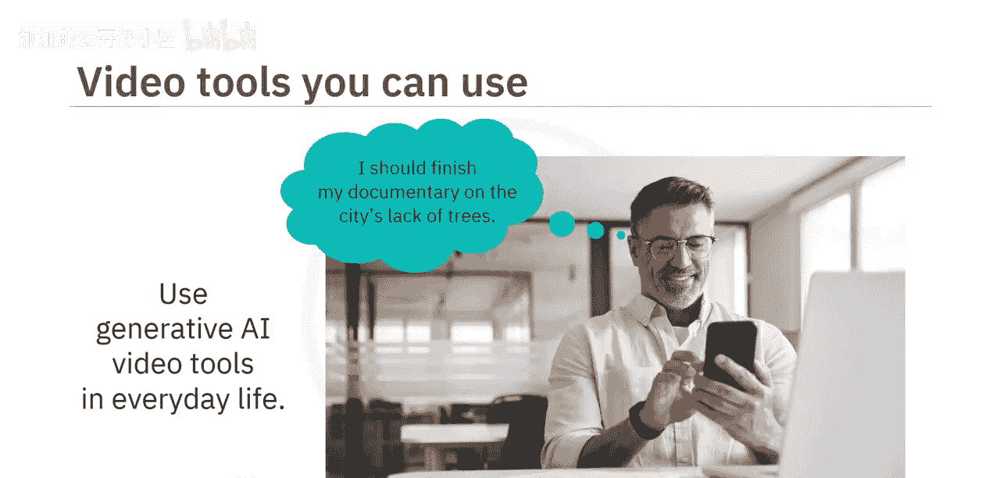

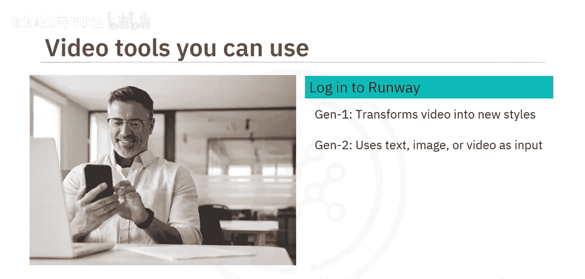

以下是视频工具的功能：
*   或者，你可以使用**E.U.的视频工具包**或**Synthesia**应用程序。
*   这些工具允许你上传照片。如果你没有任何照片，可以使用文本提示来生成你需要的图像。
*   此外，你还可以使用这些工具录制旁白、增强音频、转换视频文件格式并发布你的视频。
*   Synthesia甚至允许你创建自定义头像，以增强品牌记忆度。

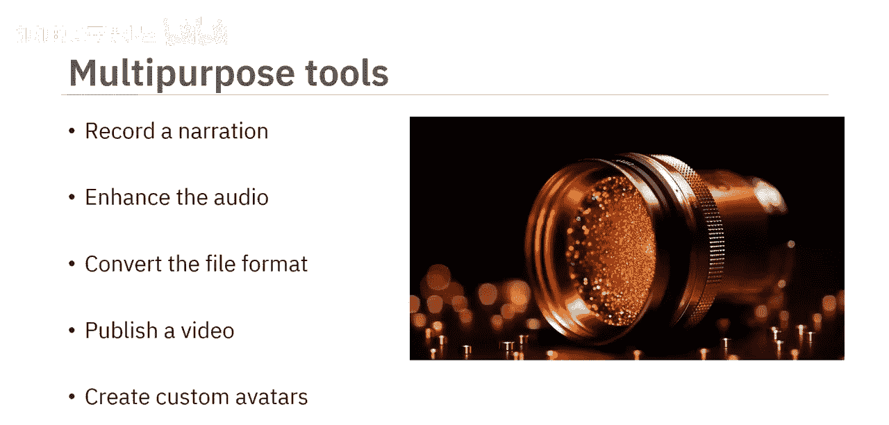

## 生成式AI与虚拟世界

生成式AI可以增强你的虚拟世界体验。你可以创建具有混合特征和异域景观的独特、富有想象力的虚拟世界。生成模型还可以实时响应，提高模拟的准确性。

以下是生成式AI在虚拟世界中的应用：
*   元宇宙平台利用生成式AI创造更个性化、更具吸引力的用户体验。
*   游戏元宇宙允许你快速生成3D对象，甚至创建配备特定个性特征的虚拟形象，这些特征会反映在他们的表情、行为、对话和决策中。
*   例如，**The Sandbox**是一个元宇宙，用户可以在其中即时构建、拥有并向全球推广他们的游戏。
*   **Scenario AI**帮助创建和连接定制的移动游戏资产。

## 总结

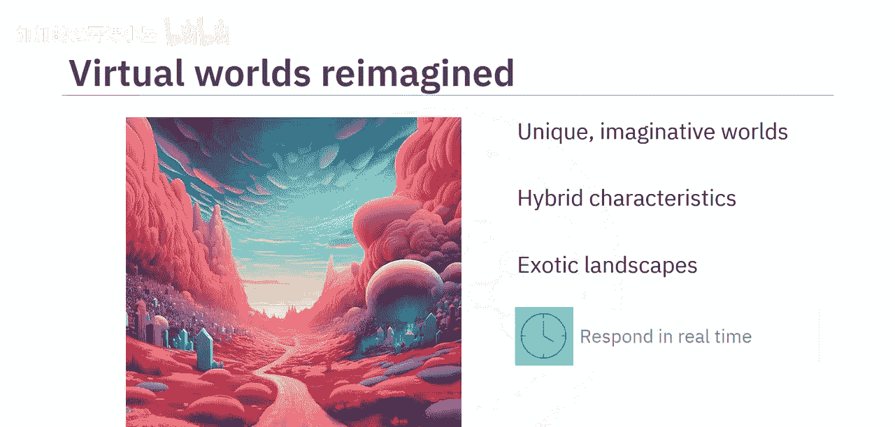

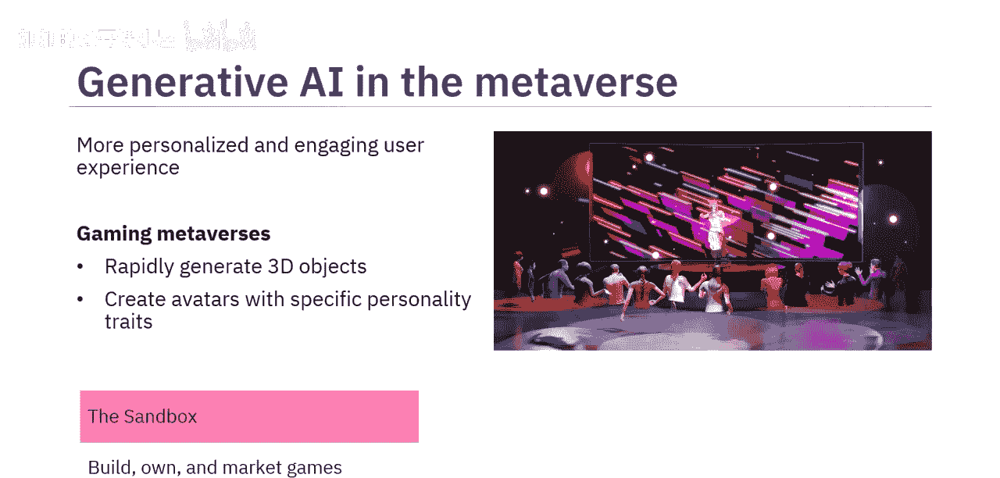

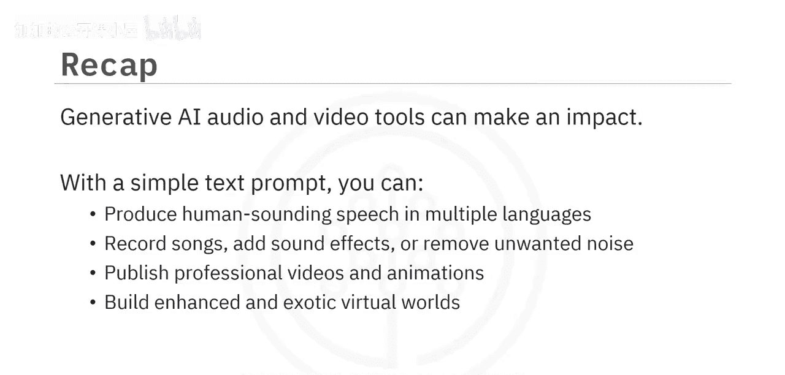

本节课中，我们一起学习了生成式AI音频和视频工具如何产生影响。通过一个简单的文本提示，你可以制作出多种语言的人声语音、录制歌曲、添加音效或去除 unwanted noise。你还可以制作视频和动画，构建增强版的和充满异域风情的虚拟世界。这些工具极大地降低了专业媒体内容创作的门槛，为项目经理和内容创作者提供了强大的支持。