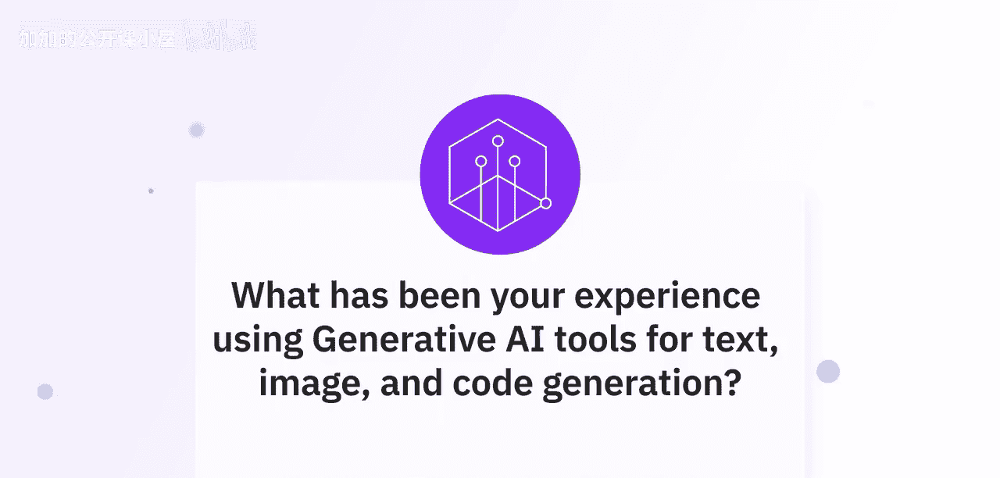
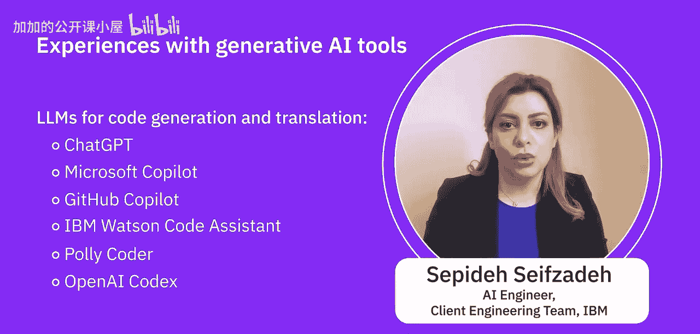

#  014：利用生成式AI工具 🛠️

在本节课中，我们将学习AI专业人士分享他们使用生成式AI工具（用于创建文本、图像和代码）的个人经验，并探讨使用这些工具的益处与挑战。

## 专家经验分享

上一节我们介绍了课程概述，本节中我们来听听专家们的实际使用体验。

以下是AI专业人士分享的关于不同类型生成式AI工具的使用心得：

*   一位专家表示，他广泛尝试了文本生成、代码生成、图像、视频、音乐、3D文件等各类生成式AI。他明确指出，目前**文本生成**和**代码生成**工具在首次尝试时就能获得理想结果方面表现最佳。这不仅因为这些模型经过了更多优化，也因为网络上存在大量关于如何精心设计提示词以获得优质输出的指南。
*   另一位专家强调，**没有一个大型语言模型能够应对所有不同的生成式AI用例**。对于任何特定任务，都可以考虑并使用多个大型语言模型。这些模型可能由开源社区提供，也可能由具备训练能力的组织提供。此外，还存在**微调**的概念，这意味着你可以考虑使用一个大型语言模型，并针对你的数据或客户数据进行微调，而无需巨大的计算资源或海量数据。

## 主流工具介绍

了解了专家的整体感受后，我们来看看他们具体提到了哪些流行的生成式AI工具。

以下是专家们列举的一些主流生成式AI工具分类：

**文本与代码生成：**
*   基于GPT-3的ChatGPT模型和Google Bard是非常流行的文本生成平台，它们也具备代码生成能力。
*   然而，在代码生成方面，**GitHub Copilot** 表现更佳。
*   其他常用于文本生成的工具还包括：Copilot AI、Jasper、Phrasee IO 和 MS Copilot。

**视觉内容生成：**
视觉生成可分为三个类别：图像生成、视频生成和设计生成。
*   在图像生成领域，**DALL-E** 是最受欢迎的工具之一。Stable Diffusion 也是一个重要模型。
*   从平台角度看，**Midjourney** 是最受欢迎的平台之一。
*   专家特别指出，DALL-E 可以与 ChatGPT 结合使用，并且 ChatGPT 的高级版本正在集成 DALL-E 功能。

**专用代码生成：**
对于代码生成这一特定用例，专家提到了以下专门的大型语言模型：
*   ChatGPT（常见选择）
*   Microsoft Copilot
*   GitHub Copilot
*   IBM Watson Code Assistant
*   CodeT5
*   OpenAI Codex

专家总结道，这些都是受欢迎的选择，对于创建你所需的任何材料（特别是文本）来说已经足够好。

## 益处与挑战

在熟悉了各类工具之后，我们需要客观地看待它们的价值与局限。

接下来，让我们探讨使用生成式AI工具相关的一些益处和挑战。

**益处：**
生成式AI工具的主要益处在于，它们可以帮助你创建一个良好的**基线**，这个基线可用于进一步开发你的内容。这能显著提高创作效率，为项目提供快速起步的原型。

**挑战：**
然而，你不能完全依赖这些技术，因为所有生成的内容都存在**局限性**。
*   当涉及更小众的领域，如**音乐**或**3D文件/模型**时，要获得你想要的结果通常更加困难。
*   这些工具生成结果需要的时间更长，并且目前阶段需要更多的**试错**。
*   专家期待未来工具变得更容易使用、效果更好，并且更重要的是走向**多模态**——即拥有一个单一的界面，能够无缝地处理所有不同类型的生成任务。

## 总结与建议

本节课中，我们一起学习了AI专家使用生成式AI工具的经验，了解了文本、代码和图像生成领域的主流工具，并分析了使用这些工具的益处与当前面临的挑战。

最后，专家给出了一条实用建议：即使你对某些类型的生成式AI目前不感兴趣，也不妨**尽可能多地尝试各种工具**，因为未来它们可能会变得非常有用。保持对技术的探索和实践，是把握AI浪潮的关键。