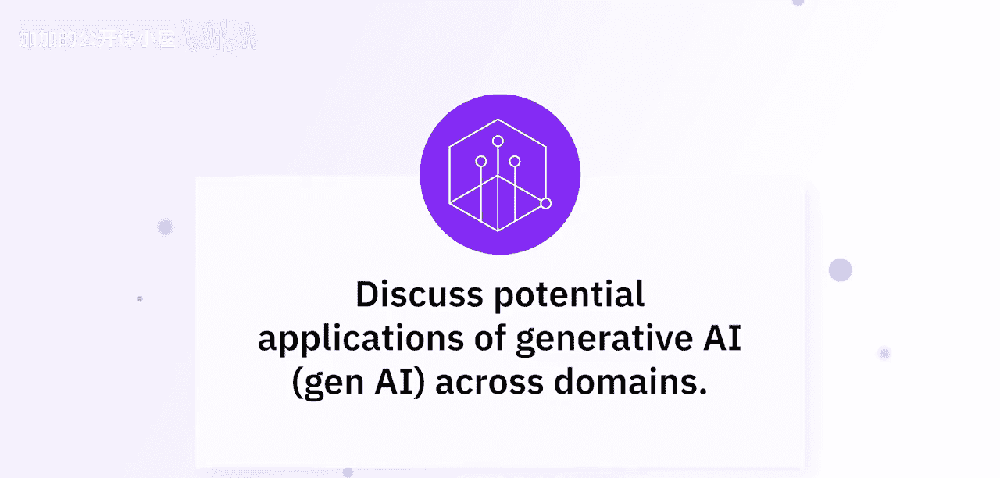
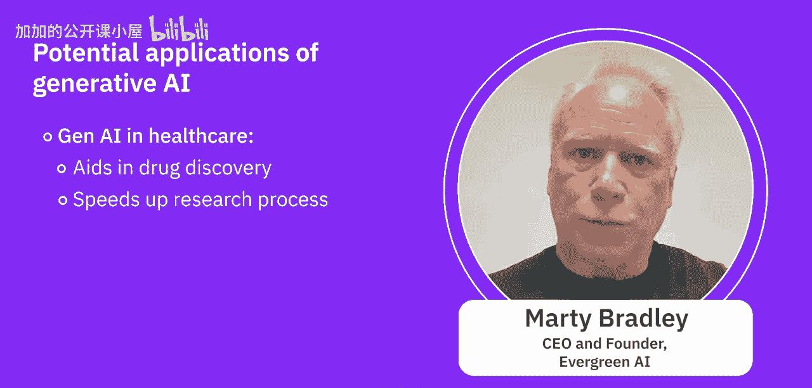
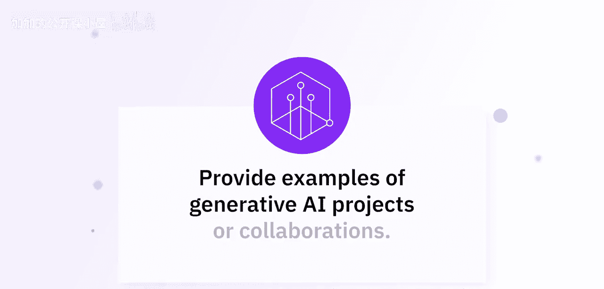

#  015：探索生成式AI在各领域的应用 🚀

在本节课中，我们将聆听行业专家的见解，共同探索生成式AI在多个关键领域的潜在应用与变革性影响。

---

## 概述

生成式AI几乎在每个行业都拥有潜在的应用前景。专家们将深入探讨其在教育、金融、医疗等领域的实际用例与成功项目。

---

## 教育领域的应用 🎓

上一节我们概述了生成式AI的广泛潜力，本节中我们来看看它在教育领域的具体应用。

在Skills Network，我们已经开始在多个环节实施生成式AI。我们不仅开发了能够自动批改作业和测验的工具，更重要的是，它能在学习者答错时提供反馈。借助生成式AI，这几乎可以零成本实现。我们只需设计一个提示词，例如：“请根据以下评分标准批改此作业，如有错误，请生成一段文字帮助学习者从错误中学习。”

此外，我们还推出了名为“TI”的个人导师，它是一个能回答几乎所有问题的个人教学助手。当你在实验中遇到困难、不知如何继续，或收到错误信息时，只需将错误信息交给我们的生成式AI助手TI，它就会帮助你解决问题——无论是定位代码中的错误，还是提供修复思路。这创造了一种双向互动模式，你可以随时提问并获得即时帮助，而无需在留言板上等待数天或数周。

更重要的是，通过这位全程陪伴的个人导师，学习者能够获得持续的复习和作业批改支持。这对我们而言非常实用，因为有些课程拥有成千上万甚至更多的学习者，仅凭有限数量的讲师和助教，根本不可能批改如此多的作业。生成式AI有效地填补了这一空白。

以下是生成式AI在教育中的核心应用方式：
*   **自动批改与反馈**：使用提示词工程，如 `grade this with the following rubric`，实现自动化评估与个性化学习指导。
*   **个人学习助手**：构建像“TI”这样的AI助手，提供7x24小时的即时答疑和编程调试支持。
*   **规模化教学支持**：解决大规模在线课程中师资力量不足的问题，为每位学习者提供个性化关注。

---

## 金融领域的变革 💹

了解了教育领域的创新后，我们转向金融行业，看看生成式AI如何改变游戏规则。

生成式AI正在改变金融世界。首先，它像侦探一样，能在交易中识别可疑行为以防止欺诈。其次，它通过分析海量市场运作数据，帮助交易员做出更明智的决策。此外，它还驱动着我们在网上看到的友好聊天机器人，帮助客户处理咨询和交易。

像摩根大通和高盛这样的大型机构已经在使用生成式AI。摩根大通的“COIN”平台利用它来快速理解法律文件，节省了大量时间和金钱。高盛则用它来预测市场走势，为交易员提供优势。生成式AI正在变革金融业，而这仅仅是个开始。准备好迎接一个资金更安全、投资更智能、银行体验前所未有的流畅的未来吧。

以下是生成式AI在金融领域的核心应用：
*   **欺诈检测**：分析交易模式，实时识别异常行为。
*   **市场分析与预测**：处理非结构化数据，生成市场洞察报告。
*   **智能客服与自动化**：驱动聊天机器人处理客户查询与标准交易。
*   **文档智能处理**：像摩根大通COIN系统那样，快速解析和理解复杂的法律与合规文件。

---

## 医疗与生命科学的突破 🏥

看过了金融领域的效率提升，本节我们将探讨生成式AI在关乎人类健康的医疗领域带来的革命性进步。

生成式AI在医疗保健领域具有变革性潜力。本课程描述的一些应用包括但不限于IT与开发运维、医疗保健、金融、人力资源、营销和娱乐。

具体到医疗保健和医药行业，生成式AI带来了诸多进步。例如**医学影像生成**：通过创建合成的图像数据，它使我们能够构建、训练和验证更强大的机器学习模型，用于医学影像分析。它也有助于**药物发现**。在制药行业，生成式AI的一个流行应用方向是生成**个性化医疗方案**。生成式AI正被用于创建氨基酸序列、蛋白质模式和基因组模式，特别是利用这些信息来为相关症状制定个性化的医疗方案。其核心思想是，利用现有数据和信息创造更好的、前所未有的模式，这件事因生成式AI而变得更容易了一些。

生成式AI通过生成具有所需特性的分子结构来辅助药物发现，显著加快了研究进程。此外，它还能通过增强图像分辨率和检测异常来协助医学影像分析，从而提高诊断准确性。

以下是该领域的两个成功项目案例：
1.  **DeepMind的AlphaFold**：该项目使我们能够根据氨基酸序列预测蛋白质的3D结构。
2.  **AI赋能影像分析**：利用生成对抗网络（GANs）生成合成数据，用这些生成的图像来构建更强大的卷积神经网络，从而更准确地检测乳腺癌，帮助医生和患者。

其他著名项目还包括**Insilico Medicine**，它使用生成式AI来识别新的候选药物，加速了早期发现阶段。以及**英伟达与伦敦国王学院的合作**，其中AI模型被用来创建合成的大脑MRI扫描图像，用于培训放射科医生，且无需担心隐私问题。

以下是生成式AI在医疗领域的核心应用与公式：
*   **医学影像增强**：使用生成模型（如GANs）合成数据，公式可表示为 `G(z) -> x'`，其中 `G` 是生成器，`z` 是噪声向量，`x'` 是生成的合成医学图像。
*   **药物发现与个性化医疗**：分析基因组、蛋白质组数据，生成特定的分子结构或治疗方案模式。
*   **诊断辅助**：通过图像分析模型（如CNN）检测病变，`CNN(Image) → {Diagnosis, Anomaly Location}`。

---

## 总结

本节课中，我们一起学习了生成式AI across domains的广泛应用。从提供个性化反馈和辅导的教育领域，到提升安全性与效率的金融行业，再到加速药物发现和改善诊断的医疗保健领域，生成式AI正在成为推动各行业创新的关键力量。专家分享的成功案例，如DeepMind的AlphaFold、AI医疗影像分析以及金融机构的自动化系统，都生动展示了这项技术的实用价值与巨大潜力。未来，随着技术的持续发展，其应用深度与广度必将进一步拓展。