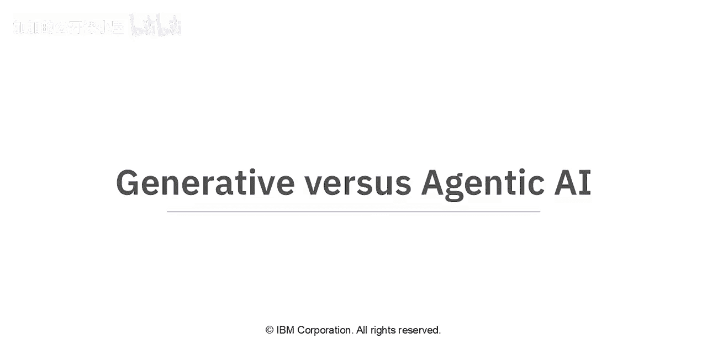
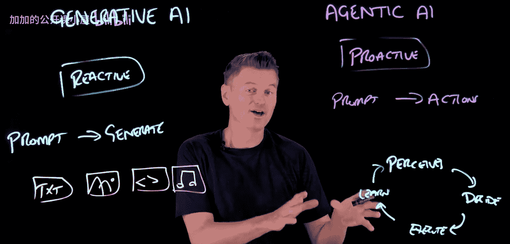
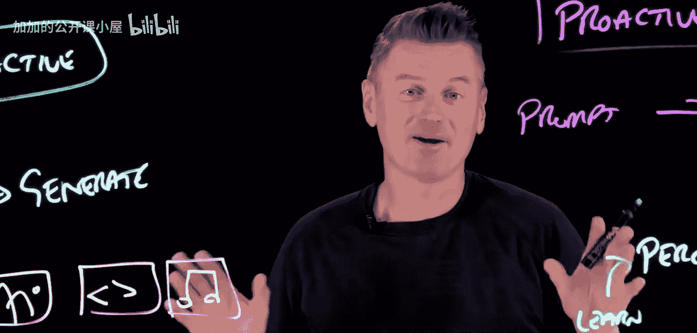
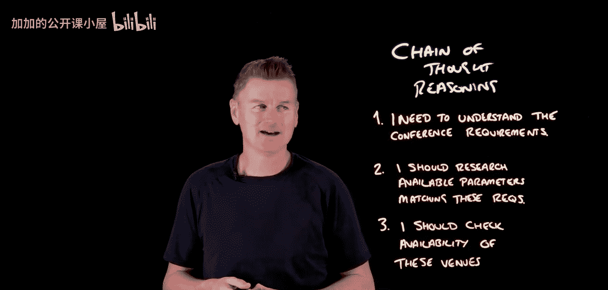

#  016：核心概念与区别

在本节课中，我们将要学习生成式人工智能与代理式人工智能的核心区别、工作原理以及它们的实际应用场景。理解这两种AI方法将帮助我们更好地认识当前AI技术的发展方向。

## 生成式人工智能：反应型系统

上一节我们介绍了课程主题，本节中我们来看看什么是生成式人工智能。

生成式人工智能是我们所熟悉的AI形式，例如聊天机器人和图像生成器。它们本质上是反应型系统。这些系统等待用户执行特定操作，即等待用户给出提示。一旦收到提示，它们的任务就是基于提示内容生成某种形式的内容。它们利用在训练中学到的模式进行生成。

以下是生成式AI可以生成的内容类型：
*   **文本**
*   **图像**
*   **代码**
*   **音频**

生成式AI本质上是复杂的模式匹配机器。它们从海量数据集中学习了单词之间、像素之间以及声波之间的统计关系。当你提供一个提示时，生成式AI会根据其训练来预测接下来应该出现的内容。但它的工作止步于生成。没有你的进一步输入，它不会采取额外步骤。

## 代理式人工智能：主动型系统

了解了反应型的生成式AI后，本节中我们来看看与之相对的代理式人工智能。

代理式人工智能系统则不同，它们不是反应型的，而是主动型系统。与生成式AI类似，它们通常也始于一个用户提示。但这个提示随后被用来通过一系列行动来追求目标。

一个代理系统基本上会经历一个生命周期。其工作方式如下：首先，它感知环境。感知完成后，它可以决定要采取的行动。决定行动后，它便可以执行该行动。行动执行完毕后，它可以从输出中学习，然后循环往复，整个过程只需最少的人工干预。

## 共同基础：大语言模型

上一节我们分别介绍了两种AI的特点，本节中我们来看看它们的共同技术基础。

这两种AI方法通常共享一个共同的基础，那就是大语言模型。LLM是聊天机器人的技术支柱。当然，生成其他内容（如图像和音频）通常会使用其他工具，例如扩散模型。但对于聊天机器人，我们使用LLM。同时，LLM也为代理系统提供了推理引擎的能力。

## 实际应用与用例

在深入探讨技术之前，让我们先谈谈一些现实世界的应用和用例。

生成式AI可以帮助完成内容创作任务，尤其是创意内容创作。例如，一个视频博主可能会使用生成式AI系统来审阅脚本、建议缩略图概念，甚至生成背景音乐。但在每一步中，都存在一个人类创作者。这位创作者会审查生成的内容，检查是否符合其要求，并对其进行优化。AI生成可能性，而人类则负责筛选和指导整个过程。

代理式AI则在需要持续管理和包含多步骤流程的场景中表现出色。考虑一个个人购物代理：给定一个要购买的产品作为输入，它会主动在各个平台上搜寻库存，监控价格波动，处理结账流程，甚至协调配送。它基本上独立运作，仅在需要时向你寻求输入。

## 推理能力：思维链

那么，代理AI是如何做到这些的呢？本节中我们来探讨其背后的推理机制。

事实证明，支撑许多生成式AI的LLM也可以用来为AI代理提供推理能力。这里我们本质上是在利用生成式AI“思考”的能力（加引号的思考），即思考如何解决问题。这有一个名称，叫做**思维链推理**。这正是LLM非常擅长的地方。

这是一个代理将复杂任务分解为更小、更合乎逻辑的步骤的过程，类似于人类处理难题的方式。想象一下，我们想要一个代理来规划组织会议这样的复杂任务。它会使用生成式AI生成内部对话。这个对话可能如下所示：
1.  首先，我需要了解会议的要求：规模、持续时间、预算等。
2.  然后，我应该研究符合这些参数的可用场地。
3.  接着，对于符合要求的场地，我需要检查其可用性等等。

这实际上是代理在采取行动之前，通过与自己对话来探索问题空间。生成式AI基本上是驱动代理决策的认知引擎。

## 未来展望：智能协作体

最后，让我们展望一下未来的发展趋势。

展望未来，最强大的AI系统可能既不是纯粹的生成式，也不是纯粹的代理式。它们将成为智能协作体。它们将理解何时通过生成来探索选项，以及何时通过代理行动来执行行动方案。就像一个知道何时生成同人小说下一章的代理，以便在（例如）视频拍摄结束后就能准备好。

## 总结

本节课中我们一起学习了生成式人工智能与代理式人工智能的核心区别。生成式AI是**反应型**的内容生成工具，而代理式AI是**主动型**的目标导向系统。两者常以**大语言模型**为基础，但应用方式不同。生成式AI辅助人类进行内容创作与筛选，代理式AI则能自主管理多步骤任务流程。未来的AI发展方向将是结合两者优势的**智能协作体**。