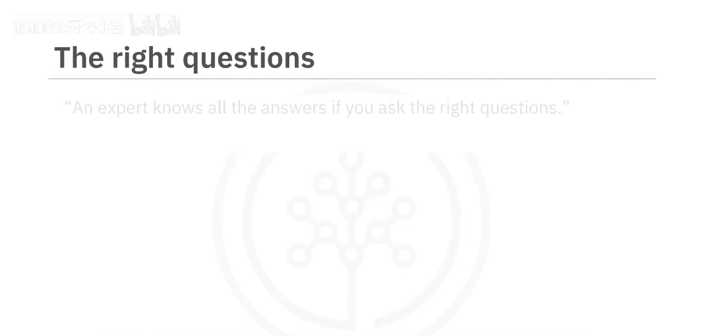
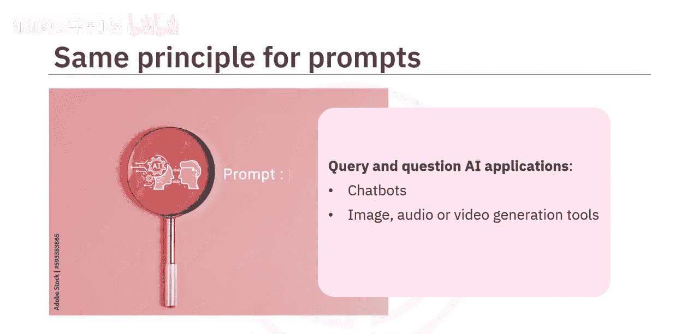
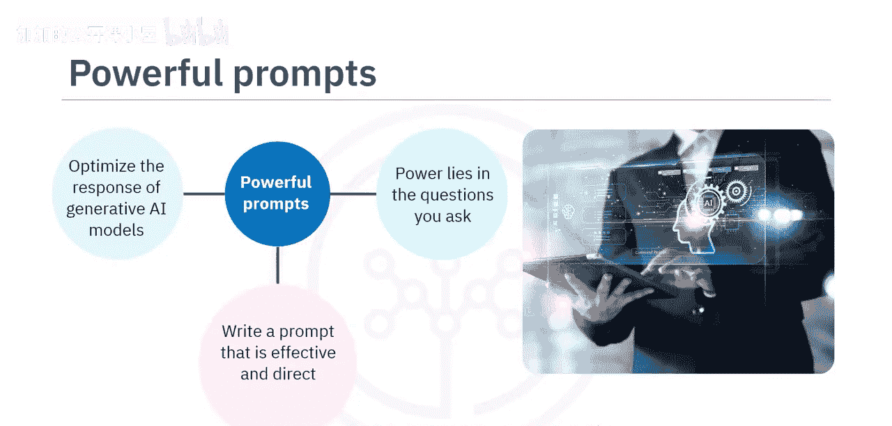
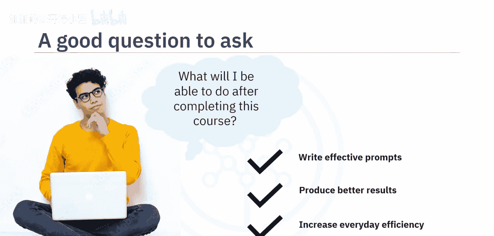
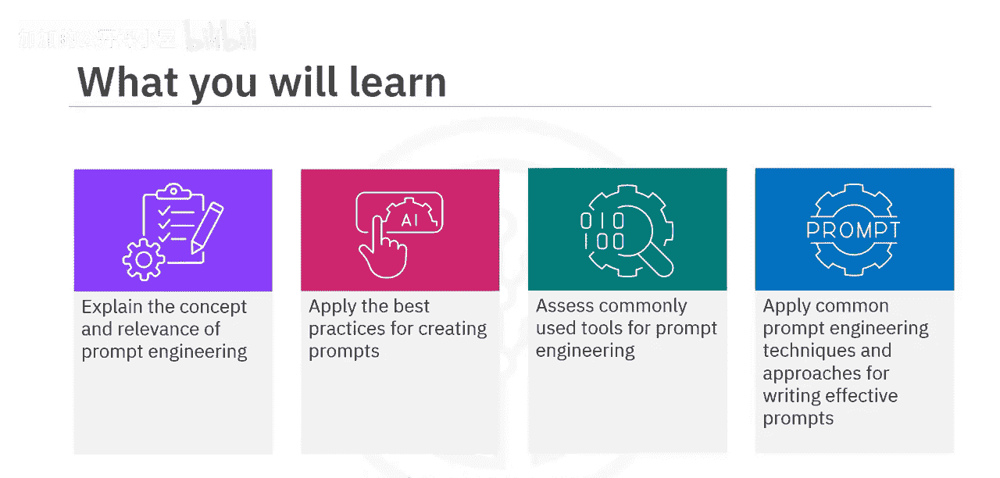
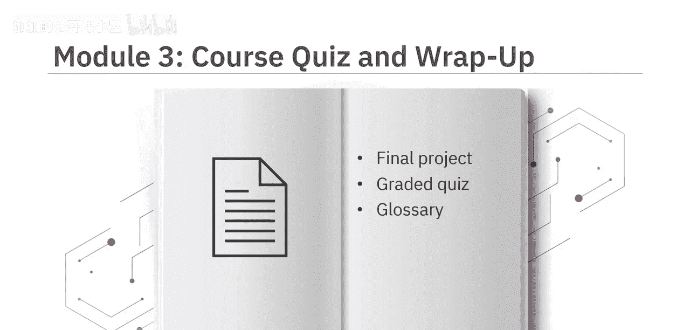
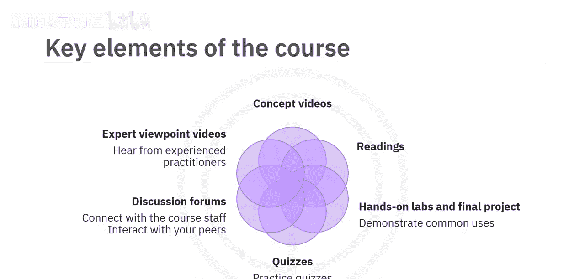
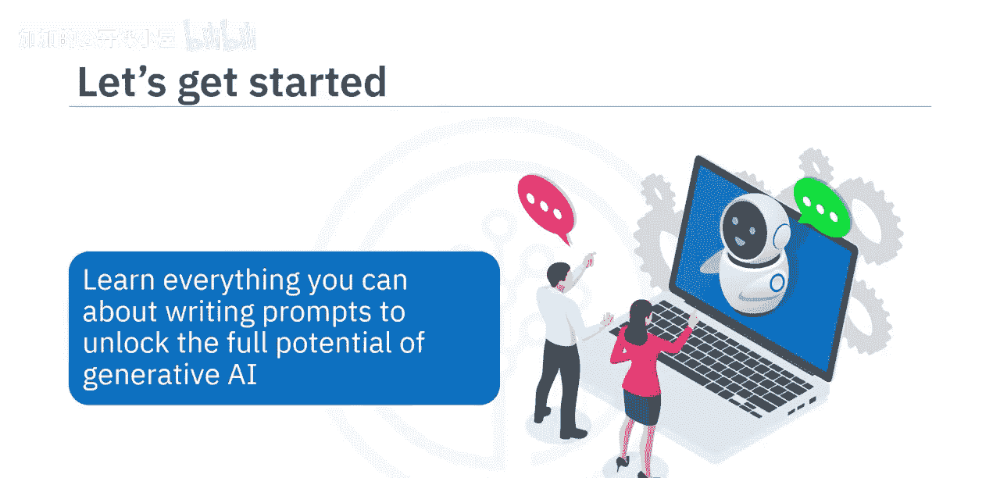

#  017：课程介绍 🚀

在本节课中，我们将要学习提示工程的基础知识。提示工程是引导生成式AI模型（如聊天机器人、图像生成工具等）生成精准、相关响应的核心技能。掌握如何设计有效的提示，将帮助你充分释放生成式AI的潜力。

## 核心概念：提示工程

专家之所以能解答问题，关键在于提出正确的问题。有趣的是，这正是我们为生成式AI模型设计提示时所遵循的同一原则。我们通过提示来查询和提问AI应用。

**提示** 能够优化生成式AI模型的响应。其力量在于你所提出的问题。了解如何撰写有效且直接的提示，将使你能够生成更精确、更相关的内容。

现在，一个值得提出的好问题是：完成本课程后，我能做什么？

## 课程目标与受众

本课程面向所有初学者，无论是专业人士、爱好者、从业者还是学生，只要对学习如何撰写有效提示抱有真诚的兴趣。这是一门适合所有人的课程，无论你的背景或经验如何。

在本课程结束时，你将能够：
*   **阐释** 提示工程的概念及其与生成式AI模型的相关性。
*   **应用** 创建提示的最佳实践。
*   **评估** 常用的提示工程工具。
*   **应用** 常见的提示工程技术和方法来撰写有效提示。

## 课程结构与内容

这是一门精炼的课程，包含三个模块，每个模块需要一到两个小时完成。

在上一节我们介绍了课程的整体目标，接下来我们看看每个模块的具体内容。

以下是三个模块的详细安排：

*   **模块1：提示工程基础**
    你将学习提示工程的概念，从如何定义提示及其构成要素开始。你将学会应用撰写有效提示的最佳实践，并评估常见的提示工程工具，如 IBM WatsonX Prompt Lab、Spellbook 和 Dust。

*   **模块2：提示工程方法与技巧**
    你将学习各种提示工程方法，如**访谈模式**、**思维链**和**思维树**。你将探索巧妙设计提示的技巧，例如**零样本**和**少样本**提示，以产生精确且相关的响应。

*   **模块3：实践与评估**
    本模块要求你参与一个最终项目，并提供一个计分测验来检验你对课程概念的理解。你还可以访问课程术语表，并获得关于后续学习步骤的指导。

## 学习资源与特色

本课程融合了概念讲解视频和辅助阅读材料。观看所有视频以掌握学习材料的全部精髓。

你将通过实践实验室和一个最终项目来享受动手操作的乐趣，该项目将在IBM生成式AI教室中演示如何通过创建有效提示来优化结果。

课程包含练习测验，帮助你在课程结束时巩固所学知识，你还将尝试一次计分测验。课程还提供了讨论论坛，供你与课程工作人员联系并与同伴交流。

最有趣的是，通过**专家观点视频**，你将听到经验丰富的从业者分享他们对提示工程中使用的工具、方法以及撰写有效提示的艺术的见解。

## 总结

本节课中，我们一起学习了本课程的概览。我们了解到，提示工程是通过精心设计问题来引导AI生成优质结果的关键技能。本课程专为初学者设计，将通过三个模块的系统学习，帮助你掌握提示工程的核心概念、最佳实践、实用工具和高级技巧，并最终通过实践项目巩固所学。

你准备好学习关于撰写提示的一切知识，以解锁生成式AI的全部潜力了吗？让我们开始吧。