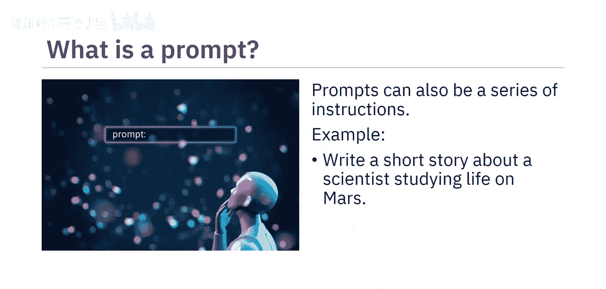
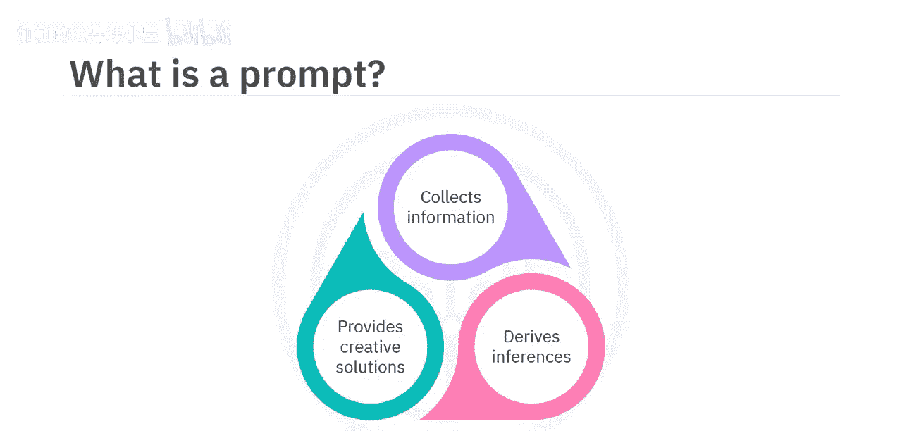

#  018：什么是提示词

在本节课中，我们将学习提示词的定义及其核心构成要素。理解如何编写有效的提示词，对于引导生成式AI模型产生符合预期的结果至关重要。

## 什么是提示词？

生成式AI模型的一项显著能力是其输出与人类创作的内容高度相似：相关、有上下文、富有想象力、细致入微且语言准确。而生成这种输出的关键因素之一就是提示词。

那么，什么是提示词？提示词是你提供给生成式模型的任何输入，用以产生期望的输出。你可以将其视为你给模型的指令。

以下是几个简单的提示词示例：
*   `write a small paragraph describing your favorite holiday destination`
*   `Write H code to generate a drop down selection of cities within an online form`

这些是用于产生特定输出的直接提示词。提示词也可以是一系列逐步细化输出的指令，以达到期望的结果。

例如：
*   `write a short story about a scientist studying life on Mars`
*   `What were some of the challenges he faced during his research`

通过这些例子可以清楚地看到，提示词包含问题、上下文文本、指导模式或示例，以及基于这些以自然语言请求形式提交的提示词，生成式AI模型会收集信息、进行推理并提供创造性的解决方案。这些指令帮助模型根据提供的输入，产生相关且合乎逻辑的回应或输出。

## 从“朴素提示”到“有效提示”

为了更好地理解，让我们看一些对比示例。

假设你想让模型写一个关于农民在10年内成为成功商人的奋斗与成就的短篇故事。如果你的提示词是“rich man's story from a small town. His struggles and achievements”，它会产生一个通用的输出。这就是我们所说的**朴素提示**，即以最简单的方式向模型提问。

为了向模型准确传达你的意图，你可以进行简单的调整，从而显著改善结果。你的提示词需要有恰当的上下文、结构和清晰度。

因此，你可以将提示词重写为：
`write a short story about the struggles and achievements of a farmer who became a rich and influential businessman in 10 years`

再看另一个例子，你想让模型生成你想象中的日落风景图像。将提示词写为“sunset image between mountains”可能无法得到期望的输出。这个提示词过于简短，缺乏对你脑海中图像的详细描述。

你可以将提示词重写为：
`generate an image depicting a calm sunset about a river valley that rests amidst the mountains`

## 有效提示词的构成要素

要掌握编写有效提示词的艺术，让我们逐一理解一个结构良好的提示词的构成要素。

**1. 指令**
指令为模型提供关于你希望执行的任务的明确指导。它规定了生成式AI模型的行为，以影响其回应的形成。
例如：`write an essay in 600 words， analyzing the effects of global warming on marine life`

**2. 上下文**
上下文有助于建立构成指令背景的环境，并为生成相关内容提供一个框架。
为了理解这一点，让我们在前一个例子的提示词中添加一些上下文：
`In recent decades， global warming has undergone significant shifts， leading to rising sea levels， increased storm intensity and changing weather patterns. These changes have had a severe impact on marine life. Write an essay in 600 words analyzing the effects of global warming on marine life.`
这个提示词将帮助模型生成与上下文一致的内容。

**3. 输入数据**
输入数据是你作为提示词一部分提供的任何信息片段。这可以作为生成式模型的参考，以获得包含特定细节或想法的回应。
为了提供输入数据，同样的提示词可以重构如下：
`You have been provided with a data set containing temperature records and measurements of sea levels in the Pacific Ocean. Write an essay in 600 words analyzing the effects of global warming on marine life in the Pacific Ocean.`

**4. 输出指示器**
输出指示器为评估模型生成输出的属性提供了基准。它可以概述你期望输出具备的语气、风格、长度和其他品质。
在提示词 `write an essay in 600 words analyzing the effects of global warming on marine life` 中，输出指示器指定生成的输出应为一篇600字的文章，并将根据分析的清晰度以及相关数据或案例研究的结合程度进行评估。

以上每个要素都在帮助生成式AI模型理解你的需求并给出期望的输出方面发挥着作用。

## 总结

本节课中，我们一起学习了提示词的定义。提示词是你为产生期望输出而提供给生成式模型的任何输入或一系列指令。这些指令有助于引导模型的创造力，并协助产生相关且合乎逻辑的回应。

一个结构良好的提示词的构成要素包括**指令**、**上下文**、**输入数据**和**输出指示器**。这些要素共同帮助模型理解我们的需求并生成相关的回应。