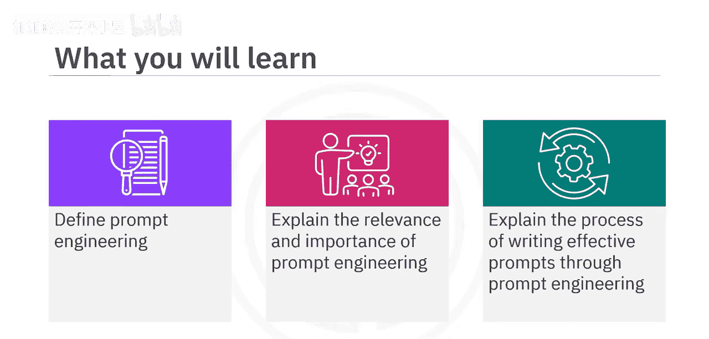
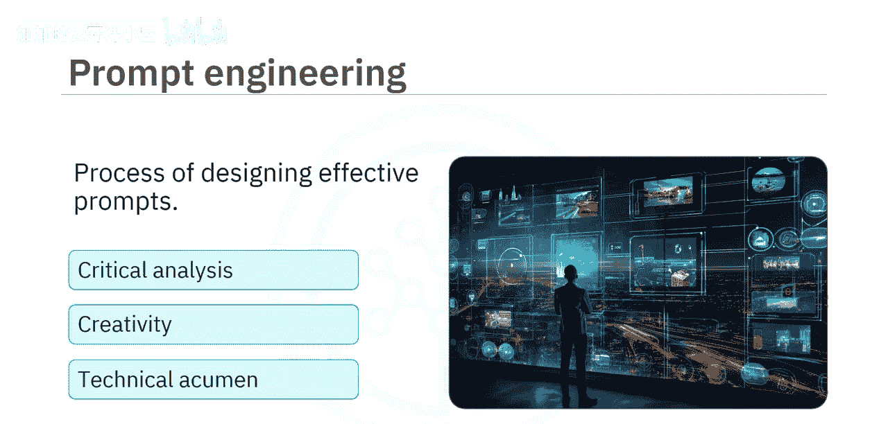
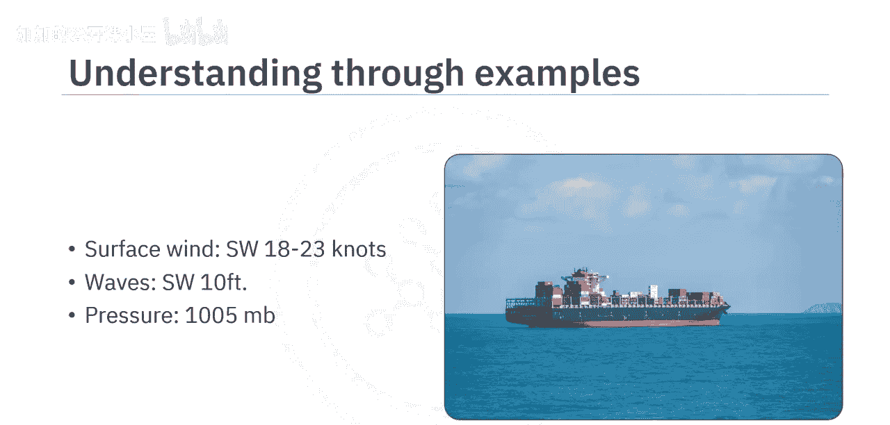
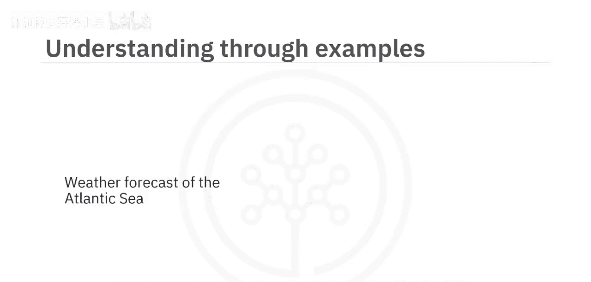
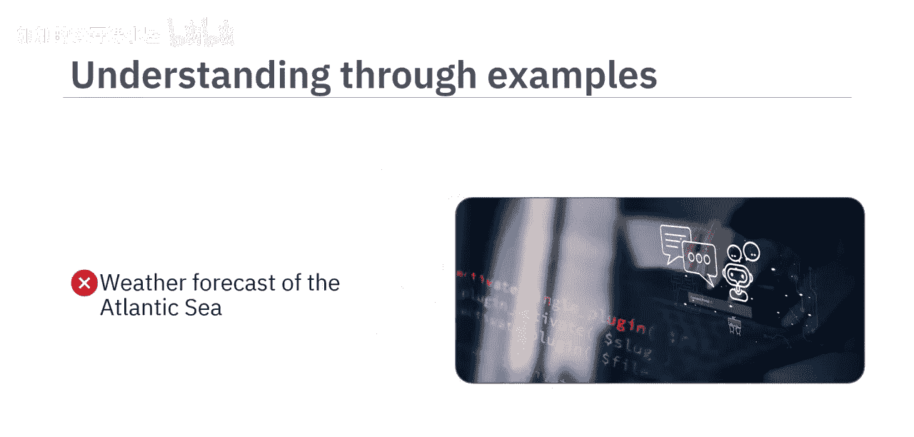
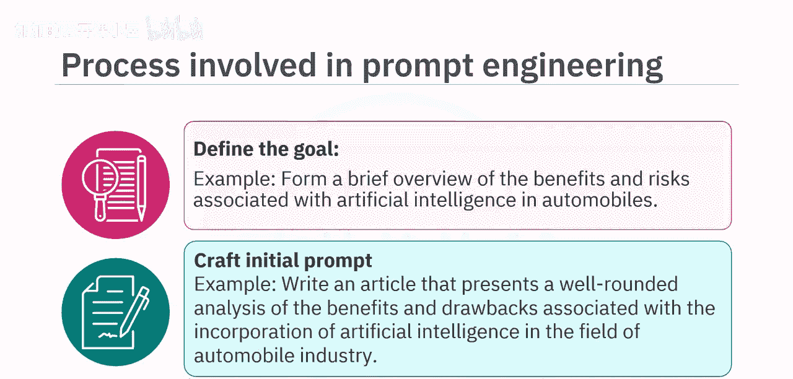
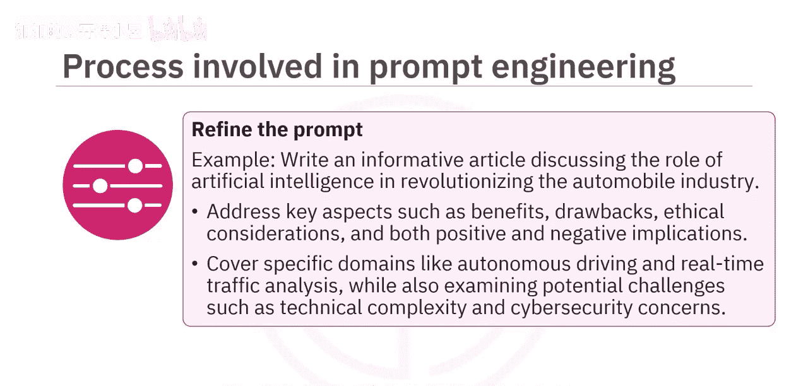
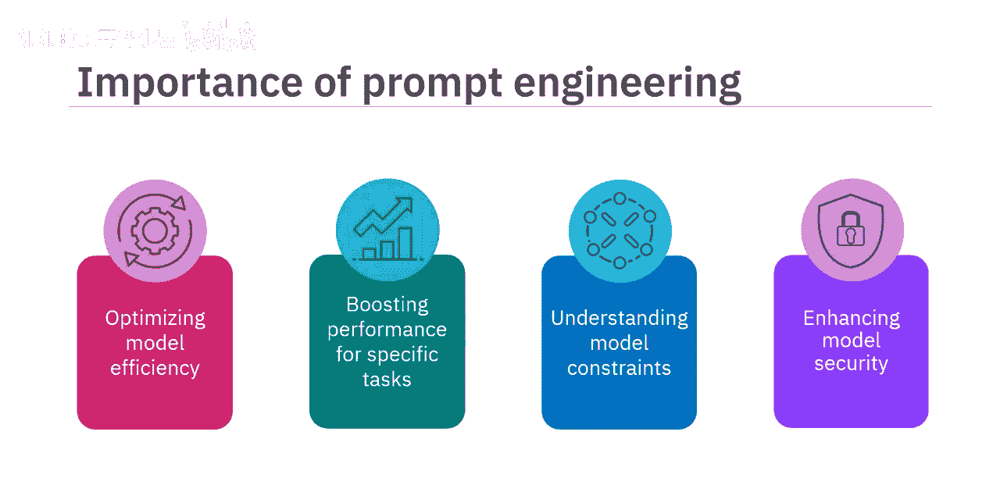

#  019：什么是提示工程 🧠

在本节课中，我们将要学习提示工程的核心概念、流程及其重要性。通过本节内容，你将能够定义提示工程，解释其在生成式AI模型中的相关性与重要性，并掌握设计有效提示的步骤。

## 概述

提示工程是设计有效提示的过程，旨在引导生成式AI模型产生更佳、更符合预期的回答。尽管生成式AI模型有潜力辅助人类创造力，但如果提供的提示不够精确，模型可能会产生不充分甚至错误和误导性的信息。提示工程融合了批判性分析、创造力和技术敏锐度，其核心在于**在正确的上下文中，以正确的信息，提出正确的问题，并明确期望的结果**。

## 提示工程流程详解

上一节我们介绍了提示工程的基本定义，本节中我们来看看设计有效提示的具体步骤。这是一个结构化的迭代过程。

以下是创建有效提示的逐步流程：

1.  **定义目标**
    流程的第一步是建立一个清晰的目标。你必须确切知道希望模型生成什么。
    *   **示例目标**：生成一份关于人工智能在汽车领域应用的利弊概述。

2.  **创建初始提示**
    在定义目标后，即可创建初始提示。根据目标，这可能是一个问题、一个指令或一个情境描述。
    *   **示例初始提示**：`写一篇文章，全面分析人工智能融入汽车行业所带来的好处和缺点。`

3.  **测试提示**
    接下来需要测试并分析所创建提示得到的回答。回答可能相关，但可能缺乏你所期望的独特视角。
    *   **示例分析**：对初始提示的回应直接列出了人工智能在汽车行业的利弊，但未强调可能出现的伦理问题，也没有讨论其正面和负面影响。

4.  **分析回答**
    你必须仔细审查回答，检查其是否符合你的目标。如果不符合，需记下不足之处。
    *   **示例分析**：初始提示未能涵盖人工智能在汽车行业相关利益和风险的全面范围。

5.  **优化提示**
    利用通过测试和分析获得的知识，现在可以修改提示。这可能包括增强其特异性、添加上下文或重新措辞。
    *   **示例优化提示**：`写一篇信息性文章，讨论人工智能如何革新汽车行业。阐述关键方面，如好处、缺点、伦理考量以及正面和负面影响。涵盖自动驾驶和实时交通分析等具体领域，同时审视技术复杂性和网络安全担忧等潜在挑战。`

6.  **迭代过程**
    最后三个步骤（测试、分析、优化）需要重复进行，直到你对回答感到满意。
    *   **示例最终提示**：`写一篇文章，重点介绍人工智能如何重塑汽车行业。聚焦于自动驾驶和实时交通分析等领域的积极进展，同时深入探讨与决策算法等复杂技术方面以及潜在网络安全漏洞相关的担忧。强调这些担忧可能对车辆安全产生的影响。确保分析透彻、有实例支持并能引发批判性思考。`

## 提示工程的重要性

理解了流程后，我们来看看提示工程为何如此重要。它在多个方面对发挥生成式AI模型的效能至关重要。

以下是提示工程的四个关键作用：

*   **优化模型效率**：提示工程帮助设计智能提示，让用户无需大量重新训练即可充分利用这些模型的全部能力。
*   **提升特定任务性能**：提示工程使生成式AI模型能够生成细致入微且符合上下文的回答，从而在特定任务上更加有效。
*   **理解模型限制**：通过每次迭代优化提示并研究模型的相应回答，可以帮助我们理解其优势和弱点。这些知识可以进一步指导未来的功能增强或模型整体开发。
*   **增强模型安全性**：熟练的提示工程可以防止因提示设计不当而导致有害内容的生成，从而提升模型使用的安全性。

## 总结

本节课中我们一起学习了提示工程。我们了解到，提示工程是通过设计有效提示来充分利用生成式AI模型能力、以产生最佳回答的过程。我们详细探讨了通过测试、分析和优化来完善提示的迭代流程。最后，我们总结了提示工程在优化模型效率、提升任务性能、理解模型限制以及增强安全性方面的重要性。掌握提示工程是有效利用生成式AI工具的关键技能。