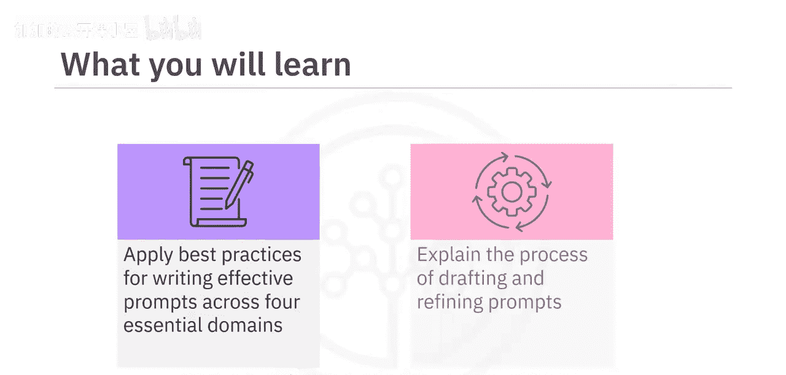
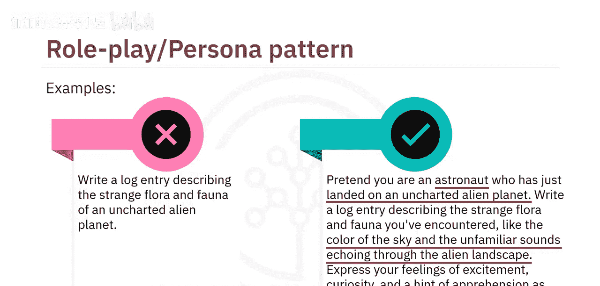

#  020：最佳提示创建实践 🎯

在本节课中，我们将学习如何应用最佳实践来创建有效的提示，并通过多个示例解释起草和优化提示的过程。

撰写有效的提示对于充分发挥生成式AI模型的潜力、生成相关且准确的回应至关重要。通过应用创建有效提示的最佳实践，你可以监督生成输出的风格、语气和内容。

创建有效提示的最佳实践可以应用于四个基本维度：**清晰度**、**上下文**、**精确度**和**角色扮演（或人物模式）**。

---

## 清晰度 ✨

上一节我们介绍了创建有效提示的四个维度，本节中我们首先来看看**清晰度**。清晰的提示能确保模型准确理解你的意图。

以下是实现清晰度的关键要点：
*   **使用简单直接的语言**：简单的语言易于传达指令。因此，应撰写明确且易于理解的提示。
*   **避免专业术语**：专业术语可能会使模型或用户感到困惑。因此，应使用能被广泛受众理解的简单词汇来撰写提示。
*   **明确任务描述**：模糊的提示可能导致回应与你的意图不符。因此，必须清晰描述模型需要执行的任务。

让我们通过一个例子来理解。

**原始提示（不清晰）**：
> 讨论在植物完全多汁的托叶上借助阳光发生的烹饪过程。同时提及一个绿色物质，以及光、空气和水对植物地上部分的重要性。

这个提示存在许多问题：
1.  它没有明确提及你想要讨论的过程（光合作用）。
2.  它包含了复杂的术语（如“完全多汁的托叶”），难以理解。
3.  它很模糊，没有清晰描述手头的任务。

**优化后的提示（清晰）**：
> 解释植物光合作用的过程，详细说明叶绿素的作用，以及阳光、二氧化碳和水如何促成这一生物功能。

修订后的提示使用了**简单、清晰、简洁的语言**，并**明确声明**你想要讨论植物光合作用的过程。

---

## 上下文 📖

在了解了清晰度的重要性之后，我们来看看第二个维度：**上下文**。上下文能帮助模型理解情境或主题。

这可以包括提供简要介绍或解释需要回应的环境。相关的信息或具体细节（如人物、地点、事件或概念）有助于引导模型的理解。因此，在撰写提示时融入这些细节非常重要。

例如：

**原始提示（缺乏上下文）**：
> 写一写1775年革命战争爆发期间发生了什么。

这个提示没有包含足够的上下文和具体细节来引导模型的理解。

**优化后的提示（包含上下文）**：
> 描述导致美国革命战争的历史事件，重点关注波士顿倾茶事件、萨拉托加战役等关键事件。强调美国殖民地与英国政府之间的紧张关系，并解释这些事件如何导致1775年革命战争的爆发。

这个修订版本**建立了正确的历史背景**，并**包含了相关的具体信息**，使模型能够生成更准确、更丰富的回应。

---

## 精确度 🎯

我们已经探讨了清晰度和上下文，接下来是第三个关键维度：**精确度**。精确度有助于勾勒出你的请求和提示的轮廓。

如果你在寻找特定类型的回应，请清晰地表达出来。在提示中**融入示例**可以帮助模型理解你期望的回应类型，并引导其思考过程。

例如：

**原始提示（不够精确）**：
> 谈谈经济学中的供给与需求，以及它是如何受影响的。

这个提示没有精确地勾勒出特定类型回应的轮廓，也没有提供示例。

**优化后的提示（精确）**：
> 解释经济学中的供给与需求概念。描述需求增加如何影响价格，并借助一个说明性例子（如智能手机市场）进行阐述。同样，通过类比石油生产中断等情况，解释供给减少对价格的影响。

这个提示**清晰地表达了**你想要借助例子来解释一个概念。

---

## 角色扮演 👤

最后，让我们讨论最后一个维度：**角色扮演（或人物模式）**。从特定角色或人物视角撰写的提示，可以帮助模型生成与该视角一致的回应。

必要的上下文细节使模型能够有效地扮演特定角色。因此，如果你要求模型从历史人物、虚构角色或特定职业的立场进行回复，请提供相关的上下文细节。

让我们看一个例子：

**原始提示（无角色设定）**：
> 写一篇日志，描述一个未知外星星球上奇特的动植物。

这个提示只会给出关于外星星球的科学细节，而不会从专业人士的视角解释其答案。

**优化后的提示（包含角色扮演）**：
> 假设你是一名刚刚降落在一个未知外星星球上的宇航员。写一篇日志，描述你遇到的奇特动植物，比如天空的颜色和回荡在异星景观中的陌生声音。表达你在记录这段非凡旅程时的兴奋、好奇以及一丝忧虑。

在这个例子中，你**明确提供了上下文细节**，并**假设自己是一名宇航员**。因此，这个提示将生成与宇航员视角一致的回应。

---

## 总结 📝

本节课中，我们一起学习了为生成式AI模型撰写有效提示的重要性，它能帮助我们监督输出的风格、语气和内容。

撰写有效提示的最佳实践可以围绕四个维度实施：
1.  **清晰度**：包括使用简单、简洁的语言。
2.  **上下文**：提供背景和所需细节。
3.  **精确度**：意味着要具体并提供示例。
4.  **角色扮演**：通过设定人物角色并提供相关上下文，可以增强回应的效果。

这些实践可以根据具体需求进行调整，以获得最佳结果。