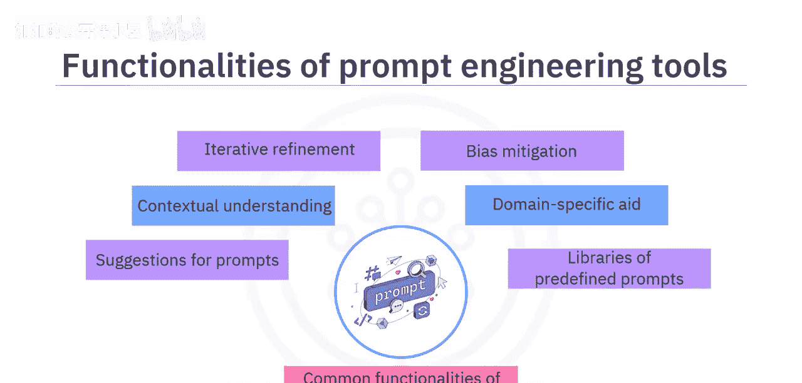
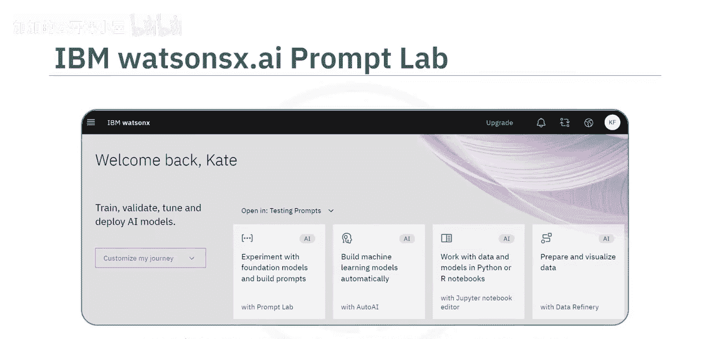
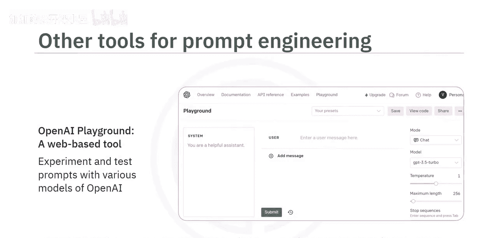
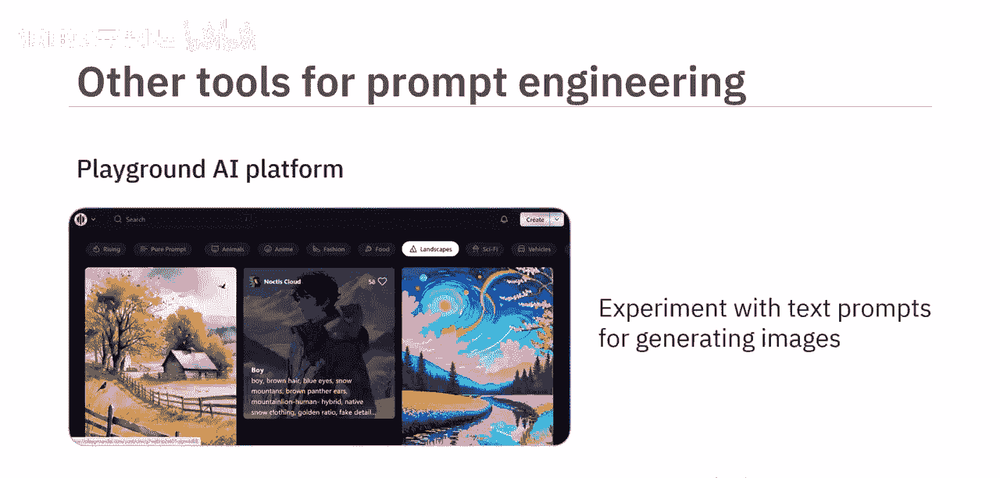
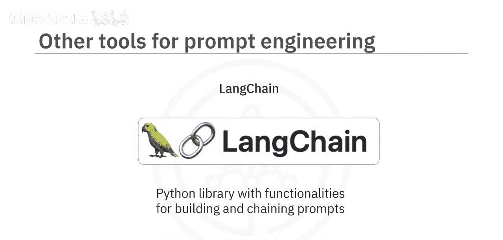
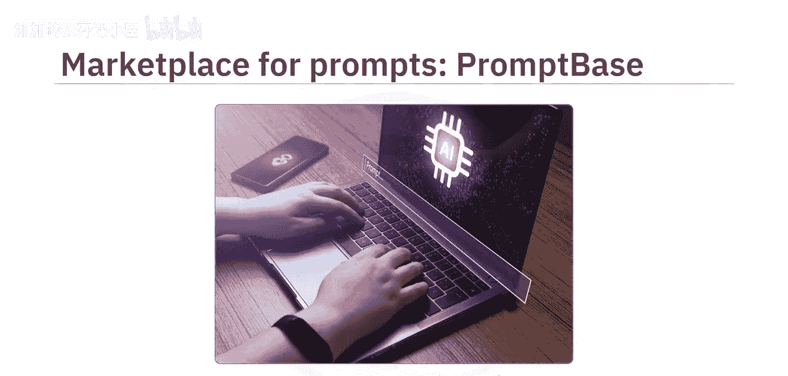
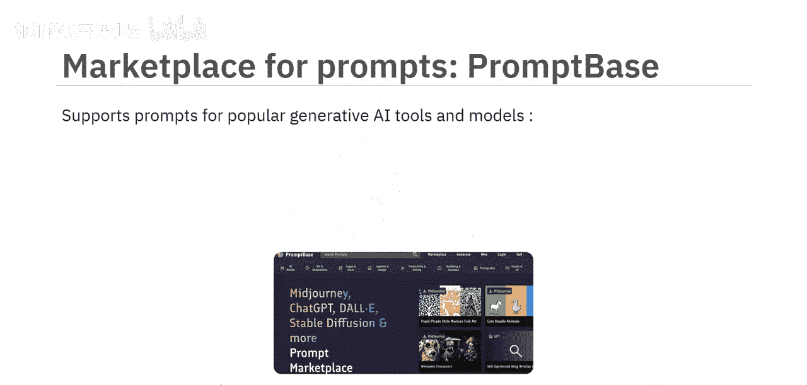
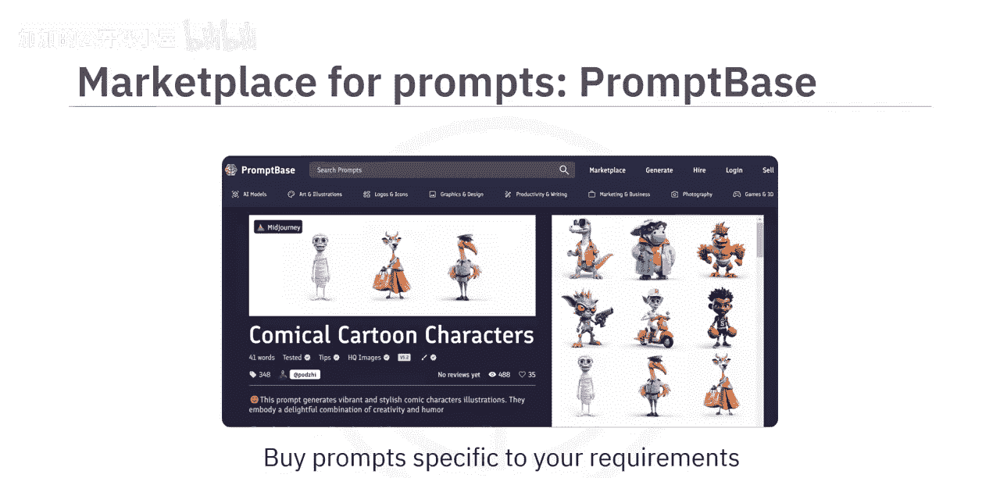
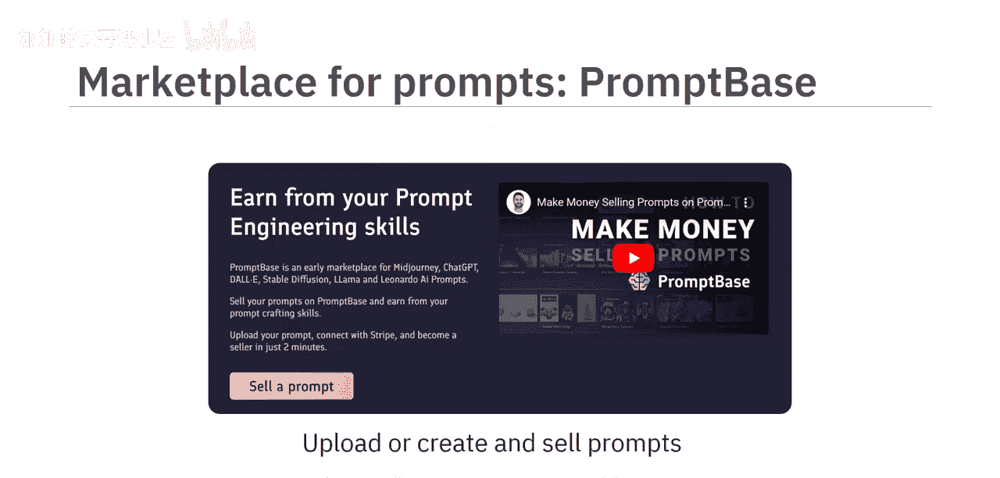
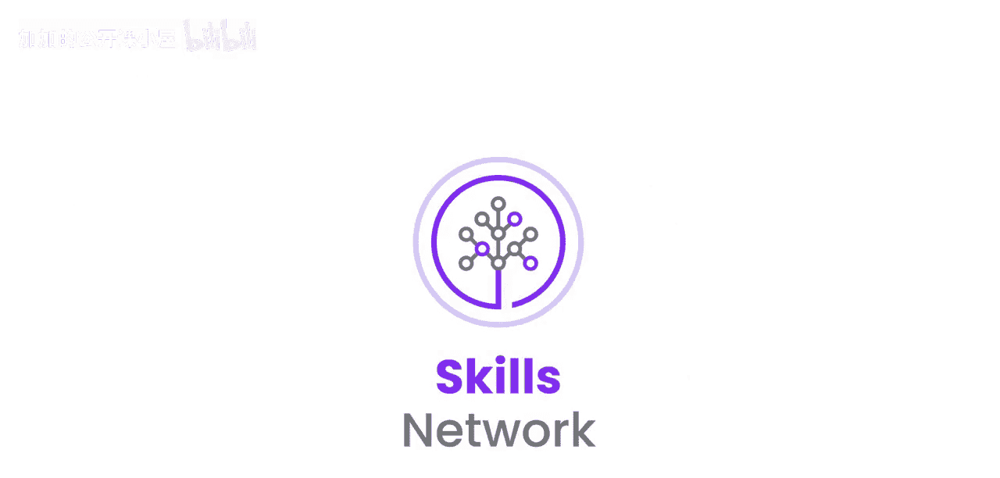

#  021：常用提示工程工具 🛠️

在本节课中，我们将学习提示工程工具。我们将了解这些工具的常见功能，并介绍几款常用的工具，以帮助你更高效地与生成式AI模型进行交互。

## 概述

提示工程是指设计精确且符合上下文的提示，以便与生成式AI模型交互，从而生成相关且准确的输出。为了辅助这一过程，存在多种提示工程工具。这些工具提供了丰富的功能和特性，旨在优化提示的创建，以获得期望的结果。它们对于不精通自然语言处理技术，但又希望在使用生成式AI模型时达成特定目标的用户尤为有用。

## 常见功能

接下来，让我们探讨一下各类提示工程工具通常提供的核心功能。

以下是提示工程工具的一些常见功能：

*   **提示建议**：许多工具能根据给定的输入或期望的输出，提供提示建议。
*   **上下文优化**：这些工具可以建议如何构建提示，以实现更好的上下文沟通。它们帮助设计能提供必要背景信息的提示，使模型能理解用户的意图。
*   **迭代优化**：你可以根据工具的初始响应，迭代地优化提示，以找到最有效的版本。
*   **偏见缓解**：提示工程工具可能提供功能，帮助减轻生成式AI模型响应中的偏见。它们可以指导如何设计提示，以减少产生偏见或不恰当输出的可能性。
*   **领域特定支持**：这些工具可以帮助创建针对特定领域（如法律、医疗或技术）的提示。
*   **预定义提示库**：一些提示工程工具提供了针对各种用例的预定义提示库，这些提示可以根据具体需求进行定制。

## 常用工具介绍

上一节我们介绍了提示工程工具的通用功能，本节中我们来看看几款具体的常用工具。

### 1. IBM Watsonx.ai 与 Prompt Lab

让我们从 **IBM Watsonx.ai** 开始。这是一个集成工具平台，可以轻松地训练、调优、部署和管理基础模型。该平台包含 **Prompt Lab** 工具，使用户能够基于不同的基础模型进行提示实验，并根据需求构建提示。

为了帮助你入门，Prompt Lab 为不同用例提供了示例提示，包括摘要、分类、生成和提取。要创建符合你特定需求的提示，你可以通过添加指令和示例来训练模型，向模型展示如何响应输入。

### 2. Spellbook (Scale AI)

接下来，我们了解一下 **Spellbook**。这是一个由 Scale AI 提供的集成开发环境。使用 Spellbook，你可以基于大型语言模型构建应用程序，并为各种用例（包括文本生成、文本提取、分类、问答、自动补全和摘要）进行提示实验。

对于提示工程，Spellbook 包含一个提示编辑器，允许你编辑和测试提示。你可以使用提示模板来利用结构化提示生成文本，也可以访问预构建的提示作为示例。

### 3. Dust

另一个提示工程工具是 **Dust**。它提供了一个用于编写提示并将其链接在一起的 Web 用户界面。你可以管理链式提示的不同版本。它还提供了一种自定义编码语言和一组用于处理 LLM 输出的标准模块。Dust 也支持 API 集成，以接入其他模型和服务。

### 4. PromptPerfect

用于高效提示工程的另一个工具是 **PromptPerfect**。它可用于为不同的 LLM 或文生图模型优化提示。它支持常见的文本模型（如 GPT、Claude、Stable LM 和 LLaMA）以及图像模型（如 DALL-E 和 Stable Diffusion）。

要编写或优化提示，你首先需要选择要为其优化提示的相关模型。不同的模型有不同的优化策略。你还可以选择与预览质量、语言和审核相关的附加功能。当你编写提示时，可以尝试自动补全功能，它会在你输入时提供建议。你可以进一步优化已编写的提示。

这里有一个例子，展示了用户编写的原始提示和由 PromptPerfect 生成的相应优化提示。为了进一步优化，你可以在流线模式下逐步优化和完善提示：编写提示 -> 优化 -> 再次编辑提示 -> 优化，直到对输出满意为止。

### 5. 其他资源与平台

还有一些其他流行的工具和界面为提示工程提供资源或帮助你进行提示实验。

以下是其他有用的资源：

*   **GitHub**：提供了大量关于提示工程和 LLM 的代码仓库。这些仓库中的指南、示例和工具有助于提高提示工程技能。
*   **OpenAI Playground**：一个基于 Web 的工具，帮助使用 OpenAI 的各种模型（如 GPT）进行提示实验和测试。
*   **Playground AI**：该平台帮助你使用文本提示进行实验，通过 Stable Diffusion 模型生成图像。
*   **LangChain**：一个 Python 库，提供了构建和链接提示的功能。

最后，有趣的是，提示词也可以进行买卖。其中一个例子是 **PromptBase**，这是一个提示词市场。PromptBase 支持为流行的生成式AI工具和模型（如 Midjourney、ChatGPT、DALL-E、Stable Diffusion 和 LLaMA）提供提示词。通过 PromptBase，你可以购买符合你特定要求、且针对特定模型或工具的提示。例如，你可以购买一个用于通过 Midjourney 生成滑稽卡通角色的提示。同样，如果你拥有出色的提示词设计技能，也可以通过 PromptBase 上传和出售提示词。它还支持直接在平台上设计提示词，并在其市场上出售。

## 总结

本节课中，我们一起学习了提示工程工具。我们了解到，这些工具提供了多种功能和特性来优化提示，包括提示建议、上下文理解、迭代优化、偏见缓解、领域特定支持和预定义提示库。我们还介绍了几款常见的提示工程工具和平台，包括 IBM Watsonx.ai 的 Prompt Lab、Spellbook、Dust 和 PromptPerfect，以及其他有用的资源和市场。掌握这些工具将帮助你更有效地利用生成式AI的能力。