#  024：文本到文本提示技术 📝

在本节课中，我们将学习如何通过文本提示技术来提升大型语言模型的可靠性与输出质量。我们将探讨多种核心提示技巧及其带来的益处。

近年来，自然语言处理领域因大型语言模型的应用取得了显著进步。然而，随着LLM规模和复杂度的增加，关于其可靠性、安全性和潜在偏见的担忧也随之浮现。有效使用文本提示是解决这些问题的可行方案。文本提示是精心设计的指令，用于引导LLM的行为以生成期望的输出。但生成内容的质量和相关性，取决于提示的有效性以及LLM自身的能力。

接下来，让我们探索那些能使文本提示更有效、并能提升LLM输出可靠性的技术。

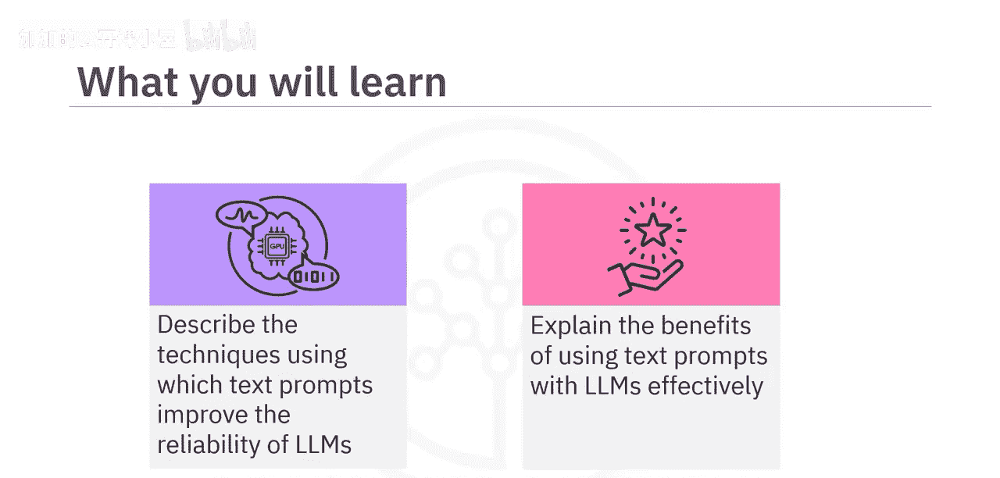

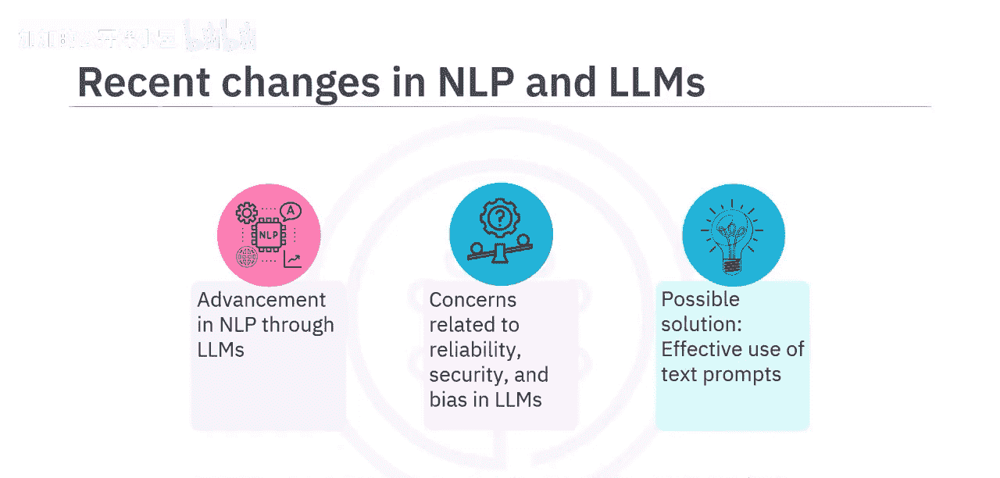

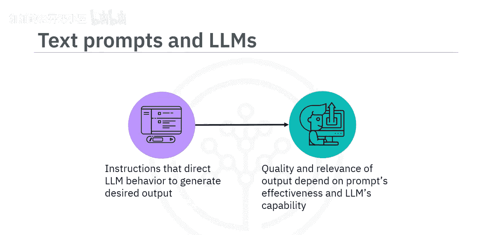

## 核心提示技术 🔧

上一节我们介绍了文本提示的基本概念，本节中我们来看看几种具体的提示技术。

### 任务明确化
文本提示应明确地向LLM传达目标，以提高回答的准确性。例如，提示“**将这句英文翻译成法语**”就是一个实现任务的清晰指令。

### 上下文引导
此技术通过文本提示为LLM提供具体指令，以生成相关输出。以下是两个对比示例：
*   一个宽泛的提示：`写一段关于纽约市的简短介绍。`
*   一个包含上下文的提示：`写一段关于纽约市的简短介绍，重点突出其标志性地标。`

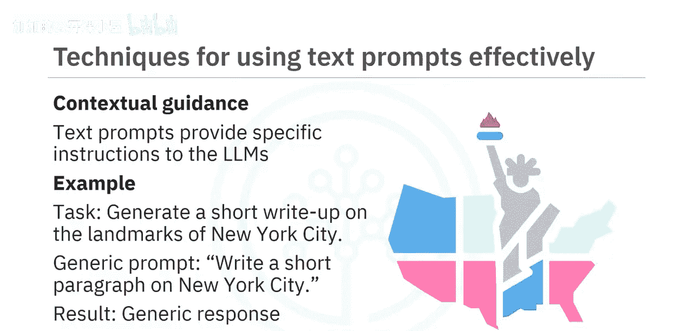

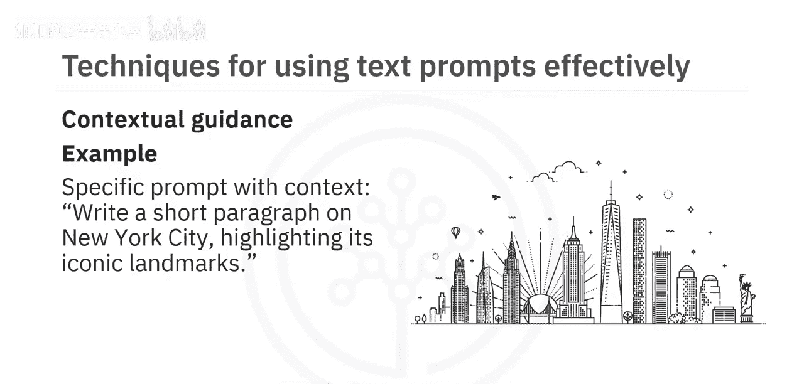

第二个提示因包含了具体上下文，能引导模型生成更符合需求的输出。

### 领域专业知识
当需要LLM在医学、法律或工程等对准确性要求极高的专业领域生成内容时，文本提示可以使用领域特定术语。例如，一个请求甲状腺功能减退症信息的提示可以这样写：
`请解释甲状腺功能减退症的病因、症状及治疗方法，需包含最新研究和医疗指南。`

### 偏见缓解
此技术通过文本提示提供明确指令，以生成中立的回应。例如，若担心模型在回答关于领导力特质的问题时存在性别偏见，可以使用如下提示：
`撰写一段100字的关于领导力特质的段落，不应偏向任何性别，需提供所有性别的平等示例。`

### 框架设定
此技术通过文本提示引导LLM在所需边界内生成回答。假设你需要模型总结一篇关于气候变化的文章，提示可以是：
`请用100字总结这篇关于气候变化的文章，聚焦其主要发现和建议。`

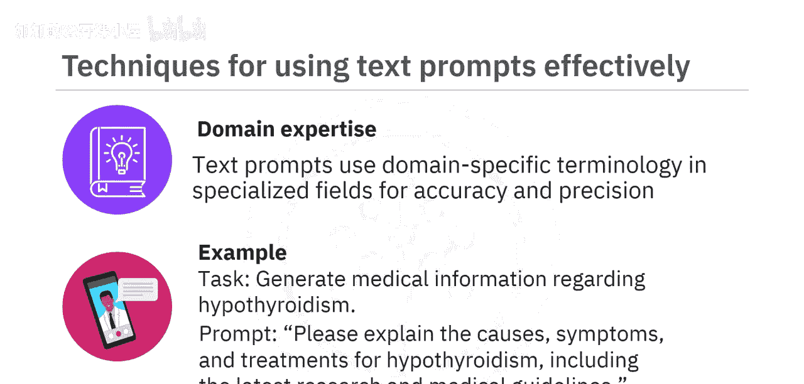

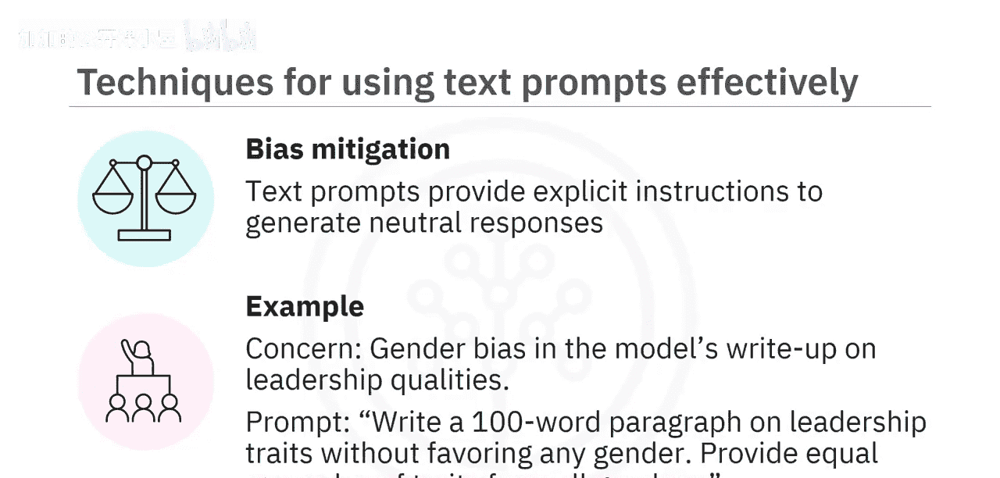

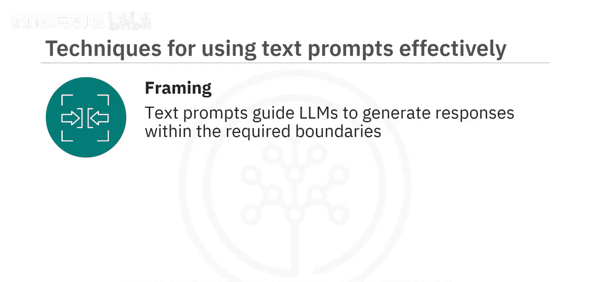

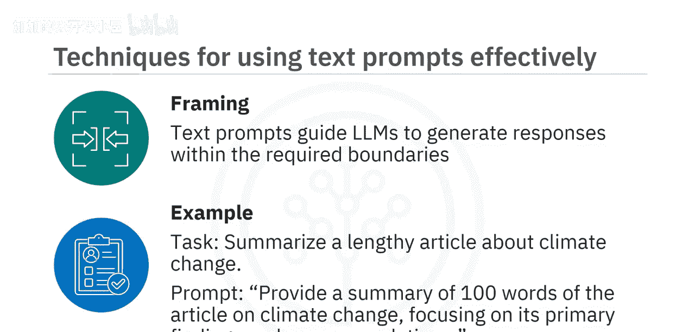

## 高级提示方法 🚀

除了上述基础技术，还有一些更高级的提示方法能应对复杂场景。

### 零样本提示
如今的LLM经过海量数据训练并能遵循指令，可以在无需特定任务训练的情况下执行任务。零样本提示即是一种让生成式AI模型无需先验训练就能对提示生成有意义回应的方
法。例如：
*   **提示**：`找出这个句子中的形容词。句子是：Anita烤出了社区里最好的蛋糕。`
*   **输出**：`最好的`

然而，通常无法通过一次提示就获得理想回应，这时可能需要迭代优化。

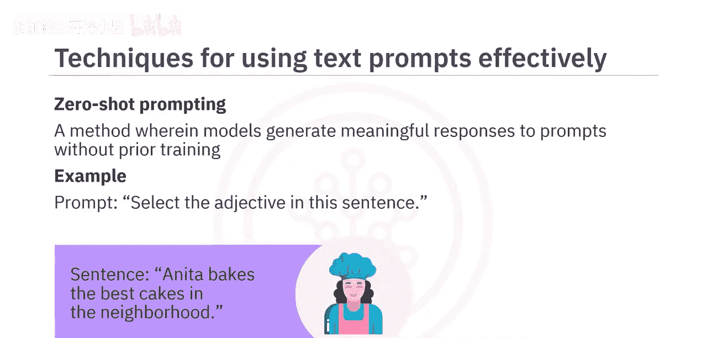

### 用户反馈循环
在此技术中，用户根据LLM生成的回应提供反馈，并迭代式地优化文本提示。这个循环允许用户逐步改进模型的输出质量，直至达到期望状态。流程示例如下：
1.  用户通过提示要求模型写一首诗。
2.  LLM生成一首诗。
3.  用户反馈：“让它更幽默一些。”
4.  LLM调整诗歌，加入更多幽默元素。
5.  用户认可修改后的诗。

### 少样本提示
对于复杂任务，当你无法清晰描述需求时，可以使用少样本提示技术。它支持上下文学习，即在提示中提供示例来引导模型的表现，这些示例作为后续希望模型生成回应的样本的条件。例如，假设任务是生成简短的旅行推荐：
首先，提供少量示例作为引导上下文：
*   `推荐一个以美丽海滩闻名的夏季旅行目的地。`
*   `推荐一个以美丽秋叶闻名的秋季旅行目的地。`

使用这些少样本提示后，模型便能基于此生成其他类型的旅行推荐。例如，对于任务“推荐一个值得探索的城市”，模型可能生成：
`考虑游览像巴黎这样充满活力的城市，以其丰富的历史、艺术和标志性地标而闻名。`
这就是模型如何基于少样本提示中提供的极少量训练数据，为不同类型假期生成旅行推荐。

## 有效使用文本提示的好处 ✨

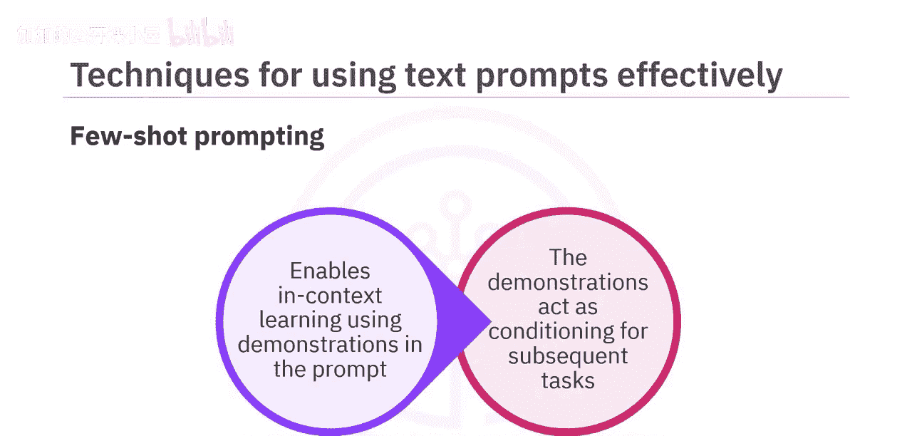

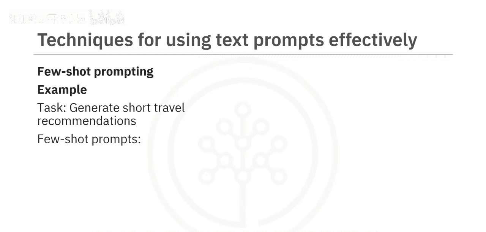

使用我们刚刚讨论的方法将文本提示与LLM结合，能带来多项益处。以下是其中一些：

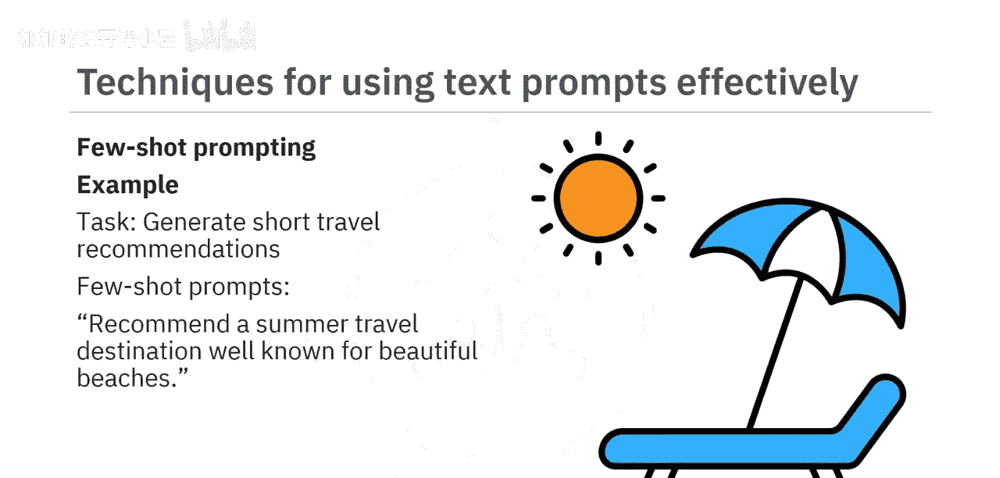

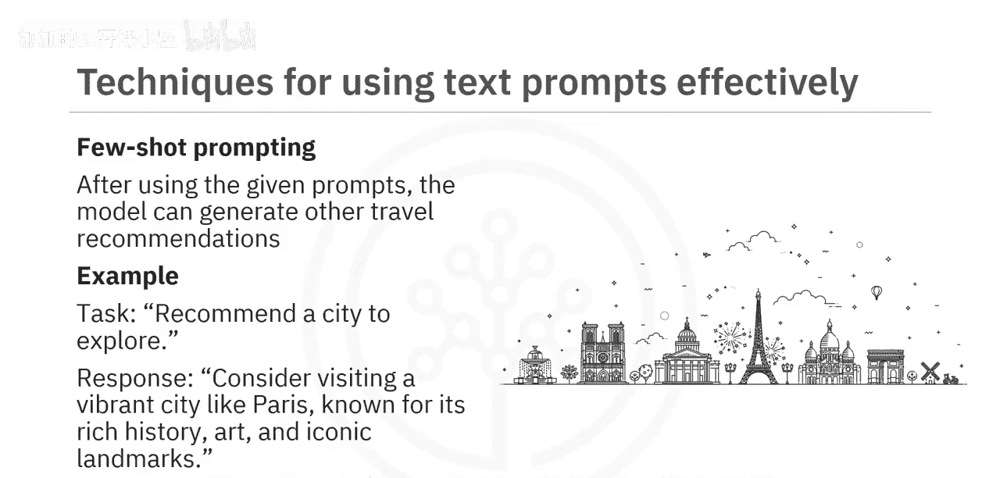

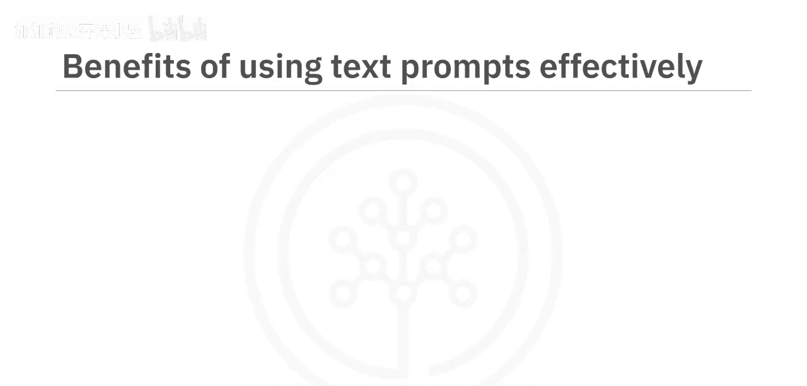

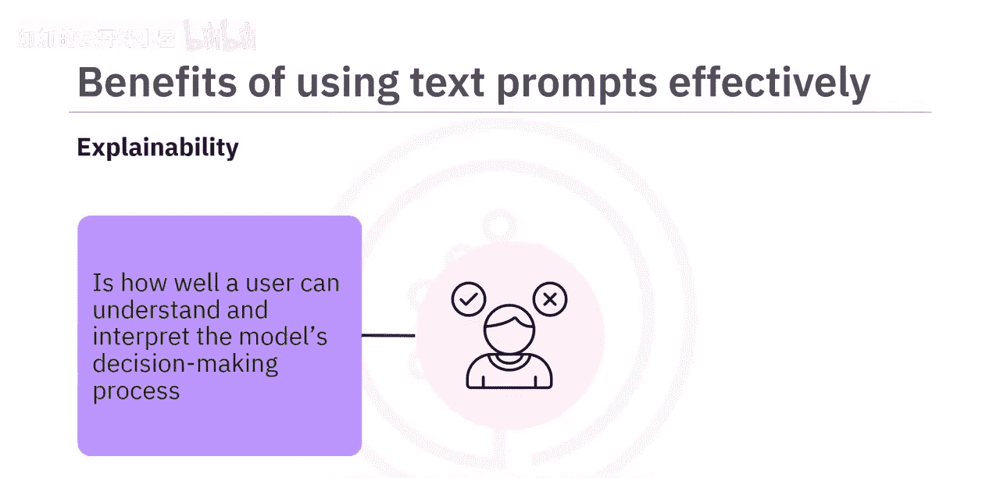

*   **增强LLM的可解释性**：可解释性指用户能够理解和解释模型的决策过程及其生成特定输出的原因。它帮助用户、开发者和利益相关者理解模型如何工作、为何做出特定预测或生成特定文本，以及在不同应用中是否可信赖。
*   **解决伦理考量**：可解释性对于解决与AI相关的伦理问题至关重要。它帮助所有利益相关者评估并确保LLM的行为符合特定领域的伦理准则和法律要求。
*   **建立用户信任**：除了提高LLM的可靠性和可解释性，有效的文本提示还能在用户和LLM之间建立信任。当用户能够理解LLM的工作原理，并看到他们的指令对LLM行为的直接影响时，将促成用户与LLM之间透明且有意义的互动。

## 总结 📋

本节课中我们一起学习了多种文本提示技术，它们能有效提升大型语言模型的可靠性和输出质量。

具体而言，我们探讨了：
*   **任务明确化**
*   **上下文引导**
*   **领域专业知识**
*   **偏见缓解**
*   **框架设定**
*   **用户反馈循环**

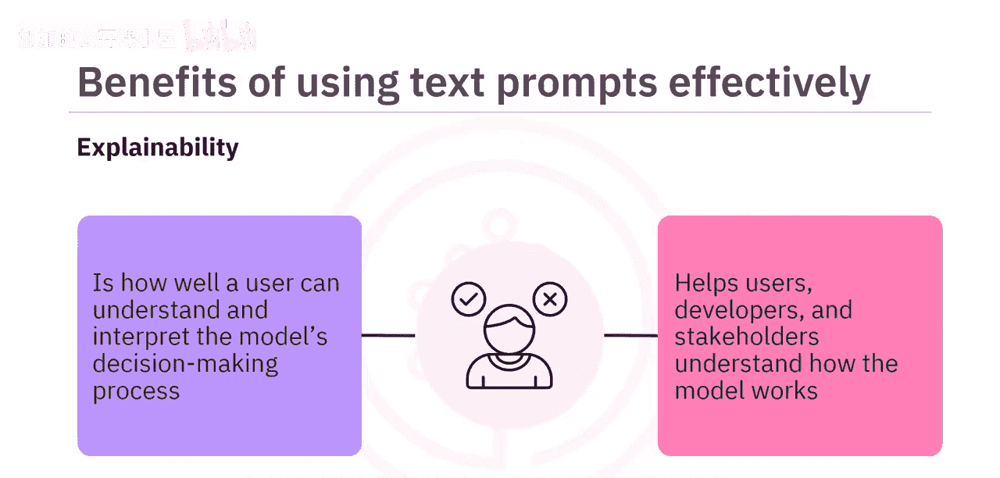

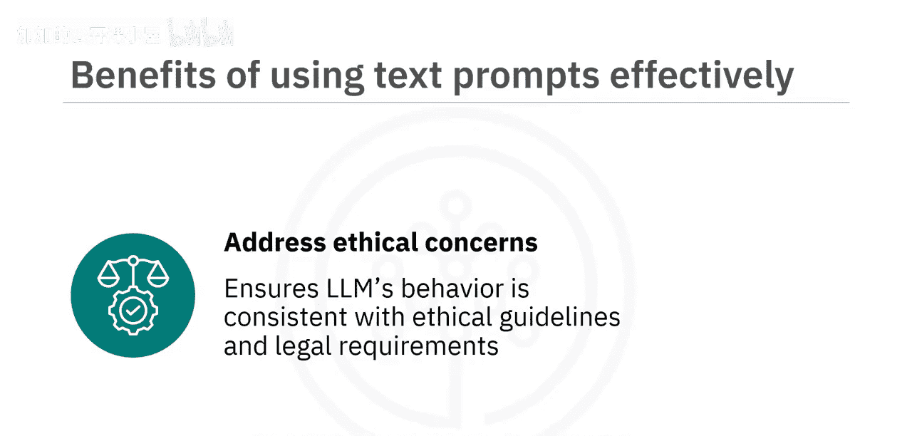

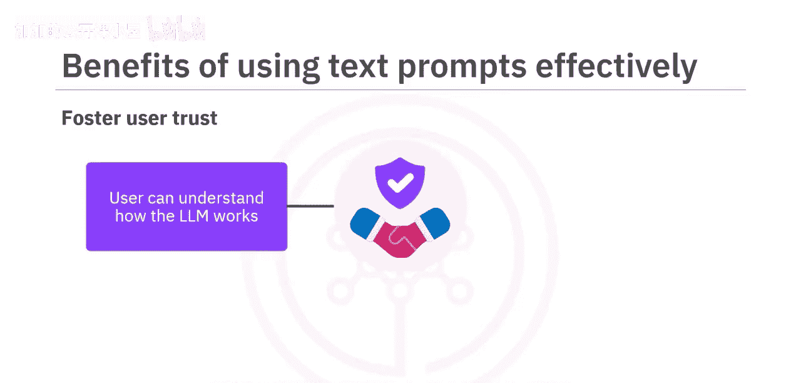

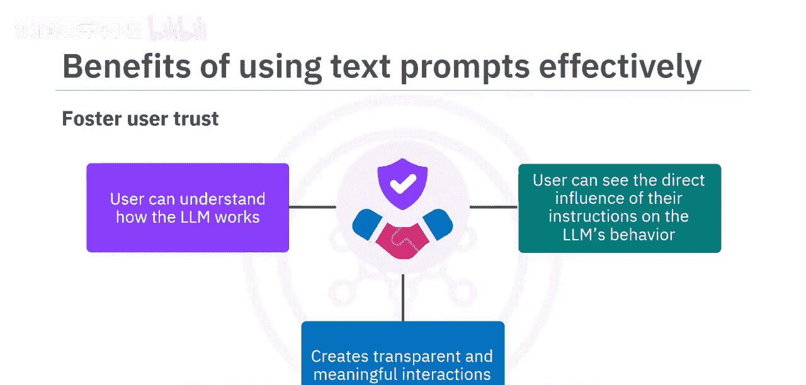

此外，我们还学习了**零样本提示**和**少样本提示**这两种高级方法。

最后，我们了解了有效使用文本提示与LLM结合的几大好处，包括增强LLM的可解释性、解决伦理考量以及建立用户信任。