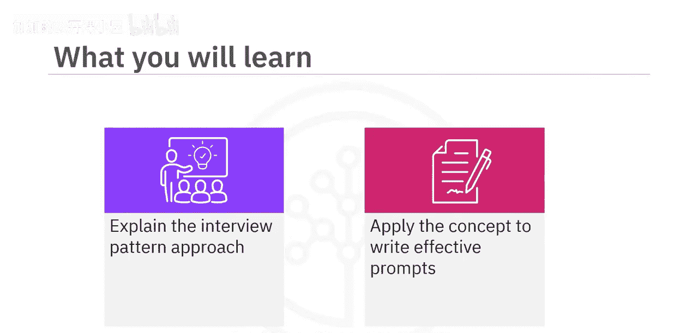
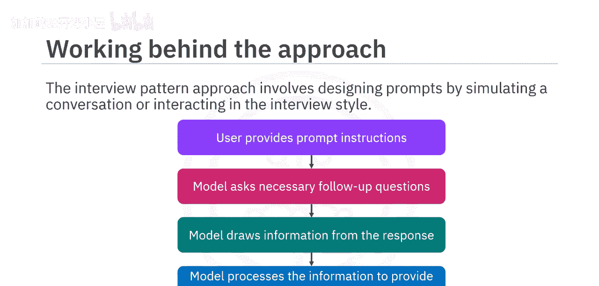
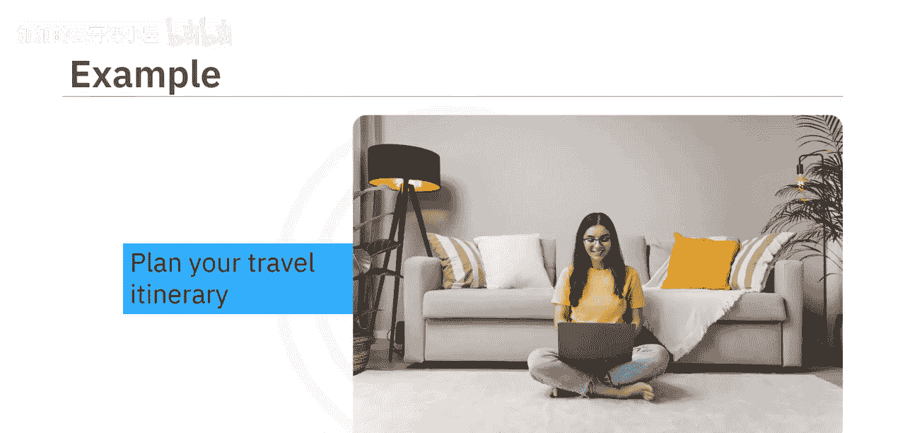
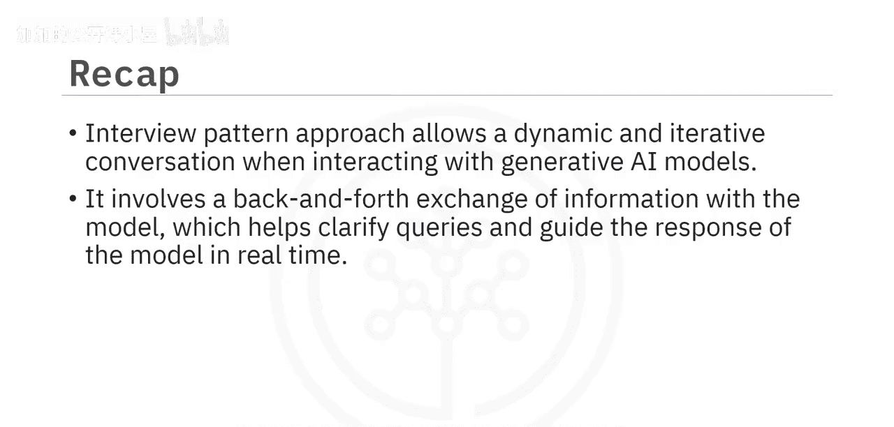

#  025：面试模式方法 🎤

在本节课中，我们将学习一种名为“面试模式方法”的提示工程策略。我们将了解其工作原理，并通过一个具体示例来掌握如何应用此方法，以引导生成式AI模型产生更具体、更符合需求的响应。

## 概述

面试模式方法是一种通过模拟对话或访谈风格与模型交互来设计提示的策略。其核心在于通过多轮问答，逐步引导模型获取所需信息，从而生成高度定制化的响应。这种方法比传统的单次提问方式更为动态和有效。

## 面试模式方法的工作原理

上一节我们介绍了面试模式方法的基本概念，本节中我们来看看它的具体工作流程。这种方法需要对提示进行细致优化，以确保模型生成的响应能精确满足你的目标。

其典型流程如下：
1.  **用户提供初始指令**：你首先向模型给出一个扮演特定角色并执行任务的指令。
2.  **模型提出跟进问题**：模型根据你的指令，开始向你提出一系列必要的、详细的跟进问题。
3.  **用户回答问题**：你逐一回答模型提出的问题，提供更多具体信息。
4.  **模型处理并生成响应**：模型根据你提供的所有信息，进行处理和整合，最终生成一个优化后的、符合你需求的响应。





**核心公式**可以概括为：
`高质量输出 = 明确的初始角色指令 + 模型的多轮交互式提问 + 用户提供的详细信息`



你提供的信息越详细，最终得到的结果就越好。

## 应用示例：旅行顾问

为了更好地理解，让我们通过一个例子来演示。假设你希望模型扮演一名旅行顾问，为你规划一个假期行程。

**初始提示指令**如下：
```
你将扮演一位经验丰富的旅行专家。你的目标是与我进行一次全面的旅行规划对话。请首先逐一提出一系列详细问题，以收集所有必要信息，从而根据我的具体偏好、兴趣和预算，制定出最量身定制且令人难忘的旅行行程。
```

在收到这个提示后，模型会开始提出跟进问题。以下是模型可能会问的问题列表：

以下是模型为收集信息可能提出的部分问题：
*   你最喜欢去哪种类型的旅行目的地？
*   请描述一下你理想假期的活动和体验。
*   你通常如何规划旅行？在选择目的地时，哪些因素对你最重要？
*   在规划旅行目的地时，是否有特定的文化或历史方面让你感兴趣？
*   旅行时你偏好哪种住宿选择？为什么？
*   你如何平衡预算考虑与获得难忘旅行体验的愿望？

在这个例子中，每个问题都建立在前一个问题的基础上，形成了一场关于旅行偏好的结构化、信息丰富的对话。根据你对这些问题的回答，模型将规划出一个符合你偏好和需求的、令人难忘的旅行行程。

## 方法优势与总结

本节课中我们一起学习了面试模式方法。通过上面的示例可以看出，这种方法优于传统的单次提示方法，因为它允许在与生成式AI模型交互时进行更动态、更迭代的对话。

面试模式涉及与模型进行来回的信息交换，这有助于实时澄清疑问并引导模型的响应方向。反过来，这增强了用户优化所获结果的能力，从而得到更精准、更个性化的输出。



**核心要点总结**：
*   **方法**：通过模拟访谈进行多轮交互式提示。
*   **关键**：提供明确的角色指令，并积极回答模型的跟进问题。
*   **优势**：比单次提问更能获得具体、定制化的高质量响应。
*   **应用**：适用于需要复杂、个性化输出的场景，如行程规划、方案设计、内容创作等。